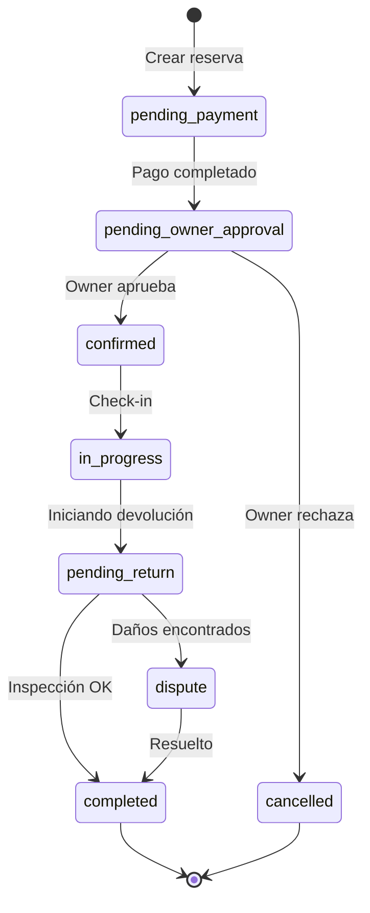

# CLAUDE.md: AutoRenta Core Intelligence

> **Fuente de Verdad para el Agente Claude en AutoRenta.**
> Este documento define el contexto, las reglas inquebrantables y los flujos de trabajo estándar.

## 1. Contexto & Memorias Activas

### Perfil del Proyecto
- **Proyecto:** AutoRenta
- **Ubicación:** `/home/edu/autorenta`
- **Stack Tecnológico:**
  - **Frontend:** Angular 18+ (Standalone, Signals), Ionic Framework.
  - **Estilos:** Tailwind CSS (Utility-first, sin SCSS complejos).
  - **Backend:** Supabase (PostgreSQL, Edge Functions, Auth, Storage).
  - **Automatización:** Python & TypeScript Scripts (`tools/`).
- **Filosofía:** "Tabula Rasa" (Mantener limpio, refactorizar sin miedo, eliminar deuda técnica).

### Estado Actual (Session Notes)
- **CI/CD:** Web deploy funcionando. Android requiere verificación de `cordova.variables.gradle`.
- **MercadoPago:** Integración P2P operativa pero requiere supervisión en selección de destinatarios.
- **Design:** EVITAR Wizards paso a paso y Modales intrusivos. Preferir navegación fluida y Bottom Sheets.

---

## 2. Convenciones Técnicas

- **Gestión de Paquetes:** Uso exclusivo de `pnpm`.
- **TypeScript Estricto:** No `any`. No `unknown` sin validación. Tipos explícitos en retornos de funciones públicas.
- **Tailwind CSS:** Única fuente de estilos. No crear clases CSS personalizadas a menos que sea un componente de UI Kit reutilizable.
- **Iconos:** Usar `<app-icon>`. Imports explícitos, nunca barrels.
- **Sintaxis:** ESM y sintaxis moderna de Angular (`@if`, `@for`, `inject()`).

---

## 3. Arquitectura Frontend (Angular)

- **Framework:** Angular 18+ (Standalone Components).
- **Generación:** `ng generate component path/to/component --standalone`.
- **Dependencias:** No añadir librerías hasta que sean estrictamente necesarias. Verificar `package.json` antes.
- **Standalone Components:** Todo componente debe ser `standalone: true`.
- **Signals:** Preferir `signal()`, `computed()` y `effect()` sobre `BehaviorSubject` para estado de vista.
- **Inyección:** Usar `inject()` en lugar de constructores.
- **Estructura de Directorios:**
  - `core/`: Servicios singleton, Guards, Interceptores, Modelos Globales.
  - `features/`: Vistas (Pages) y componentes inteligentes específicos de dominio.
  - `shared/`: UI Kit (Botones, Inputs), Pipes, Directivas.
  - `utils/`: Funciones puras, Helpers.

---

## 4. Patrones & Anti-Patrones

### Patrones Recomendados
| Patrón | Descripción |
|--------|-------------|
| **Smart Container / Dumb Component** | Páginas manejan lógica, componentes solo presentan datos. |
| **Service Facade** | Un servicio por dominio que orquesta llamadas a Supabase. |
| **Typed RPC Calls** | Siempre tipar respuestas de `supabase.rpc<T>()`. |
| **Optimistic UI** | Actualizar UI antes de confirmar con backend para fluidez. |
| **Error Boundaries** | Capturar errores en servicios, no en componentes. |

### Anti-Patrones Prohibidos
| Anti-Patrón | Razón |
|-------------|-------|
| **Wizards/Steppers** | Fricciona el flujo de usuario. Usar navegación lineal. |
| **Modales para datos** | Interrumpen contexto. Usar Bottom Sheets o páginas dedicadas. |
| **Console.log en prod** | Usar `LoggerService` con niveles configurables. |
| **Subscriptions sin unsubscribe** | Memory leaks. Usar `takeUntilDestroyed()` o `async` pipe. |
| **Hardcoded strings** | Usar constantes o i18n. |
| **Términos técnicos en UI** | No mostrar "FIPE", "Binance", "API", "RPC", etc. Usar lenguaje amigable: "valor de mercado", "precio sugerido". |

---

## 5. Supabase Guidelines

### RPC & Queries
```typescript
// Correcto: Prefijo de schema explícito
const { data } = await supabase.rpc('public.get_user_bookings', { user_id });

// Incorrecto: Sin prefijo puede fallar en Edge Functions
const { data } = await supabase.rpc('get_user_bookings', { user_id });
```

### Edge Functions
1. **Error Handling:** Siempre retornar códigos semánticos (400, 404, 409) en lugar de 500 genérico.
2. **Logging:** Usar `console.error()` con contexto estructurado.
3. **Secrets:** Nunca hardcodear. Usar `Deno.env.get('SECRET_NAME')`.

### Migraciones
- **Naming:** `YYYYMMDDHHMMSS_descriptive_name.sql`
- **Idempotencia:** Usar `IF NOT EXISTS` para CREATE, verificar existencia antes de DROP.
- **RLS:** Toda tabla nueva debe tener políticas RLS definidas.

---

## 6. Manejo de Errores

### Jerarquía de Errores
```
AppError (base)
├── NetworkError      → Problemas de conexión
├── AuthError         → Sesión expirada, no autorizado
├── ValidationError   → Datos inválidos del usuario
├── BusinessError     → Reglas de negocio violadas
└── SystemError       → Errores internos inesperados
```

### Patrón de Manejo
```typescript
try {
  await this.bookingService.create(data);
} catch (error) {
  if (error instanceof AuthError) {
    this.router.navigate(['/auth/login']);
  } else if (error instanceof BusinessError) {
    this.toastService.show(error.userMessage);
  } else {
    this.logger.error('Booking creation failed', error);
    this.toastService.show('Error inesperado. Intente nuevamente.');
  }
}
```

---

## 7. Testing & Calidad

- **CI/CD:** Revisa siempre los workflows en `.github/workflows`.
- **Ejecución:**
  - Unitarios: `pnpm test:unit` (Vitest)
  - E2E: `pnpm test:e2e` (Playwright)
- **Linting:** Código limpio es ley. `pnpm lint` debe pasar siempre.
- **Proactividad:** Añade o actualiza tests cuando cambies el comportamiento de un servicio o componente.
- **Commits:** Conventional Commits (`feat:`, `fix:`, `docs:`, `refactor:`).

---

## 8. Performance Checklist

- [ ] **Lazy Loading:** Todas las rutas principales usan `loadComponent`.
- [ ] **TrackBy:** Todo `@for` tiene función `track`.
- [ ] **OnPush:** Componentes de presentación usan `ChangeDetectionStrategy.OnPush`.
- [ ] **Signals:** Estado local con `signal()`, derivado con `computed()`.
- [ ] **Debounce:** Inputs de búsqueda con debounce de 300ms mínimo.
- [ ] **Virtual Scroll:** Listas largas (>50 items) usan `cdk-virtual-scroll-viewport`.
- [ ] **Image Optimization:** Imágenes con `loading="lazy"` y formatos WebP/AVIF.

---

## 9. Security Checklist

- [ ] **RLS Policies:** Toda tabla tiene políticas de Row Level Security.
- [ ] **Input Sanitization:** Nunca confiar en input del usuario.
- [ ] **CORS:** Configurado correctamente en Supabase.
- [ ] **Secrets:** Nunca en código fuente. Variables de entorno siempre.
- [ ] **Auth Guards:** Rutas protegidas con guards apropiados.
- [ ] **Rate Limiting:** Endpoints sensibles con límites en Edge Functions.

---

## 10. Comandos Frecuentes

| Comando | Descripción |
|---------|-------------|
| `pnpm dev` | Servidor de desarrollo |
| `pnpm dev:fast` | Dev sin sourcemaps (máquinas lentas) |
| `pnpm lint` | Ejecutar ESLint |
| `pnpm lint --fix` | Auto-fix linting |
| `pnpm test:unit` | Tests unitarios (Vitest) |
| `pnpm test:e2e` | Tests E2E |
| `supabase db diff -f <name>` | Generar migración desde cambios |
| `supabase gen types typescript` | Regenerar tipos de DB |

---

## 11. Comportamiento del Agente

- **Claridad:** Preguntar antes de asumir en tareas ambiguas.
- **Proactividad:** Corregir errores obvios (typos, imports) sin preguntar.
- **Contexto:** Leer siempre `task.md` y `implementation_plan.md` antes de escribir código.
- **Acción Directa:** Ejecutar tareas simples y bien definidas inmediatamente.
- **Confirmación:** Cambios complejos (refactors, migraciones de BD) requieren un plan y aprobación del usuario.

---

## 12. Protocolo Anti-Regresiones (CRÍTICO)

> **Problema:** El "Whack-a-Mole Anti-Pattern" ocurre cuando arreglar un bug introduce otro, creando un ciclo vicioso sin fin.

### Reglas Inquebrantables

1. **UN DOMINIO A LA VEZ**
   - No tocar `payments/` mientras se arregla `bookings/`
   - No modificar servicios compartidos sin verificar dependientes
   - Cambios en `core/` requieren ejecutar TODOS los tests

2. **COMMITS COMO CHECKPOINTS**
   ```bash
   # Después de CADA cambio pequeño que funciona:
   git add <archivos-específicos>
   git commit -m "fix: descripción concisa"
   ```
   - Nunca acumular cambios sin commitear
   - Si algo se rompe: `git diff HEAD~1` para ver qué cambió

3. **TESTS EN WATCH MODE**
   ```bash
   # Mantener corriendo durante toda la sesión:
   pnpm test:unit -- --watch
   ```
   - Si un test falla, PARAR y arreglar antes de continuar
   - No agregar features nuevas con tests rotos

4. **TAREAS ATÓMICAS**

   | ❌ Incorrecto | ✅ Correcto |
   |--------------|-------------|
   | "Arreglá el flujo de booking" | "Arreglá la validación del form de booking" |
   | "Mejorá el checkout" | "Arreglá el cálculo de precio en checkout" |
   | "Refactorizá payments" | "Extraé helper para formatear moneda" |

5. **LOOP DE VERIFICACIÓN**
   ```
   Leer código existente → Escribir cambio mínimo → Correr tests →
   Verificar visualmente → Commit → Repetir
   ```

   **Invertir 60% del tiempo en VERIFICAR, no en generar código.**

### Señales de Alerta (PARAR y Preguntar)

- 🚨 Mismo archivo modificado 3+ veces en una sesión
- 🚨 Test que pasaba ahora falla sin razón clara
- 🚨 Cambio "simple" que toca más de 3 archivos
- 🚨 Necesidad de "arreglar el arreglo"
- 🚨 3+ iteraciones sin progreso real

### Protocolo de Escape

Si estás atrapado en el ciclo:

1. **STOP** - No seguir iterando
2. **STASH** - `git stash` para guardar cambios
3. **RESET** - Volver al último commit estable
4. **REPLANTEAR** - Bajar el nivel de abstracción del pedido
5. **REINICIAR** - Nueva conversación con contexto fresco si es necesario

### Preguntas de Auto-Diagnóstico

Antes de cada cambio, el agente debe preguntarse:

1. ¿Entiendo EXACTAMENTE qué bug estoy arreglando?
2. ¿Tengo un plan claro de los archivos a modificar?
3. ¿Hay tests que cubran este comportamiento?
4. ¿Este cambio puede afectar otros dominios?

Si la respuesta a cualquiera es "no", **investigar primero, codear después**.

---

## 13. Post-Implementation Review (OBLIGATORIO)

Después de cada implementación de UI/UX, Claude DEBE ser autocrítico y verificar:

### Proceso de verificación:
1. **Screenshots comparativos** - Tomar capturas ANTES y DESPUÉS para comparar visualmente.
2. **Viewport testing real** - Probar en viewports reales: 375px (móvil), 768px (tablet), 1024px (laptop), 1440px (desktop).
3. **Lista de problemas** - Identificar y listar HONESTAMENTE cualquier problema visual o funcional.
4. **NO complacencia** - NUNCA decir "se ve bien" o "funciona correctamente" sin evidencia visual verificable.
5. **Pregunta de validación** - Siempre preguntar al usuario: "¿El resultado cumple con lo que esperabas?"

### Reglas de honestidad:
- Si algo no funciona o se ve mal, **admitirlo inmediatamente**.
- Si no se puede verificar correctamente (ej: responsive), **decirlo explícitamente**.
- Si el resultado es mediocre, **proponer mejoras concretas** en lugar de aprobar.
- **PROHIBIDO** ser complaciente para evitar conflicto con el usuario.

### Checklist post-implementación UI:
- [ ] ¿El contraste de texto es suficiente? (WCAG AA mínimo)
- [ ] ¿Los elementos interactivos tienen min 44x44px touch target?
- [ ] ¿El diseño funciona en móvil sin scroll horizontal?
- [ ] ¿Los modales/overlays son scrolleables si el contenido es largo?
- [ ] ¿Las animaciones respetan `prefers-reduced-motion`?
- [ ] ¿El diseño se ve bien con contenido real (no solo placeholders)?

---

## 14. FROZEN CODE - DO NOT MODIFY

The following files are **production-critical** and **FROZEN**. Do NOT modify them unless the user EXPLICITLY requests changes to these specific files AND provides a clear reason.

### MercadoPago Edge Functions (v12 - 2026-01-09)
These functions use direct `fetch()` to MercadoPago API. The SDK was removed due to Deno incompatibility.

```
supabase/functions/_shared/mercadopago-token.ts
supabase/functions/mercadopago-webhook/index.ts
supabase/functions/mercadopago-process-brick-payment/index.ts
supabase/functions/mercadopago-process-deposit-payment/index.ts
supabase/functions/mercadopago-create-preference/index.ts
supabase/functions/mercadopago-create-booking-preference/index.ts
supabase/functions/mercadopago-process-booking-payment/index.ts
supabase/functions/process-payment-queue/index.ts
```

**Rules for frozen code:**
1. **READ-ONLY by default** - Only read these files for context, never modify.
2. **Explicit permission required** - User must say "modify [filename]" or "fix [filename]".
3. **No refactoring** - Do not "improve", "clean up", or "optimize" frozen code.
4. **No SDK changes** - Never add `mercadopago` npm package back. Use `fetch()` only.
5. **Report issues** - If you find a bug, report it to the user instead of fixing.

### Why frozen?
- MercadoPago SDK v2 is incompatible with Deno Edge Runtime (causes BOOT_ERROR)
- Current implementation uses direct REST API calls which work correctly
- v12 is tested and deployed in production

---

## 15. Estructura del Proyecto

```
autorenta/
├── apps/web/
│   ├── src/app/
│   │   ├── core/           # Singleton services, guards, models
│   │   ├── features/       # Feature modules (pages + smart components)
│   │   ├── shared/         # UI Kit, pipes, directives
│   │   └── utils/          # Pure functions, helpers
│   └── tools/              # Scripts de automatización
├── supabase/
│   ├── functions/          # Edge Functions (Deno)
│   └── migrations/         # SQL migrations
└── .github/workflows/      # CI/CD pipelines
```

---

## 16. Dominios de Servicio (Service Domains)

La aplicación está organizada en dominios de servicio bajo `core/services/`:

| Dominio | Responsabilidad | Servicios Clave |
|---------|-----------------|-----------------|
| **auth** | Autenticación y sesión | `AuthService`, `SessionService` |
| **bookings** | Gestión de reservas completas | `BookingService`, `BookingFlowService`, `InspectionService` |
| **cars** | Vehículos y disponibilidad | `CarService`, `AvailabilityService`, `FipeService` |
| **payments** | Pagos y MercadoPago | `PaymentService`, `MercadoPagoService`, `DepositService` |
| **geo** | Geolocalización y tracking | `LocationService`, `LocationTrackingService` |
| **subscriptions** | Planes y suscripciones | `SubscriptionService` |
| **verification** | KYC y documentos | `DocumentVerificationService`, `FaceVerificationService` |
| **wallet** | Billetera virtual | `WalletService`, `WithdrawalService` |
| **ui** | Componentes de UI | `ToastService`, `LoadingService`, `ModalService` |
| **infrastructure** | Base | `LoggerService`, `StorageService`, `SupabaseService` |

---

## 17. Modelos Principales (Core Models)

| Modelo | Ubicación | Propósito |
|--------|-----------|-----------|
| `Car` | `car.model.ts` | Vehículo con specs, fotos, pricing |
| `Booking` | `fgo.model.ts` | Reserva completa con estados |
| `Subscription` | `subscription.model.ts` | Planes de suscripción (Standard/Black/Luxury) |
| `Wallet` | `wallet.model.ts` | Billetera, transacciones, retiros |
| `DynamicPricing` | `dynamic-pricing.model.ts` | Precios dinámicos por demanda |
| `Insurance` | `insurance.model.ts` | Coberturas y protecciones |
| `BookingDetailPayment` | `booking-detail-payment.model.ts` | Detalles de pago de booking |

---

## 18. Edge Functions Críticas

### Pagos (MercadoPago)
| Function | Trigger | Descripción |
|----------|---------|-------------|
| `mercadopago-webhook` | Webhook MP | Procesa notificaciones de pago |
| `mercadopago-process-booking-payment` | Manual | Procesa pago de reserva |
| `mp-create-preauth` | Manual | Crea pre-autorización de depósito |
| `mp-capture-preauth` | Manual | Captura pre-autorización |
| `mp-cancel-preauth` | Manual | Cancela pre-autorización |
| `mercadopago-money-out` | Manual | Transferencia a propietario |

### Automatización
| Function | Trigger | Descripción |
|----------|---------|-------------|
| `release-expired-deposits` | Cron | Libera depósitos expirados |
| `renew-preauthorizations` | Cron | Renueva pre-auth antes de expirar |
| `process-payment-queue` | Cron | Procesa cola de pagos pendientes |
| `return-protocol-scheduler` | Cron | Programa devoluciones |

### Verificación
| Function | Trigger | Descripción |
|----------|---------|-------------|
| `verify-document` | Manual | OCR de documentos |
| `verify-face` | Manual | Verificación facial |
| `gemini3-document-analyzer` | Manual | Análisis AI de documentos |
| `analyze-damage-images` | Manual | Análisis AI de daños |

### Notificaciones
| Function | Trigger | Descripción |
|----------|---------|-------------|
| `send-push-notification` | DB Trigger | Push notifications |
| `send-booking-confirmation-email` | Manual | Email de confirmación |
| `send-whatsapp-otp` | Manual | OTP por WhatsApp |

---

## 19. CI/CD Workflows

### Críticos (Siempre deben pasar)
| Workflow | Archivo | Descripción |
|----------|---------|-------------|
| **Build & Deploy** | `build-and-deploy.yml` | Deploy a producción |
| **CI Tests** | `ci.yml` | Lint, build, tests |
| **PR Validation** | `pr-validation.yml` | Validación de PRs |
| **Security Scan** | `security-scan.yml` | Análisis de seguridad |

### Monitoreo
| Workflow | Frecuencia | Descripción |
|----------|------------|-------------|
| `error-rate-monitoring` | Horario | Monitoreo de tasas de error |
| `mercadopago-api-health` | Horario | Salud de API MercadoPago |
| `wallet-balance-audit` | Diario | Auditoría de balances |
| `payment-reconciliation` | Diario | Reconciliación de pagos |
| `daily-metrics-report` | Diario | Reporte de métricas |

---

## 20. Feature Modules

La aplicación tiene 33 módulos de features bajo `features/`:

### Core Features
- **auth**: Login, registro, recuperación
- **bookings**: Flujo completo de reserva (114 archivos)
- **cars**: Listado, detalle, publicación
- **marketplace**: Búsqueda y exploración
- **wallet**: Billetera y transacciones
- **profile**: Perfil de usuario

### Secondary Features
- **admin**: Panel de administración
- **dashboard**: Dashboard de propietario
- **verification**: KYC y documentos
- **subscriptions**: Gestión de planes
- **payouts**: Retiros y pagos
- **disputes**: Gestión de disputas

---

## 21. Estructura de Base de Datos

### Schemas
- **public**: Tablas principales de negocio
- **auth**: Gestión de usuarios (Supabase Auth)
- **storage**: Archivos y documentos

### Tablas Principales
| Tabla | Propósito |
|-------|-----------|
| `profiles` | Perfiles de usuario extendidos |
| `cars` | Vehículos registrados |
| `bookings` | Reservas y estados |
| `payments` | Transacciones de pago |
| `wallets` | Billeteras virtuales |
| `subscriptions` | Suscripciones activas |
| `inspections` | Inspecciones de entrega/devolución |
| `disputes` | Disputas y reclamos |

### Convenciones de Migraciones
```sql
-- Naming: {timestamp}_{description}.sql
-- Ejemplo: 20260109050700_add_booking_notes.sql

-- Siempre usar IF NOT EXISTS
CREATE TABLE IF NOT EXISTS public.my_table (...);

-- Siempre definir RLS
ALTER TABLE public.my_table ENABLE ROW LEVEL SECURITY;

-- Policies descriptivas
CREATE POLICY "Users can view own records"
  ON public.my_table FOR SELECT
  USING (auth.uid() = user_id);
```

---

## 22. Estados de Booking (Booking States)



---

## 23. UI Kit (Shared Components)

La aplicación tiene **122 componentes reutilizables** en `shared/components/`.

### Formularios & Inputs
| Componente | Uso |
|------------|-----|
| `fipe-autocomplete` | Autocompletado de vehículos FIPE |
| `date-range-picker` | Selector de fechas de reserva |
| `location-map-picker` | Selector de ubicación con mapa |
| `mercadopago-card-form` | Formulario de tarjeta MercadoPago |
| `phone-verification` | Input con verificación OTP |

### Cards & Display
| Componente | Uso |
|------------|-----|
| `car-card` | Tarjeta de vehículo en listados |
| `booking-pricing-breakdown` | Desglose de precios |
| `wallet-balance-card` | Saldo de billetera |
| `renter-profile-badge` | Badge de nivel de arrendatario |
| `dynamic-pricing-badge` | Indicador de precio dinámico |

### Feedback & UX
| Componente | Uso |
|------------|-----|
| `bottom-sheet` | Sheet modal desde abajo |
| `skeleton-loader` | Loading skeleton |
| `error-state` | Estado de error |
| `loading-state` | Estado de carga |
| `pwa-update-prompt` | Prompt de actualización PWA |

### Mapas & Geolocalización
| Componente | Uso |
|------------|-----|
| `cars-map` | Mapa de vehículos disponibles |
| `live-tracking-map` | Tracking en tiempo real |
| `waze-live-map` | Integración con Waze |

### Inspecciones
| Componente | Uso |
|------------|-----|
| `video-inspection-recorder` | Grabador de video inspección |
| `damage-comparison` | Comparación de daños |
| `evidence-uploader` | Upload de evidencia |

---

## 24. Guards & Interceptors

### Guards (Protección de Rutas)
| Guard | Propósito |
|-------|-----------|
| `auth.guard` | Requiere autenticación |
| `guest.guard` | Solo usuarios no autenticados |
| `admin.guard` | Requiere rol admin |
| `verification.guard` | Requiere KYC completado |
| `booking-status.guard` | Valida estado de booking para acceso |
| `onboarding.guard` | Redirige si onboarding incompleto |
| `mercadopago.guard` | Requiere cuenta MP vinculada |

### Interceptors (HTTP Pipeline)
| Interceptor | Propósito |
|-------------|-----------|
| `auth-refresh.interceptor` | Refresh automático de tokens |
| `http-error.interceptor` | Manejo centralizado de errores HTTP |
| `http-cache.interceptor` | Cache de requests GET |
| `supabase-auth.interceptor` | Inyección de headers Supabase |
| `trace-id.interceptor` | Añade trace ID para debugging |

---

## 25. Directivas & Pipes

### Directivas
| Directiva | Uso |
|-----------|-----|
| `pullToRefresh` | Pull-to-refresh nativo |
| `swipeBack` | Swipe para volver atrás |
| `touchFeedback` | Ripple effect en touch |
| `tilt3d` | Efecto 3D en hover |
| `clickOutside` | Detecta clicks fuera del elemento |
| `escapeKey` | Listener de tecla Escape |
| `featureFlag` | Muestra/oculta por feature flag |
| `responsiveImage` | Carga lazy con srcset |
| `focusTrap` | Atrapa foco para modales/sheets |

### Pipes
| Pipe | Uso | Ejemplo |
|------|-----|---------|
| `money` | Formato de moneda | `{{ 1500 \| money }}` → `R$ 1.500,00` |
| `dateFormat` | Formato de fecha localizado | `{{ date \| dateFormat:'short' }}` |

---

## 26. Componentes AI (Gemini Integration)

Componentes que integran con Gemini API:

| Componente | Función |
|------------|---------|
| `ai-car-recommendation` | Recomienda autos basado en preferencias |
| `ai-checklist-panel` | Genera checklist de inspección |
| `ai-legal-panel` | Asistente legal para contratos |
| `ai-photo-generator` | Genera fotos promocionales del auto |
| `ai-reputation-card` | Análisis de reputación de usuario |
| `ai-trip-panel` | Sugerencias de viaje y rutas |

### Uso de Gemini
```typescript
// Modelo de Gemini en core/models/gemini.model.ts
interface GeminiRequest {
  prompt: string;
  context?: Record<string, unknown>;
  temperature?: number;
}

// Edge Function: gemini3-document-analyzer
// Analiza documentos subidos (CNH, CRLV)
```

---

## 27. Signal Stores (Estado Global)

Stores basados en Angular Signals para estado global:

### `bookings.store.ts`
```typescript
// Estado de reservas activas
const bookingsStore = {
  activeBookings: signal<Booking[]>([]),
  pendingReviews: signal<Booking[]>([]),
  isLoading: signal(false),
};
```

### `profile.store.ts`
```typescript
// Estado del perfil de usuario
const profileStore = {
  profile: signal<Profile | null>(null),
  verificationStatus: computed(() => ...),
  hasActiveSubscription: computed(() => ...),
};
```

### Patrón de Uso
```typescript
// En componentes
readonly bookings = inject(BookingsStore).activeBookings;

// En templates
@for (booking of bookings(); track booking.id) { ... }
```

---

## 28. Environment & Feature Flags

### Archivos de Configuración
| Archivo | Uso |
|---------|-----|
| `environment.base.ts` | Config compartida |
| `environment.ts` | Producción |
| `environment.development.ts` | Desarrollo local |

### Variables Críticas
```typescript
export const environment = {
  production: true,
  supabaseUrl: 'https://xxx.supabase.co',
  supabaseAnonKey: '...',
  mercadoPagoPublicKey: '...',
  googleMapsApiKey: '...',
  sentryDsn: '...',
  features: {
    enableAI: true,
    enableP2P: true,
    enableBetaFeatures: false,
  }
};
```

### Feature Flags
```typescript
// Uso con directiva
<div *featureFlag="'enableAI'">
  <app-ai-recommendation />
</div>

// Uso en código
if (environment.features.enableP2P) {
  this.initP2PTransfers();
}
```

---

## 29. Integraciones Externas

| Servicio | Propósito | Edge Function |
|----------|-----------|---------------|
| **MercadoPago** | Pagos, pre-auth, transfers | `mercadopago-*` (12 funciones) |
| **PayPal** | Pagos internacionales | `paypal-*` (4 funciones) |
| **FIPE** | Precios de vehículos Brasil | `get-fipe-value`, `sync-fipe-*` |
| **Binance** | Tasas de cambio crypto | `sync-binance-rates` |
| **WhatsApp** | OTP y notificaciones | `send-whatsapp-otp` |
| **TikTok** | Analytics y OAuth | `tiktok-*` |
| **Sentry** | Error tracking | Frontend SDK |
| **Google Maps** | Mapas y geocoding | Frontend SDK |

---

## 30. Conventional Commits

| Prefijo | Uso |
|---------|-----|
| `feat:` | Nueva funcionalidad |
| `fix:` | Corrección de bug |
| `docs:` | Documentación |
| `style:` | Formateo (no afecta lógica) |
| `refactor:` | Cambio de código sin cambio de comportamiento |
| `perf:` | Mejora de rendimiento |
| `test:` | Añadir o corregir tests |
| `chore:` | Tareas de mantenimiento |
| `ci:` | Cambios en CI/CD |

---

## 31. Workflows (Flujos de Trabajo)

### Nueva Feature
1. **Planificación:** Crear `implementation_plan.md` con objetivos y cambios propuestos.
2. **Revisión:** Solicitar feedback al usuario sobre el plan.
3. **Implementación:**
   - Crear Modelos/Tipos.
   - Implementar Servicios/Logica.
   - Construir UI/Componentes.
4. **Verificación:** Ejecutar tests y validar visualmente.
5. **Documentación:** Actualizar `walkthrough.md` con evidencia (screenshots/videos).

### Migración de Base de Datos
1. **SQL Script:** Crear archivo en `supabase/migrations` usando timestamp actual.
2. **Seguridad:** Verificar RLS Policies y Grants.
3. **Aplicación:** Ejecutar migración local y verificar integridad.
4. **Tipos:** Regenerar tipos de TypeScript si el esquema cambia.

### Despliegue (Deploy)
1. **Pre-Check:** Ejecutar `pnpm lint` localmente.
2. **Push:** Commit y Push a `main`.
3. **CI Monitor:** Verificar GitHub Actions. Si falla, corregir inmediatamente (prioridad máxima).
4. **Verification:** Smoke test en producción.

---

## 32. Quality Audits (Auditorías de Calidad)

Auditorías periódicas recomendadas para mantener estándares profesionales.

### 🔴 Alta Prioridad

#### Core Web Vitals (CWV)
Crítico para SEO, UX y conversión. Medir mensualmente.

| Métrica | Umbral Bueno | Qué Medir |
|---------|--------------|-----------|
| **LCP** (Largest Contentful Paint) | < 2.5s | Hero images, contenido principal |
| **INP** (Interaction to Next Paint) | < 200ms | Respuesta a clicks/taps en botones |
| **CLS** (Cumulative Layout Shift) | < 0.1 | Saltos de layout durante carga |

**Herramientas:** Lighthouse, Google Search Console, web.dev/measure
**Páginas críticas:** marketplace, car-detail, booking-flow, checkout

#### Security Audit (OWASP Top 10 2025)
Ejecutar `pnpm audit` semanalmente. Configurar Dependabot/Renovate.

**Checklist:**
- [ ] `pnpm audit` sin vulnerabilidades críticas/altas
- [ ] Dependencias actualizadas (no >6 meses de antigüedad)
- [ ] Trusted Types habilitado para prevenir XSS
- [ ] RLS policies en todas las tablas
- [ ] Secrets solo en variables de entorno

**Herramientas:** Snyk, npm audit, OWASP ZAP

#### Accessibility (WCAG 2.2 AA)
Requerido por European Accessibility Act (EAA) desde Junio 2025.

**Criterios clave:**
- Touch targets mínimo 24x24px CSS (recomendado 44x44px)
- Focus visible sin ser obscurecido
- Contraste mínimo 4.5:1 para texto normal
- Navegación completa por teclado
- Labels en todos los inputs

**Valores CSS Garantizados (WCAG AA):**

```css
/* === TEXTO === */
color: #fff;                        /* ✅ Blanco puro - 21:1 en negro */
color: #000;                        /* ✅ Negro puro - 21:1 en blanco */
color: rgba(255,255,255,0.87);      /* ✅ Material Design high-emphasis */

/* === FONDOS OSCUROS SOBRE VIDEO/IMÁGENES === */
background: rgba(0,0,0,0.7);        /* ✅ Mínimo garantizado */
background: rgba(0,0,0,0.85);       /* ✅ Recomendado (~12:1 con blanco) */
background: rgba(0,0,0,0.9);        /* ✅ Máximo contraste */

/* === BORDES/LÍNEAS VISIBLES === */
border: 3px solid #fff;             /* ✅ Con drop-shadow para fondos variables */
filter: drop-shadow(0 0 4px rgba(0,0,0,0.8));  /* ✅ Garantiza visibilidad */

/* === COLORES SEGUROS PARA ESTADOS === */
--color-success: #00d95f;           /* ✅ Verde accesible */
--color-error: #ef4444;             /* ✅ Rojo accesible */
--color-warning: #fbbf24;           /* ✅ Amarillo con texto negro */
```

**NUNCA usar (contraste insuficiente):**
```css
color: rgba(255,255,255,0.5);       /* ❌ 7:1 - falla en texto pequeño */
color: rgba(255,255,255,0.6);       /* ❌ Límite, evitar */
background: rgba(0,0,0,0.5);        /* ❌ Insuficiente sobre imágenes */
border: 1px solid rgba(x,x,x,0.3);  /* ❌ Invisible en muchos fondos */
```

**Herramientas:** axe DevTools (Chrome), Lighthouse Accessibility, [WebAIM Contrast Checker](https://webaim.org/resources/contrastchecker/)

### 🟡 Media Prioridad

#### Bundle Size Analysis
Establecer budget y monitorear en CI.

```bash
# Analizar bundle
npx source-map-explorer dist/**/*.js

# Verificar dependencia antes de instalar
# https://bundlephobia.com/
```

**Targets:**
- Initial bundle: < 500KB gzipped
- Lazy chunks: < 100KB cada uno
- No dependencias duplicadas entre chunks

#### PWA Audit
Verificar con Lighthouse PWA audit.

**Checklist:**
- [ ] Manifest válido con iconos (192x192, 512x512)
- [ ] Service Worker registrado y funcionando
- [ ] Offline fallback page
- [ ] HTTPS habilitado
- [ ] Instalable en home screen

**Estrategias de Cache:**
| Recurso | Estrategia |
|---------|------------|
| Static assets (JS/CSS/fonts) | Cache-First |
| Imágenes de autos | Cache-First con TTL |
| API calls dinámicos | Network-First con fallback |
| HTML pages | Stale-While-Revalidate |

#### Database Query Optimization
Usar Supabase Dashboard > Database > Query Performance.

**Checklist:**
- [ ] `pg_stat_statements` habilitado
- [ ] Queries lentas identificadas (>100ms)
- [ ] Índices en columnas de WHERE/JOIN frecuentes
- [ ] RLS optimizado con `(select auth.uid())` para cache
- [ ] No N+1 queries en frontend

#### Mobile Real Device Testing
62% del tráfico es móvil. Emuladores no capturan todo.

**Estrategia:**
- **CI diario:** Playwright con emulación mobile
- **Semanal:** Testing en dispositivos reales (BrowserStack o físicos)

**Verificar en real devices:**
- Performance real (CPU, memoria)
- Touch gestures y swipes
- Cámara (inspecciones de video)
- Network throttling (3G, 4G)

### 🟢 Baja Prioridad

#### Image Optimization
- [ ] `NgOptimizedImage` directive en imágenes críticas
- [ ] Formatos modernos (WebP, AVIF)
- [ ] `loading="lazy"` en imágenes below-the-fold
- [ ] Dimensiones explícitas (width/height) para evitar CLS
- [ ] Supabase Image Transformation para resize on-the-fly

#### Real User Monitoring (RUM)
Datos de laboratorio ≠ datos reales. Configurar Sentry Performance.

```typescript
// Ya configurado en environment
sentryDsn: '...',

// Verificar que Performance está habilitado
Sentry.init({
  tracesSampleRate: 0.1, // 10% de transacciones
});
```

### Frecuencia de Auditorías

| Auditoría | Frecuencia | Responsable |
|-----------|------------|-------------|
| `pnpm audit` | Semanal (CI) | Automatizado |
| Core Web Vitals | Mensual | Dev Team |
| Accessibility | Por release | QA |
| Bundle Size | Por PR (CI) | Automatizado |
| Database Performance | Mensual | Backend |
| Mobile Testing | Semanal | QA |

### Recursos

- [Angular Performance](https://angular.dev/best-practices/runtime-performance)
- [Angular Security](https://angular.dev/best-practices/security)
- [OWASP Top 10 2025](https://owasp.org/Top10/2025/)
- [WebAIM WCAG Checklist](https://webaim.org/standards/wcag/checklist)
- [Supabase Performance](https://supabase.com/docs/guides/platform/performance)
- [web.dev Core Web Vitals](https://web.dev/articles/vitals)

---

## 33. CI/CD & Database Types (CRÍTICO)

### Protocolo para Regenerar Tipos de Base de Datos

**NUNCA** regenerar `database.types.ts` sin verificación previa:

```bash
# 1. Generar a archivo temporal
supabase gen types typescript --project-id PROJECT_ID > /tmp/fresh-types.ts

# 2. Comparar diferencias ANTES de copiar
diff apps/web/src/app/core/types/database.types.ts /tmp/fresh-types.ts

# 3. Verificar enums críticos (pueden romper el build)
grep -E "FuelType|BookingStatus|UserRole" /tmp/fresh-types.ts

# 4. Build local ANTES de push
pnpm build

# 5. Solo entonces copiar y commitear
cp /tmp/fresh-types.ts apps/web/src/app/core/types/database.types.ts
```

### Enums con Idioma Mixto (DB Español ↔ UI Inglés)

| Enum DB (Español) | Uso en UI (Inglés) | Mapeo Requerido |
|-------------------|-------------------|-----------------|
| `electrico` | `electric` | Sí - filter ID |
| `nafta` | `gasoline` | Sí - display |
| `gasoil` | `diesel` | No - igual |
| `locador` | `owner` | Sí - roles |
| `locatario` | `renter` | Sí - roles |

**Regla:** Siempre comparar contra el valor del ENUM de DB, no el display de UI.

```typescript
// ❌ INCORRECTO - 'electric' no existe en FuelType enum
cars.filter(c => c.fuel_type === 'electric')

// ✅ CORRECTO - usar valor real del enum
cars.filter(c => c.fuel_type === 'electrico')
```

### Workflows Resilientes

**Principio:** Un workflow debe fallar solo por errores reales, no por configuración faltante.

```yaml
# ✅ CORRECTO - Skip graceful si falta configuración
- name: Check prerequisites
  id: check
  run: |
    if [ -z "$SECRET" ]; then
      echo "skip=true" >> $GITHUB_OUTPUT
      echo "⚠️ SECRET not configured, skipping"
    fi

- name: Run task
  if: steps.check.outputs.skip != 'true'
  run: actual-command

# ❌ INCORRECTO - Usar continue-on-error para ocultar problemas
- name: Run task
  continue-on-error: true  # Oculta errores reales
  run: actual-command
```

### Pre-Push Checklist para CI

Antes de hacer push a `main`, SIEMPRE ejecutar:

```bash
# 1. Lint
pnpm lint

# 2. Build (detecta errores de tipos)
pnpm build

# 3. Si modificaste database.types.ts
grep -E "FuelType|BookingStatus" apps/web/src/app/core/types/database.types.ts
# Verificar que los valores coinciden con el código

# 4. Si modificaste workflows
# Revisar que no haya secrets hardcodeados
grep -r "sk_live\|APP_USR" .github/workflows/
```

### Secrets Requeridos por Workflow

| Workflow | Secrets Necesarios |
|----------|-------------------|
| `ci.yml` | Ninguno (build local) |
| `e2e-tests.yml` | `SUPABASE_URL`, `SUPABASE_ANON_KEY` |
| `types-sync-check.yml` | `SUPABASE_ACCESS_TOKEN`, `SUPABASE_PROJECT_ID` |
| `sql-tests.yml` | `DATABASE_URL` |
| `contracts.yml` | `STAGING_SUPABASE_URL`, `STAGING_SUPABASE_ANON_KEY` |

### Lecciones Aprendidas (2026-01-29)

1. **Regenerar tipos puede romper builds** - El schema de DB puede tener valores diferentes a lo que espera el código
2. **Probar localmente ANTES de push** - Un ciclo CI de 3-5 min por error es ineficiente
3. **Skip graceful > continue-on-error** - Lo segundo oculta problemas reales
4. **Commits atómicos** - Un fix por commit, no 8 commits iterativos
5. **Project Lazarus puede interferir** - Commits automatizados pueden causar conflictos

---

**© 2026 AutoRenta | Claude Agent Configuration v3.3**
