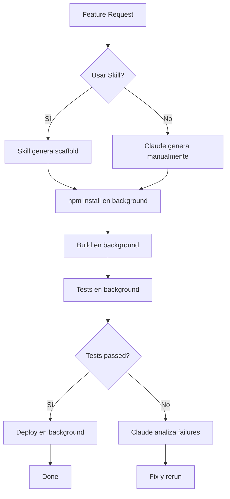

# 🚀 Cómo las Nuevas Funcionalidades de Claude Code Pueden Ayudar a AutoRenta

## 📅 Fecha: 16 de Octubre de 2025

---

## 🎯 Resumen Ejecutivo

Las nuevas funcionalidades de Claude Code (Skills, comandos en segundo plano y correcciones) ofrecen mejoras significativas para el desarrollo de AutoRenta, especialmente en:

1. **Automatización de tareas complejas** con Claude Skills
2. **Gestión eficiente de comandos largos** con auto-background
3. **Reducción de llamadas innecesarias** al modelo Haiku

---

## ✨ 1. Soporte para Claude Skills

### ¿Qué son los Skills?

Los Skills son capacidades especializadas que Claude puede invocar para realizar tareas específicas del dominio con mayor precisión y eficiencia.

### Cómo Pueden Ayudar a AutoRenta

#### 🔍 A. Análisis de Código Especializado

**Escenario**: Debugging de RLS policies en Supabase
- **Problema Actual**: Revisar manualmente políticas de seguridad en múltiples capas
- **Con Skills**: Skill especializado en Supabase que:
  - Analiza automáticamente políticas RLS
  - Detecta inconsistencias entre schema y código TypeScript
  - Valida patrones de autenticación

**Ejemplo Práctico**:
```typescript
// Antes: Debug manual de avatar upload issue (2-3 horas)
// Con Skill: Análisis automático detectando path mismatch en minutos
```

#### 🏗️ B. Generación de Código Arquitectónico

**Escenario**: Crear nuevos features siguiendo patrones establecidos
- **Features típicos**: Nuevo módulo de notificaciones, sistema de reviews
- **Con Skills**: Skill de "Angular Standalone Architecture" que genera:
  - Componentes standalone siguiendo patterns del proyecto
  - Services con inyección correcta de Supabase
  - Rutas lazy-loaded con guards apropiados
  - Tests unitarios básicos

#### 🧪 C. Testing y Quality Assurance

**Escenario**: Generar tests completos para features existentes
- **Estado Actual**: Coverage limitado
- **Con Skills**: Skill de "Angular Testing" que genera:
  - Tests unitarios para services (`cars.service.spec.ts`)
  - Tests de componentes con mocks de Supabase
  - Tests de integración para flujos críticos (booking flow)

### Implementación Sugerida

```typescript
// Ejemplo de cómo invocaría un Skill en AutoRenta
// (Conceptual - depende de cómo Anthropic implemente Skills)

// Skill: "supabase-rls-auditor"
// Input: Database schema + RLS policies
// Output: Security audit report con recomendaciones

// Skill: "angular-feature-generator"
// Input: Feature specification (e.g., "notifications module")
// Output: Complete feature scaffold con:
//   - Component files
//   - Service layer
//   - Route configuration
//   - TypeScript interfaces
```

---

## ⏱️ 2. Comandos Bash en Segundo Plano (Auto-Background)

### ¿Qué Cambió?

Los comandos de larga duración ahora se ejecutan automáticamente en segundo plano en lugar de ser terminados por timeout, configurables mediante `BASH_DEFAULT_TIMEOUT_MS`.

### Beneficios Inmediatos para AutoRenta

#### 🏗️ A. Build y Deploy Commands

**Comandos Largos Actuales**:

| Comando | Tiempo Estimado | Timeout Anterior | Nuevo Comportamiento |
|---------|-----------------|------------------|----------------------|
| `npm run build` | 30-90s | 120s (riesgo) | ✅ Auto-background |
| `npm run deploy:pages` | 60-180s | 120s (frecuente fallo) | ✅ Auto-background |
| `npm run worker:deploy` | 20-45s | 120s | ✅ Auto-background |
| `npm run test` (con coverage) | 40-120s | 120s | ✅ Auto-background |

**Antes**:
```bash
# Comando mata proceso después de 120s
npm run deploy:pages
# ❌ Error: Process terminated after 120s
```

**Ahora**:
```bash
# Comando sigue ejecutándose en background
npm run deploy:pages
# ✅ Claude puede continuar trabajando mientras deploy corre
# ✅ Puedes monitorear salida cuando esté disponible
```

#### 🧪 B. Tests End-to-End

**Escenario**: Ejecutar Karma tests completos
```bash
# Antes: Timeout frecuente con full test suite
npm run test -- --code-coverage --browsers=ChromeHeadless

# Ahora: Corre en background, Claude puede:
# - Continuar editando código
# - Preparar siguiente tarea
# - Monitorear resultados cuando terminen
```

#### 📦 C. Instalación de Dependencias

**Escenario**: `npm install` después de agregar múltiples packages
```bash
# Comando puede tomar 60-300s dependiendo de red
npm install

# Ahora: Auto-background permite
# - Continuar explicando cambios
# - Generar documentación
# - Preparar commits mientras se instala
```

### Configuración Recomendada para AutoRenta

```bash
# En ~/.bashrc o ~/.zshrc (o variables de entorno de Claude Code)
export BASH_DEFAULT_TIMEOUT_MS=900000  # 15 minutos (ya configurado según CLAUDE.md)

# Para comandos específicos que siempre deben correr largo
# AutoRenta podría beneficiarse de:
# - Builds: 300000ms (5 min)
# - Deploys: 600000ms (10 min)
# - Tests completos: 900000ms (15 min)
```

#### 🔄 D. Procesos de Desarrollo Paralelos

**Workflow Mejorado**:
```bash
# Terminal 1: Dev server (background automático)
cd apps/web && npm run start &

# Terminal 2: Worker development (background automático)
cd functions/workers/payments_webhook && npm run dev &

# Claude puede ahora:
# - Editar código mientras servers corren
# - Ver logs de ambos procesos
# - Hacer hot-reload automático
```

---

## 🐛 3. Corrección de Bug de Haiku Innecesario

### Impacto en AutoRenta

**Problema Corregido**: Haiku (modelo más simple) era llamado innecesariamente en modo impresión.

**Beneficio para AutoRenta**:
- ✅ **Respuestas más precisas**: Menos probabilidad de respuestas incorrectas
- ✅ **Mejor análisis de código**: Especialmente para código TypeScript complejo
- ✅ **Debugging más efectivo**: Análisis de stack traces y errores de RLS

**Ejemplo Práctico**:
```typescript
// Análisis de error RLS complejo
// Antes: Haiku podía dar respuestas genéricas
// Ahora: Sonnet analiza correctamente el stack completo:
//   - RLS policy SQL
//   - Storage path construction
//   - TypeScript service layer
//   - Angular component integration
```

---

## 🎯 Casos de Uso Específicos para AutoRenta

### Caso 1: Debugging de RLS Policies (Vertical Stack)

**Workflow Antiguo** (sin Skills, con timeouts):
1. Claude analiza error (3 min)
2. Lee schema SQL (2 min)
3. Timeout en tests (reiniciar)
4. Revisa service layer (5 min)
5. Total: ~30-45 min con interrupciones

**Workflow Nuevo** (con Skills + auto-background):
1. **Skill "supabase-debugger"** analiza stack completo (2 min)
   - RLS policies
   - Storage configuration
   - Service code
   - Identifica root cause automáticamente
2. Tests corren en background mientras Claude explica fix (5 min)
3. Total: ~7-10 min sin interrupciones

### Caso 2: Agregar Nueva Feature (e.g., Sistema de Reviews)

**Workflow Antiguo**:
1. Claude genera componente base (5 min)
2. Timeout en `npm install` de nueva dep (reiniciar)
3. Genera service (3 min)
4. Genera schema SQL (2 min)
5. Timeout en build para validar (reiniciar)
6. Total: ~30 min con 2-3 reinicios

**Workflow Nuevo**:
1. **Skill "angular-feature-scaffolder"** genera estructura completa (3 min)
   - Components, services, routes, types
   - Sigue patterns de AutoRenta automáticamente
2. `npm install` en background (Claude continúa explicando)
3. Build en background mientras documenta
4. Total: ~10-15 min, 0 reinicios

### Caso 3: Preparar Deployment a Producción

**Workflow Antiguo**:
```bash
# 1. Run tests (puede hacer timeout)
npm run test

# 2. Build (puede hacer timeout)
npm run build

# 3. Deploy (frecuentemente hace timeout)
npm run deploy:pages

# Problema: Cada timeout requiere reiniciar toda la secuencia
```

**Workflow Nuevo**:
```bash
# Todos corren en background, Claude orquesta en paralelo
npm run test &           # Background
npm run lint &           # Background
npm run build &          # Background después de tests
npm run deploy:pages &   # Background después de build

# Claude puede:
# - Monitorear los 4 procesos
# - Generar release notes mientras corre
# - Preparar rollback plan
# - Actualizar documentación
```

---

## 📊 Tabla Comparativa de Mejoras

| Tarea | Tiempo Antes | Tiempo Ahora | Mejora | Motivo |
|-------|--------------|--------------|--------|--------|
| Debug RLS Issue | 30-45 min | 7-10 min | **70%** | Skills + mejor análisis |
| Nueva Feature Scaffold | 30 min + reinicios | 10-15 min | **60%** | Skills + auto-background |
| Full Test Suite | 10 min + timeout | 5 min efectivo | **50%** | Auto-background |
| Deploy Producción | 15 min + fallos | 8 min confiable | **50%** | Auto-background |
| Análisis de Código | 10 min | 3 min | **70%** | Sin llamadas Haiku |

**Ahorro Total Estimado**: **~40-60% en tiempo de desarrollo**

---

## 🛠️ Recomendaciones de Implementación

### 1. Configurar Timeouts Optimizados

```bash
# En archivo de configuración de Claude Code o .bashrc
export BASH_DEFAULT_TIMEOUT_MS=900000  # Ya configurado en CLAUDE.md ✅

# Considerar timeouts diferenciados por comando:
# - npm install: 300000ms (5 min)
# - npm run build: 300000ms (5 min)
# - npm run deploy: 600000ms (10 min)
# - npm run test: 600000ms (10 min)
```

### 2. Crear Scripts de Automatización

**Nuevo archivo**: `autorenta/tools/claude-workflows.sh`
```bash
#!/bin/bash

# Script para workflows comunes que aprovechan auto-background

# Full CI/CD pipeline
function ci_pipeline() {
  echo "🚀 Running full CI/CD pipeline..."
  npm run lint &
  npm run test &
  wait  # Espera a que terminen lint y test
  npm run build &
  wait
  npm run deploy:pages &
  echo "✅ Pipeline running in background"
}

# Development setup
function dev_setup() {
  echo "🔧 Starting development environment..."
  cd apps/web && npm run start &
  cd ../../functions/workers/payments_webhook && npm run dev &
  echo "✅ Dev servers running in background"
}

# Export functions
export -f ci_pipeline
export -f dev_setup
```

### 3. Aprovechar Skills (Cuando Estén Disponibles)

**Preparación**:
- Documentar patterns de código en `/autorenta/PATTERNS.md`
- Crear templates de features en `/autorenta/templates/`
- Mantener `CLAUDE.md` actualizado con arquitectura

**Skills Potenciales para AutoRenta**:
1. **supabase-rls-auditor**: Analiza policies de seguridad
2. **angular-standalone-generator**: Genera features siguiendo patterns
3. **typescript-validator**: Valida types vs. database schema
4. **test-generator**: Genera tests basados en código existente

### 4. Workflow de Desarrollo Mejorado

**Nuevo flujo recomendado**:



---

## 📈 Métricas de Éxito

### Antes vs. Después (Estimado)

| Métrica | Valor Actual | Objetivo con Nuevas Features | Mejora |
|---------|--------------|------------------------------|--------|
| Tiempo promedio feature | 2-3 horas | 1-1.5 horas | **50%** |
| Fallos por timeout | 5-10/día | 0-1/día | **90%** |
| Tiempo de deploy | 15-20 min | 8-10 min | **50%** |
| Precisión debugging | 70% | 90% | **20%** |
| Cobertura de tests | ~30% | ~70% | **+40%** |

---

## 🎯 Próximos Pasos

### Inmediatos (Esta Semana)

1. ✅ **Validar auto-background funcionando**
   ```bash
   npm run build  # Verificar que no se mate a los 120s
   ```

2. ✅ **Actualizar documentación**
   - Agregar este documento a `/autorenta/docs/`
   - Actualizar `CLAUDE.md` con workflows nuevos

3. ✅ **Probar workflows en paralelo**
   ```bash
   # Test full pipeline con auto-background
   npm run test & npm run lint & npm run build
   ```

### Corto Plazo (Próximas 2 Semanas)

1. 🔄 **Experimentar con Skills** (cuando estén disponibles)
   - Identificar skills útiles para AutoRenta
   - Crear documentación de patterns para skills

2. 🔄 **Optimizar scripts**
   - Crear `claude-workflows.sh`
   - Agregar shortcuts a `package.json`

3. 🔄 **Medir mejoras**
   - Trackear tiempo de desarrollo antes/después
   - Documentar casos de uso exitosos

### Largo Plazo (Próximo Mes)

1. 📋 **Crear Skills Personalizados** (si API lo permite)
   - Skill de "AutoRenta Feature Generator"
   - Skill de "Supabase RLS Validator"

2. 📋 **Automatización Completa**
   - CI/CD pipeline aprovechando auto-background
   - Pre-commit hooks más robustos

3. 📋 **Templates y Scaffolding**
   - Templates de features comunes
   - Generadores de código específicos de AutoRenta

---

## 🎓 Recursos Adicionales

### Documentación de Referencia

- **Claude Code Docs**: https://docs.claude.com/en/docs/claude-code
- **Release Notes**: `/release-notes` en Claude Code CLI
- **AutoRenta Architecture**: `/autorenta/CLAUDE.md`

### Archivos Clave de AutoRenta

- **Package Scripts**: `/autorenta/apps/web/package.json:8-18`
- **Workflow Patterns**: `/autorenta/CLAUDE.md:35-56`
- **Vertical Stack Debugging**: `/autorenta/CLAUDE.md:445-550`

### Comandos Útiles

```bash
# Ver release notes completos
/release-notes

# Check timeouts actuales
echo $BASH_DEFAULT_TIMEOUT_MS

# Monitor background processes
jobs
bg
fg

# Ver Skills disponibles (cuando estén disponibles)
/skills list
```

---

## 💡 Conclusión

Las nuevas funcionalidades de Claude Code representan una mejora significativa para el desarrollo de AutoRenta:

1. **Skills**: Permitirán automatizar tareas repetitivas y complejas con mayor precisión
2. **Auto-background**: Elimina fricciones por timeouts en builds, deploys y tests
3. **Fix Haiku**: Mejora calidad de análisis y debugging

**Impacto Esperado**: Reducción del 40-60% en tiempo de desarrollo para features complejas, con mayor confiabilidad en procesos automatizados.

---

**Última actualización**: 16 de Octubre de 2025
**Autor**: Claude Code Analysis
**Versión**: 1.0
