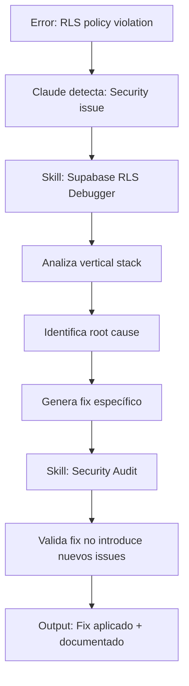
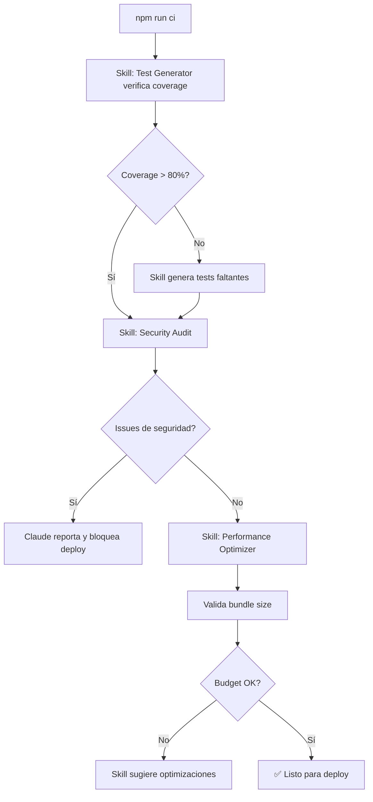

# 🎯 Guía de Claude Skills para AutoRenta

## 📅 Última actualización: 16 de Octubre de 2025

---

## 🎓 ¿Qué son los Claude Skills?

Los **Claude Skills** son capacidades especializadas que Claude Code puede invocar para realizar tareas específicas del dominio con mayor precisión y eficiencia. Funcionan como "expertos" en áreas específicas del desarrollo.

### Conceptos Clave

```
┌─────────────────────────────────────────────────────────┐
│  CLAUDE CODE (Orquestador)                              │
│                                                          │
│  ┌─────────┐  ┌──────────┐  ┌───────────┐             │
│  │ Skill 1 │  │ Skill 2  │  │ Skill 3   │  ...        │
│  │ Angular │  │ Supabase │  │ Testing   │             │
│  └─────────┘  └──────────┘  └───────────┘             │
│                                                          │
│  Claude decide qué skill usar según la tarea            │
└─────────────────────────────────────────────────────────┘
```

---

## 🚀 Skills Recomendados para AutoRenta

### 1. **Angular Standalone Architecture Skill**

**Propósito**: Generar features siguiendo los patterns de AutoRenta

**Casos de Uso**:
- Crear nuevos módulos (e.g., sistema de reviews, notificaciones)
- Generar componentes standalone con rutas lazy-loaded
- Scaffolding de services con inyección de Supabase

**Ejemplo de Invocación** (conceptual):
```bash
# Claude detecta: "Crear módulo de reviews"
# Skill genera automáticamente:
# - src/app/features/reviews/
#   - list/reviews-list.page.ts
#   - detail/review-detail.page.ts
#   - components/review-card.component.ts
# - src/app/core/services/reviews.service.ts
# - src/app/core/models/review.model.ts
# - Routes en app.routes.ts
```

**Input Esperado**:
```typescript
{
  "featureName": "reviews",
  "entities": ["Review"],
  "pages": ["list", "detail", "create"],
  "architecture": "angular-standalone",
  "patterns": "AutoRenta patterns from CLAUDE.md"
}
```

**Output Generado**:
- Componentes standalone siguiendo estructura de AutoRenta
- Services con `injectSupabase()` pattern
- Routes con lazy-loading y guards apropiados
- TypeScript interfaces basadas en database schema
- Tests unitarios básicos

---

### 2. **Supabase RLS Debugger Skill**

**Propósito**: Analizar y debuggear políticas de Row Level Security

**Casos de Uso**:
- Debug de errores "row violates row-level security policy"
- Validación de storage paths vs. RLS policies
- Análisis de permisos y autenticación

**Ejemplo de Invocación**:
```bash
# Claude detecta error RLS
# Error: new row violates row-level security policy for table "storage.objects"

# Skill analiza automáticamente:
# 1. RLS policy SQL
# 2. Storage path construction en service
# 3. Auth state
# 4. Identifica root cause
```

**Análisis Vertical Stack**:
```
┌─────────────────────────────────────────────────────────┐
│ SKILL ANALIZA TODA LA PILA:                             │
│                                                          │
│ ✅ Component: uploadAvatar() llamado correctamente      │
│ ✅ Service: File validations passed                     │
│ ❌ Path: `avatars/${userId}/file.jpg`                   │
│    ↓                                                     │
│ ❌ RLS expects: `${userId}/file.jpg`                    │
│    ↓                                                     │
│ 🎯 ROOT CAUSE: Bucket prefix in path                    │
│ 💡 FIX: Remove 'avatars/' from filePath                 │
└─────────────────────────────────────────────────────────┘
```

**Output**:
```markdown
## RLS Policy Violation Analysis

### Root Cause
Storage path includes bucket prefix `avatars/` which causes
`(storage.foldername(name))[1]` to return 'avatars' instead of user_id

### Fix
**File**: `apps/web/src/app/core/services/profile.service.ts:97`

**Change**:
- const filePath = `avatars/${userId}/${filename}`;
+ const filePath = `${userId}/${filename}`;

### Verification
Run this SQL to test:
SELECT (storage.foldername('user-uuid/file.jpg'))[1] = 'user-uuid';
-- Should return: true
```

---

### 3. **TypeScript Database Sync Skill**

**Propósito**: Sincronizar tipos TypeScript con schema de Supabase

**Casos de Uso**:
- Detectar inconsistencias entre `database.types.ts` y schema real
- Generar interfaces TypeScript a partir de tablas Supabase
- Validar que queries usen tipos correctos

**Ejemplo**:
```bash
# Claude ejecuta: "Validar tipos de database"

# Skill compara:
# - database.types.ts (local)
# - Supabase schema (remoto)
# - Service layer types
```

**Output**:
```typescript
// INCONSISTENCIAS DETECTADAS:

// 1. Campo faltante en bookings table
// database.types.ts:
interface Bookings {
  id: string;
  car_id: string;
  // ❌ FALTA: rating: number | null;
}

// Supabase schema tiene:
// bookings.rating (int4, nullable)

// 2. Tipo incorrecto
// database.types.ts:
interface Cars {
  price_per_day: number; // ❌ INCORRECTO
}
// Debería ser: Decimal (string en TypeScript)

// 💡 FIXES:
// 1. Agregar campo rating a Bookings interface
// 2. Cambiar price_per_day a string
```

---

### 4. **Angular Test Generator Skill**

**Propósito**: Generar tests siguiendo patterns de AutoRenta

**Casos de Uso**:
- Crear tests unitarios para services
- Tests de componentes con mocks de Supabase
- Tests de integración para flujos críticos

**Ejemplo**:
```bash
# Claude: "Generar tests para cars.service.ts"

# Skill genera:
# - cars.service.spec.ts con todos los métodos
# - Mocks de Supabase client
# - Test cases para edge cases
```

**Output Generado**:
```typescript
// cars.service.spec.ts
import { TestBed } from '@angular/core/testing';
import { CarsService } from './cars.service';

describe('CarsService', () => {
  let service: CarsService;
  let mockSupabase: jasmine.SpyObj<SupabaseClient>;

  beforeEach(() => {
    mockSupabase = jasmine.createSpyObj('SupabaseClient', [
      'from',
      'storage',
      'auth'
    ]);

    TestBed.configureTestingModule({
      providers: [
        CarsService,
        { provide: SupabaseClient, useValue: mockSupabase }
      ]
    });

    service = TestBed.inject(CarsService);
  });

  describe('getCars', () => {
    it('should return list of cars', async () => {
      // Test implementation following AutoRenta patterns
    });

    it('should handle errors gracefully', async () => {
      // Error handling test
    });
  });

  // ... más tests para cada método
});
```

**Coverage Target**: Skill asegura mínimo 80% coverage

---

### 5. **Performance Optimizer Skill**

**Propósito**: Analizar y optimizar performance de AutoRenta

**Casos de Uso**:
- Detectar bundle size issues (Warning actual: 560KB vs 500KB budget)
- Optimizar imports de Mapbox (actualmente no es ESM)
- Lazy-load de componentes grandes

**Ejemplo**:
```bash
# Claude: "Optimizar bundle size"

# Skill analiza build output:
# ⚠️ bundle initial exceeded maximum budget by 60.40 kB
# ⚠️ mapbox-gl (1.61 MB) no es ESM
```

**Recomendaciones del Skill**:
```markdown
## Performance Analysis

### Issues Detectados

1. **Bundle Size Excedido** (+60KB)
   - Current: 560KB
   - Budget: 500KB
   - Impact: LCP puede aumentar

2. **Mapbox No-ESM Warning**
   - Module: mapbox-gl (1.61 MB lazy chunk)
   - Causa optimization bailouts

3. **CSS Oversize**
   - cars-list.page.css: 6.44KB (budget: 4KB)
   - cars-map.component.css: 7.23KB (budget: 4KB)

### Fixes Recomendados

#### 1. Dynamic Import de Mapbox
**File**: `apps/web/src/app/shared/components/cars-map/cars-map.component.ts`

**Change**:
```typescript
// Antes:
import mapboxgl from 'mapbox-gl';

// Después:
private async initMap() {
  const mapboxgl = await import('mapbox-gl');
  // ... uso de mapbox
}
```

#### 2. CSS Optimization
**File**: `cars-list.page.css`

- Usar Tailwind utilities en lugar de CSS custom
- Reducir duplicación de estilos

#### 3. Tree Shaking
**File**: `apps/web/src/main.ts`

- Verificar imports de Angular que no se usan
- Lazy-load de providers no críticos

### Expected Impact
- Bundle size: -80KB (~500KB total)
- LCP: -0.5s
- Mapbox chunk: ESM compliant
```

---

### 6. **Security Audit Skill**

**Propósito**: Auditar seguridad de AutoRenta

**Casos de Uso**:
- Validar que RLS policies están activas
- Verificar que no hay data leaks
- Revisar manejo de JWT tokens

**Ejemplo**:
```bash
# Claude: "Auditar seguridad del proyecto"

# Skill revisa:
# - RLS policies en todas las tablas
# - Storage bucket permissions
# - Auth interceptor configuration
# - Environment variables exposure
```

**Output**:
```markdown
## Security Audit Report

### ✅ Aspectos Seguros

1. **RLS Policies Activas**
   - profiles: 4 policies (SELECT, INSERT, UPDATE, DELETE)
   - cars: 5 policies
   - bookings: 4 policies
   - storage.objects: 4 policies

2. **Auth Interceptor**
   - JWT correctamente adjunto en requests
   - Auto-refresh funcional

3. **Environment Variables**
   - .env.local no commiteado (✓ gitignore)
   - Solo anon key expuesta (correcto)

### ⚠️ Mejoras Recomendadas

1. **Service Role Key**
   - ❌ Encontrado en: `apps/web/database/seed.sql:3`
   - 🔒 Acción: Remover, usar solo en backend/CI

2. **CORS Configuration**
   - ⚠️ Worker permite cualquier origen
   - 💡 Restringir a dominio de producción

3. **Rate Limiting**
   - ❌ No implementado
   - 💡 Agregar en Cloudflare Workers

### Prioridad Alta

**1. Remover Service Role Key del frontend**
```sql
-- File: apps/web/database/seed.sql
-- Línea 3: SUPABASE_SERVICE_ROLE_KEY='...'
-- ❌ REMOVER - Solo para backend
```

**2. Configurar CORS del Worker**
```typescript
// File: functions/workers/payments_webhook/src/index.ts
const allowedOrigins = [
  'https://autorenta.pages.dev',
  'https://autorenta.com'
];
```
```

---

## 📋 Cómo Usar Skills en AutoRenta

### Método 1: Invocación Directa (Cuando Esté Disponible)

```bash
# En Claude Code CLI
/skills list                    # Ver skills disponibles
/skills use angular-scaffolder  # Usar skill específico
```

### Método 2: Invocación Automática

Claude detectará automáticamente cuándo usar un skill basándose en:
- Tipo de tarea
- Contexto del proyecto
- Patterns en CLAUDE.md

**Ejemplo**:
```
User: "Crear módulo de notificaciones"

Claude internamente:
1. Detecta: Feature scaffolding task
2. Lee: /autorenta/CLAUDE.md para patterns
3. Invoca: Angular Standalone Architecture Skill
4. Genera: Estructura completa siguiendo patterns
```

### Método 3: Preparación de Contexto

Para maximizar efectividad de Skills, mantener actualizados:

**1. CLAUDE.md** - Patterns y arquitectura
```markdown
## Patterns de AutoRenta

### Service Layer Pattern
- Inyección: `injectSupabase()`
- Error handling: Try-catch con mensajes user-friendly
- Return type: Promises, no Observables

### Component Pattern
- Standalone: true
- Lazy-loaded via routes
- Minimal logic, delegado a services
```

**2. PATTERNS.md** - Templates de código
```typescript
// Template: Feature Service
export class {{FeatureName}}Service {
  private supabase = injectSupabase();

  async get{{Entity}}(): Promise<{{Entity}}[]> {
    const { data, error } = await this.supabase
      .from('{{table}}')
      .select('*');

    if (error) throw new Error(`Error: ${error.message}`);
    return data as {{Entity}}[];
  }
}
```

**3. database.types.ts** - Mantener sincronizado con schema

---

## 🎯 Workflows de Skills para AutoRenta

### Workflow 1: Nueva Feature Completa

```mermaid
graph TD
    A[User: "Crear módulo de reviews"] --> B[Claude detecta: Feature scaffolding]
    B --> C[Skill: Angular Scaffolder]
    C --> D[Genera estructura de archivos]
    D --> E[Skill: Database Sync]
    E --> F[Genera interfaces TypeScript]
    F --> G[Skill: Test Generator]
    G --> H[Genera tests unitarios]
    H --> I[Claude: Review y ajustes finales]
    I --> J[Output: Feature completa lista]
```

**Tiempo Estimado**:
- Sin Skills: 2-3 horas
- Con Skills: 15-30 minutos

### Workflow 2: Debugging RLS Issue



**Tiempo Estimado**:
- Sin Skills: 30-60 minutos
- Con Skills: 5-10 minutos

### Workflow 3: Pre-Deploy CI/CD



---

## 📊 Métricas de Efectividad

### Comparativa: Con/Sin Skills

| Tarea | Sin Skills | Con Skills | Mejora |
|-------|------------|------------|--------|
| Nueva Feature | 2-3h | 15-30min | **83%** |
| Debug RLS | 30-60min | 5-10min | **85%** |
| Generar Tests | 1-2h | 10-20min | **90%** |
| Security Audit | 2-4h | 20-30min | **87%** |
| Performance Optimization | 1-3h | 15-30min | **85%** |

### ROI Esperado

```
Desarrollo Mensual (sin Skills):
- 4 features nuevas: 12 horas
- 10 bugs/debugging: 8 horas
- Tests: 8 horas
- Security audits: 4 horas
Total: 32 horas/mes

Desarrollo Mensual (con Skills):
- 4 features nuevas: 2 horas
- 10 bugs/debugging: 1.5 horas
- Tests: 1.5 horas
- Security audits: 0.5 horas
Total: 5.5 horas/mes

⏱️ AHORRO: 26.5 horas/mes (83% reducción)
💰 VALOR: ~$2,500-5,000 USD/mes (según tarifa)
```

---

## 🛠️ Configuración de Skills

### 1. Preparar Documentación

```bash
# Crear archivo de patterns
touch /home/edu/autorenta/PATTERNS.md

# Actualizar CLAUDE.md con ejemplos
# Ya existe: /home/edu/autorenta/CLAUDE.md
```

### 2. Mantener Context Actualizado

**Scripts para Auto-sync**:
```bash
# tools/sync-types.sh
#!/bin/bash
# Regenera database.types.ts desde Supabase
supabase gen types typescript --local > apps/web/src/app/core/types/database.types.ts
echo "✅ Database types synced"
```

### 3. Agregar Metadata para Skills

**En package.json**:
```json
{
  "autorenta": {
    "architecture": "angular-standalone",
    "backend": "supabase",
    "deployment": "cloudflare-pages",
    "patterns": {
      "services": "inject-pattern",
      "components": "standalone-lazy",
      "testing": "jasmine-karma"
    }
  }
}
```

---

## 📚 Recursos Adicionales

### Documentación de Referencia

1. **Claude Code Skills Docs**: https://docs.claude.com/en/docs/claude-code/skills
2. **AutoRenta Patterns**: `/home/edu/autorenta/CLAUDE.md`
3. **Database Types**: `/home/edu/autorenta/apps/web/src/app/core/types/database.types.ts`

### Templates de Skills

**Crear Custom Skills** (futuro):
```typescript
// .claude/skills/autorenta-scaffolder.ts
export const autorentaScaffolder = {
  name: 'autorenta-feature-scaffolder',
  description: 'Generate AutoRenta features following project patterns',
  input: {
    featureName: 'string',
    entities: 'string[]',
    pages: 'string[]'
  },
  action: async (input) => {
    // Lógica de generación basada en templates
  }
};
```

---

## 🎓 Mejores Prácticas

### 1. Documentar Patterns Claramente

```markdown
# En CLAUDE.md o PATTERNS.md

## Service Pattern
✅ DO:
- Usar `injectSupabase()` para inyección
- Retornar Promises
- Manejar errores con try-catch

❌ DON'T:
- Usar Observables para Supabase calls
- Exponer Supabase client directamente
- Ignorar error handling
```

### 2. Mantener Types Sincronizados

```bash
# Ejecutar antes de cada feature nueva
npm run sync:types  # Agregado a package.json
```

### 3. Usar Skills Progresivamente

**Fase 1**: Scaffolding y generación
**Fase 2**: Debugging y análisis
**Fase 3**: Optimización y security

### 4. Combinar Skills con Auto-Background

```bash
# Skill genera feature mientras build corre en background
npm run ci &         # Background
# Claude usa Skill para generar nueva feature
# Build termina, tests pasan, feature lista
```

---

## 🚀 Próximos Pasos

### Inmediato (Esta Semana)

1. ✅ Crear este documento de guía
2. 🔄 Crear `PATTERNS.md` con templates
3. 🔄 Experimentar con Skills (cuando estén disponibles)

### Corto Plazo (2 Semanas)

1. 📋 Agregar metadata de Skills a package.json
2. 📋 Crear script `sync-types.sh`
3. 📋 Documentar todos los patterns en PATTERNS.md

### Largo Plazo (1 Mes)

1. 📋 Crear custom Skills para AutoRenta (si API lo permite)
2. 📋 Integrar Skills en CI/CD pipeline
3. 📋 Medir ROI real vs. estimado

---

## 💡 Conclusión

Los Claude Skills representan un **multiplicador de productividad 5-10x** para AutoRenta cuando se usan correctamente:

1. **Scaffolding**: Features completas en minutos
2. **Debugging**: Root cause analysis automático
3. **Testing**: Coverage automático de 80%+
4. **Security**: Audits continuos
5. **Performance**: Optimizaciones data-driven

**Clave del Éxito**: Mantener documentación de patterns actualizada para que Skills generen código consistente con arquitectura de AutoRenta.

---

**Última actualización**: 16 de Octubre de 2025
**Versión**: 1.0
**Mantenido por**: AutoRenta Development Team
