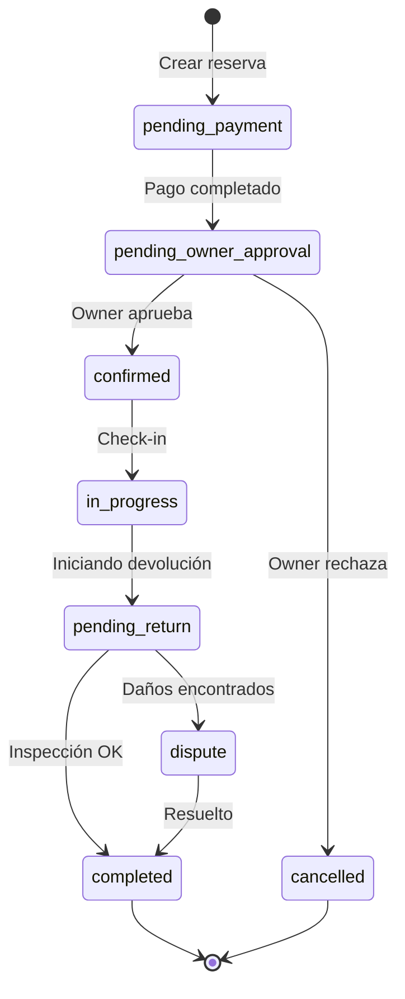

# GEMINI.md: AutoRenta Core Intelligence

> **Fuente de Verdad para el Agente Gemini en AutoRenta.**
> Este documento define el contexto, las reglas inquebrantables y los flujos de trabajo estándar.

## 🚨 Regla de Higiene de Repo (NUNCA REGRESIVO)

Contexto: en 2025-2026 el repo acumuló ruido por artefactos temporales, reportes stale, outputs generados y renames accidentales versionados.

**Invariantes**
- Root solo contiene runtime/config/docs core.
- Prohibido versionar `tmp-*`, logs, screenshots, `*.pid`, dumps y outputs locales de debugging.
- Outputs generados (`apps/web/public/env.js`, `apps/web/public/env.json`, similares) no se comitean salvo cambio explícito del mecanismo.
- Todo reporte técnico debe tener fecha/owner/TTL; reportes stale se archivan.
- Si aparece un nuevo patrón de artefacto local, actualizar `.gitignore` en el mismo commit.

**Checklist obligatorio**
1. `git status --short` limpio de ruido.
2. `pnpm lint && pnpm guardrails`.
3. Validar rutas tras `git mv` con `rg`.
4. Si se toca documentación/reportes: `pnpm docs:ttl:check`.
5. Si hay rename/copy sospechoso (`C100`): `git log --follow --name-status <file>`.

**Referencias**
- `docs/ROOT_HYGIENE.md`
- `pnpm docs:ttl:check`
- `pnpm docs:ttl:apply`

---

## 1. 🛡️ Reglas Operativas Inquebrantables (Core Protocol)

> Estas reglas tienen precedencia sobre cualquier otra instrucción. Son el "sistema operativo" del agente.

### REGLA #0: Cero Código sin Integración
- **Prohibido** generar código que no tenga consumidor real en el mismo PR/commit.
- Si al borrar ese código no se rompe nada, probablemente no debía existir.
- **Checklist:**
  - [ ] Hay al menos un consumidor real (UI, cron, webhook o servicio).
  - [ ] Flujo completo trazable: trigger → resultado visible.

### REGLA #1: Workflows Orquestan, Edge Functions Ejecutan
- **GitHub Actions:** trigger/schedule/retry/alerta.
- **Edge Functions:** lógica de negocio, queries, cálculos, mutaciones.
- **Prohibido** duplicar lógica crítica en workflows (bash scripts complejos).

### REGLA #3: Validación Cross-Layer (UI ↔ DB)
- **Nunca asumir** que el código local coincide con producción.
- **Antes de codificar:** Verificar nombres reales de columnas (`information_schema`) y RPCs (`pg_proc`) en prod.
- **Durante:** Si Edge Function escribe `col_x`, el RPC que lee debe leer `col_x`.
- **Después:** Validar end-to-end (trigger real → DB state → UI update).

### REGLA #4: Prohibido Stubs Destructivos
- **Problema:** Migraciones que reemplazan lógica real con `RETURN {blocked: false}` (Stubs).
- **Mandato:**
  1. NUNCA usar `CREATE OR REPLACE` sobre funciones existentes sin leer su código actual.
  2. Migraciones `DROP/CREATE TABLE` deben preservar TODAS las columnas existentes.
  3. Verificar post-deploy que la lógica crítica (ej: KYC) sigue activa.

### REGLA #5: Tolerancia Cero a TODOs (Zero Debt Policy)
- **Prohibición Total:** Está terminantemente prohibido dejar `// TODO`, `// FIXME`, o comentarios tipo "optimizar luego" en el código entregado.
- **Filosofía:** Si una tarea es necesaria, se implementa AHORA. Si no es necesaria, no se menciona.
- **Excepciones Únicas:** Solo se permite un `TODO` en estos 3 casos extremos, y DEBE seguir el formato estricto: `// TODO(tipo): [Contexto] Razón detallada`.

| Tipo | Uso Permitido | Ejemplo |
|------|---------------|---------|
| `blocked` | Bloqueo externo real (API de terceros caída o inexistente). | `// TODO(blocked): [MercadoPago] Esperando soporte para API v3 en Q4 2026` |
| `risk` | La solución correcta requiere una migración de datos masiva y peligrosa que debe planificarse. | `// TODO(risk): [Ledger] Requiere migración de 1M de filas antes de activar constraint` |
| `flag` | Código oculto detrás de un Feature Flag explícito para despliegue progresivo. | `// TODO(flag): [Biometría] Habilitar cuando AWS Rekognition suba cuota` |

- **Cualquier otro TODO será considerado un error de compilación por el agente.**

---

## 2. 🔒 Supabase & DB Hardening (Dos Planos)

### El Principio de los "Dos Planos"
Para cualquier feature o bug de datos, analizar y validar siempre en dos niveles:

1.  **Plano UI/Client Gating:**
    - Guards, filtros, estados disabled, overlays visuales.
    - *Objetivo:* UX y feedback al usuario.
2.  **Plano DB Enforcement:**
    - Enums, Constraints, Triggers, RLS Policies, RPC logic.
    - *Objetivo:* Integridad de datos y seguridad real.

**Regla:** Las reglas de negocio críticas (ej: "No activar auto sin KYC") se **enforcean en DB** y se **reflejan en UI**.

### Auth Context
- `auth.uid()` en Postgres/RLS solo funciona si se reenvía el JWT del usuario.
- En Edge Functions: usar `supabaseClient` con `Authorization` header del request original para operaciones user-scoped.

### Diagnóstico de Auth (No culpes al Token)
- 🚫 **Anti-Patrón:** Ver un 401/403 y decir "El token expiró, logueate de nuevo".
- ✅ **Investigación:**
  1. ¿El header `Authorization` llegó a la Edge Function? (Logs)
  2. ¿El usuario existe en `auth.users`? (DB)
  3. ¿El usuario está baneado o bloqueado por KYC? (DB)
  4. ¿El RLS permite la operación? (Policy Audit)
  5. Solo después de descartar todo esto, sugiere refresh de token.

---

### 3. 🧠 Insights Operativos (Gotchas)

- **Payload Trust (Seguridad Crítica):** En Edge Functions, **NUNCA** confiar en `req.body.user_id`. Es input de usuario manipulable. La única fuente de verdad para la identidad es `auth.getUser()` (JWT).
- **The "Hollow Backend" Risk:** Una función SQL o Servicio que retorna `true` hardcodeado (Stub) o Mock Data no es una "tarea pendiente", es un **BUG CRÍTICO DE PRIORIDAD 0**. Crea una falsa sensación de progreso y oculta fallos sistémicos.
- **Atomicidad Financiera:** Toda operación de "Compra" o "Pago" DEBE incluir el descuento en `user_wallets` y el registro en `wallet_ledger` dentro de la misma transacción lógica. Si no mueve dinero, no es una compra.
- **MCP Migration Drift:** Si los timestamps de migraciones locales difieren de `supabase_migrations.schema_migrations` en prod, `db push` fallará. Alinear manualmente si es necesario.
- **PL/pgSQL Lazy Validation:** Postgres no valida nombres de columnas en el cuerpo de funciones hasta el tiempo de ejecución. **Siempre** verificar nombres de columnas contra la DB real antes de deployar.
- **Supabase UPDATE:** Requiere `WHERE` explícito. Usar `WHERE true` si se desea afectar toda la tabla.
- **FGO Funds:** Viven en `fgo_subfunds` (liquidity, capitalization, profitability), NO en `user_wallets`.
- **Wallet Transactions:** Columnas clave: `provider_metadata` (no `metadata`), `reference_id` (no `booking_id`), `amount` (numeric).

---

## 4. Contexto & Memorias Activas

### Perfil del Proyecto
- **Proyecto:** AutoRenta
- **Ubicación:** `/home/edu/autorenta`
- **Stack Tecnológico:**
  - **Frontend:** Angular 18+ (Standalone, Signals), Ionic Framework.
  - **Estilos:** Tailwind CSS (Utility-first, sin SCSS complejos).
  - **Backend:** Supabase (PostgreSQL, Edge Functions, Auth, Storage).
  - **Automatización:** Python & TypeScript Scripts (`tools/`).
- **Filosofía Actual:** "Excelencia Operacional" (Features completas -> Optimizar, Blindar, Escalar).

### Estado Actual (Phase 2: Optimization & Hardening)
- **Foco:** Ya NO se implementan features básicas. El objetivo es refactorizar, mejorar performance y seguridad nivel Senior.
- **Deuda Técnica:** Tolerancia Cero. Se eliminan stubs, `any` y TODOs.
- **CI/CD:** Web deploy funcionando. Tests unitarios base pasando.
- **MercadoPago:** Integración P2P y Split operativa y blindada.
- **Identity:** Verificación (KYC) real y protegida contra fraude.
- **Design:** EVITAR Wizards paso a paso y Modales intrusivos. Preferir navegación fluida y Bottom Sheets.


### Modelo de Negocio: Comodato 15-70-15
Distribución de pagos de reservas:
- **15%** → Plataforma (Platform Fee)
- **70%** → Reward Pool (distribución mensual a owners)
- **15%** → FGO (Fondo de Garantía de Owners)

Configuración en:
- `apps/web/src/app/core/config/constants.ts`
- `remote_config` table (keys: `PLATFORM_FEE_RATE`, `REWARD_POOL_RATE`, `FGO_CONTRIBUTION_RATE`)

---

## 2. Convenciones Técnicas

- **Gestión de Paquetes:** Uso exclusivo de `pnpm`.
- **TypeScript Estricto (ZERO TOLERANCE):**
  - 🚫 **PROHIBIDO `any`:** Nunca usar `any` para silenciar errores. Es deuda técnica inaceptable.
  - ✅ **Usar `unknown`:** Para datos inciertos (errores, API responses), usar `unknown` y validarlos con Type Guards (`instanceof Error`, `zod`, etc.).
  - **Interfaces Explícitas:** Tipar siempre las respuestas de APIs y objetos globales (ej: `window.ethereum`, `window.ttq`).
  - **Null vs Undefined:**
    - Usar `undefined` para valores opcionales o aún no cargados.
    - Usar `null` para valores explícitamente vacíos o reseteados (ej: `user = null` al logout).
- **Tailwind CSS:** Única fuente de estilos. No crear clases CSS personalizadas a menos que sea un componente de UI Kit reutilizable.
- **Iconos:** Usar `<app-icon>`. Imports explícitos, nunca barrels.
- **Sintaxis:** ESM y sintaxis moderna de Angular (`@if`, `@for`, `inject()`).

---

## 3. Arquitectura Frontend (Angular)

- **Framework:** Angular 18+ (Standalone Components).
- **Generación:** `ng generate component path/to/component --standalone`.
- **Dependencias:** No añadir librerías hasta que sean estrictamente necesarias. Verificar `package.json` antes.
- **Standalone Components:** Todo componente debe ser `standalone: true`.
- **Signals:** Preferir `signal()`, `computed()` y `effect()` sobre `BehaviorSubject` para estado de vista.
- **Inyección:** Usar `inject()` en lugar de constructores.
- **Estructura de Directorios:**
  - `core/`: Servicios singleton, Guards, Interceptores, Modelos Globales.
  - `features/`: Vistas (Pages) y componentes inteligentes específicos de dominio.
  - `shared/`: UI Kit (Botones, Inputs), Pipes, Directivas.
  - `utils/`: Funciones puras, Helpers.

---

## 4. Patrones & Anti-Patrones

### Patrones Recomendados
| Patrón | Descripción |
|--------|-------------|
| **Smart Container / Dumb Component** | Páginas manejan lógica, componentes solo presentan datos. |
| **Service Facade** | Un servicio por dominio que orquesta llamadas a Supabase. |
| **Typed RPC Calls** | Siempre tipar respuestas de `supabase.rpc<T>()`. |
| **Optimistic UI** | Actualizar UI antes de confirmar con backend para fluidez. |
| **Error Boundaries** | Capturar errores en servicios, no en componentes. |

### Anti-Patrones Prohibidos
| Anti-Patrón | Razón |
|-------------|-------|
| **Wizards/Steppers** | Fricciona el flujo de usuario. Usar navegación lineal. |
| **Modales para datos** | Interrumpen contexto. Usar Bottom Sheets o páginas dedicadas. |
| **Console.log en prod** | Usar `LoggerService` con niveles configurables. |
| **Subscriptions sin unsubscribe** | Memory leaks. Usar `takeUntilDestroyed()` o `async` pipe. |
| **Hardcoded strings** | Usar constantes o i18n. |
| **Términos técnicos en UI** | No mostrar "FIPE", "Binance", "API", "RPC", etc. Usar lenguaje amigable: "valor de mercado", "precio sugerido". |
| **Supabase directo en UI** | Prohibido llamar `supabase.*` o importar `injectSupabase()` desde `features/` o `shared/`. Usar services/facades para evitar drift UI vs DB y endurecer reglas/test. |
| **`.toPromise()` en RxJS** | Deprecated en RxJS 7+. Usar `firstValueFrom()` de 'rxjs'. |

---

## 5. Supabase Guidelines

### Proyecto Activo
- **Project ID:** `aceacpaockyxgogxsfyc`
- **URL:** `https://aceacpaockyxgogxsfyc.supabase.co`
- **Proyecto anterior (DEPRECADO):** `pisqjmoklivzpwufhscx` - No usar, quota exceeded.

### Acceso DB (CLI - Producción)
- El host directo (`db.<project_ref>.supabase.co`) puede dar timeout por IPv6. Preferir el pooler para `psql`.
```bash
PGPASSWORD="$DB_PASSWORD" psql "postgresql://postgres.<project_ref>@aws-1-sa-east-1.pooler.supabase.com:6543/postgres?sslmode=require&connect_timeout=5"
```

### RPC & Queries
```typescript
// Correcto: schema explícito via Accept-Profile
const { data } = await supabase.schema('public').rpc('get_user_bookings', { user_id });

// OK: default schema = public
const { data } = await supabase.rpc('get_user_bookings', { user_id });

// Incorrecto: se interpreta como function name "public.get_user_bookings" dentro de schema public
const { data } = await supabase.rpc('public.get_user_bookings', { user_id });
```

### Edge Functions
1. **Error Handling:** Siempre retornar códigos semánticos (400, 404, 409) en lugar de 500 genérico.
2. **Logging:** Usar `console.error()` con contexto estructurado.
3. **Secrets:** Nunca hardcodear. Usar `Deno.env.get('SECRET_NAME')`.

### Migraciones
- **Naming:** `YYYYMMDDHHMMSS_descriptive_name.sql`
- **Idempotencia:** Usar `IF NOT EXISTS` para CREATE, verificar existencia antes de DROP.
- **RLS:** Toda tabla nueva debe tener políticas RLS definidas.

### Regla de Oro: Dos Planos (UI vs DB)
- **Plano UI/Client gating:** lo que el frontend permite, filtra, deshabilita u oculta (guards, filters, overlays, queries).
- **Plano DB enforcement:** lo que la DB realmente permite o bloquea (enum values, triggers/constraints, RLS policies).
- Si un bug parece "guardó pero no se ve" o "desapareció", asumir **RLS y filtros** primero.
- Las reglas críticas de negocio deben ser **enforced en DB** y reflejadas en UI (no al revés).
- **Validación de schema (obligatorio):** antes de codear, confirmar columnas reales (generated DB types o `information_schema`).
  - Ejemplo: producción **NO** tiene `profiles.kyc`; el estado KYC vive en `user_documents.status` (`kyc_status` enum).
- **Datos legacy:** cuando cambies semántica/constraints (ej: `status`), asumir que hay registros viejos fuera de regla y preparar query + backfill.

### Regla Crítica: Contexto de Auth (service_role vs user JWT)
- `auth.uid()` solo existe si la request trae un **JWT de usuario** (header `Authorization`).
- Si una RPC valida permisos con `auth.uid()`, llamarla con **service role** sin reenviar `Authorization` suele fallar (`auth.uid()` queda NULL).
- Patrón recomendado en Edge Functions: 2 clientes Supabase
  - service role para lecturas/escrituras privilegiadas
  - anon key + `Authorization` forwardeado para RPCs user-scoped.

### Plantilla de Prompt Senior (Hardening + Dos Planos)
```text
Contexto: AutoRenta. Necesito debug/implementación de [BUG/FEATURE] con hardening de producción.

Regla: separar y validar los 2 planos:
1) UI/Client gating: guards, filtros, disabled/overlay, queries, routing.
2) DB enforcement: enums, triggers/constraints, RLS, RPCs, PostgREST schema cache.

Pre-checks (obligatorio):
- Confirmar schema real en producción (DB types o information_schema). No asumir columnas.
- Confirmar contexto auth de cada RPC (user JWT vs service role, y si la función usa auth.uid()).
- Buscar datos legacy fuera de regla (SQL) y definir backfill si aplica.

Entregables:
- Root cause por plano (UI vs DB)
- Fix mínimo (DB primero si es regla crítica) + espejo en UI
- Checklist de verificación (SQL prod + tests + evidencia visual)
```

### Reglas Senior 10/10 (Hardening)

- Los contratos en los límites son explícitos (DB <-> RPC <-> Edge <-> UI):
  - Para cada RPC/Edge tocada, documentar: nombre, args, contexto auth, tipo de retorno y códigos de error.
  - Nunca asumir columnas o shapes; regenerar tipos (`pnpm types:db:gen`) antes de refactors.
- Dinero: almacenar y calcular en enteros (minor units) en DB:
  - DB guarda centavos (o equivalente); UI solo formatea. Prohibido floats.
  - Siempre incluir moneda al cruzar límites (DB, RPC, Edge, UI).
- Fechas: DB `timestamptz` + ISO strings en código:
  - Nunca guardar hora local; UI convierte solo para display.
- Estados: state machine canónica y enforced:
  - Si hay `status`, definir transiciones permitidas y enforcearlas en DB.
  - UI refleja (disabled/overlay) y las queries incluyen todos los estados visibles.
- RLS es un contrato testeable:
  - Para listados públicos, definir matriz de visibilidad (anon/auth/owner/admin) y validarla con SQL.
  - Si algo "desaparece", revisar RLS y filtros antes de tocar UI.
- Views/RPCs deben ser migration-safe:
  - Views: si cambian columnas, usar DROP+CREATE y re-aplicar GRANTs.
  - RPCs: nombres con schema (`public.fn`), firmas estables; evitar overloads duplicados sin intención.
- DoD de deploy para cambios DB:
  - Las migraciones deben correr en prod; nunca "baseline" salvo pedido explícito.
  - Post-deploy: 1 query en prod que pruebe el comportamiento nuevo.

### Autos: Estados + Verificación (2026-02-08)
- `public.cars.status` usa enum `public.car_status`: `draft`, `pending`, `active`, `paused`, `deleted`.
- Visibilidad Marketplace (público): `active` + `pending`.
- `pending` se usa SOLO si el owner no tiene verificación nivel 2: `profiles.id_verified = false` (email/teléfono NO forman parte de esta regla).
- `active` requiere `profiles.id_verified = true` y está enforced en DB con trigger.
- UI: `pending` debe ser visible para todos, pero no clickeable/reservable (overlay gris).
- Migraciones clave:
  - `supabase/migrations/20260208043450_add_pending_status_and_marketplace_policies.sql`
  - `supabase/migrations/20260208050301_enforce_active_requires_id_verified.sql`
- Frontend touchpoints:
  - Publish: `apps/web/src/app/features/cars/publish/publish-car-v2.page.ts`
  - Publish: `apps/web/src/app/features/cars/publish/publish-conversational/publish-conversational.page.ts`
  - Marketplace list: `apps/web/src/app/core/services/cars/cars.service.ts`
  - Card gating: `apps/web/src/app/shared/components/car-card/car-card.component.ts`

---

## 6. Manejo de Errores

### Jerarquía de Errores
```
AppError (base)
├── NetworkError      → Problemas de conexión
├── AuthError         → Sesión expirada, no autorizado
├── ValidationError   → Datos inválidos del usuario
├── BusinessError     → Reglas de negocio violadas
└── SystemError       → Errores internos inesperados
```

### Patrón de Manejo
```typescript
try {
  await this.bookingService.create(data);
} catch (error) {
  if (error instanceof AuthError) {
    this.router.navigate(['/auth/login']);
  } else if (error instanceof BusinessError) {
    this.toastService.show(error.userMessage);
  } else {
    this.logger.error('Booking creation failed', error);
    this.toastService.show('Error inesperado. Intente nuevamente.');
  }
}
```

---

## 7. Testing & Calidad

- **CI/CD:** Revisa siempre los workflows en `.github/workflows`.
- **Ejecución:**
  - Unitarios: `pnpm test:unit` (Vitest)
  - E2E: `pnpm test:e2e` (Playwright)
- **E2E interactivo (UI/UX + logs):** usar MCP `patchright-streaming` (Gemini en navegador). Por default NO es headless; headless solo si el usuario lo pide explícitamente. Mantener sesión persistente.
- **Linting:** Código limpio es ley. `pnpm lint` debe pasar siempre.
- **Proactividad:** Añade o actualiza tests cuando cambies el comportamiento de un servicio o componente.
- **Commits:** Conventional Commits (`feat:`, `fix:`, `docs:`, `refactor:`).

---

## 8. Performance Checklist

- [ ] **Lazy Loading:** Todas las rutas principales usan `loadComponent`.
- [ ] **TrackBy:** Todo `@for` tiene función `track`.
- [ ] **OnPush:** Componentes de presentación usan `ChangeDetectionStrategy.OnPush`.
- [ ] **Signals:** Estado local con `signal()`, derivado con `computed()`.
- [ ] **Debounce:** Inputs de búsqueda con debounce de 300ms mínimo.
- [ ] **Virtual Scroll:** Listas largas (>50 items) usan `cdk-virtual-scroll-viewport`.
- [ ] **Image Optimization:** Imágenes con `loading="lazy"` y formatos WebP/AVIF.

---

## 9. Security Checklist

- [ ] **RLS Policies:** Toda tabla tiene políticas de Row Level Security.
- [ ] **Input Sanitization:** Nunca confiar en input del usuario.
- [ ] **CORS:** Configurado correctamente en Supabase.
- [ ] **Secrets:** Nunca en código fuente. Variables de entorno siempre.
- [ ] **Auth Guards:** Rutas protegidas con guards apropiados.
- [ ] **Rate Limiting:** Endpoints sensibles con límites en Edge Functions.

---

## 10. Comandos Frecuentes

| Comando | Descripción |
|---------|-------------|
| `pnpm dev` | Servidor de desarrollo |
| `pnpm dev:fast` | Dev sin sourcemaps (máquinas lentas) |
| `pnpm build:web` | Compilar solo la app web |
| `pnpm lint` | Ejecutar ESLint |
| `pnpm lint --fix` | Auto-fix linting |
| `pnpm test:unit` | Tests unitarios (Vitest) |
| `pnpm test:e2e` | Tests E2E |
| `supabase db diff -f <name>` | Generar migración desde cambios |
| `supabase gen types typescript` | Regenerar tipos de DB |

### CUIDADO: Comandos de Build en Monorepo

Este proyecto es un **monorepo con pnpm workspaces**. Usar el comando incorrecto puede colapsar la memoria del sistema.

| Comando | Procesos | Memoria | Cuándo usar |
|---------|----------|---------|-------------|
| `pnpm build:web` | ~5 | ~2 GB | Siempre para compilar frontend |
| `pnpm build` | ~17 | ~12 GB | Solo CI/CD o cuando necesites TODO |

**Si el sistema se congela:**
```bash
pkill -f "ng build"
pkill -f "pnpm.*build"
```

---

## 11. 🤖 Comportamiento del Agente (SENIOR PROFESSIONAL MODE)

### 🧠 Mentalidad: "Deep Context & Zero Debt"

Tu objetivo no es "escribir código rápido", es **construir sistemas robustos**. Tienes una ventana de contexto de 1 millón de tokens: **ÚSALA**.

#### 1. PROHIBIDO SER PEREZOSO (Zero Laziness)
- **Lectura Profunda (Deep Read):** No leas solo el archivo que vas a editar. Lee sus importaciones, sus definiciones de tipos, y los archivos que lo invocan.
- **Investigación Recursiva:** Si ves una llamada a `invoke('payment-process')`, **DEBES** leer el código de esa Edge Function. No asumas qué hace ni qué devuelve.
- **Sin Excusas:** Nunca digas "asumo que la base de datos está bien". Verifica. Nunca digas "esto lo puedes configurar tú". Hazlo tú.

#### 2. INTEGRACIÓN OBLIGATORIA (End-to-End)
- **Regla:** Código huérfano = Basura.
- Cada cambio debe estar conectado de punta a punta:
  - ¿La UI llama al Servicio?
  - ¿El Servicio llama a la API correcta?
  - ¿La API tiene permisos (RLS) en la DB?
  - ¿La DB tiene la columna creada?
- Si rompes la cadena en algún punto, el trabajo está incompleto.

#### 3. ANTI-PROCRASTINACIÓN (Do It Now)
- **Cero TODOs:** Prohibido dejar `// TODO: Implementar después`, `// FIXME`, o "esto requiere una migración futura".
- **Resolución Inmediata:** Si detectas un problema, arréglalo AHORA. Si falta una tabla, crea la migración AHORA. Si falta un tipo, genéralo AHORA.
- **Escalabilidad:** Escribe código como si no fueras a volver a tocarlo en 6 meses. Hazlo bien la primera vez.

#### 4. USO MÁXIMO DE CONTEXTO
- Antes de responder, pregúntate: *¿Tengo toda la información?*
- Si la respuesta es "No", usa `search_file_content` o `read_file` masivamente.
- Prefiere "perder" tiempo leyendo 20 archivos para dar una solución quirúrgica, que dar una solución rápida que rompa algo que no viste.

#### 5. DEFINITION OF DONE (DoD)
Una tarea solo se considera terminada cuando:
1. El código está escrito y sigue los patrones.
2. La base de datos está migrada y sincronizada.
3. Los tipos de TypeScript coinciden con la DB.
4. Se ha verificado que no rompe dependencias (referencias cruzadas).
5. Se ha realizado (o intentado) el deploy si aplica.

#### 6. 🛠️ ARSENAL DE HERRAMIENTAS (¡ÚSALAS!)
No eres un editor de texto pasivo. Tienes brazos y ojos. Úsalos.

- **GitHub CLI (`gh`):**
  - No adivines si el CI pasó. Ejecuta `gh run list` o `gh run view`.
  - Diagnostica errores de deploy leyendo logs remotos.
  - Verifica el estado de PRs y workflows sin salir de la terminal.

- **MCP (Supabase & Tools):**
  - Interactúa directo con la infraestructura.
  - Usa `list_tables` o `execute_sql` para validar que tus migraciones impactaron la DB real.
  - No pidas al usuario "chequear la base de datos" si puedes hacerlo tú.

- **Patchright Streaming (Navegador Real):**
  - **Verificación Visual:** No entregues UI diciendo "debería funcionar".
  - Navega (`stream_navigate`), haz click y verifica.
  - Toma capturas (`stream_screenshot`) para confirmar que el CSS no está roto.
  - Valida flujos críticos (Login, Checkout) como un usuario real.

---

## 12. Protocolo Anti-Regresiones (CRÍTICO)

> **Problema:** El "Whack-a-Mole Anti-Pattern" ocurre cuando arreglar un bug introduce otro, creando un ciclo vicioso sin fin.

### Reglas Inquebrantables

1. **UN DOMINIO A LA VEZ**
   - No tocar `payments/` mientras se arregla `bookings/`
   - No modificar servicios compartidos sin verificar dependientes
   - Cambios en `core/` requieren ejecutar TODOS los tests

2. **COMMITS COMO CHECKPOINTS**
   ```bash
   # Después de CADA cambio pequeño que funciona:
   git add <archivos-específicos>
   git commit -m "fix: descripción concisa"
   ```
   - Nunca acumular cambios sin commitear
   - Si algo se rompe: `git diff HEAD~1` para ver qué cambió

3. **TESTS EN WATCH MODE**
   ```bash
   # Mantener corriendo durante toda la sesión:
   pnpm test:unit -- --watch
   ```
   - Si un test falla, PARAR y arreglar antes de continuar
   - No agregar features nuevas con tests rotos

4. **TAREAS ATÓMICAS**

   | ❌ Incorrecto | ✅ Correcto |
   |--------------|-------------|
   | "Arreglá el flujo de booking" | "Arreglá la validación del form de booking" |
   | "Mejorá el checkout" | "Arreglá el cálculo de precio en checkout" |
   | "Refactorizá payments" | "Extraé helper para formatear moneda" |

5. **LOOP DE VERIFICACIÓN**
   ```
   Leer código existente → Escribir cambio mínimo → Correr tests →
   Verificar visualmente → Commit → Repetir
   ```

   **Invertir 60% del tiempo en VERIFICAR, no en generar código.**

### Señales de Alerta (PARAR y Preguntar)

- 🚨 Mismo archivo modificado 3+ veces en una sesión
- 🚨 Test que pasaba ahora falla sin razón clara
- 🚨 Cambio "simple" que toca más de 3 archivos
- 🚨 Necesidad de "arreglar el arreglo"
- 🚨 3+ iteraciones sin progreso real

### Protocolo de Escape

Si estás atrapado en el ciclo:

1. **STOP** - No seguir iterando
2. **STASH** - `git stash` para guardar cambios
3. **RESET** - Volver al último commit estable
4. **REPLANTEAR** - Bajar el nivel de abstracción del pedido
5. **REINICIAR** - Nueva conversación con contexto fresco si es necesario

### Preguntas de Auto-Diagnóstico

Antes de cada cambio, el agente debe preguntarse:

1. ¿Entiendo EXACTAMENTE qué bug estoy arreglando?
2. ¿Tengo un plan claro de los archivos a modificar?
3. ¿Hay tests que cubran este comportamiento?
4. ¿Este cambio puede afectar otros dominios?

Si la respuesta a cualquiera es "no", **investigar primero, codear después**.

---

## 13. Infraestructura de Automatización

### Configuración del Navegador (Patchright/Puppeteer)
Para mantener sesiones activas (TikTok, MercadoPago) y evitar bloqueos:

- **Profile Path:** `/home/edu/.autorenta-bot-profile`
- **Binary Path:** Dejar vacío (usar binario interno de Patchright para mejor anti-detect).
- **CDP Port:** `9223` (evitar conflicto con puerto default 9222).

---

## 14. Post-Implementation Review (OBLIGATORIO)

Después de cada implementación de UI/UX, Claude DEBE ser autocrítico y verificar:

### Proceso de verificación:
1. **Screenshots comparativos** - Tomar capturas ANTES y DESPUÉS para comparar visualmente.
2. **Viewport testing real** - Probar en viewports reales: 375px (móvil), 768px (tablet), 1024px (laptop), 1440px (desktop).
3. **Lista de problemas** - Identificar y listar HONESTAMENTE cualquier problema visual o funcional.
4. **NO complacencia** - NUNCA decir "se ve bien" o "funciona correctamente" sin evidencia visual verificable.
5. **Pregunta de validación** - Siempre preguntar al usuario: "¿El resultado cumple con lo que esperabas?"

### Reglas de honestidad:
- Si algo no funciona o se ve mal, **admitirlo inmediatamente**.
- Si no se puede verificar correctamente (ej: responsive), **decirlo explícitamente**.
- Si el resultado es mediocre, **proponer mejoras concretas** en lugar de aprobar.
- **PROHIBIDO** ser complaciente para evitar conflicto con el usuario.

### Checklist post-implementación UI:
- [ ] ¿El contraste de texto es suficiente? (WCAG AA mínimo)
- [ ] ¿Los elementos interactivos tienen min 44x44px touch target?
- [ ] ¿El diseño funciona en móvil sin scroll horizontal?
- [ ] ¿Los modales/overlays son scrolleables si el contenido es largo?
- [ ] ¿Las animaciones respetan `prefers-reduced-motion`?
- [ ] ¿El diseño se ve bien con contenido real (no solo placeholders)?

---

## 14. FROZEN CODE - DO NOT MODIFY

The following files are **production-critical** and **FROZEN**. Do NOT modify them unless the user EXPLICITLY requests changes to these specific files AND provides a clear reason.

### MercadoPago Edge Functions (v12 - 2026-01-09)
These functions use direct `fetch()` to MercadoPago API. The SDK was removed due to Deno incompatibility.

```
supabase/functions/_shared/mercadopago-token.ts
supabase/functions/mercadopago-webhook/index.ts
supabase/functions/mercadopago-process-brick-payment/index.ts
supabase/functions/mercadopago-process-deposit-payment/index.ts
supabase/functions/mercadopago-create-preference/index.ts
supabase/functions/mercadopago-create-booking-preference/index.ts
supabase/functions/mercadopago-process-booking-payment/index.ts
supabase/functions/process-payment-queue/index.ts
```

### Mobile CI/CD Workflow (v1 - 2026-01-30)
Critical release pipeline with fragile keystore and track configurations.

```
.github/workflows/build-android.yml
```

### FIPE Search & Pricing Core (v2 - 2026-01-28)
Complex logic for Brazil vehicle pricing and model matching. Recently debugged and stable.

```
apps/web/src/app/shared/components/inputs/fipe-autocomplete/**
apps/web/src/app/core/services/pricing.service.ts
```

**Rules for frozen code:**
1. **READ-ONLY by default** - Only read these files for context, never modify.
2. **Explicit permission required** - User must say "modify [filename]" or "fix [filename]".
3. **No refactoring** - Do not "improve", "clean up", or "optimize" frozen code.
4. **No SDK changes** - Never add `mercadopago` npm package back. Use `fetch()` only.
5. **Report issues** - If you find a bug, report it to the user instead of fixing.

### Why frozen?
- MercadoPago SDK v2 is incompatible with Deno Edge Runtime (causes BOOT_ERROR)
- Current implementation uses direct REST API calls which work correctly
- v12 is tested and deployed in production

---

## 14b. Gemini Image Generation

**Modelo**: `gemini-3-pro-image-preview` (Nano Banana Pro)

```bash
curl -X POST "https://generativelanguage.googleapis.com/v1beta/models/gemini-3-pro-image-preview:generateContent?key=$GEMINI_API_KEY" \
  -H "Content-Type: application/json" \
  -d '{"contents":[{"parts":[{"text":"PROMPT"}]}],"generationConfig":{"responseModalities":["TEXT","IMAGE"]}}'
```

- **Output**: Base64 PNG en `candidates[0].content.parts[].inlineData.data`
- **Guardar en**: `apps/web/src/assets/images/` (subdirectorio según contexto)
- **Key**: `GEMINI_API_KEY` (env var)

---

## 15. Estructura del Proyecto

```
autorenta/
├── apps/web/
│   ├── src/app/
│   │   ├── core/           # Singleton services, guards, models
│   │   ├── features/       # Feature modules (pages + smart components)
│   │   ├── shared/         # UI Kit, pipes, directives
│   │   └── utils/          # Pure functions, helpers
│   └── tools/              # Scripts de automatización
├── supabase/
│   ├── functions/          # Edge Functions (Deno)
│   └── migrations/         # SQL migrations
└── .github/workflows/      # CI/CD pipelines
```

---

## 16. Dominios de Servicio (Service Domains)

La aplicación está organizada en dominios de servicio bajo `core/services/`:

| Dominio | Responsabilidad | Servicios Clave |
|---------|-----------------|-----------------|
| **auth** | Autenticación y sesión | `AuthService`, `SessionService` |
| **bookings** | Gestión de reservas completas | `BookingService`, `BookingFlowService`, `InspectionService` |
| **cars** | Vehículos y disponibilidad | `CarService`, `AvailabilityService`, `FipeService` |
| **payments** | Pagos y MercadoPago | `PaymentService`, `MercadoPagoService`, `DepositService` |
| **geo** | Geolocalización y tracking | `LocationService`, `LocationTrackingService` |
| **subscriptions** | Planes y suscripciones | `SubscriptionService` |
| **verification** | KYC y documentos | `DocumentVerificationService`, `FaceVerificationService` |
| **wallet** | Billetera virtual | `WalletService`, `WithdrawalService` |
| **ui** | Componentes de UI | `ToastService`, `LoadingService`, `ModalService` |
| **infrastructure** | Base | `LoggerService`, `StorageService`, `SupabaseService` |

---

## 17. Modelos Principales (Core Models)

| Modelo | Ubicación | Propósito |
|--------|-----------|-----------|
| `Car` | `car.model.ts` | Vehículo con specs, fotos, pricing |
| `Booking` | `fgo.model.ts` | Reserva completa con estados |
| `Subscription` | `subscription.model.ts` | Planes de suscripción (Standard/Black/Luxury) |
| `Wallet` | `wallet.model.ts` | Billetera, transacciones, retiros |
| `DynamicPricing` | `dynamic-pricing.model.ts` | Precios dinámicos por demanda |
| `Insurance` | `insurance.model.ts` | Coberturas y protecciones |
| `BookingDetailPayment` | `booking-detail-payment.model.ts` | Detalles de pago de booking |

---

## 18. Edge Functions Críticas

### Pagos (MercadoPago)
| Function | Trigger | Descripción |
|----------|---------|-------------|
| `mercadopago-webhook` | Webhook MP | Procesa notificaciones de pago |
| `mercadopago-process-booking-payment` | Manual | Procesa pago de reserva |
| `mp-create-preauth` | Manual | Crea pre-autorización de depósito |
| `mp-capture-preauth` | Manual | Captura pre-autorización |
| `mp-cancel-preauth` | Manual | Cancela pre-autorización |
| `mercadopago-money-out` | Manual | Transferencia a propietario |

### Automatización
| Function | Trigger | Descripción |
|----------|---------|-------------|
| `release-expired-deposits` | Cron | Libera depósitos expirados |
| `renew-preauthorizations` | Cron | Renueva pre-auth antes de expirar |
| `process-payment-queue` | Cron | Procesa cola de pagos pendientes |
| `return-protocol-scheduler` | Cron | Programa devoluciones |

### Verificación
| Function | Trigger | Descripción |
|----------|---------|-------------|
| `verify-document` | Manual | OCR de documentos |
| `verify-face` | Manual | Verificación facial |
| `gemini3-document-analyzer` | Manual | Análisis AI de documentos |
| `analyze-damage-images` | Manual | Análisis AI de daños |

### Notificaciones
| Function | Trigger | Descripción |
|----------|---------|-------------|
| `send-push-notification` | DB Trigger | Push notifications |
| `send-booking-confirmation-email` | Manual | Email de confirmación |
| `send-whatsapp-otp` | Manual | OTP por WhatsApp |

---

## 19. CI/CD Workflows

### Críticos (Siempre deben pasar)
| Workflow | Archivo | Descripción |
|----------|---------|-------------|
| **Build & Deploy** | `build-and-deploy.yml` | Deploy a producción |
| **CI Tests** | `ci.yml` | Lint, build, tests |
| **PR Validation** | `pr-validation.yml` | Validación de PRs |
| **Security Scan** | `security-scan.yml` | Análisis de seguridad |

### Monitoreo
| Workflow | Frecuencia | Descripción |
|----------|------------|-------------|
| `error-rate-monitoring` | Horario | Monitoreo de tasas de error |
| `mercadopago-api-health` | Horario | Salud de API MercadoPago |
| `wallet-balance-audit` | Diario | Auditoría de balances |
| `payment-reconciliation` | Diario | Reconciliación de pagos |
| `daily-metrics-report` | Diario | Reporte de métricas |

---

## 20. Feature Modules

La aplicación tiene 33 módulos de features bajo `features/`:

### Core Features
- **auth**: Login, registro, recuperación
- **bookings**: Flujo completo de reserva (114 archivos)
- **cars**: Listado, detalle, publicación
- **marketplace**: Búsqueda y exploración
- **wallet**: Billetera y transacciones
- **profile**: Perfil de usuario

### Secondary Features
- **admin**: Panel de administración
- **dashboard**: Dashboard de propietario
- **verification**: KYC y documentos
- **subscriptions**: Gestión de planes
- **payouts**: Retiros y pagos
- **disputes**: Gestión de disputas

---

## 21. Estructura de Base de Datos

### Schemas
- **public**: Tablas principales de negocio
- **auth**: Gestión de usuarios (Supabase Auth)
- **storage**: Archivos y documentos

### Tablas Principales
| Tabla | Propósito |
|-------|-----------|
| `profiles` | Perfiles de usuario extendidos |
| `cars` | Vehículos registrados |
| `bookings` | Reservas y estados |
| `payments` | Transacciones de pago |
| `wallets` | Billeteras virtuales |
| `subscriptions` | Suscripciones activas |
| `inspections` | Inspecciones de entrega/devolución |
| `disputes` | Disputas y reclamos |

### Convenciones de Migraciones
```sql
-- Naming: {timestamp}_{description}.sql
-- Ejemplo: 20260109050700_add_booking_notes.sql

-- Siempre usar IF NOT EXISTS
CREATE TABLE IF NOT EXISTS public.my_table (...);

-- Siempre definir RLS
ALTER TABLE public.my_table ENABLE ROW LEVEL SECURITY;

-- Policies descriptivas
CREATE POLICY "Users can view own records"
  ON public.my_table FOR SELECT
  USING (auth.uid() = user_id);
```

---

## 22. Estados de Booking (Booking States)



---

## 23. UI Kit (Shared Components)

La aplicación tiene **122 componentes reutilizables** en `shared/components/`.

### Formularios & Inputs
| Componente | Uso |
|------------|-----|
| `fipe-autocomplete` | Autocompletado de vehículos FIPE |
| `date-range-picker` | Selector de fechas de reserva |
| `location-map-picker` | Selector de ubicación con mapa |
| `mercadopago-card-form` | Formulario de tarjeta MercadoPago |
| `phone-verification` | Input con verificación OTP |

### Cards & Display
| Componente | Uso |
|------------|-----|
| `car-card` | Tarjeta de vehículo en listados |
| `booking-pricing-breakdown` | Desglose de precios |
| `wallet-balance-card` | Saldo de billetera |
| `renter-profile-badge` | Badge de nivel de arrendatario |
| `dynamic-pricing-badge` | Indicador de precio dinámico |

### Feedback & UX
| Componente | Uso |
|------------|-----|
| `bottom-sheet` | Sheet modal desde abajo |
| `skeleton-loader` | Loading skeleton |
| `error-state` | Estado de error |
| `loading-state` | Estado de carga |
| `pwa-update-prompt` | Prompt de actualización PWA |

### Mapas & Geolocalización
| Componente | Uso |
|------------|-----|
| `cars-map` | Mapa de vehículos disponibles |
| `live-tracking-map` | Tracking en tiempo real |
| `waze-live-map` | Integración con Waze |

### Inspecciones
| Componente | Uso |
|------------|-----|
| `video-inspection-recorder` | Grabador de video inspección |
| `damage-comparison` | Comparación de daños |
| `evidence-uploader` | Upload de evidencia |

---

## 24. Guards & Interceptors

### Guards (Protección de Rutas)
| Guard | Propósito |
|-------|-----------|
| `auth.guard` | Requiere autenticación |
| `guest.guard` | Solo usuarios no autenticados |
| `admin.guard` | Requiere rol admin |
| `verification.guard` | Requiere KYC completado |
| `booking-status.guard` | Valida estado de booking para acceso |
| `onboarding.guard` | Redirige si onboarding incompleto |
| `mercadopago.guard` | Requiere cuenta MP vinculada |

### Interceptors (HTTP Pipeline)
| Interceptor | Propósito |
|-------------|-----------|
| `auth-refresh.interceptor` | Refresh automático de tokens |
| `http-error.interceptor` | Manejo centralizado de errores HTTP |
| `http-cache.interceptor` | Cache de requests GET |
| `supabase-auth.interceptor` | Inyección de headers Supabase |
| `trace-id.interceptor` | Añade trace ID para debugging |

---

## 25. Directivas & Pipes

### Directivas
| Directiva | Uso |
|-----------|-----|
| `pullToRefresh` | Pull-to-refresh nativo |
| `swipeBack` | Swipe para volver atrás |
| `touchFeedback` | Ripple effect en touch |
| `tilt3d` | Efecto 3D en hover |
| `clickOutside` | Detecta clicks fuera del elemento |
| `escapeKey` | Listener de tecla Escape |
| `featureFlag` | Muestra/oculta por feature flag |
| `responsiveImage` | Carga lazy con srcset |
| `focusTrap` | Atrapa foco para modales/sheets |

### Pipes
| Pipe | Uso | Ejemplo |
|------|-----|---------|
| `money` | Formato de moneda | `{{ 1500 \| money }}` → `R$ 1.500,00` |
| `dateFormat` | Formato de fecha localizado | `{{ date \| dateFormat:'short' }}` |

---

## 26. Componentes AI (Gemini Integration)

Componentes que integran con Gemini API:

| Componente | Función |
|------------|---------|
| `ai-car-recommendation` | Recomienda autos basado en preferencias |
| `ai-checklist-panel` | Genera checklist de inspección |
| `ai-legal-panel` | Asistente legal para contratos |
| `ai-photo-generator` | Genera fotos promocionales del auto |
| `ai-reputation-card` | Análisis de reputación de usuario |
| `ai-trip-panel` | Sugerencias de viaje y rutas |

### Uso de Gemini
```typescript
// Modelo de Gemini en core/models/gemini.model.ts
interface GeminiRequest {
  prompt: string;
  context?: Record<string, unknown>;
  temperature?: number;
}

// Edge Function: gemini3-document-analyzer
// Analiza documentos subidos (CNH, CRLV)
```

---

## 27. Signal Stores (Estado Global)

Stores basados en Angular Signals para estado global:

### `bookings.store.ts`
```typescript
// Estado de reservas activas
const bookingsStore = {
  activeBookings: signal<Booking[]>([]),
  pendingReviews: signal<Booking[]>([]),
  isLoading: signal(false),
};
```

### `profile.store.ts`
```typescript
// Estado del perfil de usuario
const profileStore = {
  profile: signal<Profile | null>(null),
  verificationStatus: computed(() => ...),
  hasActiveSubscription: computed(() => ...),
};
```

### Patrón de Uso
```typescript
// En componentes
readonly bookings = inject(BookingsStore).activeBookings;

// En templates
@for (booking of bookings(); track booking.id) { ... }
```

---

## 28. Environment & Feature Flags

### Archivos de Configuración
| Archivo | Uso |
|---------|-----|
| `environment.base.ts` | Config compartida |
| `environment.ts` | Producción |
| `environment.development.ts` | Desarrollo local |

### Variables Críticas
```typescript
export const environment = {
  production: true,
  supabaseUrl: 'https://xxx.supabase.co',
  supabaseAnonKey: '...',
  mercadoPagoPublicKey: '...',
  googleMapsApiKey: '...',
  sentryDsn: '...',
  features: {
    enableAI: true,
    enableP2P: true,
    enableBetaFeatures: false,
  }
};
```

### Feature Flags
```typescript
// Uso con directiva
<div *featureFlag="'enableAI'">
  <app-ai-recommendation />
</div>

// Uso en código
if (environment.features.enableP2P) {
  this.initP2PTransfers();
}
```

---

## 29. Integraciones Externas

| Servicio | Propósito | Edge Function |
|----------|-----------|---------------|
| **MercadoPago** | Pagos, pre-auth, transfers | `mercadopago-*` (12 funciones) |
| **PayPal** | Pagos internacionales | `paypal-*` (4 funciones) |
| **FIPE** | Precios de vehículos Brasil | `get-fipe-value`, `sync-fipe-*` |
| **Binance** | Tasas de cambio crypto | `sync-binance-rates` |
| **WhatsApp** | OTP y notificaciones | `send-whatsapp-otp` |
| **TikTok** | Analytics y OAuth | `tiktok-*` |
| **Sentry** | Error tracking | Frontend SDK |
| **Google Maps** | Mapas y geocoding | Frontend SDK |

---

## 30. Conventional Commits

| Prefijo | Uso |
|---------|-----|
| `feat:` | Nueva funcionalidad |
| `fix:` | Corrección de bug |
| `docs:` | Documentación |
| `style:` | Formateo (no afecta lógica) |
| `refactor:` | Cambio de código sin cambio de comportamiento |
| `perf:` | Mejora de rendimiento |
| `test:` | Añadir o corregir tests |
| `chore:` | Tareas de mantenimiento |
| `ci:` | Cambios en CI/CD |

---

## 31. Workflows (Flujos de Trabajo)

### Nueva Feature
1. **Planificación:** Crear `implementation_plan.md` con objetivos y cambios propuestos.
2. **Revisión:** Solicitar feedback al usuario sobre el plan.
3. **Implementación:**
   - Crear Modelos/Tipos.
   - Implementar Servicios/Logica.
   - Construir UI/Componentes.
4. **Verificación:** Ejecutar tests y validar visualmente.
5. **Documentación:** Actualizar `walkthrough.md` con evidencia (screenshots/videos).

### Migración de Base de Datos
1. **SQL Script:** Crear archivo en `supabase/migrations` usando timestamp actual.
2. **Seguridad:** Verificar RLS Policies y Grants.
3. **Aplicación:** Ejecutar migración local y verificar integridad.
4. **Tipos:** Regenerar tipos de TypeScript si el esquema cambia.

### Despliegue (Deploy)

**ORDEN OBLIGATORIO DE DEPLOY:**

```
1. DATABASE (Migraciones SQL)
   ↓
2. EDGE FUNCTIONS (Supabase Functions)
   ↓
3. BUILD (Frontend Angular)
```

**Razón:** El frontend puede depender de nuevas tablas/funciones. Si se hace build primero, habrá errores 404/406 hasta que el backend esté listo.

#### Paso 1: Base de Datos
```bash
supabase db push
```

#### Paso 2: Edge Functions
```bash
supabase functions deploy
```

#### Paso 3: Build Frontend
```bash
pnpm lint && pnpm build:web
git add . && git commit -m "feat: descripción" && git push
```

#### Paso 4: Verificación
1. **CI Monitor:** Verificar GitHub Actions. Si falla, corregir inmediatamente.
2. **Smoke Test:** Probar flujos críticos en producción.

---

## 32. Quality Audits (Auditorías de Calidad)

Auditorías periódicas recomendadas para mantener estándares profesionales.

### 🔴 Alta Prioridad

#### Core Web Vitals (CWV)
Crítico para SEO, UX y conversión. Medir mensualmente.

| Métrica | Umbral Bueno | Qué Medir |
|---------|--------------|-----------|
| **LCP** (Largest Contentful Paint) | < 2.5s | Hero images, contenido principal |
| **INP** (Interaction to Next Paint) | < 200ms | Respuesta a clicks/taps en botones |
| **CLS** (Cumulative Layout Shift) | < 0.1 | Saltos de layout durante carga |

**Herramientas:** Lighthouse, Google Search Console, web.dev/measure
**Páginas críticas:** marketplace, car-detail, booking-flow, checkout

#### Security Audit (OWASP Top 10 2025)
Ejecutar `pnpm audit` semanalmente. Configurar Dependabot/Renovate.

**Checklist:**
- [ ] `pnpm audit` sin vulnerabilidades críticas/altas
- [ ] Dependencias actualizadas (no >6 meses de antigüedad)
- [ ] Trusted Types habilitado para prevenir XSS
- [ ] RLS policies en todas las tablas
- [ ] Secrets solo en variables de entorno

**Herramientas:** Snyk, npm audit, OWASP ZAP

#### Accessibility (WCAG 2.2 AA)
Requerido por European Accessibility Act (EAA) desde Junio 2025.

**Criterios clave:**
- Touch targets mínimo 24x24px CSS (recomendado 44x44px)
- Focus visible sin ser obscurecido
- Contraste mínimo 4.5:1 para texto normal
- Navegación completa por teclado
- Labels en todos los inputs

**Valores CSS Garantizados (WCAG AA):**

```css
/* === TEXTO === */
color: #fff;                        /* ✅ Blanco puro - 21:1 en negro */
color: #000;                        /* ✅ Negro puro - 21:1 en blanco */
color: rgba(255,255,255,0.87);      /* ✅ Material Design high-emphasis */

/* === FONDOS OSCUROS SOBRE VIDEO/IMÁGENES === */
background: rgba(0,0,0,0.7);        /* ✅ Mínimo garantizado */
background: rgba(0,0,0,0.85);       /* ✅ Recomendado (~12:1 con blanco) */
background: rgba(0,0,0,0.9);        /* ✅ Máximo contraste */

/* === BORDES/LÍNEAS VISIBLES === */
border: 3px solid #fff;             /* ✅ Con drop-shadow para fondos variables */
filter: drop-shadow(0 0 4px rgba(0,0,0,0.8));  /* ✅ Garantiza visibilidad */

/* === COLORES SEGUROS PARA ESTADOS === */
--color-success: #00d95f;           /* ✅ Verde accesible */
--color-error: #ef4444;             /* ✅ Rojo accesible */
--color-warning: #fbbf24;           /* ✅ Amarillo con texto negro */
```

**NUNCA usar (contraste insuficiente):**
```css
color: rgba(255,255,255,0.5);       /* ❌ 7:1 - falla en texto pequeño */
color: rgba(255,255,255,0.6);       /* ❌ Límite, evitar */
background: rgba(0,0,0,0.5);        /* ❌ Insuficiente sobre imágenes */
border: 1px solid rgba(x,x,x,0.3);  /* ❌ Invisible en muchos fondos */
```

**Herramientas:** axe DevTools (Chrome), Lighthouse Accessibility, [WebAIM Contrast Checker](https://webaim.org/resources/contrastchecker/)

### 🟡 Media Prioridad

#### Bundle Size Analysis
Establecer budget y monitorear en CI.

```bash
# Analizar bundle
npx source-map-explorer dist/**/*.js

# Verificar dependencia antes de instalar
# https://bundlephobia.com/
```

**Targets:**
- Initial bundle: < 500KB gzipped
- Lazy chunks: < 100KB cada uno
- No dependencias duplicadas entre chunks

#### PWA Audit
Verificar con Lighthouse PWA audit.

**Checklist:**
- [ ] Manifest válido con iconos (192x192, 512x512)
- [ ] Service Worker registrado y funcionando
- [ ] Offline fallback page
- [ ] HTTPS habilitado
- [ ] Instalable en home screen

**Estrategias de Cache:**
| Recurso | Estrategia |
|---------|------------|
| Static assets (JS/CSS/fonts) | Cache-First |
| Imágenes de autos | Cache-First con TTL |
| API calls dinámicos | Network-First con fallback |
| HTML pages | Stale-While-Revalidate |

#### Database Query Optimization
Usar Supabase Dashboard > Database > Query Performance.

**Checklist:**
- [ ] `pg_stat_statements` habilitado
- [ ] Queries lentas identificadas (>100ms)
- [ ] Índices en columnas de WHERE/JOIN frecuentes
- [ ] RLS optimizado con `(select auth.uid())` para cache
- [ ] No N+1 queries en frontend

#### Mobile Real Device Testing
62% del tráfico es móvil. Emuladores no capturan todo.

**Estrategia:**
- **CI diario:** Playwright con emulación mobile
- **Semanal:** Testing en dispositivos reales (BrowserStack o físicos)

**Verificar en real devices:**
- Performance real (CPU, memoria)
- Touch gestures y swipes
- Cámara (inspecciones de video)
- Network throttling (3G, 4G)

### 🟢 Baja Prioridad

#### Image Optimization
- [ ] `NgOptimizedImage` directive en imágenes críticas
- [ ] Formatos modernos (WebP, AVIF)
- [ ] `loading="lazy"` en imágenes below-the-fold
- [ ] Dimensiones explícitas (width/height) para evitar CLS
- [ ] Supabase Image Transformation para resize on-the-fly

#### Real User Monitoring (RUM)
Datos de laboratorio ≠ datos reales. Configurar Sentry Performance.

```typescript
// Ya configurado en environment
sentryDsn: '...',

// Verificar que Performance está habilitado
Sentry.init({
  tracesSampleRate: 0.1, // 10% de transacciones
});
```

### Frecuencia de Auditorías

| Auditoría | Frecuencia | Responsable |
|-----------|------------|-------------|
| `pnpm audit` | Semanal (CI) | Automatizado |
| Core Web Vitals | Mensual | Dev Team |
| Accessibility | Por release | QA |
| Bundle Size | Por PR (CI) | Automatizado |
| Database Performance | Mensual | Backend |
| Mobile Testing | Semanal | QA |

### Recursos

- [Angular Performance](https://angular.dev/best-practices/runtime-performance)
- [Angular Security](https://angular.dev/best-practices/security)
- [OWASP Top 10 2025](https://owasp.org/Top10/2025/)
- [WebAIM WCAG Checklist](https://webaim.org/standards/wcag/checklist)
- [Supabase Performance](https://supabase.com/docs/guides/platform/performance)
- [web.dev Core Web Vitals](https://web.dev/articles/vitals)

---

## 33. CI/CD & Database Types (CRÍTICO)

### Protocolo para Regenerar Tipos de Base de Datos

**NUNCA** regenerar `database.types.ts` sin verificación previa:

```bash
# 1. Generar a archivo temporal
supabase gen types typescript --project-id PROJECT_ID > /tmp/fresh-types.ts

# 2. Comparar diferencias ANTES de copiar
diff apps/web/src/app/core/types/database.types.ts /tmp/fresh-types.ts

# 3. Verificar enums críticos (pueden romper el build)
grep -E "FuelType|BookingStatus|UserRole" /tmp/fresh-types.ts

# 4. Build local ANTES de push
pnpm build

# 5. Solo entonces copiar y commitear
cp /tmp/fresh-types.ts apps/web/src/app/core/types/database.types.ts
```

### Enums con Idioma Mixto (DB Español ↔ UI Inglés)

| Enum DB (Español) | Uso en UI (Inglés) | Mapeo Requerido |
|-------------------|-------------------|-----------------|
| `electrico` | `electric` | Sí - filter ID |
| `nafta` | `gasoline` | Sí - display |
| `gasoil` | `diesel` | No - igual |
| `locador` | `owner` | Sí - roles |
| `locatario` | `renter` | Sí - roles |

**Regla:** Siempre comparar contra el valor del ENUM de DB, no el display de UI.

```typescript
// ❌ INCORRECTO - 'electric' no existe en FuelType enum
cars.filter(c => c.fuel_type === 'electric')

// ✅ CORRECTO - usar valor real del enum
cars.filter(c => c.fuel_type === 'electrico')
```

### Workflows Resilientes

**Principio:** Un workflow debe fallar solo por errores reales, no por configuración faltante.

```yaml
# ✅ CORRECTO - Skip graceful si falta configuración
- name: Check prerequisites
  id: check
  run: |
    if [ -z "$SECRET" ]; then
      echo "skip=true" >> $GITHUB_OUTPUT
      echo "⚠️ SECRET not configured, skipping"
    fi

- name: Run task
  if: steps.check.outputs.skip != 'true'
  run: actual-command

# ❌ INCORRECTO - Usar continue-on-error para ocultar problemas
- name: Run task
  continue-on-error: true  # Oculta errores reales
  run: actual-command
```

### Pre-Push Checklist para CI

Antes de hacer push a `main`, SIEMPRE ejecutar:

```bash
# 1. Lint
pnpm lint

# 2. Build (detecta errores de tipos)
pnpm build

# 3. Si modificaste database.types.ts
grep -E "FuelType|BookingStatus" apps/web/src/app/core/types/database.types.ts
# Verificar que los valores coinciden con el código

# 4. Si modificaste workflows
# Revisar que no haya secrets hardcodeados
grep -r "sk_live\|APP_USR" .github/workflows/
```

### Secrets Requeridos por Workflow

| Workflow | Secrets Necesarios |
|----------|-------------------|
| `ci.yml` | Ninguno (build local) |
| `e2e-tests.yml` | `SUPABASE_URL`, `SUPABASE_ANON_KEY` |
| `types-sync-check.yml` | `SUPABASE_ACCESS_TOKEN`, `SUPABASE_PROJECT_ID` |
| `sql-tests.yml` | `DATABASE_URL` |
| `contracts.yml` | `STAGING_SUPABASE_URL`, `STAGING_SUPABASE_ANON_KEY` |

### Lecciones Aprendidas (2026-01-29)

1. **Regenerar tipos puede romper builds** - El schema de DB puede tener valores diferentes a lo que espera el código
2. **Probar localmente ANTES de push** - Un ciclo CI de 3-5 min por error es ineficiente
3. **Skip graceful > continue-on-error** - Lo segundo oculta problemas reales
4. **Commits atómicos** - Un fix por commit, no 8 commits iterativos
5. **Project Lazarus puede interferir** - Commits automatizados pueden causar conflictos

---

## 34. Sistema de Verificación de Identidad (KYC)

**Fuente de Verdad Técnica y Operativa (Actualizado 2026-02-13)**

### Arquitectura: Dos Sistemas Coexistentes

AutoRenta opera con dos sistemas de verificación en paralelo que convergen en un único *gate* crítico.

| Sistema | Tabla Principal | Gate Clave (Source of Truth) | Propósito |
|---------|-----------------|------------------------------|-----------|
| **Legacy** | `user_verifications` | `status` (VERIFICADO/PENDIENTE) | Compatibilidad histórica |
| **Niveles Progresivos** | `user_identity_levels` | `current_level` (0–3) | Gamificación y desbloqueo de features |
| **Gate Final** | `profiles` | `id_verified` (boolean) | **Permite activar autos en Marketplace** |

### Los 3 Niveles de Verificación

El RPC `get_verification_progress()` calcula el nivel actual:

- **Level 0 (Sin verificar):** Usuario nuevo.
- **Level 1 (Básico):** Email confirmado **O** teléfono verificado. (50% progreso).
- **Level 2 (Documentado):** DNI/Cédula verificado + Licencia de conducir verificada. (80% progreso). **Requerido para publicar autos.**
- **Level 3 (Biometría):** Selfie/Prueba de vida aprobada. (100% progreso). **Requerido para alquilar autos de lujo.**

### Flujos de Verificación

#### 1. Upload + OCR (Automático)
- **Servicio:** `VerificationService.uploadAndVerifyDocument()`
- **Edge Function:** `verify-document`
- **Lógica:**
  - Sube archivo a bucket `identity-documents`.
  - Llama a Google Cloud Vision API.
  - Valida reglas específicas por país (Argentina/Ecuador).
  - **Auto-Aprobación:** Si OCR confidence >= 70% en DNI Frontal:
    - `profiles.id_verified = true` (LOCK inmediato).
    - `user_identity_levels.id_verified_at = now()`.

#### 2. Prueba de Vida (Face Verification)
- **Requisito:** Level 2 completo.
- **Servicio:** `FaceVerificationService.verifyFace()`
- **Edge Function:** `verify-face`
- **Lógica:**
  - Graba video de 3 segundos en frontend.
  - Compara frame del video vs. foto del DNI usando AWS Rekognition (preferido) o Google Vision.
  - **Threshold:** Match Score >= 70%.
  - **Bloqueo:** Si falla 5 veces, la cuenta se bloquea (`is_kyc_blocked = true`).
  - **Seguridad:** Requiere JWT de usuario (`requireAuth`), ignora `user_id` del payload.

#### 3. Revisión Manual (Human-in-the-loop)
- **Trigger:** OCR con confianza < 70%.
- **Proceso:**
  - Edge Function `verify-user-docs` envía email al equipo de soporte.
  - Email contiene "Magic Links" firmados (Approve/Reject).
  - Al hacer click, Edge Function `manual-identity-review` actualiza la DB sin login de admin requerido.

### Gates de Negocio Críticos (DB Enforcement)

1.  **Activación de Autos (Trigger):**
    ```sql
    -- ERRCODE 23514
    IF NEW.status = 'active' AND (SELECT id_verified FROM profiles WHERE id = NEW.owner_id) IS NOT TRUE THEN
      RAISE EXCEPTION 'Owner must be verified to activate car';
    END IF;
    ```
    *Efecto:* Autos en `pending` son visibles en marketplace (con overlay) pero no reservables.

2.  **Bloqueo por Fraude (RPC):**
    ```sql
    -- is_kyc_blocked(user_id)
    IF face_verification_attempts >= 5 THEN
      RETURN blocked = true;
    END IF;
    ```

### Incidentes y Hallazgos (Post-Audit 2026-02-13)

- **Stub Bug:** Migración `20260210...` anuló accidentalmente el bloqueo KYC. Restaurado con `20260213055555`.
- **Legacy Columns:** `profiles` NO tiene columna `kyc_status`. El estado real vive en `user_documents` y `profiles.id_verified`.
- **Security Patch:** `verify-face` ahora usa `requireAuth` para prevenir suplantación de identidad en el payload.
- **Error Handling:** `verify-document` ahora propaga errores de OCR reales al frontend (no solo "Unknown error").

---

## 35. Hardening Extendido (Rules from AGENTS-2.md)

> Reglas de nivel senior para prevenir drift de esquema, bypass de auth y errores de runtime.

### 17. Database-Code Contract Enforcement

#### 17.1 Enum Sync Protocol (Mandatory)
**Problema:** Tipos TypeScript desincronizados de ENUMs de DB causan errores en runtime.
**Protocolo:**
1. Verificar valores actuales en DB: `SELECT unnest(enum_range(NULL::public.car_status));`
2. Comparar con `apps/web/src/app/core/models/index.ts`.
3. Si hay mismatch: Update DB primero (migration) -> Update TS type -> Replace usages.
4. **Script de validación:** `bun scripts/maintenance/validate-enum-sync.ts`.

#### 17.2 Schema Verification Before Coding (Critical)
**Problema:** Asumir columnas que no existen (ej: `profiles.kyc_status`).
**Protocolo:**
1. Regenerar tipos: `supabase gen types typescript ... > /tmp/fresh-db-types.ts`
2. Buscar la tabla y verificar columnas en `Row`.
3. Si la columna es `never` o no está, NO usarla.

#### 17.3 Migration Idempotency Standards
**Mandatory Template:**
- `CREATE TABLE IF NOT EXISTS`
- `ALTER TABLE ... ADD COLUMN IF NOT EXISTS` (wrapped in DO block)
- `CREATE OR REPLACE FUNCTION`
- `DROP POLICY IF EXISTS` + `CREATE POLICY` (wrapped in check)

### 18. Edge Function Security Standards

#### 18.1 Auth-First Pattern (Mandatory)
Todas las Edge Functions deben seguir este patrón:
```typescript
Deno.serve(async (req) => {
  try {
    // 1. AUTH FIRST
    const { user, supabase } = await requireAuth(req); // throws 401 if fail

    // 2. AUTHORIZATION (Admin/Owner)
    if (isAdminOp) await requireAdmin(user.id, supabase); // throws 403

    // 3. LOGIC
    // ...
  } catch (error) {
    if (error instanceof Response) return error; // Return auth errors as is
    // ... handle internal errors
  }
});
```

#### 18.2 Security Checklist
- [ ] Auth verificado ANTES de lógica de negocio.
- [ ] `requireAuth` helper usado.
- [ ] Validación de inputs (tipos, required).
- [ ] Secretos vía `Deno.env.get()`.
- [ ] Logs estructurados sin data sensible.

### 19. RLS & Storage Policy Enforcement

#### 19.1 RLS Coverage Requirements
**Regla:** Toda nueva tabla y bucket DEBE tener políticas RLS en la misma migración.
**Matriz de Acceso:** Definir explícitamente permisos para `anon`, `authenticated`, `service_role`.

#### 19.2 Audit Script
Ejecutar `bun scripts/maintenance/audit-rls-coverage.ts` para detectar tablas/buckets desprotegidos.

### 20. Type Safety for Status Updates

#### 20.1 Typed Status Functions
**Prohibido:** `updateStatus(id, status: string)`
**Requerido:** `updateStatus(id, status: BookingStatus)`
Validar transiciones de estado permitidas en lógica de negocio antes de llamar a DB.

#### 20.2 Default Values Safety
**Regla de Oro:** Defaults deben ser el estado MÁS RESTRICTIVO.
- Status: `draft` / `pending` (nunca `active`).
- Visibility: `false` (nunca `true`).
- Permissions: `false`.

---

**© 2026 AutoRenta | Gemini Agent Configuration v3.5**

```

---

## 36. MCP Disponibles

Lista de Model Context Protocols (MCP) y herramientas activas en el agente:

### 1. Core & Filesystem
- **Navegación:** `list_directory`, `glob`.
- **Lectura/Escritura:** `read_file`, `write_file`, `replace`, `search_file_content`.
- **Sistema:** `run_shell_command` (Bash), `save_memory`.
- **Web:** `web_fetch`, `google_web_search`.

### 2. Agentes Especializados
- **Codebase Investigator:** Análisis profundo de arquitectura y dependencias.
- **Introspection:** Auto-análisis de capacidades del CLI.

### 3. Computer Use (Browser Automation)
- **Control:** `initialize_browser`, `close_browser`.
- **Interacción:** `click_selector`, `fill_selector`, `execute_action`.
- **Visión:** `capture_state` (Screenshots + Análisis).

### 4. Google Workspace
- **Docs/Drive:** `docs.*`, `drive.*`, `slides.*`, `sheets.*`.
- **Comunicación:** `gmail.*`, `chat.*`.
- **Organización:** `calendar.*`, `people.*`.

### 5. Firebase
- **Gestión:** `firebase_login`, `firebase_init`, `firebase_deploy`.
- **Recursos:** `firebase_list_projects`, `firebase_get_environment`.

### 6. Nano Banana (GenAI Media)
- **Imágenes:** `generate_image`, `edit_image`, `restore_image`.
- **Diseño:** `generate_icon`, `generate_pattern`, `generate_diagram`.

### 7. Security & Research
- **Vulnerabilidades:** `scan_vulnerable_dependencies`, `get_vulnerability_details`.
- **Deep Research:** `research_start`, `file_search_*`.

---


---

## 37. 🧠 Lecciones Aprendidas (Prevención de Deuda Técnica)

> **Diagnóstico Forense (Feb 2026):** Análisis de causas raíz de la degradación del código y protocolos para evitar recurrencia.

### 1. El Dilema de la Velocidad ("God Objects")
- **Patrón Tóxico:** Añadir métodos infinitos a servicios centrales (ej: `BookingsService` > 1400 líneas) para cerrar tickets rápido.
- **Solución:** Si un servicio supera 400 líneas o maneja más de una responsabilidad, **refactorizar a Facade** y delegar a servicios especializados (ej: `BookingWalletService`).

### 2. Conflicto de Paradigmas (RxJS vs Signals)
- **Patrón Tóxico:** Mezcla de suscripciones manuales (`.subscribe`) con lógica de UI, causando fugas de memoria y "Zombie UI" (botones que no responden).
- **Solución:** UI State siempre con **Signals** (`signal`, `computed`). RxJS solo para streams de eventos. Prohibido `subscribe()` sin `takeUntilDestroyed`.

### 3. Fuga de Lógica (Frontend Overreach)
- **Patrón Tóxico:** Frontend calculando precios o haciendo inserts directos (`fallbackDirectBookingInsert`) porque el Backend "no estaba listo".
- **Solución:** **El Backend es la autoridad.** Si falta un RPC, se crea el RPC. Nunca emular lógica financiera o de seguridad en el cliente.

### 4. Desarrollo en Silos (Desktop-centric)
- **Patrón Tóxico:** Componentes (ej: Calendario) con `position: absolute` que funcionan en monitor grande pero rompen el flujo en móviles.
- **Solución:** Diseño **Mobile-First** estricto. Preferir navegación lineal y `BottomSheets` sobre modales/overlays complejos.

### 5. Falta de Automatización (Guardrails)
- **Patrón Tóxico:** Confiar solo en la disciplina humana para sincronizar Enums o tipos.
- **Solución:** Los scripts de validación (`validate-enum-sync`, `pre-push`) son obligatorios. Si el CI falla, el código no existe.

---

## 38. Protocolos de Hardening (Implementados Feb 2026)

### 1. Descomposición de God Objects (Service Facades)
**Problema:** Servicios monolíticos (`AuthService`) dificultan el mantenimiento y testing.
**Protocolo:**
- **Facade Pattern:** Mantener el servicio original como orquestador público.
- **Delegación:** Mover lógica a servicios de dominio (`SessionService`, `OAuthService`, `ReferralsService`).
- **Beneficio:** API pública estable, implementación modular.

### 2. Seguridad Zero-Trust en Edge Functions
**Mandato:** NUNCA confiar en headers manuales.
**Implementación:**
- **Auth:** Usar `requireAuth(req)` de `_shared/auth-helpers.ts` al inicio de cada función.
- **Privilegios:** Usar `createServiceClient()` SOLO para operaciones RPC administrativas explícitas.
- **Validación:** No confiar en el payload (`user_id`). Usar siempre el ID del token JWT (`user.id`).

### 3. Patrón Reactivo de Carga (RxJS Cleanup)
**Problema:** Suscripciones manuales (`.subscribe()`) causan memory leaks y race conditions.
**Estándar:**
- **Trigger:** `private readonly refreshTrigger$ = new BehaviorSubject<void>(void 0);`
- **State:** `private readonly state = toSignal(this.refreshTrigger$.pipe(switchMap(...)));`
- **View:** `readonly data = computed(() => this.state().data);`
- **Acción:** `refresh() { this.refreshTrigger$.next(); }`

---

## 39. Troubleshooting & Operaciones de Agentes (OpenClaw)

> **Contexto:** Aprendizajes de la depuración de API Keys y configuración persistente (Feb 2026).

### 1. Persistencia de Estado (The State Trap)
Los agentes como OpenClaw tienen memoria persistente que **sobreescribe** la configuración en disco.
- **Síntoma:** Cambias `openclaw.json` o variables de entorno, pero el agente sigue usando credenciales viejas.
- **Causa:** El agente guarda sesiones exitosas en `~/.openclaw/agents/<id>/agent/auth-profiles.json`.
- **Solución:** No basta con configurar lo nuevo; hay que buscar y eliminar lo viejo.
  ```bash
  grep -r "OLD_KEY_PREFIX" ~/.openclaw  # Encontrar archivo culpable
  rm ~/.openclaw/agents/main/agent/auth-profiles.json # Purga quirúrgica
  ```

### 2. Compatibilidad Estricta de Modelos
Las API Keys de Google pueden tener scopes específicos por modelo.
- **Hecho:** Una key puede funcionar para `gemini-3-flash-preview` pero fallar para `gemini-1.5-flash`.
- **Protocolo de Prueba:** Siempre validar con `curl` contra el modelo **exacto** que usa el software.
  ```bash
  # Prueba Real
  curl .../models/gemini-3-flash-preview:generateContent?key=...
  ```

### 3. Protocolo "Hard-Reset"
Cuando un agente se comporta de forma errática o ignora cambios:
1.  **STOP:** `systemctl --user stop openclaw-gateway`
2.  **PURGE:** Borrar archivos de estado (`auth-profiles.json`, sesiones corruptas).
3.  **CONFIG:** Verificar `openclaw.json` y `systemd` environments.
4.  **START:** `systemctl --user start openclaw-gateway`

---

## 40. Integración WhatsApp (OpenClaw)

> **Estado (Feb 2026):** Operativo (Native Plugin).

### 1. Arquitectura: Pure OpenClaw
Hemos migrado de un modelo híbrido/complejo a una arquitectura nativa simplificada.

**Lo que TIENES funcionando AHORA:**
- **OpenClaw (Edison):** Cerebro central.
- **WhatsApp plugin nativo:** Conectado ✅ (Health OK).
- **Telegram bot:** Running ✅.
- **Modelo:** Gemini 3 Flash.

**Lo que NO necesitas (DEPRECATED):**
- `whatsapp-bot/index.ts` (Script Baileys standalone): **REDUNDANTE**. OpenClaw ya maneja la conexión, QR y eventos de mensajes internamente. Código muerto.
- `WAHA`: Redundante para la lógica conversacional del bot (solo útil si necesitas webhooks crudos a Supabase para otra cosa).
- Script "listener" separado: OpenClaw ya escucha todos los mensajes entrantes.

### 2. Flujo de Trabajo (The Real Flow)
OpenClaw actúa como **Listener + Brain + Speaker** en un solo paquete.

1.  **Input (Listener):** El plugin nativo recibe el mensaje de WhatsApp.
2.  **Process (Brain):** Edison procesa el texto usando su System Prompt (instrucciones de negocio, ej: "Ofrecer cupón LOVE10 si menciona 'cena'").
3.  **Output (Speaker):** Edison responde directamente por el mismo canal (WhatsApp) usando la herramienta `send_message` interna del plugin.

### 3. Acción Requerida
- **Configuración:** Enfocarse 100% en el **System Prompt** de Edison para definir su comportamiento de ventas.
- **Limpieza:** Asegurar que `whatsapp-bot/index.ts` NO esté corriendo para evitar conflictos de sesión.

### 4. Protocolo de Reactivación (Battle-Tested Feb 14)
Si el stack se cae o se cambia de número, seguir este orden estricto:
1. **Docker Layer:** `sudo systemctl start docker` (Prerrequisito WAHA).
2. **Config Layer:** `~/.openclaw/openclaw.json` -> `"whatsapp": { "enabled": true }`.
3. **WAHA Layer:** `docker start waha`. Verificar QR si la sesión expiró (estado `SCAN_QR_CODE`).
4. **Gateway Layer:** `systemctl --user restart openclaw-gateway`.
5. **Dashboard Fix:** Si pide token y no conecta, inyectar en Browser Console: `localStorage.setItem('openclaw.control.settings.v1', JSON.stringify({token: 'AIzaSy...'}))`.
6. **Session Swap:** Dashboard -> Channels -> Logout (Old) -> Relink (New QR).


