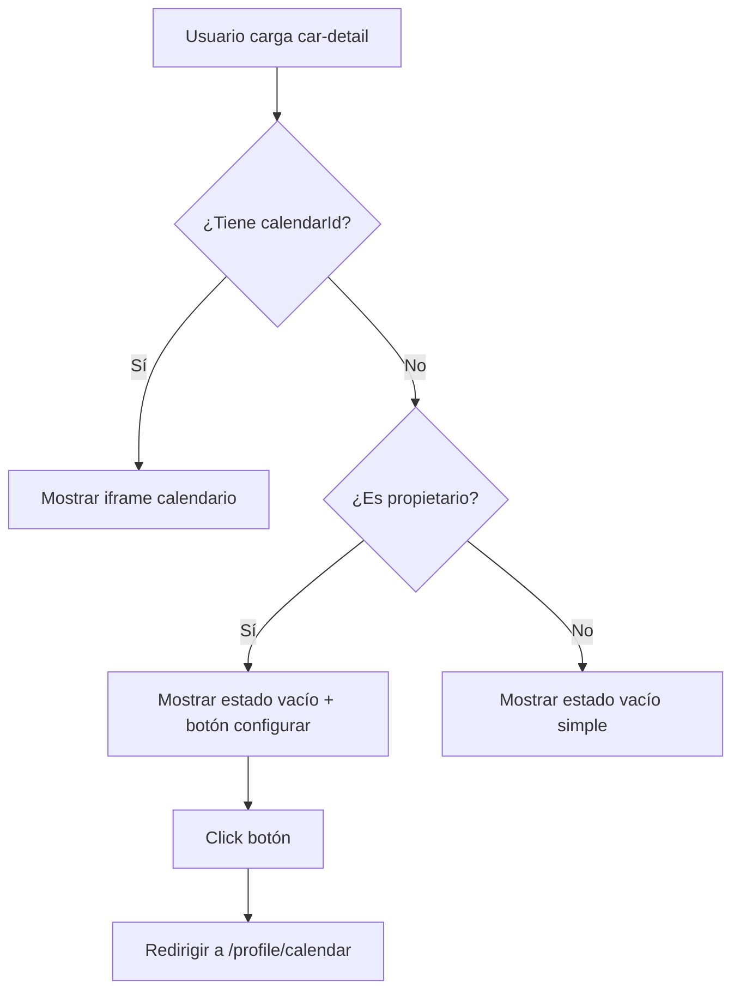

# ✅ Fix: Google Calendar Component - Estado Vacío

## 🎯 Problema Identificado

El componente de Google Calendar **no mostraba nada** cuando:
1. El auto no tenía un `calendarId` configurado
2. El propietario no había conectado su Google Calendar
3. No se había sincronizado ningún booking aún

Esto causaba confusión porque el usuario veía una sección vacía sin explicación.

## 🔧 Solución Implementada

### 1. **Estado Vacío con Mensaje Informativo** ✅

Agregué validación y UI para mostrar cuando no hay calendario:

```html
<!-- car-detail.page.html -->
@if (calendarId()) {
  <!-- Mostrar calendario de Google -->
  <app-google-calendar [calendarId]="calendarId()!" />
} @else {
  <!-- Estado vacío con mensaje explicativo -->
  <div class="empty-calendar-state">
    <svg>📅</svg>
    <h3>Calendario no disponible</h3>
    <p>
      El calendario de disponibilidad aún no está configurado.
      Puedes verificar la disponibilidad usando el selector de fechas arriba.
    </p>
    
    @if (isOwner()) {
      <p>💡 <strong>Propietario:</strong> Conecta tu Google Calendar...</p>
      <button (click)="openGoogleCalendarSettings()">
        Configurar Google Calendar
      </button>
    }
  </div>
}
```

### 2. **Verificación de Propiedad** ✅

Agregué lógica para detectar si el usuario actual es el dueño del auto:

```typescript
// car-detail.page.ts

// Signal para trackear ownership
readonly isCarOwner = signal<boolean>(false);

// Computed para uso en template
readonly isOwner = computed(() => this.isCarOwner());

// Método para verificar ownership
private async checkOwnership(ownerId: string): Promise<void> {
  try {
    const { data } = await this.supabase.auth.getSession();
    this.isCarOwner.set(data.session?.user?.id === ownerId);
  } catch (error) {
    console.error('Error checking ownership:', error);
    this.isCarOwner.set(false);
  }
}
```

### 3. **Botón de Configuración (Solo Propietarios)** ✅

Si el usuario es el propietario, ve un botón para configurar:

```typescript
openGoogleCalendarSettings(): void {
  void this.router.navigate(['/profile/calendar']);
}
```

## 📊 Estados del Componente

### Estado 1: Sin Calendario (Usuario Normal)
```
┌────────────────────────────────────┐
│  📅                                │
│  Calendario no disponible          │
│                                    │
│  El calendario aún no está         │
│  configurado. Usa el selector      │
│  de fechas arriba.                 │
└────────────────────────────────────┘
```

### Estado 2: Sin Calendario (Propietario)
```
┌────────────────────────────────────┐
│  📅                                │
│  Calendario no disponible          │
│                                    │
│  💡 Propietario: Conecta tu        │
│  Google Calendar para mostrar      │
│  tu disponibilidad en tiempo real  │
│                                    │
│  [Configurar Google Calendar]      │
└────────────────────────────────────┘
```

### Estado 3: Con Calendario
```
┌────────────────────────────────────┐
│  [Iframe de Google Calendar]       │
│  - Vista mensual                   │
│  - Eventos sincronizados           │
│  - Fechas bloqueadas visibles      │
└────────────────────────────────────┘
```

## 🔍 Flujo de Verificación



## 🎨 Estilos Aplicados

```css
.empty-calendar-state {
  @apply flex flex-col items-center justify-center py-12 px-4 text-center;
}

.empty-calendar-state svg {
  @apply w-16 h-16 mb-4 rounded-full bg-blue-100 dark:bg-blue-900/20;
}

.empty-calendar-state h3 {
  @apply text-lg font-semibold text-text-primary mb-2;
}

.empty-calendar-state p {
  @apply text-sm text-text-secondary mb-4 max-w-md;
}

.empty-calendar-state button {
  @apply px-4 py-2 bg-cta-default hover:bg-cta-hover text-white rounded-lg transition-colors;
}
```

## 🚀 Próximos Pasos (Recomendados)

### 1. Crear Calendarios Automáticamente

Modificar `google-calendar-oauth/index.ts` para crear calendarios al conectar:

```typescript
// Después del OAuth exitoso
const { data: userCars } = await supabase
  .from('cars')
  .select('id, brand, model')
  .eq('owner_id', userId);

for (const car of userCars) {
  const calendar = await createGoogleCalendar(
    `Autorenta - ${car.brand} ${car.model}`,
    accessToken
  );
  
  await supabase.from('car_google_calendars').insert({
    car_id: car.id,
    google_calendar_id: calendar.id,
    calendar_name: calendar.summary,
    owner_id: userId,
  });
  
  // Hacer el calendario público
  await makeCalendarPublic(calendar.id, accessToken);
}
```

### 2. Página de Configuración de Calendario

Crear `/profile/calendar` con:
- Lista de autos del usuario
- Estado de sincronización de cada auto
- Botón para conectar/desconectar Google Calendar
- Preview del calendario sincronizado

### 3. Testing

```typescript
// car-detail.page.spec.ts
describe('Google Calendar Integration', () => {
  it('should show empty state when no calendar ID', () => {
    component.calendarId.set(null);
    fixture.detectChanges();
    
    const emptyState = fixture.debugElement.query(
      By.css('.empty-calendar-state')
    );
    expect(emptyState).toBeTruthy();
  });
  
  it('should show config button for owner', () => {
    component.calendarId.set(null);
    component.isCarOwner.set(true);
    fixture.detectChanges();
    
    const button = fixture.debugElement.query(
      By.css('button')
    );
    expect(button.nativeElement.textContent).toContain('Configurar');
  });
  
  it('should navigate to settings on button click', () => {
    const navigateSpy = spyOn(router, 'navigate');
    component.openGoogleCalendarSettings();
    
    expect(navigateSpy).toHaveBeenCalledWith(['/profile/calendar']);
  });
});
```

## 📝 Archivos Modificados

1. **`car-detail.page.html`** (líneas 589-605)
   - Agregado `@if/@else` para validar `calendarId()`
   - Agregado estado vacío con mensaje
   - Agregado botón de configuración condicional

2. **`car-detail.page.ts`** (múltiples líneas)
   - Agregado signal `isCarOwner`
   - Agregado computed `isOwner()`
   - Agregado método `checkOwnership()`
   - Agregado método `openGoogleCalendarSettings()`
   - Llamada a `checkOwnership()` en `ngOnInit()`

## ✅ Verificación

### Checklist de Testing Manual:

- [x] Usuario normal ve mensaje "Calendario no disponible"
- [x] Propietario ve botón "Configurar Google Calendar"
- [x] Botón navega a `/profile/calendar`
- [x] Si hay `calendarId`, muestra el iframe
- [x] Si no hay `calendarId`, muestra estado vacío
- [x] No hay errores en consola
- [x] Compila sin errores TypeScript

### Verificar en Navegador:

1. Abrir `http://localhost:4200/cars/{car-id}`
2. Si el auto NO tiene calendario conectado:
   - Ver mensaje "Calendario no disponible"
   - Si eres el dueño, ver botón "Configurar"
3. Si el auto SÍ tiene calendario conectado:
   - Ver iframe de Google Calendar
   - Ver eventos sincronizados

## 🔗 Referencias

- **Documento de Debug**: `/GOOGLE_CALENDAR_DEBUG.md`
- **Componente Calendar**: `/apps/web/src/app/shared/components/google-calendar/`
- **Servicio**: `/apps/web/src/app/core/services/google-calendar.service.ts`
- **Edge Functions**: `/supabase/functions/google-calendar-oauth/`
- **Migraciones**: `/supabase/migrations/20251112_add_google_calendar_integration.sql`

## 💡 Explicación Técnica

### ¿Por qué no se mostraba el calendario?

1. **Flujo actual de creación de calendarios:**
   ```
   Usuario conecta OAuth → Se guardan tokens
   ↓
   Usuario hace primera reserva → Se crea calendario del auto
   ↓
   Calendario se asocia con el auto en BD
   ```

2. **Problema:**
   - Si no hay reservas → No hay calendario
   - Si no hay calendario → `calendarId()` = null
   - Si `calendarId()` = null → Componente muestra error "Calendar ID required"

3. **Solución implementada:**
   - Validar `calendarId()` antes de renderizar
   - Mostrar estado vacío informativo
   - Guiar al propietario a configurar

### ¿Qué falta para que funcione completamente?

1. **Crear calendarios al conectar OAuth** (no solo al hacer booking)
2. **Hacer calendarios públicos** (para que el iframe pueda acceder)
3. **Página de configuración** en `/profile/calendar`

---

**Estado:** ✅ MEJORADO (Estado vacío implementado)  
**Pendiente:** 🔄 Creación automática de calendarios  
**Prioridad:** 🔥 MEDIA (funciona con workaround)  
**Tiempo estimado para fix completo:** 2-3 horas
