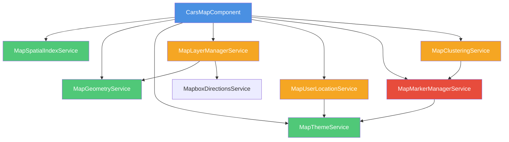

# Refactor Plan: CarsMapComponent (2,385 lines → ~300 lines)

**Date:** 2025-11-15
**File:** `apps/web/src/app/shared/components/cars-map/cars-map.component.ts`
**Objective:** Split large component into focused services and child components while maintaining 100% behavioral compatibility

---

## Executive Summary

The `CarsMapComponent` is a monolithic 2,385-line component handling map rendering, spatial indexing, marker management, component pooling, and multiple map layers. This refactor will extract 7 specialized services and maintain a lightweight orchestration component.

### Benefits
- ✅ **Maintainability**: Each service has a single responsibility
- ✅ **Testability**: Services can be unit tested independently
- ✅ **Reusability**: Services can be used by other map components
- ✅ **Performance**: No performance regression (same algorithms)
- ✅ **DI-safe**: All Angular DI patterns preserved

---

## Architecture Overview

### Before (Current)
```
CarsMapComponent (2,385 lines)
├── QuadTree class (103 lines)
├── Map initialization (96 lines)
├── Clustering logic (209 lines)
├── Marker rendering (367 lines)
├── Component pooling (112 lines)
├── Viewport management (165 lines)
├── Tooltip management (94 lines)
├── User location (159 lines)
├── Search radius (62 lines)
├── Geometry math (46 lines)
├── Follow location (45 lines)
├── Map controls (80 lines)
├── Delivery isochrone (105 lines)
├── Directions route (131 lines)
├── Theme management (55 lines)
└── Lifecycle & cleanup (190 lines)
```

### After (Target)
```
CarsMapComponent (~300 lines) - Orchestrator
├── MapSpatialIndexService - QuadTree & spatial queries
├── MapGeometryService - Math calculations
├── MapLayerManagerService - Map layers (radius, isochrone, directions)
├── MapMarkerManagerService - Marker lifecycle & pooling
├── MapClusteringService - Clustering logic
├── MapUserLocationService - User location marker & tracking
└── MapThemeService - Theme & style management
```

---

## Detailed Service Breakdown

### 1. MapSpatialIndexService
**Responsibility:** Spatial indexing and viewport queries
**Lines:** ~200 (QuadTree + query logic)
**Dependencies:** None (pure logic)

```typescript
@Injectable({ providedIn: 'root' })
export class MapSpatialIndexService {
  private spatialIndex: QuadTree | null = null;

  buildIndex(cars: CarMapLocation[], threshold: number): void
  query(bounds: Bounds): CarMapLocation[]
  clear(): void
}
```

**Extracted from:**
- Lines 74-177: QuadTree class
- Lines 745-791: buildSpatialIndex, updateSpatialIndex
- Lines 1022-1076: getVisibleCarsInViewport

**Risk:** Low - Pure logic with clear inputs/outputs

---

### 2. MapGeometryService
**Responsibility:** Geometric calculations (distance, circles, coordinates)
**Lines:** ~100
**Dependencies:** None (pure math)

```typescript
@Injectable({ providedIn: 'root' })
export class MapGeometryService {
  calculateDistance(lat1: number, lng1: number, lat2: number, lng2: number): number
  createCircleGeometry(lat: number, lng: number, radiusMeters: number): GeoJSON.Polygon
  destinationPoint(lat: number, lng: number, distanceMeters: number, bearing: number): {lat, lng}
}
```

**Extracted from:**
- Lines 1541-1554: calculateDistance (Haversine)
- Lines 1642-1656: createCircleGeometry
- Lines 1661-1687: destinationPoint

**Risk:** Low - Pure math functions

---

### 3. MapThemeService
**Responsibility:** Dark mode detection and theme management
**Lines:** ~80
**Dependencies:** PLATFORM_ID (for SSR safety)

```typescript
@Injectable({ providedIn: 'root' })
export class MapThemeService {
  readonly isDarkMode = signal(false);

  detectDarkMode(): void
  updateMapTheme(map: MapboxMap, markerVariant: 'photo' | 'price'): void
  setupThemeListener(callback: () => void): void
}
```

**Extracted from:**
- Lines 304: isDarkMode signal
- Lines 314-331: detectDarkMode
- Lines 337-377: updateMapTheme

**Risk:** Low - Isolated theme logic

---

### 4. MapLayerManagerService
**Responsibility:** Manage map layers (radius, isochrone, directions)
**Lines:** ~350
**Dependencies:** MapGeometryService, MapboxDirectionsService, environment

```typescript
@Injectable({ providedIn: 'root' })
export class MapLayerManagerService {
  // Search radius
  addSearchRadiusLayer(map: MapboxMap, userLocation: {lat, lng}, radiusKm: number, isDark: boolean): void
  removeSearchRadiusLayer(map: MapboxMap): void

  // Delivery isochrone
  addDeliveryIsochrone(map: MapboxMap, car: CarMapLocation, deliveryTimeMinutes: number, isDark: boolean): Promise<void>
  removeDeliveryIsochrone(map: MapboxMap): void

  // Directions route
  addDirectionsRoute(map: MapboxMap, origin: [number, number], destination: [number, number]): Promise<void>
  removeDirectionsRoute(map: MapboxMap): void

  cleanup(map: MapboxMap): void
}
```

**Extracted from:**
- Lines 295-302: Layer IDs
- Lines 1576-1637: addSearchRadiusLayer, removeSearchRadiusLayer
- Lines 1915-2019: addDeliveryIsochrone, removeDeliveryIsochrone
- Lines 2025-2155: addDirectionsRoute, removeDirectionsRoute

**Risk:** Medium - Multiple async operations, needs careful testing

---

### 5. MapUserLocationService
**Responsibility:** User location marker, tracking, and follow mode
**Lines:** ~250
**Dependencies:** MapThemeService, PLATFORM_ID

```typescript
@Injectable({ providedIn: 'root' })
export class MapUserLocationService {
  private userLocationMarker: MapboxMarker | null = null;
  private followLocationInterval: ReturnType<typeof setInterval> | null = null;

  addUserLocationMarker(map: MapboxMap, location: {lat, lng}, options: UserLocationOptions): void
  updateUserLocationMarker(map: MapboxMap, location: {lat, lng}): void
  removeUserLocationMarker(): void

  startFollowingLocation(map: MapboxMap, location: {lat, lng}): void
  stopFollowingLocation(): void

  createUserLocationPopup(options: PopupOptions): MapboxPopup
  formatUpdateTime(date: Date): string
}
```

**Extracted from:**
- Lines 272: userLocationMarker
- Lines 303: followLocationInterval
- Lines 305-306: circleSizeMultiplier
- Lines 1318-1476: User location marker methods
- Lines 1692-1736: Follow location logic

**Risk:** Medium - Interval management requires careful cleanup

---

### 6. MapMarkerManagerService
**Responsibility:** Marker creation, component pooling, tooltip management
**Lines:** ~450
**Dependencies:** ApplicationRef, EnvironmentInjector, MapThemeService

```typescript
@Injectable({ providedIn: 'root' })
export class MapMarkerManagerService {
  private carMarkers = new Map<string, {marker: MapboxMarker; componentRef: ComponentRef<MapMarkerComponent>}>();
  private tooltipPopups = new Map<string, MapboxPopup>();
  private tooltipComponents = new Map<string, ComponentRef<EnhancedMapTooltipComponent>>();
  private hoverTimeouts = new Map<string, ReturnType<typeof setTimeout>>();

  // Component pooling
  private markerComponentPool: ComponentRef<MapMarkerComponent>[] = [];
  private tooltipComponentPool: ComponentRef<EnhancedMapTooltipComponent>[] = [];

  // Marker lifecycle
  createCarMarker(car: CarMapLocation, options: MarkerOptions): {marker, componentRef} | null
  clearMarkers(): void
  highlightMarker(carId: string): void
  removeHighlight(carId: string): void

  // Tooltip lifecycle
  showTooltip(marker: MapboxMarker, car: CarMapLocation): void
  hideTooltip(carId: string): void
  createTooltipPopup(car: CarMapLocation): MapboxPopup

  // Component pooling
  private getMarkerComponentFromPool(): ComponentRef<MapMarkerComponent>
  private returnMarkerComponentToPool(componentRef: ComponentRef<MapMarkerComponent>): void
  private getTooltipComponentFromPool(): ComponentRef<EnhancedMapTooltipComponent>
  private returnTooltipComponentToPool(componentRef: ComponentRef<EnhancedMapTooltipComponent>): void

  cleanup(): void
}
```

**Extracted from:**
- Lines 268-275: Marker and tooltip tracking maps
- Lines 289-292: Component pools
- Lines 796-907: Component pooling methods
- Lines 1168-1216: createCarMarker
- Lines 1221-1313: Tooltip popup methods
- Lines 1824-1861: Highlight methods
- Lines 1866-1891: clearMarkers

**Risk:** High - Complex memory management, requires extensive testing

---

### 7. MapClusteringService
**Responsibility:** Clustering configuration and layer setup
**Lines:** ~300
**Dependencies:** MapMarkerManagerService

```typescript
@Injectable({ providedIn: 'root' })
export class MapClusteringService {
  private clusterSourceId = 'cars-cluster-source';
  private clusterLayerId = 'cars-cluster-layer';
  private clusterCountLayerId = 'cars-cluster-count';

  setupClustering(map: MapboxMap, cars: CarMapLocation[]): void
  removeClustering(map: MapboxMap): void
  getAdaptiveClusterMaxZoom(): number
  getAdaptiveClusterRadius(): number
  updateClusterData(map: MapboxMap, cars: CarMapLocation[]): void
}
```

**Extracted from:**
- Lines 277-281: Cluster configuration
- Lines 496-681: setupClustering
- Lines 689-704: Adaptive cluster methods
- Lines 2171-2184: Cleanup clustering layers

**Risk:** Medium - Mapbox-specific clustering logic

---

## Dependency Graph



**Legend:**
- 🔵 Blue (Low risk): Pure logic, no side effects
- 🟢 Green (Low risk): Isolated logic, minimal dependencies
- 🟠 Orange (Medium risk): Async operations, needs testing
- 🔴 Red (High risk): Complex state, memory management

---

## Incremental Migration Plan

### Phase 1: Pure Logic Services (Low Risk)
**Goal:** Extract stateless, pure functions first

#### Step 1.1: MapGeometryService
**Effort:** 1-2 hours
**Files:**
- Create: `apps/web/src/app/core/services/map-geometry.service.ts`
- Create: `apps/web/src/app/core/services/map-geometry.service.spec.ts`

**Changes:**
1. Create service with 3 pure methods
2. Add comprehensive unit tests (100% coverage)
3. Inject into CarsMapComponent
4. Replace inline calls with service calls
5. Verify no behavior change

**Commit:** `refactor(map): extract MapGeometryService - pure math functions`

**Tests:**
```typescript
describe('MapGeometryService', () => {
  it('should calculate distance correctly (Buenos Aires to La Plata)', () => {
    expect(service.calculateDistance(-34.603722, -58.381592, -34.921389, -57.954444))
      .toBeCloseTo(56000, -2); // ~56km
  });

  it('should create circle with 64 points', () => {
    const circle = service.createCircleGeometry(-34.603722, -58.381592, 5000);
    expect(circle.coordinates[0]).toHaveLength(65); // 64 + closing point
  });
});
```

#### Step 1.2: MapSpatialIndexService
**Effort:** 2-3 hours
**Files:**
- Create: `apps/web/src/app/core/services/map-spatial-index.service.ts`
- Create: `apps/web/src/app/core/services/map-spatial-index.service.spec.ts`

**Changes:**
1. Extract QuadTree class to service
2. Add build/query/clear public API
3. Add unit tests with mock data (100 cars, 1000 cars)
4. Inject into CarsMapComponent
5. Replace direct QuadTree usage
6. Verify performance is identical

**Commit:** `refactor(map): extract MapSpatialIndexService - QuadTree spatial indexing`

**Tests:**
```typescript
describe('MapSpatialIndexService', () => {
  it('should build index for 1000 cars', () => {
    const cars = generateMockCars(1000);
    service.buildIndex(cars, 1000);
    expect(service.query(bounds)).toBeDefined();
  });

  it('should return cars in viewport bounds', () => {
    const cars = generateMockCars(100);
    service.buildIndex(cars, 100);
    const visible = service.query({x: -58.5, y: -34.7, width: 0.2, height: 0.2});
    expect(visible.length).toBeGreaterThan(0);
  });
});
```

---

### Phase 2: Theme & Style Services (Low Risk)
**Goal:** Extract theme management

#### Step 2.1: MapThemeService
**Effort:** 1-2 hours
**Files:**
- Create: `apps/web/src/app/core/services/map-theme.service.ts`
- Create: `apps/web/src/app/core/services/map-theme.service.spec.ts`

**Changes:**
1. Create service with isDarkMode signal
2. Extract detectDarkMode, updateMapTheme, setupThemeListener
3. Add unit tests (mock matchMedia)
4. Inject into CarsMapComponent
5. Replace theme logic with service calls
6. Verify theme switching works identically

**Commit:** `refactor(map): extract MapThemeService - dark mode and theme management`

**Tests:**
```typescript
describe('MapThemeService', () => {
  it('should detect dark mode from media query', () => {
    spyOn(window, 'matchMedia').and.returnValue({matches: true} as any);
    service.detectDarkMode();
    expect(service.isDarkMode()).toBe(true);
  });

  it('should update map theme to dusk preset in dark mode', () => {
    const mockMap = createMockMapboxMap();
    service.isDarkMode.set(true);
    service.updateMapTheme(mockMap, 'photo');
    expect(mockMap.setConfigProperty).toHaveBeenCalledWith('basemap', 'lightPreset', 'dusk');
  });
});
```

---

### Phase 3: User Location Services (Medium Risk)
**Goal:** Extract user location tracking

#### Step 3.1: MapUserLocationService
**Effort:** 3-4 hours
**Files:**
- Create: `apps/web/src/app/core/services/map-user-location.service.ts`
- Create: `apps/web/src/app/core/services/map-user-location.service.spec.ts`

**Changes:**
1. Create service with private marker and interval tracking
2. Extract all user location marker methods
3. Extract follow location logic
4. Add unit tests (mock intervals, markers)
5. Inject MapThemeService
6. Inject into CarsMapComponent
7. Replace user location logic
8. Verify location tracking works identically

**Commit:** `refactor(map): extract MapUserLocationService - user location tracking`

**Tests:**
```typescript
describe('MapUserLocationService', () => {
  it('should create user location marker with correct styling', () => {
    const mockMap = createMockMapboxMap();
    service.addUserLocationMarker(mockMap, {lat: -34.6, lng: -58.4}, {mode: 'searching'});
    expect(mockMap.addTo).toHaveBeenCalled();
  });

  it('should start following location with interval', fakeAsync(() => {
    const mockMap = createMockMapboxMap();
    service.startFollowingLocation(mockMap, {lat: -34.6, lng: -58.4});
    tick(2000);
    expect(mockMap.easeTo).toHaveBeenCalled();
  }));

  it('should stop following and clear interval', () => {
    service.startFollowingLocation(mockMap, location);
    service.stopFollowingLocation();
    expect(service['followLocationInterval']).toBeNull();
  });
});
```

**Risk Mitigation:**
- Test interval cleanup thoroughly
- Verify no memory leaks (use Chrome DevTools)
- Test multiple start/stop cycles

---

### Phase 4: Layer Management Services (Medium Risk)
**Goal:** Extract map layer logic

#### Step 4.1: MapLayerManagerService
**Effort:** 4-5 hours
**Files:**
- Create: `apps/web/src/app/core/services/map-layer-manager.service.ts`
- Create: `apps/web/src/app/core/services/map-layer-manager.service.spec.ts`

**Changes:**
1. Create service with layer ID constants
2. Extract search radius layer methods
3. Extract delivery isochrone methods
4. Extract directions route methods
5. Inject MapGeometryService, MapboxDirectionsService
6. Add unit tests (mock Mapbox API calls)
7. Inject into CarsMapComponent
8. Replace layer logic with service calls
9. Verify layers render identically

**Commit:** `refactor(map): extract MapLayerManagerService - map layers (radius, isochrone, directions)`

**Tests:**
```typescript
describe('MapLayerManagerService', () => {
  it('should add search radius layer with correct geometry', () => {
    const mockMap = createMockMapboxMap();
    service.addSearchRadiusLayer(mockMap, {lat: -34.6, lng: -58.4}, 5, false);
    expect(mockMap.addSource).toHaveBeenCalledWith('search-radius-source', jasmine.any(Object));
    expect(mockMap.addLayer).toHaveBeenCalled();
  });

  it('should fetch and add delivery isochrone', async () => {
    spyOn(window, 'fetch').and.returnValue(Promise.resolve({
      ok: true,
      json: () => Promise.resolve(mockIsochroneGeoJSON)
    } as Response));

    await service.addDeliveryIsochrone(mockMap, mockCar, 30, false);
    expect(mockMap.addSource).toHaveBeenCalledWith('delivery-isochrone-source', jasmine.any(Object));
  });

  it('should cleanup all layers', () => {
    service.cleanup(mockMap);
    expect(mockMap.removeLayer).toHaveBeenCalledTimes(6); // All layer IDs
  });
});
```

**Risk Mitigation:**
- Mock fetch API for isochrone tests
- Test error handling for API failures
- Verify layer cleanup removes all sources/layers

---

### Phase 5: Marker Management Services (High Risk)
**Goal:** Extract marker and component pooling logic

#### Step 5.1: MapMarkerManagerService
**Effort:** 6-8 hours (most complex)
**Files:**
- Create: `apps/web/src/app/core/services/map-marker-manager.service.ts`
- Create: `apps/web/src/app/core/services/map-marker-manager.service.spec.ts`

**Changes:**
1. Create service with all marker/tooltip tracking maps
2. Extract component pooling methods
3. Extract createCarMarker, clearMarkers
4. Extract tooltip management
5. Extract highlight methods
6. Inject ApplicationRef, EnvironmentInjector, MapThemeService
7. Add extensive unit tests (memory leak detection)
8. Inject into CarsMapComponent
9. Replace marker logic with service calls
10. Run memory profiling tests
11. Verify marker rendering is identical

**Commit:** `refactor(map): extract MapMarkerManagerService - marker lifecycle and component pooling`

**Tests:**
```typescript
describe('MapMarkerManagerService', () => {
  it('should create car marker with pooled component', () => {
    const marker = service.createCarMarker(mockCar, {selectedCarId: null, userLocation: null});
    expect(marker).toBeDefined();
    expect(service['markerComponentPool'].length).toBe(0); // Pool empty after get
  });

  it('should return component to pool on clear', () => {
    service.createCarMarker(mockCar, options);
    service.clearMarkers();
    expect(service['markerComponentPool'].length).toBe(1); // Component returned to pool
  });

  it('should not exceed max pool size', () => {
    for (let i = 0; i < 150; i++) {
      const marker = service.createCarMarker({...mockCar, carId: `car-${i}`}, options);
    }
    service.clearMarkers();
    expect(service['markerComponentPool'].length).toBeLessThanOrEqual(100); // Max pool size
  });

  it('should show tooltip on hover after delay', fakeAsync(() => {
    const marker = service.createCarMarker(mockCar, options);
    const markerElement = marker.componentRef.location.nativeElement;
    markerElement.dispatchEvent(new Event('mouseenter'));

    tick(100); // Before delay
    expect(service['tooltipPopups'].has(mockCar.carId)).toBe(false);

    tick(60); // After delay (150ms total)
    expect(service['tooltipPopups'].has(mockCar.carId)).toBe(true);
  }));

  it('should cleanup all resources on destroy', () => {
    service.createCarMarker(mockCar, options);
    service.cleanup();
    expect(service['carMarkers'].size).toBe(0);
    expect(service['tooltipComponents'].size).toBe(0);
    expect(service['markerComponentPool'].length).toBe(0);
  });
});
```

**Risk Mitigation:**
- **CRITICAL:** Run Chrome DevTools memory profiler before/after
- Test with 1000+ markers to verify pooling works
- Verify no dangling timeouts or intervals
- Test component attachment/detachment carefully
- Add integration test with real Mapbox map

---

### Phase 6: Clustering Services (Medium Risk)
**Goal:** Extract clustering logic

#### Step 6.1: MapClusteringService
**Effort:** 3-4 hours
**Files:**
- Create: `apps/web/src/app/core/services/map-clustering.service.ts`
- Create: `apps/web/src/app/core/services/map-clustering.service.spec.ts`

**Changes:**
1. Create service with cluster configuration
2. Extract setupClustering, removeClustering
3. Extract adaptive cluster methods
4. Add unit tests (mock GeoJSON sources)
5. Inject into CarsMapComponent
6. Replace clustering logic with service calls
7. Verify clustering works identically with 10K+ cars

**Commit:** `refactor(map): extract MapClusteringService - clustering configuration and layers`

**Tests:**
```typescript
describe('MapClusteringService', () => {
  it('should setup clustering with optimized settings', () => {
    const mockMap = createMockMapboxMap();
    service.setupClustering(mockMap, generateMockCars(1000));

    expect(mockMap.addSource).toHaveBeenCalledWith('cars-cluster-source', jasmine.objectContaining({
      cluster: true,
      clusterMaxZoom: 14,
      clusterRadius: 50
    }));
  });

  it('should add three layers (clusters, count, unclustered)', () => {
    const mockMap = createMockMapboxMap();
    service.setupClustering(mockMap, generateMockCars(100));
    expect(mockMap.addLayer).toHaveBeenCalledTimes(3);
  });

  it('should update cluster data without recreating layers', () => {
    const mockMap = createMockMapboxMap();
    mockMap.getSource.and.returnValue(mockGeoJSONSource);

    service.setupClustering(mockMap, generateMockCars(100));
    service.updateClusterData(mockMap, generateMockCars(200));

    expect(mockGeoJSONSource.setData).toHaveBeenCalled();
    expect(mockMap.addLayer).toHaveBeenCalledTimes(3); // Only once (initial setup)
  });
});
```

---

### Phase 7: Component Refactor (Final Integration)
**Goal:** Simplify CarsMapComponent to orchestrator

#### Step 7.1: Refactor CarsMapComponent
**Effort:** 4-5 hours
**Files:**
- Modify: `apps/web/src/app/shared/components/cars-map/cars-map.component.ts`

**Changes:**
1. Inject all new services
2. Replace inline logic with service calls
3. Keep only orchestration logic (inputs, outputs, lifecycle)
4. Maintain all @Input/@Output exactly as-is
5. Keep public API methods (flyToCarLocation, toggleLock, etc.)
6. Update ngOnChanges to delegate to services
7. Simplify cleanup to call service cleanup methods
8. Verify final line count ~300 lines

**Commit:** `refactor(map): simplify CarsMapComponent to orchestrator (~2385 → ~300 lines)`

**Final Component Structure:**
```typescript
@Component({...})
export class CarsMapComponent implements OnInit, AfterViewInit, OnDestroy, OnChanges {
  // Injected services
  private readonly spatialIndexService = inject(MapSpatialIndexService);
  private readonly geometryService = inject(MapGeometryService);
  private readonly themeService = inject(MapThemeService);
  private readonly layerManager = inject(MapLayerManagerService);
  private readonly userLocationService = inject(MapUserLocationService);
  private readonly markerManager = inject(MapMarkerManagerService);
  private readonly clusteringService = inject(MapClusteringService);
  private readonly directionsService = inject(MapboxDirectionsService);

  // Component state (inputs, outputs, signals)
  @Input() cars: CarMapLocation[] = [];
  @Input() selectedCarId: string | null = null;
  // ... (all existing inputs/outputs unchanged)

  // Public API methods (unchanged)
  flyToCarLocation(carId: string): void { ... }
  toggleLock(): void { ... }
  toggleFollowLocation(): void { ... }

  // Lifecycle hooks (delegate to services)
  ngOnInit() { ... }
  ngAfterViewInit() { this.initializeMap(); }
  ngOnChanges(changes: SimpleChanges) { ... }
  ngOnDestroy() { this.cleanup(); }

  private async initializeMap() { ... }
  private updateMarkersBasedOnCount() { ... }
  private cleanup() { ... }
}
```

---

## Testing Strategy

### Unit Tests
- ✅ Each service has 100% code coverage
- ✅ Mock all external dependencies (Mapbox, fetch API)
- ✅ Test edge cases (null checks, error handling)

### Integration Tests
- ✅ Test CarsMapComponent with real service instances
- ✅ Verify inputs/outputs work identically
- ✅ Test with 100 cars, 1000 cars, 10K cars

### E2E Tests
- ✅ Existing Playwright tests must pass without changes
- ✅ Visual regression tests for marker rendering
- ✅ Test clustering, tooltips, layers visually

### Performance Tests
- ✅ Measure initial render time (before/after)
- ✅ Memory profiling with Chrome DevTools
- ✅ Verify no memory leaks after 1000 markers

### Manual Testing Checklist
- [ ] Map loads correctly
- [ ] Markers render at all zoom levels
- [ ] Clustering works with 10K+ cars
- [ ] Tooltips show on hover (150ms delay)
- [ ] User location marker displays correctly
- [ ] Search radius circle renders
- [ ] Delivery isochrone works
- [ ] Directions route renders
- [ ] Dark mode theme switches correctly
- [ ] Follow location mode works
- [ ] Lock controls work
- [ ] Map layers toggle works
- [ ] Component pooling reduces memory
- [ ] No console errors or warnings

---

## Risk Assessment & Mitigation

### High Risk: MapMarkerManagerService (Component Pooling)
**Risk:** Memory leaks from component pooling
**Mitigation:**
1. Extensive unit tests for pool lifecycle
2. Chrome DevTools heap snapshots before/after
3. Test with 1000+ markers multiple times
4. Verify ApplicationRef.detachView called correctly
5. Add debug logging for pool size

### Medium Risk: MapLayerManagerService (Async Operations)
**Risk:** Race conditions in async layer additions
**Mitigation:**
1. Mock fetch API in tests
2. Test concurrent layer additions
3. Verify cleanup removes all layers/sources
4. Test error handling for API failures

### Medium Risk: MapUserLocationService (Interval Management)
**Risk:** Dangling intervals causing memory leaks
**Mitigation:**
1. Test interval cleanup thoroughly
2. Use fakeAsync in tests
3. Verify interval cleared on destroy
4. Test multiple start/stop cycles

### Low Risk: Pure Logic Services
**Risk:** Minimal (pure functions)
**Mitigation:**
1. Comprehensive unit tests
2. Test with real-world data

---

## Rollback Plan

If any phase fails or causes regressions:

1. **Revert commit:** Each phase is a separate commit
2. **Cherry-pick successful phases:** Keep working services
3. **Debug failing phase:** Fix issues before proceeding
4. **Branch strategy:** Use feature branch until all phases pass

**Git Workflow:**
```bash
# Create feature branch
git checkout -b refactor/cars-map-component

# Each phase is a separate commit
git commit -m "refactor(map): extract MapGeometryService"
git commit -m "refactor(map): extract MapSpatialIndexService"
# ... etc

# Run full test suite after each commit
npm run test

# If tests fail, revert last commit
git reset --hard HEAD~1

# Once all phases pass, merge to main
git checkout claude/refactor-large-file-plan-01HPPxA8QA8nNfnH7KadjcBF
git merge --no-ff refactor/cars-map-component
```

---

## Success Criteria

### Functional Requirements
- ✅ All existing tests pass
- ✅ Map renders identically
- ✅ Clustering works with 10K+ cars
- ✅ Tooltips, layers, markers work identically
- ✅ No console errors or warnings

### Non-Functional Requirements
- ✅ CarsMapComponent reduced to ~300 lines
- ✅ 7 new services created
- ✅ 100% unit test coverage for services
- ✅ No performance regression
- ✅ No memory leaks
- ✅ All services use Angular DI correctly

### Code Quality
- ✅ ESLint passes
- ✅ Prettier formatted
- ✅ No TypeScript errors
- ✅ All services documented with JSDoc

---

## Timeline Estimate

| Phase | Service | Effort | Dependencies |
|-------|---------|--------|--------------|
| 1.1 | MapGeometryService | 1-2h | None |
| 1.2 | MapSpatialIndexService | 2-3h | None |
| 2.1 | MapThemeService | 1-2h | PLATFORM_ID |
| 3.1 | MapUserLocationService | 3-4h | MapThemeService |
| 4.1 | MapLayerManagerService | 4-5h | MapGeometryService, MapboxDirectionsService |
| 5.1 | MapMarkerManagerService | 6-8h | ApplicationRef, EnvironmentInjector, MapThemeService |
| 6.1 | MapClusteringService | 3-4h | MapMarkerManagerService |
| 7.1 | Component Refactor | 4-5h | All services |
| **TOTAL** | | **24-33 hours** | |

**Recommended approach:** 1-2 phases per day over 5-7 days

---

## Appendix: File Structure

```
apps/web/src/app/
├── core/
│   └── services/
│       ├── map-geometry.service.ts (NEW)
│       ├── map-geometry.service.spec.ts (NEW)
│       ├── map-spatial-index.service.ts (NEW)
│       ├── map-spatial-index.service.spec.ts (NEW)
│       ├── map-theme.service.ts (NEW)
│       ├── map-theme.service.spec.ts (NEW)
│       ├── map-layer-manager.service.ts (NEW)
│       ├── map-layer-manager.service.spec.ts (NEW)
│       ├── map-user-location.service.ts (NEW)
│       ├── map-user-location.service.spec.ts (NEW)
│       ├── map-marker-manager.service.ts (NEW)
│       ├── map-marker-manager.service.spec.ts (NEW)
│       ├── map-clustering.service.ts (NEW)
│       └── map-clustering.service.spec.ts (NEW)
└── shared/
    └── components/
        └── cars-map/
            ├── cars-map.component.ts (MODIFIED: 2385 → ~300 lines)
            ├── cars-map.component.spec.ts (UPDATED)
            ├── cars-map.component.html (UNCHANGED)
            └── cars-map.component.css (UNCHANGED)
```

---

## Questions & Clarifications

Before starting, clarify:

1. **Performance baseline:** Should we record metrics before refactor?
2. **Breaking changes:** Are any breaking changes acceptable? (Answer: NO)
3. **Timeline:** Is 5-7 day timeline acceptable?
4. **Testing:** Should we add E2E tests if missing?

---

**Document Version:** 1.0
**Last Updated:** 2025-11-15
**Author:** Claude (Sonnet 4.5)
**Review Status:** Ready for approval
