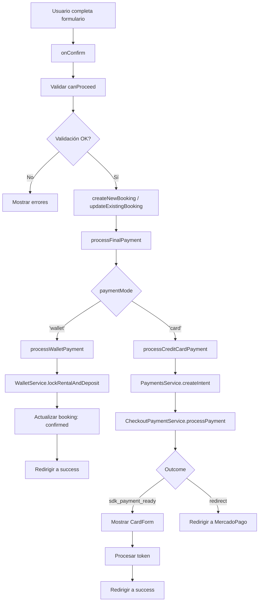

# 🔄 Análisis del Flujo de Pago: Tarjeta vs Wallet

## 📍 HUB CENTRAL Y DEFINITIVO

### **Ubicación Principal**: `booking-detail-payment.page.ts`

El **hub central** que decide entre tarjeta de crédito y wallet está en:

```typescript
// Línea 1334-1358: booking-detail-payment.page.ts
private async processFinalPayment(bookingId: string): Promise<void> {
  const method = this.paymentMode(); // ← DECISIÓN CENTRAL
  
  if (method === 'wallet') {
    await this.processWalletPayment(booking);
  } else {
    await this.processCreditCardPayment(booking);
  }
}
```

**El punto de decisión es**: `this.paymentMode()` que puede ser:
- `'card'` → Flujo de tarjeta de crédito
- `'wallet'` → Flujo de wallet AutoRenta

---

## 📊 DIAGRAMAS DE FLUJO

### 🔀 FLUJO COMPLETO: TARJETA DE CRÉDITO

```mermaid
flowchart TD
    A[Usuario en booking-detail-payment] --> B{Selecciona método}
    B -->|Tarjeta| C[paymentMode.set 'card']
    C --> D[CardHoldPanel: Pre-autorización]
    D --> E{Pre-autorización exitosa?}
    E -->|No| F[onFallbackToWallet]
    F --> G[Cambiar a wallet]
    E -->|Sí| H[paymentAuthorization.set]
    H --> I[Usuario hace clic Confirmar]
    I --> J[onConfirm]
    J --> K[createNewBooking / updateExistingBooking]
    K --> L[processFinalPayment]
    L --> M{paymentMode === 'card'?}
    M -->|Sí| N[processCreditCardPayment]
    N --> O[paymentsService.createIntent]
    O --> P[bookingsService.updateBooking]
    P --> Q[checkoutPaymentService.processPayment]
    Q --> R{Outcome}
    R -->|sdk_payment_ready| S[Mostrar CardForm]
    R -->|redirect_to_mercadopago| T[Redirigir a MP]
    S --> U[Usuario completa tarjeta]
    U --> V[onCardTokenGenerated]
    V --> W[checkoutPaymentService.processPaymentWithToken]
    W --> X[mpPaymentService.processBookingPayment]
    X --> Y{Pago exitoso?}
    Y -->|Sí| Z[/bookings/id/success]
    Y -->|No| AA[Mostrar error, mantener CardForm]
```

### 💰 FLUJO COMPLETO: WALLET AUTORENTA

```mermaid
flowchart TD
    A[Usuario en booking-detail-payment] --> B{Selecciona método}
    B -->|Wallet| C[paymentMode.set 'wallet']
    C --> D[CreditSecurityPanel: Bloquear crédito]
    D --> E[walletService.lockFunds]
    E --> F{Bloqueo exitoso?}
    F -->|No| G[Mostrar error]
    F -->|Sí| H[walletLock.set]
    H --> I[Usuario hace clic Confirmar]
    I --> J[onConfirm]
    J --> K[createNewBooking / updateExistingBooking]
    K --> L[processFinalPayment]
    L --> M{paymentMode === 'wallet'?}
    M -->|Sí| N[processWalletPayment]
    N --> O[walletService.lockRentalAndDeposit]
    O --> P{Bloqueo exitoso?}
    P -->|No| Q[Lanzar error]
    P -->|Sí| R[bookingsService.updateBooking]
    R --> S[payment_method: 'wallet']
    S --> T[status: 'confirmed']
    T --> U[bookingsService.recalculatePricing]
    U --> V[/bookings/success/bookingId]
```

### 🔄 FLUJO UNIFICADO: DECISIÓN EN HUB CENTRAL



---

## 🔧 SERVICIOS INVOLUCRADOS

### 1. **WalletService** (`core/services/wallet.service.ts`)
**Responsabilidades**:
- ✅ Bloquear fondos para garantía y alquiler
- ✅ Desbloquear fondos en caso de error
- ✅ Obtener balance disponible
- ✅ Gestionar transacciones de wallet

**Métodos clave**:
```typescript
lockRentalAndDeposit(bookingId, rentalAmount, depositUsd)
lockFunds(bookingId, amount, reason)
unlockFunds(bookingId, reason)
getBalance()
```

**Usado en**:
- `processWalletPayment()` - Bloquea rental + deposit
- `CreditSecurityPanel` - Bloquea crédito de seguridad

---

### 2. **PaymentsService** (`core/services/payments.service.ts`)
**Responsabilidades**:
- ✅ Crear intenciones de pago
- ✅ Gestionar estados de pago
- ✅ Integración con sistema de pagos

**Métodos clave**:
```typescript
createIntent(bookingId)
processPayment(bookingId)
```

**Usado en**:
- `processCreditCardPayment()` - Crea intent antes de procesar tarjeta

---

### 3. **CheckoutPaymentService** (`features/bookings/checkout/services/checkout-payment.service.ts`)
**Responsabilidades**:
- ✅ Procesar pagos con diferentes métodos (wallet, card, partial)
- ✅ Integración con MercadoPago SDK
- ✅ Manejar tokens de tarjeta
- ✅ Programar risk snapshots

**Métodos clave**:
```typescript
processPayment() // Hub secundario - decide método
payWithWallet(booking)
payWithCreditCard(booking)
payWithPartialWallet(booking)
processPaymentWithToken(bookingId, cardToken)
```

**Usado en**:
- `processCreditCardPayment()` - Procesa pago con tarjeta
- `onCardTokenGenerated()` - Procesa token generado

---

### 4. **MercadoPagoPaymentService** (`core/services/mercadopago-payment.service.ts`)
**Responsabilidades**:
- ✅ Procesar pagos con tokens de tarjeta
- ✅ Comunicación con Edge Functions de MercadoPago
- ✅ Manejar respuestas de pago

**Métodos clave**:
```typescript
processBookingPayment({ booking_id, card_token, issuer_id, installments })
```

**Usado en**:
- `checkoutPaymentService.processPaymentWithToken()` - Procesa pago final

---

### 5. **BookingsService** (`core/services/bookings.service.ts`)
**Responsabilidades**:
- ✅ Crear bookings atómicamente
- ✅ Actualizar bookings
- ✅ Recalcular pricing
- ✅ Obtener bookings por ID

**Métodos clave**:
```typescript
createBookingAtomic(params)
updateBooking(bookingId, updates)
recalculatePricing(bookingId)
getBookingById(bookingId)
```

**Usado en**:
- `createNewBooking()` - Crea booking
- `processWalletPayment()` - Actualiza booking a confirmed
- `processCreditCardPayment()` - Actualiza booking con payment_method

---

### 6. **MercadoPagoBookingGateway** (`features/bookings/checkout/support/mercadopago-booking.gateway.ts`)
**Responsabilidades**:
- ✅ Crear preferencias de MercadoPago
- ✅ Manejar errores de onboarding
- ✅ Integración con API de MercadoPago

**Métodos clave**:
```typescript
createPreference(bookingId)
```

**Usado en**:
- `createPreferenceWithOnboardingGuard()` - Fallback cuando SDK no está disponible

---

## 🗂️ SEPARACIÓN DE FUNCIONES POR PÁGINA

### 1. **`booking-detail-payment.page.ts`** (Página Principal)
**Ruta**: `/bookings/detail-payment`

**Responsabilidades**:
- ✅ Inicializar snapshots (FX, Risk, Pricing)
- ✅ Permitir selección de método de pago (card/wallet)
- ✅ Validar consentimientos y autorizaciones
- ✅ **CREAR/ACTUALIZAR booking en DB**
- ✅ **LLAMAR al hub central** `processFinalPayment()`
- ✅ Redirigir según resultado

**Métodos clave**:
- `onConfirm()` → Crea booking → Llama `processFinalPayment()`
- `processFinalPayment()` → **HUB CENTRAL** → Decide wallet o card
- `processWalletPayment()` → Procesa pago con wallet
- `processCreditCardPayment()` → Procesa pago con tarjeta

---

### 2. **`checkout-payment.service.ts`** (Servicio de Pago)
**Ubicación**: `features/bookings/checkout/services/`

**Responsabilidades**:
- ✅ Procesar pagos con diferentes métodos
- ✅ Manejar estados de checkout
- ✅ Integración con MercadoPago SDK
- ✅ Bloqueo/desbloqueo de wallet

**Métodos clave**:
```typescript
// Línea 40-59: Hub secundario (usado por otras páginas)
async processPayment(): Promise<CheckoutPaymentOutcome> {
  const method = this.state.getPaymentMethod();
  
  switch (method) {
    case 'wallet':
      return this.payWithWallet(booking);
    case 'partial_wallet':
      return this.payWithPartialWallet(booking);
    case 'credit_card':
    default:
      return this.payWithCreditCard(booking);
  }
}
```

**Flujos**:
- `payWithWallet()` → Bloquea fondos → Actualiza booking → Redirige
- `payWithCreditCard()` → Crea intent → Prepara SDK → Retorna `sdk_payment_ready`
- `processPaymentWithToken()` → Procesa token de tarjeta → Aproba/rechaza

---

## ✅ REFACTORIZACIÓN COMPLETADA

### ❌ Duplicación Eliminada

**Problema identificado**: 
- `processCreditCardPayment()` llamaba a `checkoutPaymentService.processPayment()` que intentaba procesar el pago nuevamente
- Lógica redundante de creación de intent y actualización de booking

**Solución implementada**:
1. ✅ **Simplificado `processCreditCardPayment()`**: Ahora solo prepara el SDK (crea intent, actualiza booking, muestra CardForm)
2. ✅ **Eliminado método `createPreferenceWithOnboardingGuard()`**: Ya no se usa redirección a MercadoPago
3. ✅ **Mantenido `processWalletPayment()`**: Lógica directa y clara, sin duplicación

**Código eliminado**:
- Llamada redundante a `checkoutPaymentService.processPayment()` en `processCreditCardPayment()`
- Método `createPreferenceWithOnboardingGuard()` completo
- Lógica duplicada de manejo de preferencias de MercadoPago

**Resultado**: 
- Código más limpio y directo
- Menos puntos de fallo
- Flujo más claro: preparar → tokenizar → procesar

---

## 📊 COMPARACIÓN: TARJETA vs WALLET

| Aspecto | Tarjeta de Crédito | Wallet AutoRenta |
|---------|-------------------|------------------|
| **Pre-autorización** | ✅ CardHoldPanel | ❌ No requiere |
| **Bloqueo de fondos** | ❌ No bloquea (solo pre-autoriza) | ✅ Bloquea rental + deposit |
| **Procesamiento** | MercadoPago SDK | WalletService interno |
| **Confirmación** | Después de tokenización | Inmediata al bloquear |
| **Estado booking** | `pending_payment` → `confirmed` | `confirmed` (directo) |
| **Redirección** | `/bookings/{id}/success` | `/bookings/success/{id}` |
| **Servicios usados** | PaymentsService → CheckoutPaymentService → MercadoPagoPaymentService | WalletService → BookingsService |

---

## 🎯 PUNTOS CLAVE DE DECISIÓN

### **1. Selección Inicial de Método**
**Ubicación**: `booking-detail-payment.page.ts` línea 376-399
```typescript
private preselectPaymentMethod(): void {
  const methodFromQuery = this.route.snapshot.queryParamMap.get('paymentMethod');
  
  if (methodFromQuery === 'wallet') {
    this.paymentMode.set('wallet');
  } else if (methodFromQuery === 'credit_card') {
    this.paymentMode.set('card');
  }
}
```

### **2. Cambio de Método por Usuario**
**Ubicación**: `booking-detail-payment.page.ts` línea 901-910
```typescript
protected onPaymentModeChange(mode: PaymentMode): void {
  this.paymentMode.set(mode);
  
  // Reset autorizaciones del modo anterior
  if (mode === 'card') {
    this.walletLock.set(null);
  } else {
    this.paymentAuthorization.set(null);
  }
}
```

### **3. Hub Central de Procesamiento**
**Ubicación**: `booking-detail-payment.page.ts` línea 1334-1358
```typescript
private async processFinalPayment(bookingId: string): Promise<void> {
  const method = this.paymentMode(); // ← AQUÍ SE DECIDE
  
  if (method === 'wallet') {
    await this.processWalletPayment(booking);
  } else {
    await this.processCreditCardPayment(booking);
  }
}
```

---

## 🚨 FALLBACK: Tarjeta → Wallet

**Ubicación**: `booking-detail-payment.page.ts` línea 1009-1023

Si la pre-autorización de tarjeta falla:
```typescript
protected onFallbackToWallet(reason?: string): void {
  this.fallbackReason.set(reason || 'La pre-autorización fue rechazada');
  this.showFallbackMessage.set(true);
  this.paymentMode.set('wallet'); // ← Cambia automáticamente a wallet
}
```

---

## 📝 RESUMEN EJECUTIVO

1. **Hub Central**: `processFinalPayment()` en `booking-detail-payment.page.ts` (línea 1334)
2. **Decisión**: Basada en `this.paymentMode()` que puede ser `'card'` o `'wallet'`
3. **Flujo Tarjeta**: CardHoldPanel → createIntent → CardForm → processPaymentWithToken
4. **Flujo Wallet**: CreditSecurityPanel → lockRentalAndDeposit → Confirmación inmediata
5. **Servicio Auxiliar**: `CheckoutPaymentService` usado por otras páginas (checkout, wizard)

---

## ✅ REFACTORIZACIÓN COMPLETADA

### Cambios Realizados:

1. ✅ **Simplificado `processCreditCardPayment()`**
   - Eliminada llamada redundante a `checkoutPaymentService.processPayment()`
   - Ahora solo: crear intent → actualizar booking → mostrar CardForm
   - El procesamiento real se hace en `onCardTokenGenerated()`

2. ✅ **Eliminado `createPreferenceWithOnboardingGuard()`**
   - Ya no se usa redirección a MercadoPago
   - El flujo ahora es 100% con SDK (sin redirecciones)

3. ✅ **Mantenido `processWalletPayment()`**
   - Lógica directa y clara
   - Sin duplicación con `checkout-payment.service.ts`

### Flujo Refactorizado:

**Tarjeta**:
```
processCreditCardPayment() 
  → createIntent() 
  → updateBooking() 
  → showCardForm() 
  → [Usuario completa tarjeta] 
  → onCardTokenGenerated() 
  → checkoutPaymentService.processPaymentWithToken()
```

**Wallet**:
```
processWalletPayment() 
  → lockRentalAndDeposit() 
  → updateBooking(confirmed) 
  → redirect to success
```

### Beneficios:
- ✅ Menos código duplicado
- ✅ Flujo más claro y directo
- ✅ Menos puntos de fallo
- ✅ Más fácil de mantener
