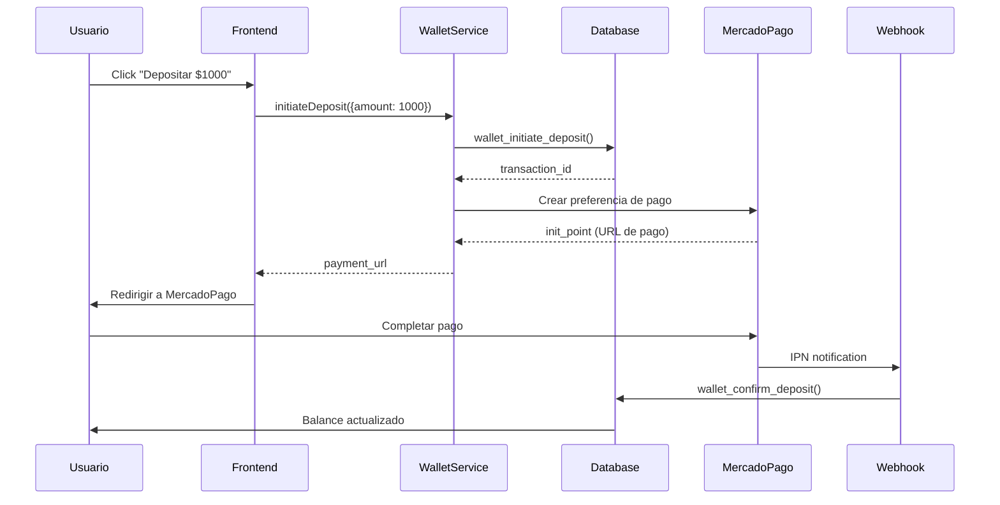
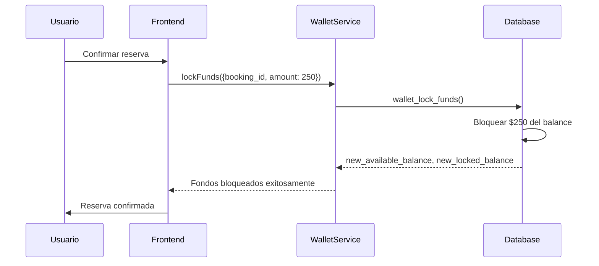
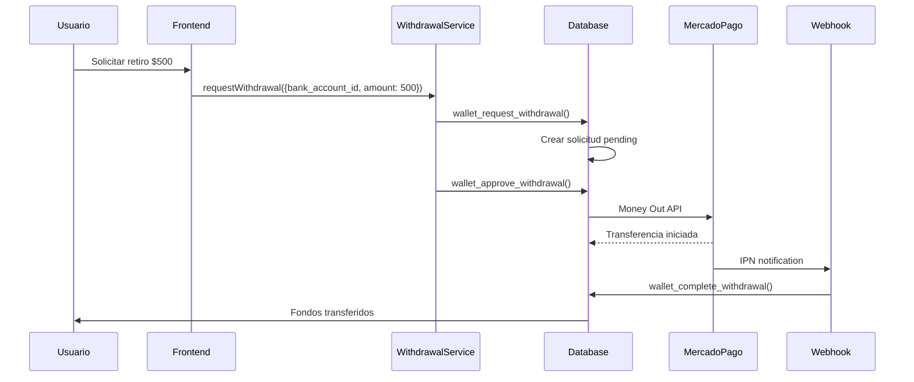

# 💰 Sistema de Wallet - AutoRenta

## 🎯 Visión General

El sistema de wallet de AutoRenta permite a los usuarios:
- **Depositar fondos** via MercadoPago (Argentina)
- **Bloquear garantías** para reservas de autos
- **Retirar fondos** a cuentas bancarias argentinas
- **Gestionar transacciones** con historial completo

## 🏗️ Arquitectura

### Base de Datos

#### Tablas Principales

**`user_wallets`** - Balance de usuarios
```sql
CREATE TABLE user_wallets (
  id UUID PRIMARY KEY DEFAULT gen_random_uuid(),
  user_id UUID REFERENCES auth.users(id) ON DELETE CASCADE,
  available_balance DECIMAL(10,2) DEFAULT 0,
  locked_balance DECIMAL(10,2) DEFAULT 0,
  currency VARCHAR(3) DEFAULT 'ARS',
  created_at TIMESTAMP WITH TIME ZONE DEFAULT NOW(),
  updated_at TIMESTAMP WITH TIME ZONE DEFAULT NOW()
);
```

**`wallet_transactions`** - Historial de transacciones
```sql
CREATE TABLE wallet_transactions (
  id UUID PRIMARY KEY DEFAULT gen_random_uuid(),
  user_id UUID REFERENCES auth.users(id) ON DELETE CASCADE,
  type wallet_transaction_type NOT NULL,
  status wallet_transaction_status DEFAULT 'pending',
  amount DECIMAL(10,2) NOT NULL,
  currency VARCHAR(3) DEFAULT 'ARS',
  reference_type wallet_reference_type,
  reference_id UUID,
  provider wallet_payment_provider,
  provider_transaction_id VARCHAR(255),
  provider_metadata JSONB,
  description TEXT,
  admin_notes TEXT,
  created_at TIMESTAMP WITH TIME ZONE DEFAULT NOW(),
  updated_at TIMESTAMP WITH TIME ZONE DEFAULT NOW(),
  completed_at TIMESTAMP WITH TIME ZONE
);
```

**`withdrawal_requests`** - Solicitudes de retiro
```sql
CREATE TABLE withdrawal_requests (
  id UUID PRIMARY KEY DEFAULT gen_random_uuid(),
  user_id UUID REFERENCES auth.users(id) ON DELETE CASCADE,
  bank_account_id UUID REFERENCES bank_accounts(id),
  amount DECIMAL(10,2) NOT NULL,
  currency VARCHAR(3) DEFAULT 'ARS',
  fee_amount DECIMAL(10,2) DEFAULT 0,
  net_amount DECIMAL(10,2) NOT NULL,
  status withdrawal_status DEFAULT 'pending',
  provider VARCHAR(50) DEFAULT 'mercadopago',
  provider_transaction_id VARCHAR(255),
  provider_metadata JSONB,
  approved_by UUID REFERENCES auth.users(id),
  approved_at TIMESTAMP WITH TIME ZONE,
  rejection_reason TEXT,
  processed_at TIMESTAMP WITH TIME ZONE,
  completed_at TIMESTAMP WITH TIME ZONE,
  failed_at TIMESTAMP WITH TIME ZONE,
  failure_reason TEXT,
  wallet_transaction_id UUID REFERENCES wallet_transactions(id),
  user_notes TEXT,
  admin_notes TEXT,
  created_at TIMESTAMP WITH TIME ZONE DEFAULT NOW(),
  updated_at TIMESTAMP WITH TIME ZONE DEFAULT NOW()
);
```

**`bank_accounts`** - Cuentas bancarias de usuarios
```sql
CREATE TABLE bank_accounts (
  id UUID PRIMARY KEY DEFAULT gen_random_uuid(),
  user_id UUID REFERENCES auth.users(id) ON DELETE CASCADE,
  account_type bank_account_type NOT NULL,
  account_number VARCHAR(50) NOT NULL,
  account_holder_name VARCHAR(255) NOT NULL,
  account_holder_document VARCHAR(20) NOT NULL,
  bank_name VARCHAR(255),
  is_verified BOOLEAN DEFAULT FALSE,
  verified_at TIMESTAMP WITH TIME ZONE,
  verification_method VARCHAR(50),
  is_active BOOLEAN DEFAULT TRUE,
  is_default BOOLEAN DEFAULT FALSE,
  created_at TIMESTAMP WITH TIME ZONE DEFAULT NOW(),
  updated_at TIMESTAMP WITH TIME ZONE DEFAULT NOW()
);
```

### Tipos de Datos

```sql
-- Tipos de transacciones
CREATE TYPE wallet_transaction_type AS ENUM (
  'deposit',                    -- Depósito de fondos
  'lock',                      -- Bloqueo de fondos para garantía
  'unlock',                    -- Desbloqueo de fondos
  'charge',                    -- Cargo efectivo de fondos
  'refund',                    -- Devolución de fondos
  'bonus',                     -- Bonificación/regalo
  'rental_payment_lock',       -- Bloqueo del pago del alquiler
  'rental_payment_transfer',   -- Transferencia del pago al propietario
  'security_deposit_lock',     -- Bloqueo de la garantía
  'security_deposit_release',  -- Liberación de la garantía al usuario
  'security_deposit_charge',   -- Cargo por daños de la garantía
  'withdrawal'                 -- Retiro de fondos a cuenta bancaria
);

-- Estados de transacciones
CREATE TYPE wallet_transaction_status AS ENUM (
  'pending',     -- En proceso
  'completed',   -- Completada exitosamente
  'failed',      -- Falló
  'refunded'     -- Reembolsada
);

-- Tipos de referencia
CREATE TYPE wallet_reference_type AS ENUM (
  'booking',     -- Referencia a reserva
  'deposit',     -- Referencia a depósito
  'reward'       -- Referencia a recompensa
);

-- Proveedores de pago
CREATE TYPE wallet_payment_provider AS ENUM (
  'mercadopago',     -- MercadoPago (Argentina)
  'stripe',          -- Stripe (futuro)
  'bank_transfer',   -- Transferencia bancaria
  'internal'         -- Transferencia interna
);

-- Tipos de cuenta bancaria
CREATE TYPE bank_account_type AS ENUM (
  'cbu',    -- Clave Bancaria Uniforme
  'cvu',    -- Clave Virtual Uniforme
  'alias'   -- Alias bancario
);

-- Estados de retiros
CREATE TYPE withdrawal_status AS ENUM (
  'pending',     -- Esperando aprobación
  'approved',    -- Aprobada, lista para procesar
  'processing',  -- En proceso de transferencia
  'completed',   -- Transferencia exitosa
  'failed',      -- Transferencia falló
  'rejected',    -- Rechazada por admin
  'cancelled'    -- Cancelada por usuario
);
```

## 🔄 Flujos de Transacciones

### 1. Depósito de Fondos



### 2. Bloqueo de Garantía para Reserva



### 3. Retiro de Fondos



## 🛠️ Servicios Angular

### WalletService

```typescript
@Injectable({ providedIn: 'root' })
export class WalletService {
  // Signals para estado reactivo
  readonly balance = signal<WalletBalance | null>(null);
  readonly transactions = signal<WalletTransaction[]>([]);
  readonly loading = signal<WalletLoadingState>({...});
  readonly error = signal<WalletError | null>(null);

  // Métodos principales
  async getBalance(): Promise<WalletBalance>
  async initiateDeposit(params: InitiateDepositParams): Promise<WalletInitiateDepositResponse>
  async lockFunds(params: LockFundsParams): Promise<WalletLockFundsResponse>
  async unlockFunds(params: UnlockFundsParams): Promise<WalletUnlockFundsResponse>
  async getTransactions(filters?: WalletTransactionFilters): Promise<WalletTransaction[]>
}
```

### WithdrawalService

```typescript
@Injectable({ providedIn: 'root' })
export class WithdrawalService {
  // Signals para estado reactivo
  readonly requests = signal<WithdrawalRequest[]>([]);
  readonly bankAccounts = signal<BankAccount[]>([]);
  readonly loading = signal<WithdrawalLoadingState>({...});

  // Métodos principales
  async requestWithdrawal(params: RequestWithdrawalParams): Promise<WalletRequestWithdrawalResponse>
  async getWithdrawalRequests(filters?: WithdrawalFilters): Promise<WithdrawalRequest[]>
  async addBankAccount(params: AddBankAccountParams): Promise<BankAccount>
  async getBankAccounts(): Promise<BankAccount[]>
}
```

## 🔧 Edge Functions

### mercadopago-create-preference

**URL:** `https://obxvffplochgeiclibng.supabase.co/functions/v1/mercadopago-create-preference`

**Propósito:** Crear preferencias de pago en MercadoPago para depósitos

**Request:**
```json
{
  "transaction_id": "uuid",
  "amount": 1000,
  "description": "Depósito a wallet"
}
```

**Response:**
```json
{
  "success": true,
  "preference_id": "123456789",
  "init_point": "https://www.mercadopago.com.ar/checkout/v1/redirect?pref_id=123456789",
  "external_reference": "uuid"
}
```

### mercadopago-webhook

**URL:** `https://obxvffplochgeiclibng.supabase.co/functions/v1/mercadopago-webhook`

**Propósito:** Procesar notificaciones IPN de MercadoPago

**Eventos:**
- `payment` - Para depósitos
- `money_request` - Para retiros

## 🔒 Seguridad (RLS Policies)

### user_wallets
```sql
-- Usuarios solo pueden ver su propio wallet
CREATE POLICY "Users can view own wallet"
ON user_wallets FOR SELECT
USING (auth.uid() = user_id);

-- Solo el sistema puede insertar/actualizar wallets
CREATE POLICY "System can manage wallets"
ON user_wallets FOR ALL
USING (false); -- Solo via RPC functions
```

### wallet_transactions
```sql
-- Usuarios solo pueden ver sus propias transacciones
CREATE POLICY "Users can view own transactions"
ON wallet_transactions FOR SELECT
USING (auth.uid() = user_id);

-- Solo el sistema puede insertar/actualizar transacciones
CREATE POLICY "System can manage transactions"
ON wallet_transactions FOR ALL
USING (false); -- Solo via RPC functions
```

### withdrawal_requests
```sql
-- Usuarios solo pueden ver sus propios retiros
CREATE POLICY "Users can view own withdrawals"
ON withdrawal_requests FOR SELECT
USING (auth.uid() = user_id);

-- Usuarios pueden crear sus propios retiros
CREATE POLICY "Users can create own withdrawals"
ON withdrawal_requests FOR INSERT
WITH CHECK (auth.uid() = user_id);
```

### bank_accounts
```sql
-- Usuarios solo pueden ver sus propias cuentas
CREATE POLICY "Users can view own bank accounts"
ON bank_accounts FOR SELECT
USING (auth.uid() = user_id);

-- Usuarios pueden gestionar sus propias cuentas
CREATE POLICY "Users can manage own bank accounts"
ON bank_accounts FOR ALL
USING (auth.uid() = user_id);
```

## 📊 Monitoreo y Logs

### Verificar Balance de Usuario
```sql
SELECT 
  available_balance,
  locked_balance,
  total_balance,
  currency
FROM user_wallets 
WHERE user_id = 'user-uuid';
```

### Ver Transacciones Recientes
```sql
SELECT 
  type,
  amount,
  status,
  description,
  created_at
FROM wallet_transactions 
WHERE user_id = 'user-uuid'
ORDER BY created_at DESC 
LIMIT 10;
```

### Ver Retiros Pendientes
```sql
SELECT 
  amount,
  status,
  created_at,
  user_notes
FROM withdrawal_requests 
WHERE status IN ('pending', 'approved', 'processing')
ORDER BY created_at DESC;
```

## 🧪 Testing

### Test de Depósito
```bash
# Crear preferencia de prueba
curl -X POST \
  https://obxvffplochgeiclibng.supabase.co/functions/v1/mercadopago-create-preference \
  -H 'Content-Type: application/json' \
  -H 'Authorization: Bearer YOUR_ANON_KEY' \
  -d '{
    "transaction_id": "test-tx-123",
    "amount": 1000,
    "description": "Test deposit"
  }'
```

### Test de Webhook
```bash
# Simular webhook de pago aprobado
curl -X POST \
  'https://obxvffplochgeiclibng.supabase.co/functions/v1/mercadopago-webhook?topic=payment&id=123456789'
```

## ⚠️ Troubleshooting

### Error: "Insufficient funds"
**Causa:** Usuario no tiene balance suficiente  
**Solución:** Verificar balance disponible antes de bloquear

### Error: "Transaction not found"
**Causa:** transaction_id no existe en DB  
**Solución:** Verificar que la transacción fue creada correctamente

### Error: "MercadoPago API error"
**Causa:** Token inválido o API down  
**Solución:** Verificar credenciales y estado de MercadoPago

### Error: "Webhook not processing"
**Causa:** URL mal configurada o función no deployada  
**Solución:** Verificar configuración en MercadoPago Dashboard

## 📈 Métricas Importantes

- **Total de depósitos procesados**
- **Tasa de éxito de pagos**
- **Tiempo promedio de procesamiento**
- **Volumen de transacciones por día**
- **Retiros pendientes de aprobación**

## 🎯 Próximas Mejoras

1. **Notificaciones por email** cuando se completan transacciones
2. **Límites de retiro** configurables por usuario
3. **Verificación de identidad** para retiros grandes
4. **Dashboard de admin** para gestión de retiros
5. **Integración con Stripe** para pagos internacionales
6. **Sistema de referidos** con bonificaciones

---

## 📚 Referencias

- [MERCADOPAGO_SETUP.md](./MERCADOPAGO_SETUP.md) - Configuración de MercadoPago
- [Supabase Edge Functions](https://supabase.com/docs/guides/functions)
- [MercadoPago Checkout Pro](https://www.mercadopago.com.ar/developers/es/docs/checkout-pro)
- [MercadoPago Money Out](https://www.mercadopago.com.ar/developers/es/docs/money-out)