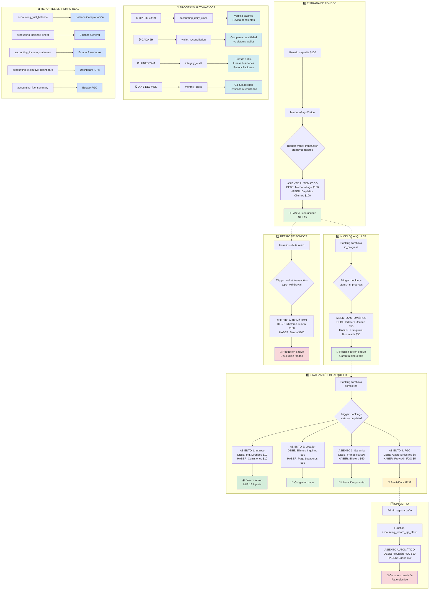

# 🎨 DIAGRAMA DE FLUJO CONTABLE AUTOMATIZADO

## 📍 Leyenda de Colores

- 🟢 **Verde claro**: Pasivos (obligaciones con usuarios)
- 🟩 **Verde oscuro**: Ingresos reconocidos
- 🟡 **Amarillo**: Provisiones (NIIF 37)
- 🔴 **Rojo claro**: Salidas de efectivo
- 🔵 **Azul claro**: Procesos automáticos y reportes

## 🔄 Flujo de Datos

```
Usuario → Plataforma → Trigger → Función Contable → Asiento Automático → Reportes
```

## 📋 Triggers Activos

1. **wallet_transactions** (INSERT/UPDATE)
   - Detecta: `status='completed'` y `type='deposit'`
   - Ejecuta: `accounting_record_wallet_deposit()`

2. **bookings** (UPDATE)
   - Detecta: `status='in_progress'`
   - Ejecuta: `accounting_record_booking_start()`

3. **bookings** (UPDATE)
   - Detecta: `status='completed'`
   - Ejecuta: `accounting_record_booking_completion()`
   - Ejecuta: `trigger_create_fgo_provision()`

## ⚙️ Cron Jobs Configurados

| Job | Frecuencia | Función |
|-----|-----------|---------|
| Cierre Diario | 23:59 diario | `accounting_daily_close()` |
| Reconciliación Wallet | Cada 6 horas | `accounting_wallet_reconciliation()` |
| Auditoría | Lunes 2am | `accounting_integrity_audit()` |
| Cierre Mensual | Día 1 3am | `accounting_monthly_close()` |
| Expirar FGO | Mensual | `accounting_release_fgo_provision()` |

## 🎯 Principios Clave

### NIIF 15 - Reconocimiento de Ingresos
- ✅ AutoRenta actúa como **AGENTE**, no principal
- ✅ Solo reconoce **comisión** como ingreso
- ✅ Fondos en billetera son **PASIVO** hasta completar servicio

### NIIF 37 - Provisiones
- ✅ FGO es una **PROVISIÓN** para siniestros esperados
- ✅ Se estima basado en experiencia histórica (5% del alquiler)
- ✅ Se consume al ocurrir siniestros reales

### Partida Doble
- ✅ Validación automática: DÉBITOS = CRÉDITOS
- ✅ Error si diferencia > $0.01
- ✅ Transacción atómica (rollback automático)

## 📊 Ecuación Contable Fundamental

```
ACTIVOS = PASIVOS + PATRIMONIO
```

Verificable en tiempo real:
```sql
SELECT * FROM accounting_executive_dashboard;
```

## 🔍 Monitoreo Continuo

### Alertas Automáticas
- 🚨 Asiento desbalanceado
- 🚨 Discrepancia wallet > $1
- 🚨 Fallo en auditoría de integridad
- 🚨 Provisión FGO insuficiente

### Dashboard de Alertas
```sql
SELECT * FROM accounting_active_alerts;
```

## 💡 Ventajas del Sistema

1. **Cero intervención manual** en operaciones normales
2. **Cumplimiento normativo** garantizado
3. **Trazabilidad completa** de cada movimiento
4. **Auditoría facilitada** con reportes instantáneos
5. **Escalabilidad** sin límite de transacciones
6. **Transparencia** para usuarios y reguladores

---

**Sistema diseñado para AutoRenta**  
Versión 1.0.0 | 2025-10-26
