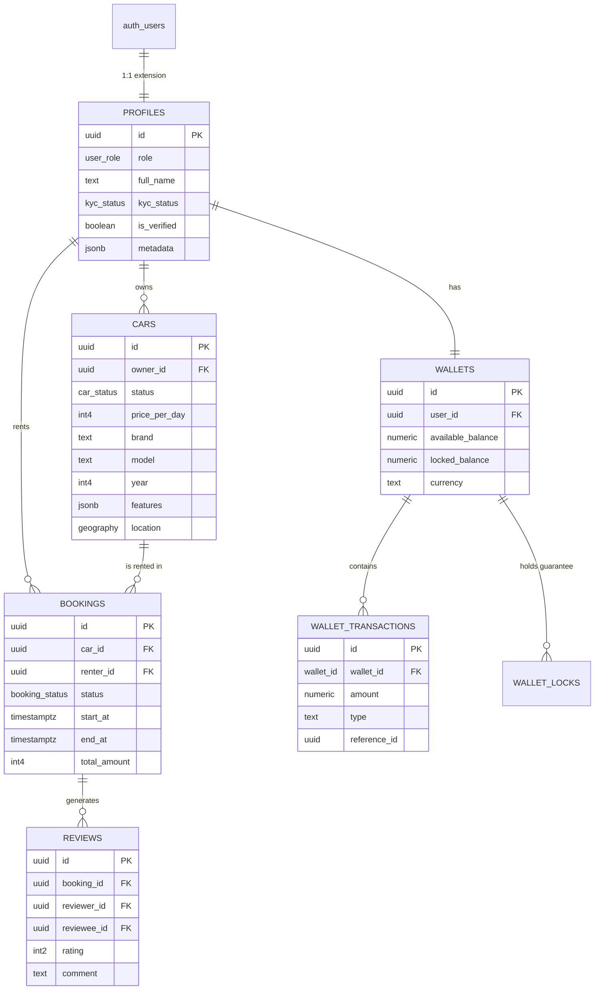

# 🗄️ Guía Maestra de Base de Datos (Database Schema Reference)

> **Documento Vivo de Arquitectura de Datos**
> Referencia técnica completa del esquema PostgreSQL, políticas de seguridad (RLS), funciones almacenadas y tipos de datos de la plataforma Autorenta.

---

## 📊 Diagrama Entidad-Relación (Nivel Alto)



---

## 📋 Catálogo de Tablas (Schema Public)

### 1. Gestión de Usuarios e Identidad

#### `public.profiles`
Extensión de la tabla `auth.users`. Contiene datos públicos y de perfil.
*   **Seguridad:** RLS habilitado. Lectura pública parcial, escritura solo dueño.

| Columna | Tipo | Constraints | Descripción |
| :--- | :--- | :--- | :--- |
| `id` | `uuid` | `PK`, `FK -> auth.users.id` | Identificador único del usuario. |
| `role` | `user_role` | `DEFAULT 'renter'` | Rol principal: `renter`, `owner`, `admin`. |
| `full_name` | `text` | `NOT NULL` | Nombre completo legal. |
| `email` | `text` | `UNIQUE` | Email de contacto (sincronizado con auth). |
| `avatar_url` | `text` | `NULLABLE` | URL pública de la imagen de perfil. |
| `phone` | `text` | `NULLABLE` | Teléfono verificado. |
| `kyc_status` | `kyc_status` | `DEFAULT 'not_started'` | Estado de verificación de identidad. |
| `is_verified` | `boolean` | `DEFAULT false` | Flag rápido de verificación. |
| `reputation_score` | `int4` | `DEFAULT 0` | Puntaje de reputación calculado (0-100). |
| `mercadopago_connected` | `boolean` | `DEFAULT false` | Si tiene cuenta vinculada para cobros. |
| `created_at` | `timestamptz` | `DEFAULT now()` | Fecha de registro. |
| `updated_at` | `timestamptz` | `DEFAULT now()` | Última actualización. |

#### `public.user_documents`
Documentos sensibles para validación KYC (DNI, Licencia).
*   **Seguridad:** RLS estricto. Solo el usuario y admins pueden ver.

| Columna | Tipo | Constraints | Descripción |
| :--- | :--- | :--- | :--- |
| `id` | `uuid` | `PK`, `DEFAULT gen_random_uuid()` | ID del documento. |
| `user_id` | `uuid` | `FK -> profiles.id` | Dueño del documento. |
| `kind` | `document_kind` | `NOT NULL` | Tipo: `dni_front`, `dni_back`, `license`. |
| `storage_path` | `text` | `NOT NULL` | Ruta en Supabase Storage (Buckets). |
| `status` | `kyc_status` | `DEFAULT 'pending'` | Estado de validación del doc. |
| `rejection_reason` | `text` | `NULLABLE` | Motivo si fue rechazado. |

---

### 2. Flota y Vehículos

#### `public.cars`
Inventario de vehículos disponibles.
*   **Seguridad:** RLS. Lectura pública (si activo). Escritura solo dueño.

| Columna | Tipo | Constraints | Descripción |
| :--- | :--- | :--- | :--- |
| `id` | `uuid` | `PK`, `DEFAULT gen_random_uuid()` | ID del vehículo. |
| `owner_id` | `uuid` | `FK -> profiles.id` | Propietario. |
| `status` | `car_status` | `DEFAULT 'draft'` | Estado: `active`, `paused`, `maintenance`. |
| `brand` | `text` | `NOT NULL` | Marca (ej. Toyota). |
| `model` | `text` | `NOT NULL` | Modelo (ej. Corolla). |
| `year` | `int4` | `NOT NULL` | Año de fabricación. |
| `plate_last_digits` | `text` | `NOT NULL` | Últimos dígitos patente (seguridad). |
| `price_per_day` | `int4` | `NOT NULL` | Precio base diario en centavos. |
| `currency` | `text` | `DEFAULT 'ARS'` | Moneda del precio (ISO 4217). |
| `location_city` | `text` | `NOT NULL` | Ciudad base. |
| `location_geo` | `geography` | `NULLABLE` | Coordenadas exactas (PostGIS). |
| `features` | `jsonb` | `DEFAULT '{}'` | Tags: aire, gps, automático, etc. |
| `specs` | `jsonb` | `DEFAULT '{}'` | Ficha técnica: motor, combustible. |
| `photos` | `jsonb` | `DEFAULT '[]'` | Array de URLs de imágenes. |

#### `public.car_blocked_dates`
Calendario de disponibilidad.
*   **Seguridad:** RLS. Lectura pública. Escritura solo dueño.

| Columna | Tipo | Constraints | Descripción |
| :--- | :--- | :--- | :--- |
| `id` | `uuid` | `PK` | ID del bloqueo. |
| `car_id` | `uuid` | `FK -> cars.id` | Vehículo afectado. |
| `start_date` | `date` | `NOT NULL` | Inicio del bloqueo. |
| `end_date` | `date` | `NOT NULL` | Fin del bloqueo. |
| `reason` | `text` | `NULLABLE` | `booking`, `maintenance`, `personal`. |
| `booking_id` | `uuid` | `FK -> bookings.id`, `NULL` | Si es por reserva automática. |

---

### 3. Motor de Reservas

#### `public.bookings`
Transacciones de alquiler. Tabla central.
*   **Seguridad:** RLS. Visible solo por Owner y Renter.

| Columna | Tipo | Constraints | Descripción |
| :--- | :--- | :--- | :--- |
| `id` | `uuid` | `PK` | ID de reserva. |
| `car_id` | `uuid` | `FK -> cars.id` | Vehículo reservado. |
| `renter_id` | `uuid` | `FK -> profiles.id` | Conductor. |
| `owner_id` | `uuid` | `FK -> profiles.id` | Propietario (desnormalizado). |
| `status` | `booking_status` | `DEFAULT 'pending'` | Estado del flujo. |
| `start_at` | `timestamptz` | `NOT NULL` | Inicio del alquiler. |
| `end_at` | `timestamptz` | `NOT NULL` | Fin del alquiler. |
| `total_amount` | `int4` | `NOT NULL` | Total en centavos. |
| `deposit_amount` | `int4` | `DEFAULT 0` | Depósito garantía requerido. |
| `payment_status` | `payment_status` | `DEFAULT 'unpaid'` | Estado del cobro. |
| `checkin_at` | `timestamptz` | `NULLABLE` | Fecha real de entrega. |
| `checkout_at` | `timestamptz` | `NULLABLE` | Fecha real de devolución. |

#### `public.booking_inspections` (FGO)
Reportes de estado del vehículo (Check-in/Check-out).
*   **Seguridad:** RLS. Solo participantes.

| Columna | Tipo | Constraints | Descripción |
| :--- | :--- | :--- | :--- |
| `id` | `uuid` | `PK` | ID de inspección. |
| `booking_id` | `uuid` | `FK` | Reserva asociada. |
| `type` | `text` | `CHECK_IN` o `CHECK_OUT`. |
| `odometer` | `int4` | `NOT NULL` | Kilometraje reportado. |
| `fuel_level` | `int4` | `NOT NULL` | Nivel de combustible (0-100%). |
| `photos` | `jsonb` | `NOT NULL` | Evidencia fotográfica. |
| `damages` | `jsonb` | `NULLABLE` | Reporte de daños nuevos. |
| `signature_url` | `text` | `NOT NULL` | Firma digital de conformidad. |

---

### 4. Sistema Financiero (Ledger)

#### `public.wallets`
Cuentas de saldo de usuarios.
*   **Seguridad:** RLS Crítico. Solo lectura para el dueño. Escritura **EXCLUSIVA** por funciones RPC.

| Columna | Tipo | Constraints | Descripción |
| :--- | :--- | :--- | :--- |
| `id` | `uuid` | `PK` | ID de la wallet. |
| `user_id` | `uuid` | `FK`, `UNIQUE` | Dueño de la wallet. |
| `available_balance` | `numeric(12,2)` | `DEFAULT 0` | Dinero líquido. |
| `locked_balance` | `numeric(12,2)` | `DEFAULT 0` | Dinero en garantía (holds). |
| `currency` | `text` | `DEFAULT 'ARS'` | Moneda operativa. |

#### `public.wallet_transactions`
Historial inmutable de movimientos (Libro Mayor).

| Columna | Tipo | Constraints | Descripción |
| :--- | :--- | :--- | :--- |
| `id` | `uuid` | `PK` | ID transacción. |
| `wallet_id` | `uuid` | `FK` | Wallet afectada. |
| `amount` | `numeric(12,2)` | `NOT NULL` | Monto (+ crédito, - débito). |
| `type` | `transaction_type` | `NOT NULL` | Motivo (`payment`, `deposit`, `refund`). |
| `reference_id` | `uuid` | `NULLABLE` | ID externo (booking, pago MP). |
| `balance_after` | `numeric` | `NOT NULL` | Snapshot del saldo post-op. |

---

## 🏷️ Tipos Enumerados (Enums)

Definiciones estrictas de estados en PostgreSQL.

### `user_role`
*   `renter`: Usuario conductor base.
*   `owner`: Usuario que ha publicado vehículos.
*   `admin`: Administrador de la plataforma.
*   `superadmin`: Acceso total al sistema.

### `booking_status`
*   `pending`: Creada, esperando aprobación o pago.
*   `pending_payment`: Aprobada, esperando transacción.
*   `confirmed`: Pagada y agendada.
*   `active`: Vehículo entregado (Check-in realizado).
*   `completed`: Vehículo devuelto y finalizada.
*   `cancelled`: Cancelada por usuario o sistema.
*   `rejected`: Rechazada por el propietario.
*   `disputed`: En proceso de mediación.

### `car_status`
*   `draft`: Borrador, no visible.
*   `pending_approval`: Esperando revisión de calidad.
*   `active`: Publicado y reservable.
*   `paused`: Oculto temporalmente por el dueño.
*   `maintenance`: En taller/reparación.
*   `banned`: Bloqueado por la plataforma.

### `payment_status`
*   `unpaid`: No iniciado.
*   `pending`: Procesando (Async).
*   `paid`: Cobro exitoso.
*   `refunded`: Reembolsado totalmente.
*   `partially_refunded`: Reembolso parcial.
*   `failed`: Error en el procesador.

---

## 🔒 Políticas de Seguridad (RLS) Detalladas

A continuación, el SQL real de las políticas más críticas.

### Seguridad en `profiles`
```sql
-- Todos pueden ver perfiles básicos (necesario para reviews y bookings)
CREATE POLICY "Public profiles are viewable by everyone" 
ON profiles FOR SELECT 
USING (true);

-- Solo el usuario puede editar su propio perfil
CREATE POLICY "Users can update own profile" 
ON profiles FOR UPDATE 
USING (auth.uid() = id);
```

### Seguridad en `bookings`
```sql
-- Visibilidad bilateral estricta
CREATE POLICY "Participants can view bookings" 
ON bookings FOR SELECT 
USING (
    auth.uid() = renter_id OR 
    auth.uid() IN (SELECT owner_id FROM cars WHERE id = car_id)
);

-- Solo renters verificados crean bookings
CREATE POLICY "Verified users can create bookings" 
ON bookings FOR INSERT 
WITH CHECK (
    auth.uid() = renter_id AND
    EXISTS (SELECT 1 FROM profiles WHERE id = auth.uid() AND kyc_status = 'verified')
);
```

### Seguridad en `wallets` (Modelo de Caja Fuerte)
```sql
-- El dueño solo puede LEER
CREATE POLICY "Users can view own wallet" 
ON wallets FOR SELECT 
USING (auth.uid() = user_id);

-- NADIE puede insertar/actualizar directamente vía API
-- Todas las políticas FOR INSERT/UPDATE/DELETE son implícitamente DENY ALL
-- Las modificaciones se hacen vía funciones SECURITY DEFINER
```

---

## ⚙️ Funciones RPC y Triggers

### Triggers Automáticos
*   `handle_new_user`: Al crear usuario en `auth.users`, crea automáticamente fila en `public.profiles` y `public.wallets`.
*   `update_updated_at`: Actualiza columna `updated_at` en cada `UPDATE` de cualquier tabla.
*   `check_booking_collision`: En `INSERT bookings`, verifica solapamiento de fechas con `car_blocked_dates` y lanza excepción si hay conflicto.

### Funciones Financieras (RPC)
Funciones `SECURITY DEFINER` que se ejecutan con privilegios de sistema.

#### `wallet_process_payment(booking_id uuid)`
1.  Verifica saldo en wallet del renter.
2.  Crea transacción de débito al renter.
3.  Calcula comisión de plataforma.
4.  Crea transacción de crédito al owner (neto).
5.  Actualiza estado de `bookings` a `paid`.

#### `wallet_lock_funds(user_id uuid, amount numeric)`
1.  Verifica `available_balance >= amount`.
2.  Mueve fondos de `available` a `locked`.
3.  Retorna ID de bloqueo (`lock_id`).

---

## 📈 Índices de Rendimiento

Optimización de consultas frecuentes.

*   `idx_cars_location`: Índice GIST en `location_geo` para búsquedas espaciales rápidas ("autos cerca de mí").
*   `idx_bookings_dates`: Índice BTREE en `(car_id, start_at, end_at)` para chequeo rápido de disponibilidad.
*   `idx_profiles_email`: Búsqueda de usuarios por correo.
*   `idx_transactions_wallet`: Historial de movimientos paginado.

---

**© 2026 Autorenta Database Engineering**
