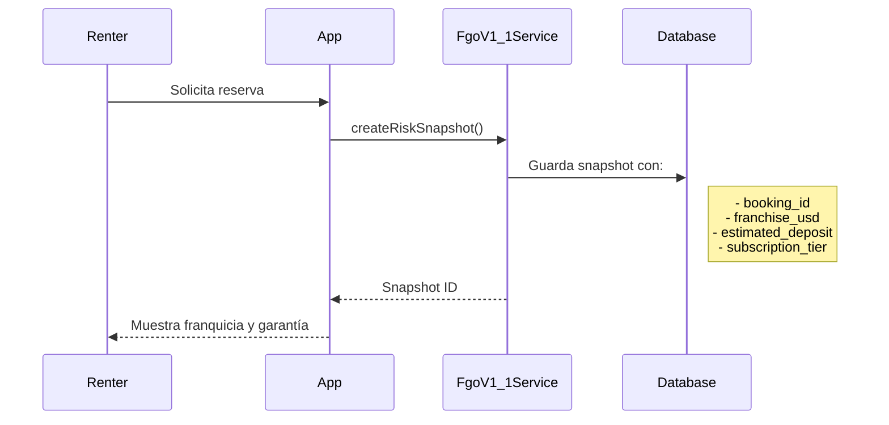
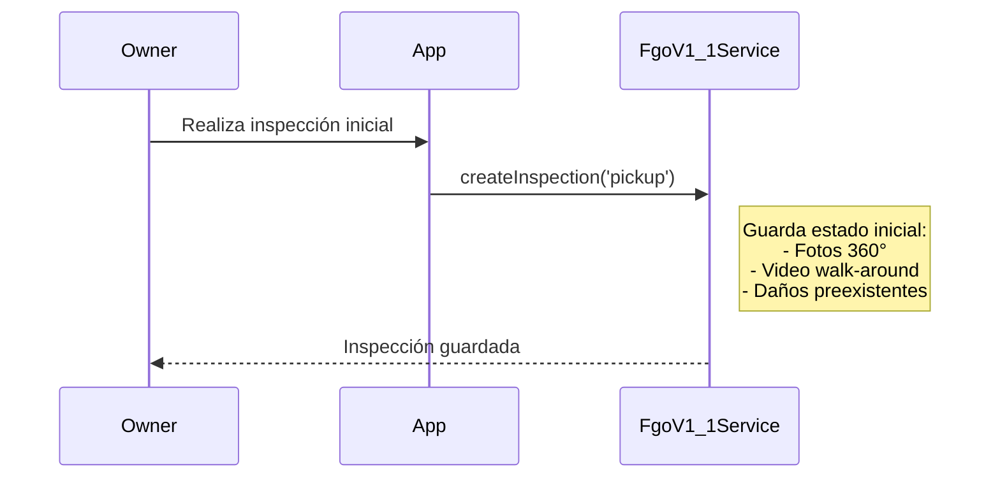
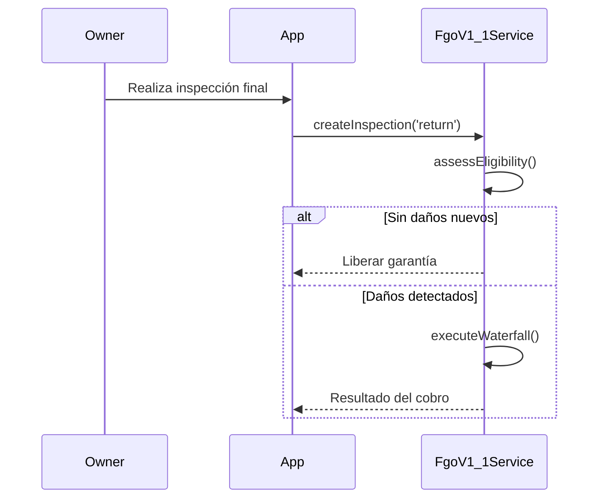

# 🛡️ Guía del Fondo de Garantía Operativa (FGO)

> **Última actualización:** 2026-01-09
> **Versión:** v1.1
> **Tipo:** Documentación de sistema de cobertura de daños

---

## 📋 Tabla de Contenidos

1. [¿Qué es el FGO?](#-qué-es-el-fgo)
2. [Principios del Modelo](#-principios-del-modelo)
3. [Parámetros del Sistema](#-parámetros-del-sistema)
4. [Flujo de Cobertura](#-flujo-de-cobertura)
5. [Waterfall de Cobros](#-waterfall-de-cobros)
6. [Risk Snapshots](#-risk-snapshots)
7. [Inspecciones de Vehículo](#-inspecciones-de-vehículo)
8. [Cálculos Clave](#-cálculos-clave)
9. [Métricas y Monitoreo](#-métricas-y-monitoreo)

---

## 🎯 ¿Qué es el FGO?

El **Fondo de Garantía Operativa (FGO)** es el sistema de autoseguro de AutoRenta que cubre daños a vehículos durante los alquileres. A diferencia de un seguro tradicional, el FGO:

- **No es un seguro externo:** Es un fondo administrado por la plataforma
- **Cubre franquicias:** Protege al renter del pago total de daños
- **Es dinámico:** Los parámetros se ajustan según métricas de siniestralidad
- **Es transparente:** El renter conoce su exposición máxima antes de reservar

### Modelo Comodato + FGO

AutoRenta opera bajo un modelo de **Comodato Oneroso** (préstamo de uso con contraprestación), donde:

1. El **Propietario** presta el vehículo bajo contrato legal
2. El **Renter** paga por el uso y acepta responsabilidad limitada
3. El **FGO** cubre daños hasta un límite establecido por "franquicia"

```
┌─────────────────────────────────────────────────────────┐
│                    DAÑO OCURRIDO                        │
├─────────────────────────────────────────────────────────┤
│                                                         │
│   Responsabilidad Renter (Franquicia)    │    FGO      │
│   ←───────── $500 USD ─────────────────→ │←── resto ──→│
│   (pagado por renter o su suscripción)   │ (fondo)     │
│                                                         │
└─────────────────────────────────────────────────────────┘
```

---

## 📐 Principios del Modelo

### 1. Franquicia (Franchise)

El renter tiene una **exposición máxima fija** (franquicia) independiente del valor del daño:

| Tier de Suscripción | Franquicia |
|---------------------|------------|
| Sin suscripción | $500 USD |
| Standard | $300 USD |
| Black | $150 USD |
| Luxury | $50 USD |

### 2. Cobertura por Evento

El FGO cubre daños hasta un **tope por evento**:

| País | Event Cap |
|------|-----------|
| Argentina | $5,000 USD |
| México | $5,000 USD |
| Brasil | $7,500 USD |

### 3. Límite por Usuario

Protección contra abuso con **límite anual por usuario**:

- Máximo 3 eventos cubiertos por año
- Después del 3er evento, el usuario es evaluado

---

## ⚙️ Parámetros del Sistema

Los parámetros FGO se configuran por **país** y **bucket** (categoría de vehículo).

### Tabla `fgo_parameters`

| Campo | Tipo | Descripción |
|-------|------|-------------|
| `country_code` | VARCHAR(2) | Código ISO del país |
| `bucket` | VARCHAR(20) | Categoría: `'economy'`, `'standard'`, `'premium'`, `'luxury'` |
| `alpha` | DECIMAL | Multiplicador de riesgo (0.8 - 1.5) |
| `rc_floor` | INTEGER | Monto mínimo de garantía (cents) |
| `event_cap_usd` | INTEGER | Tope por evento en USD |
| `per_user_limit` | INTEGER | Eventos máximos/año por usuario |

### Ejemplo de Configuración

```sql
INSERT INTO fgo_parameters (country_code, bucket, alpha, rc_floor, event_cap_usd, per_user_limit)
VALUES
  ('AR', 'economy', 0.9, 30000, 5000, 3),
  ('AR', 'standard', 1.0, 50000, 5000, 3),
  ('AR', 'premium', 1.1, 80000, 5000, 2),
  ('AR', 'luxury', 1.3, 120000, 7500, 2);
```

---

## 🔄 Flujo de Cobertura

### Paso 1: Creación de Reserva



### Paso 2: Check-in (Entrega)



### Paso 3: Check-out (Devolución)



---

## 💧 Waterfall de Cobros

Cuando se detectan daños, el sistema ejecuta un **waterfall** de fuentes de cobro:

```
     ┌─────────────────────────────────────┐
     │         DAÑO DETECTADO              │
     │            $800 USD                 │
     └─────────────┬───────────────────────┘
                   │
     ┌─────────────▼───────────────────────┐
     │ PASO 1: Franquicia del Renter       │
     │ Cobrar: min($800, $300) = $300      │
     │ Restante: $500                      │
     └─────────────┬───────────────────────┘
                   │
     ┌─────────────▼───────────────────────┐
     │ PASO 2: Wallet del Renter           │
     │ Si tiene saldo disponible: cobrar   │
     │ Restante: $500 - cobrado            │
     └─────────────┬───────────────────────┘
                   │
     ┌─────────────▼───────────────────────┐
     │ PASO 3: Pre-autorización (Tarjeta)  │
     │ Capturar pre-auth si existe         │
     │ Restante: $500 - capturado          │
     └─────────────┬───────────────────────┘
                   │
     ┌─────────────▼───────────────────────┐
     │ PASO 4: FGO (Fondo)                 │
     │ Cubrir hasta Event Cap              │
     │ El FGO absorbe el resto             │
     └─────────────────────────────────────┘
```

### Código del Waterfall

```typescript
// Simplificado de FgoV1_1Service.executeWaterfall()
async executeWaterfall(params: ExecuteWaterfallParams): Promise<WaterfallResult> {
  const { bookingId, damageAmountUsd } = params;
  const snapshot = await this.getRiskSnapshot(bookingId);

  let remaining = damageAmountUsd;
  const result: WaterfallResult = {
    fromFranchise: 0,
    fromWallet: 0,
    fromPreauth: 0,
    fromFgo: 0,
    total: damageAmountUsd
  };

  // 1. Cobrar franquicia
  const franchiseCharge = Math.min(remaining, snapshot.franchiseUsd);
  result.fromFranchise = franchiseCharge;
  remaining -= franchiseCharge;

  // 2. Wallet (si hay saldo)
  if (remaining > 0) {
    const walletCharge = await this.chargeWallet(bookingId, remaining);
    result.fromWallet = walletCharge;
    remaining -= walletCharge;
  }

  // 3. Pre-autorización
  if (remaining > 0 && snapshot.hasCard) {
    const preauthCharge = await this.capturePreauth(bookingId, remaining);
    result.fromPreauth = preauthCharge;
    remaining -= preauthCharge;
  }

  // 4. FGO cubre el resto
  result.fromFgo = remaining;

  return result;
}
```

---

## 📸 Risk Snapshots

Un **Risk Snapshot** captura el estado de riesgo al momento de la reserva.

### Estructura

```typescript
interface BookingRiskSnapshot {
  bookingId: string;
  countryCode: string;
  bucket: string;
  fxSnapshot: number;          // Tipo de cambio congelado
  currency: string;
  estimatedHoldAmount: number; // Pre-auth estimada (cents)
  estimatedDeposit: number;    // Garantía requerida (cents)
  franchiseUsd: number;        // Franquicia del renter
  hasCard: boolean;            // ¿Tiene tarjeta vinculada?
  hasWalletSecurity: boolean;  // ¿Tiene saldo en wallet?
  subscriptionTier?: string;   // Tier de suscripción al momento
}
```

### ¿Por qué Snapshots?

- **Inmutabilidad:** Los términos se congelan al reservar
- **Auditoría:** Registro histórico de condiciones
- **Justicia:** El renter sabe exactamente su exposición

---

## 🔍 Inspecciones de Vehículo

Las inspecciones documentan el estado del vehículo en momentos clave.

### Tipos de Inspección

| Tipo | Momento | Responsable |
|------|---------|-------------|
| `pickup` | Entrega al renter | Owner |
| `return` | Devolución | Owner |
| `damage_report` | Reporte de daño | Owner/Renter |

### Datos Capturados

```typescript
interface BookingInspection {
  bookingId: string;
  type: 'pickup' | 'return' | 'damage_report';
  photos: string[];            // URLs de fotos
  video?: string;              // URL de video 360°
  preexistingDamages: Damage[];
  newDamages: Damage[];
  odometer: number;
  fuelLevel: number;           // 0-100%
  cleanlinessScore: number;    // 1-5
  notes: string;
  inspectedAt: Date;
  inspectedBy: string;         // user_id
}
```

---

## 🧮 Cálculos Clave

### 1. PEM (Prima Esperada Mensual)

Estimación de pérdidas mensuales del fondo:

```
PEM = (Frecuencia de Eventos) × (Severidad Promedio) × Alpha
```

### 2. RC Dinámico (Reserve Capital)

Capital reservado para cubrir eventos:

```
RC = max(RC_Floor, PEM × 3)
```

### 3. Alpha Adjustment

Factor de ajuste basado en siniestralidad:

| Loss Ratio | Alpha |
|------------|-------|
| < 50% | 0.8 (reducir reservas) |
| 50-80% | 1.0 (mantener) |
| 80-100% | 1.2 (aumentar) |
| > 100% | 1.5 (alerta) |

---

## 📊 Métricas y Monitoreo

### KPIs del FGO

| Métrica | Fórmula | Target |
|---------|---------|--------|
| Loss Ratio | Pagos FGO / Primas | < 80% |
| Claim Frequency | Claims / Bookings | < 5% |
| Average Severity | Total Pagado / Claims | < $400 |
| Reserve Ratio | Reservas / Exposición | > 120% |

### Tablas de Métricas

```sql
-- fgo_metrics: Métricas históricas
SELECT
  period_start,
  total_claims,
  total_paid_usd,
  loss_ratio,
  claim_frequency
FROM fgo_metrics
WHERE bucket = 'standard'
ORDER BY period_start DESC;
```

### Alertas Configuradas

| Alerta | Condición | Acción |
|--------|-----------|--------|
| High Loss Ratio | > 100% | Revisar parámetros |
| Low Reserves | < 80% target | Inyectar capital |
| User Abuse | > 2 claims/año | Revisar usuario |

---

## 🔗 Referencias

- **Servicio:** `core/services/verification/fgo-v1-1.service.ts`
- **Modelos:** `core/models/fgo.model.ts`
- **Migraciones:** `supabase/migrations/*_fgo_*.sql`
- **Manifiesto:** `AUTORENTA_CORE_MANIFESTO.md`

---

**Documento generado automáticamente por Gemini Agent**
**Fecha de generación:** 2026-01-09T06:04:35-03:00
