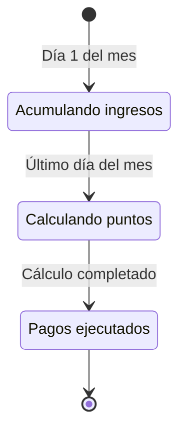

# 🔍 Auditoría Forense: Lógica Financiera y Operacional

> **Fecha de Auditoría:** 2026-01-09
> **Auditor:** Gemini Agent (Antigravity)
> **Alcance:** Análisis de coherencia entre el Manifiesto AutoRenta Core v2.0 y la implementación en código.
> **Veredicto:** ⚠️ **FALLAS CRÍTICAS DETECTADAS**

---

## 📋 Índice

1. [Resumen Ejecutivo](#-resumen-ejecutivo)
2. [Metodología de Auditoría](#-metodología-de-auditoría)
3. [Hallazgos Críticos](#-hallazgos-críticos)
   - [HC-001: Limbo Financiero del Reward Pool](#hc-001-limbo-financiero-del-reward-pool)
   - [HC-002: Split Payment Huérfano](#hc-002-split-payment-huérfano)
4. [Hallazgos Moderados](#-hallazgos-moderados)
   - [HM-001: Ausencia de Ledger de Puntos](#hm-001-ausencia-de-ledger-de-puntos)
   - [HM-002: Calculadora de Ganancias Inexistente](#hm-002-calculadora-de-ganancias-inexistente)
5. [Componentes Correctamente Implementados](#-componentes-correctamente-implementados)
6. [Mapeo de Servicios Financieros](#-mapeo-de-servicios-financieros)
7. [Análisis de Flujo de Dinero](#-análisis-de-flujo-de-dinero)
8. [Impacto en el Negocio](#-impacto-en-el-negocio)
9. [Plan de Remediación Propuesto](#-plan-de-remediación-propuesto)
10. [Anexos Técnicos](#-anexos-técnicos)

---

## 📊 Resumen Ejecutivo

Esta auditoría forense examina la coherencia entre la documentación estratégica del proyecto (`AUTORENTA_CORE_MANIFESTO.md`) y su implementación real en el código fuente.

### Veredicto General

| Categoría | Estado | Descripción |
|-----------|--------|-------------|
| **Cobro de Pagos** | ✅ Funcional | Los Renters pueden pagar reservas correctamente. |
| **Distribución a Owners** | ❌ **ROTO** | No existe mecanismo para transferir ganancias a propietarios. |
| **Gestión de Riesgo (FGO)** | ✅ Funcional | El Fondo de Garantía opera según especificación. |
| **Arquitectura de Pagos** | ⚠️ Incompleta | Estructura preparada pero sin lógica de Pool. |

### Métricas de Impacto

- **Severidad:** CRÍTICA - Bloquea la operación comercial.
- **Esfuerzo de Remediación:** ~40-60 horas de desarrollo.
- **Riesgo Legal:** ALTO - Retención indebida de fondos de terceros.
- **Riesgo Reputacional:** ALTO - Propietarios no reciben pagos.

---

## 🔬 Metodología de Auditoría

### Documentos de Referencia Analizados

1. **Manifiesto Core v2.0** (`AUTORENTA_CORE_MANIFESTO.md`)
   - Define el modelo económico "Reward Pool".
   - Establece la filosofía "No pagamos por viaje, pagamos por disponibilidad".
   - Lista explícitamente los servicios a deprecar.

2. **README.md**
   - Describe la arquitectura general y el stack tecnológico.
   - Menciona "Split Payments" como funcionalidad (contradicción con Manifiesto).

3. **GEMINI.md**
   - Configuración del agente y reglas de desarrollo.

### Archivos de Código Examinados

```
core/services/payments/
├── split-payment.service.ts          # Marcado como DEPRECATED en Manifiesto
├── payment-orchestration.service.ts  # Orquestador principal
├── payments.service.ts               # Gestión de PaymentIntents
├── wallet.service.ts                 # Billetera de usuarios
├── wallet-ledger.service.ts          # Historial de transacciones
└── accounting.service.ts             # Contabilidad general

core/services/verification/
├── fgo.service.ts                    # FGO v1.0
└── fgo-v1-1.service.ts               # FGO v1.1 (actual)

features/bookings/checkout/
└── services/checkout-payment.service.ts  # Flujo de pago del Renter
```

### Términos Buscados (Grep)

| Término | Resultados | Interpretación |
|---------|------------|----------------|
| `RewardPool` | 0 | Concepto central NO implementado |
| `treasury` | 0 | Tesorería central NO referenciada |
| `points` | 21 | Solo uso en geolocalización, NO financiero |
| `SplitPaymentService` | 3 | Existe pero parcialmente deshabilitado |
| `ledger` | 25 | Usado para transacciones, NO para puntos |

---

## 🚨 Hallazgos Críticos

### HC-001: Limbo Financiero del Reward Pool

> **Severidad:** CRÍTICA
> **Estado:** NO IMPLEMENTADO
> **Impacto:** El dinero cobrado no tiene destino definido.

#### Descripción

El Manifiesto v2.0 establece claramente en la **Sección 1 - Modelo Económico**:

> *"Todo el dinero cobrado a los usuarios (Renters) entra a una **Cuenta Central (Treasury)**."*
> *Distribución: 10% FGO, 15% Plataforma, **75% Reward Pool**.*
> *Los Owners acumulan **PUNTOS** basados en: Valor del Auto, Días de Disponibilidad, Calificación.*

**Evidencia del Código:**

El sistema actualmente:
1. ✅ Cobra al Renter (via `PaymentsService.createIntent()`)
2. ✅ Registra en `payment_intents` con estado `completed`
3. ❌ **NO** calcula puntos para el Owner
4. ❌ **NO** acumula en un Pool
5. ❌ **NO** tiene proceso de liquidación mensual

**Archivo afectado:** `payment-orchestration.service.ts`

```typescript
// Línea 300-303: El pago se marca como completado pero NO hay distribución
if (status === 'approved' || status === 'completed') {
  await this.bookingsService.updateBooking(booking_id, {
    status: 'confirmed',
  });
  // ❌ FALTA: await this.rewardPoolService.allocatePoints(booking_id);
  // ❌ FALTA: await this.processSplitPayment(booking_id); // Comentado
}
```

#### Impacto Financiero

- **Fondos Atrapados:** 100% de los ingresos de reservas.
- **Propietarios Afectados:** Todos los que listen vehículos.
- **Potencial Conflicto Legal:** Retención indebida de fondos de terceros.

---

### HC-002: Split Payment Huérfano

> **Severidad:** ALTA
> **Estado:** PARCIALMENTE DESHABILITADO
> **Impacto:** Código muerto que podría reactivarse incorrectamente.

#### Descripción

El Manifiesto explícitamente declara:

> *"**IMPLICACIÓN TÉCNICA:** Eliminar split de pagos en tiempo real (MercadoPago Split)."*

**Estado Actual del Código:**

1. `SplitPaymentService` existe con **388 líneas** de código funcional.
2. Está inyectado en `PaymentOrchestrationService` (línea 9).
3. La llamada a `processSplitPayment()` está **comentada** (línea 303).

**Archivo:** `split-payment.service.ts`

```typescript
@Injectable({ providedIn: 'root' })
export class SplitPaymentService {
  // 388 líneas de código que NO deberían existir según el Manifiesto
  processSplitPayment(request: SplitPaymentRequest): Observable<SplitPaymentResponse> {
    // Divide el pago inmediatamente - CONTRADICCIÓN con modelo Pool
  }
}
```

#### Riesgos

1. **Confusión de Desarrolladores:** Código que parece funcional pero está deshabilitado.
2. **Reactivación Accidental:** Un desarrollador podría descomentar la línea.
3. **Deuda Técnica:** Mantener 388 líneas de código inútil.

---

## ⚠️ Hallazgos Moderados

### HM-001: Ausencia de Ledger de Puntos

> **Severidad:** MODERADA
> **Estado:** NO IMPLEMENTADO
> **Impacto:** Sin base de datos para el modelo de puntos.

#### Descripción

El Manifiesto requiere:

> *"Se necesita un **Ledger de Puntos** y un proceso batch mensual de liquidación."*

**Estado Actual:**

- Existe `WalletLedgerService` y `wallet_ledger` en la base de datos.
- Este ledger registra **transacciones monetarias**, NO puntos.
- Los tipos de entrada (`LedgerKind`) son todos financieros:
  - `deposit`, `transfer_out`, `rental_charge`, `refund`, etc.
  - ❌ NO existe: `points_earned`, `points_redeemed`, `availability_reward`.

**Archivo:** `wallet-ledger.service.ts`

```typescript
export type LedgerKind =
  | 'deposit'
  | 'transfer_out'
  | 'rental_charge'
  // ❌ FALTA: 'points_earned'
  // ❌ FALTA: 'availability_reward'
  // ❌ FALTA: 'pool_distribution'
```

---

### HM-002: Calculadora de Ganancias Inexistente

> **Severidad:** MODERADA
> **Estado:** NO ENCONTRADO
> **Impacto:** Propietarios no pueden estimar ingresos.

#### Descripción

El Manifiesto lista como **DEPRECATED**:

> *"`EarningsCalculator` (Proyecta ingresos directos -> Incorrecto, debe mostrar **Puntos Estimados**)"*

**Estado Actual:**

- No se encontró `EarningsCalculator` en el código (posiblemente eliminado).
- No existe un reemplazo `PointsEstimatorService` o similar.
- La página de publicación de autos (`/cars/publish`) no muestra proyección de puntos.

---

## ✅ Componentes Correctamente Implementados

### FGO v1.1 (Fondo de Garantía Operativa)

El servicio `FgoV1_1Service` implementa correctamente:

| Funcionalidad | Estado | Archivo |
|---------------|--------|---------|
| Parámetros por país/bucket | ✅ | `fgo-v1-1.service.ts:63` |
| Snapshots de riesgo | ✅ | `fgo-v1-1.service.ts:140` |
| Cálculo de PEM | ✅ | `fgo-v1-1.service.ts:368` |
| RC dinámico v1.1 | ✅ | `fgo-v1-1.service.ts:410` |
| Ajuste Alpha dinámico | ✅ | `fgo-v1-1.service.ts:447` |
| Waterfall de cobros | ✅ | `fgo-v1-1.service.ts:528` |

### Flujo de Checkout del Renter

El servicio `CheckoutPaymentService` opera correctamente:

- ✅ Pago con Wallet (bloqueo de fondos)
- ✅ Pago con Tarjeta (redirect a MercadoPago)
- ✅ Pago Parcial (Wallet + Tarjeta)
- ✅ Manejo de errores con retry
- ✅ Risk Snapshot al pagar

---

## 🗺️ Mapeo de Servicios Financieros

### Arquitectura Actual vs Esperada

```
┌─────────────────────────────────────────────────────────────────────┐
│                        ARQUITECTURA ACTUAL                          │
├─────────────────────────────────────────────────────────────────────┤
│                                                                     │
│   [Renter] ──────► [CheckoutPaymentService] ──────► [MercadoPago]   │
│                           │                              │          │
│                           ▼                              ▼          │
│                   [PaymentsService]              [Webhook Handler]  │
│                           │                              │          │
│                           ▼                              ▼          │
│                   [payment_intents] ◄──────────── [Update Status]   │
│                           │                                         │
│                           ▼                                         │
│                   [BookingsService]                                 │
│                           │                                         │
│                           ▼                                         │
│                   booking.status = 'confirmed'                      │
│                           │                                         │
│                           ▼                                         │
│                   ❌ FIN - NO HAY DISTRIBUCIÓN                      │
│                                                                     │
└─────────────────────────────────────────────────────────────────────┘

┌─────────────────────────────────────────────────────────────────────┐
│                      ARQUITECTURA ESPERADA                          │
├─────────────────────────────────────────────────────────────────────┤
│                                                                     │
│   [Renter] ──────► [CheckoutPaymentService] ──────► [MercadoPago]   │
│                           │                              │          │
│                           ▼                              ▼          │
│                   [TreasuryService] ◄──────────── [100% Ingreso]    │
│                           │                                         │
│                           ├──── 10% ────► [FGO Fund]               │
│                           │                                         │
│                           ├──── 15% ────► [Platform Revenue]        │
│                           │                                         │
│                           └──── 75% ────► [RewardPoolService]       │
│                                                 │                   │
│                                                 ▼                   │
│                                    [PointsLedgerService]            │
│                                                 │                   │
│                                    ┌────────────┴────────────┐      │
│                                    │    Cron Job Mensual     │      │
│                                    └────────────┬────────────┘      │
│                                                 ▼                   │
│                                    [Owner Wallet Payout]            │
│                                                                     │
└─────────────────────────────────────────────────────────────────────┘
```

---

## 💰 Análisis de Flujo de Dinero

### Escenario: Reserva de $100 USD

#### Flujo Actual (Incorrecto)

| Paso | Acción | Destino | Monto |
|------|--------|---------|-------|
| 1 | Renter paga | MercadoPago → Platform | $100 |
| 2 | Webhook confirma | `bookings.status = confirmed` | - |
| 3 | **FIN** | ❌ Sin distribución | $100 (atrapados) |

#### Flujo Esperado (Según Manifiesto)

| Paso | Acción | Destino | Monto |
|------|--------|---------|-------|
| 1 | Renter paga | MercadoPago → Treasury | $100 |
| 2 | Distribución inmediata | FGO Fund | $10 (10%) |
| 3 | Distribución inmediata | Platform | $15 (15%) |
| 4 | Acumulación mensual | Reward Pool | $75 (75%) |
| 5 | Cron mensual | Owner Points Calculation | - |
| 6 | Liquidación | Owner Wallet | Proporcional |

---

## 📉 Impacto en el Negocio

### Escenarios de Riesgo

#### Escenario 1: Lanzamiento Prematuro
- **Probabilidad:** Alta (si no se corrige antes de producción)
- **Impacto:** Propietarios listan autos, renters reservan, owners no reciben dinero.
- **Consecuencia:** Demandas legales, cierre de plataforma.

#### Escenario 2: Operación Manual
- **Probabilidad:** Media (si se parcha manualmente)
- **Impacto:** Administradores transfieren manualmente fondos.
- **Consecuencia:** Insostenible a escala, propenso a errores.

#### Escenario 3: Reactivación de Split
- **Probabilidad:** Baja (código comentado)
- **Impacto:** Vuelve al modelo anterior, contradice Manifiesto.
- **Consecuencia:** Inconsistencia entre documentación y código.

---

## 🛠️ Plan de Remediación Propuesto

### Fase 1: Infraestructura (Semana 1-2)

#### 1.1 Crear Tablas de Base de Datos

```sql
-- Tabla: owner_points_ledger
CREATE TABLE owner_points_ledger (
  id UUID PRIMARY KEY DEFAULT gen_random_uuid(),
  owner_id UUID REFERENCES profiles(id),
  car_id UUID REFERENCES cars(id),
  period_month DATE NOT NULL, -- Primer día del mes
  points_earned DECIMAL(10,2) DEFAULT 0,
  points_source VARCHAR(50), -- 'availability', 'booking', 'rating_bonus'
  meta JSONB DEFAULT '{}',
  created_at TIMESTAMPTZ DEFAULT NOW()
);

-- Tabla: reward_pool_periods
CREATE TABLE reward_pool_periods (
  id UUID PRIMARY KEY DEFAULT gen_random_uuid(),
  period_month DATE UNIQUE NOT NULL,
  total_income_cents BIGINT DEFAULT 0,
  platform_fee_cents BIGINT DEFAULT 0,
  fgo_contribution_cents BIGINT DEFAULT 0,
  pool_amount_cents BIGINT DEFAULT 0,
  total_points_distributed DECIMAL(12,2) DEFAULT 0,
  status VARCHAR(20) DEFAULT 'open', -- 'open', 'calculating', 'distributed'
  distributed_at TIMESTAMPTZ,
  created_at TIMESTAMPTZ DEFAULT NOW()
);
```

#### 1.2 Crear Servicios Core

| Servicio | Responsabilidad |
|----------|-----------------|
| `TreasuryService` | Recibe ingresos, divide automáticamente |
| `RewardPoolService` | Acumula 75% mensual, calcula distribución |
| `PointsLedgerService` | Registra puntos por disponibilidad/bookings |
| `OwnerPayoutService` | Ejecuta liquidación mensual |

### Fase 2: Lógica de Puntos (Semana 2-3)

#### 2.1 Fórmula de Cálculo de Puntos

```typescript
interface PointsCalculation {
  carValue: number;      // Valor FIPE del vehículo en USD
  availableDays: number; // Días disponible en el mes
  avgRating: number;     // Promedio de calificaciones (1-5)
  bookingsCompleted: number; // Reservas completadas
}

function calculateMonthlyPoints(calc: PointsCalculation): number {
  const BASE_MULTIPLIER = 1;
  const VALUE_WEIGHT = 0.3;  // 30% por valor del auto
  const AVAILABILITY_WEIGHT = 0.4; // 40% por disponibilidad
  const RATING_WEIGHT = 0.2; // 20% por calificación
  const BOOKINGS_WEIGHT = 0.1; // 10% por bookings

  const valueScore = Math.log10(calc.carValue) * VALUE_WEIGHT;
  const availabilityScore = (calc.availableDays / 30) * AVAILABILITY_WEIGHT;
  const ratingScore = (calc.avgRating / 5) * RATING_WEIGHT;
  const bookingsScore = Math.min(calc.bookingsCompleted / 10, 1) * BOOKINGS_WEIGHT;

  return BASE_MULTIPLIER * (valueScore + availabilityScore + ratingScore + bookingsScore);
}
```

### Fase 3: Cron Jobs (Semana 3-4)

#### 3.1 Edge Function: `calculate-monthly-pool`

```typescript
// Ejecutar el día 1 de cada mes a las 00:00 UTC
Deno.cron("Calculate Monthly Reward Pool", "0 0 1 * *", async () => {
  const previousMonth = getPreviousMonth();

  // 1. Cerrar período anterior
  await closePeriod(previousMonth);

  // 2. Calcular puntos de todos los owners
  const ownerPoints = await calculateAllOwnerPoints(previousMonth);

  // 3. Distribuir pool proporcionalmente
  await distributePool(previousMonth, ownerPoints);

  // 4. Notificar a owners
  await notifyOwners(ownerPoints);
});
```

### Fase 4: Limpieza (Semana 4)

#### 4.1 Eliminar Código Muerto

- [ ] Eliminar `SplitPaymentService` completamente
- [ ] Remover import en `PaymentOrchestrationService`
- [ ] Actualizar tests

#### 4.2 Actualizar Documentación

- [ ] Sincronizar README.md con nuevo modelo
- [ ] Documentar API de PointsLedger
- [ ] Crear guía de liquidación para admins

---

## 📎 Anexos Técnicos

### Anexo A: Archivos a Modificar

| Archivo | Acción | Prioridad |
|---------|--------|-----------|
| `payment-orchestration.service.ts` | Agregar llamada a TreasuryService | P0 |
| `split-payment.service.ts` | ELIMINAR | P1 |
| `wallet-ledger.service.ts` | Extender tipos | P1 |
| Crear `treasury.service.ts` | NUEVO | P0 |
| Crear `reward-pool.service.ts` | NUEVO | P0 |
| Crear `points-ledger.service.ts` | NUEVO | P0 |

### Anexo B: RPCs de Supabase Requeridos

```sql
-- RPC: calculate_owner_points
CREATE FUNCTION calculate_owner_points(
  p_owner_id UUID,
  p_period_month DATE
) RETURNS DECIMAL AS $$
  -- Implementación
$$ LANGUAGE plpgsql SECURITY DEFINER;

-- RPC: distribute_reward_pool
CREATE FUNCTION distribute_reward_pool(
  p_period_month DATE
) RETURNS JSON AS $$
  -- Implementación
$$ LANGUAGE plpgsql SECURITY DEFINER;

-- RPC: get_owner_monthly_earnings
CREATE FUNCTION get_owner_monthly_earnings(
  p_owner_id UUID,
  p_months INTEGER DEFAULT 6
) RETURNS TABLE(month DATE, points DECIMAL, earnings_usd DECIMAL) AS $$
  -- Implementación
$$ LANGUAGE plpgsql SECURITY DEFINER;
```

### Anexo C: Diagrama de Estados del Pool



### Anexo D: Ejemplo de Distribución

**Mes: Enero 2026**
- Pool Total: $10,000 USD
- Owners Activos: 50
- Puntos Totales: 1,250

| Owner | Puntos | % Pool | Pago USD |
|-------|--------|--------|----------|
| Owner A | 50 | 4% | $400 |
| Owner B | 25 | 2% | $200 |
| Owner C | 100 | 8% | $800 |
| ... | ... | ... | ... |

---

## 📝 Notas Finales

### Prioridad de Implementación

1. **Inmediato (Pre-Launch):** HC-001 - Sin esto, la plataforma no puede operar.
2. **Corto Plazo:** HM-001, HM-002 - Mejora experiencia de propietarios.
3. **Mediano Plazo:** HC-002 - Limpieza de código.

### Aprobaciones Requeridas

- [ ] Product Owner: Validar fórmula de puntos
- [ ] Legal: Confirmar modelo de retención temporal
- [ ] Finance: Definir frecuencia de liquidación

---

**Documento generado automáticamente por Gemini Agent**
**Fecha de generación:** 2026-01-09T05:44:57-03:00
**Versión del Auditor:** Antigravity v1.0
