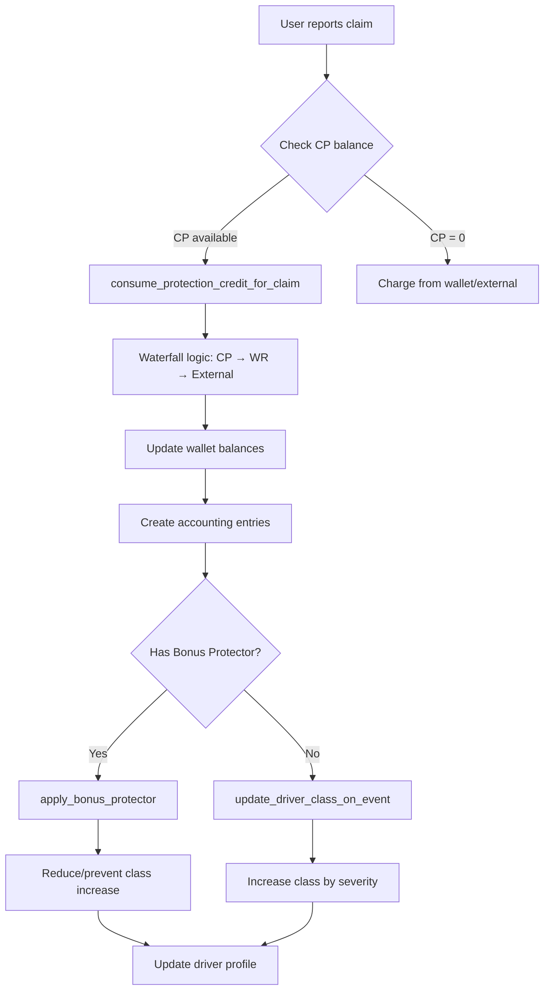

# Bonus-Malus System - Technical Documentation

**Version:** 1.0
**Date:** November 2025
**System:** AutoRenta Platform
**Module:** Driver Risk Classification & Pricing

---

## Table of Contents

1. [System Overview](#system-overview)
2. [Architecture](#architecture)
3. [Database Schema](#database-schema)
4. [RPC Functions API](#rpc-functions-api)
5. [Frontend Services](#frontend-services)
6. [UI Components](#ui-components)
7. [Accounting Integration](#accounting-integration)
8. [Cron Jobs](#cron-jobs)
9. [Security & RLS](#security--rls)
10. [Performance Considerations](#performance-considerations)
11. [Troubleshooting](#troubleshooting)

---

## System Overview

### Purpose

The Bonus-Malus system is a risk-based pricing mechanism that:
- **Rewards** safe drivers with discounts (Bonus)
- **Penalizes** risky drivers with surcharges (Malus)
- **Incentivizes** good driving behavior through gamification
- **Protects** platform revenue through accurate risk pricing

### Key Features

1. **Risk Classification:** 11 classes (0-10) from excellent to high-risk
2. **Telematics Integration:** Real-time driver scoring based on behavior
3. **Protection Credit (CP):** Non-withdrawable credit for claims ($300 USD)
4. **Bonus Protector:** Purchasable add-on to protect class from increasing
5. **Accounting Integration:** Full NIIF 15 / IFRIC 13 compliance
6. **Automated Jobs:** Daily, monthly, and annual automated processes

### Business Rules

| Rule | Description |
|------|-------------|
| **Starting Class** | New users begin at class 5 (base) |
| **Annual Improvement** | -1 class per year without fault claims |
| **Claim Penalty** | +1/+2/+3 classes based on severity |
| **CP Issuance** | $300 USD for new users, valid 1 year |
| **CP Renewal** | Free after 10 bookings without fault claims |
| **Breakage** | Unused CP becomes platform revenue when expired |

---

## Architecture

### System Layers

```
┌─────────────────────────────────────────┐
│  UI Layer (Angular Components)         │
│  - DriverProfileCard                    │
│  - ProtectionCreditCard                 │
│  - BonusProtectorPurchase               │
│  - ClassBenefitsModal                   │
└─────────────────────────────────────────┘
              ↓↑
┌─────────────────────────────────────────┐
│  Service Layer (Angular Services)       │
│  - DriverProfileService                 │
│  - ProtectionCreditService              │
│  - BonusProtectorService                │
│  - TelemetryService                     │
└─────────────────────────────────────────┘
              ↓↑
┌─────────────────────────────────────────┐
│  API Layer (Supabase RPC Functions)     │
│  - Driver Profile Management (5)        │
│  - Pricing Calculations (3)             │
│  - Protection Credit (5)                │
│  - Bonus Protector (4)                  │
│  - Telemetry (7)                        │
│  - Accounting (5)                       │
└─────────────────────────────────────────┘
              ↓↑
┌─────────────────────────────────────────┐
│  Database Layer (PostgreSQL)            │
│  - driver_risk_profile                  │
│  - pricing_class_factors                │
│  - driver_telemetry                     │
│  - driver_protection_addons             │
│  - booking_claims                       │
│  - user_wallets (extended)              │
│  - accounting_journal_entries           │
└─────────────────────────────────────────┘
              ↓↑
┌─────────────────────────────────────────┐
│  Automation Layer (pg_cron)             │
│  - Annual class improvement             │
│  - Monthly score recalculation          │
│  - Daily CP auto-renewal                │
│  - Daily breakage recognition           │
└─────────────────────────────────────────┘
```

### Data Flow

#### Claim Processing Flow



---

## Database Schema

### Core Tables

#### `driver_risk_profile`

Stores driver classification and history.

```sql
CREATE TABLE driver_risk_profile (
  user_id UUID PRIMARY KEY REFERENCES auth.users(id),
  class INT NOT NULL DEFAULT 5 CHECK (class BETWEEN 0 AND 10),
  driver_score INT NOT NULL DEFAULT 50 CHECK (driver_score BETWEEN 0 AND 100),
  good_years INT NOT NULL DEFAULT 0,
  total_claims INT NOT NULL DEFAULT 0,
  claims_with_fault INT NOT NULL DEFAULT 0,
  last_claim_at TIMESTAMPTZ,
  last_class_update TIMESTAMPTZ DEFAULT NOW(),
  created_at TIMESTAMPTZ DEFAULT NOW(),
  updated_at TIMESTAMPTZ DEFAULT NOW()
);
```

**Key Fields:**
- `class`: Risk class (0 = best, 10 = worst)
- `driver_score`: Telemetry score (0-100, higher = better)
- `good_years`: Consecutive years without fault claims
- `total_claims`: All claims (with or without fault)
- `claims_with_fault`: Claims where driver was responsible

#### `pricing_class_factors`

Multipliers for each risk class.

```sql
CREATE TABLE pricing_class_factors (
  class INT PRIMARY KEY CHECK (class BETWEEN 0 AND 10),
  fee_multiplier DECIMAL(5, 3) NOT NULL,
  guarantee_multiplier DECIMAL(5, 3) NOT NULL,
  description TEXT NOT NULL
);
```

**Example Data:**

| class | fee_multiplier | guarantee_multiplier | description |
|-------|----------------|----------------------|-------------|
| 0 | 0.85 | 0.75 | Excellent - Maximum discount |
| 5 | 1.00 | 1.00 | Base (no history) |
| 10 | 1.20 | 1.80 | Maximum risk - Maximum surcharge |

#### `driver_telemetry`

Telemetry data per trip.

```sql
CREATE TABLE driver_telemetry (
  id UUID PRIMARY KEY DEFAULT gen_random_uuid(),
  user_id UUID NOT NULL REFERENCES auth.users(id),
  booking_id UUID NOT NULL REFERENCES bookings(id),
  total_km DECIMAL(10, 2) NOT NULL,
  hard_brakes INT DEFAULT 0,
  speed_violations INT DEFAULT 0,
  night_driving_hours DECIMAL(5, 2) DEFAULT 0,
  risk_zones_visited INT DEFAULT 0,
  driver_score INT NOT NULL CHECK (driver_score BETWEEN 0 AND 100),
  gps_coordinates JSONB,
  created_at TIMESTAMPTZ DEFAULT NOW()
);
```

**Score Algorithm:**

```
Initial Score = 100
Penalties (normalized per 100km):
  - Hard brakes: -2 points each
  - Speed violations: -3 points each
  - Night driving: -1 point per hour
  - Risk zones: -5 points each
Final Score = max(0, min(100, Initial - Total Penalties))
```

#### `driver_protection_addons`

Purchased add-ons (Bonus Protector, etc.).

```sql
CREATE TABLE driver_protection_addons (
  id UUID PRIMARY KEY DEFAULT gen_random_uuid(),
  user_id UUID NOT NULL REFERENCES auth.users(id),
  addon_type VARCHAR(50) NOT NULL CHECK (addon_type IN ('BONUS_PROTECTOR', 'DEDUCTIBLE_SHIELD')),
  protection_level INT CHECK (protection_level BETWEEN 1 AND 3),
  price_paid_cents BIGINT NOT NULL,
  currency VARCHAR(3) DEFAULT 'USD',
  status VARCHAR(20) DEFAULT 'ACTIVE' CHECK (status IN ('ACTIVE', 'USED', 'EXPIRED')),
  purchased_at TIMESTAMPTZ DEFAULT NOW(),
  expires_at TIMESTAMPTZ,
  used_at TIMESTAMPTZ
);
```

**Protection Levels:**
- **Level 1** ($15): Protects 1 leve claim
- **Level 2** ($25): Protects 2 leve or 1 moderado
- **Level 3** ($40): Protects 3 leve, 2 moderado, or 1 grave

#### `user_wallets` (Extended)

Added fields for Protection Credit.

```sql
ALTER TABLE user_wallets ADD COLUMN IF NOT EXISTS
  protection_credit_cents BIGINT DEFAULT 0,
  protection_credit_currency VARCHAR(3) DEFAULT 'USD',
  protection_credit_issued_at TIMESTAMPTZ,
  protection_credit_expires_at TIMESTAMPTZ;
```

**CP Fields:**
- `protection_credit_cents`: Non-withdrawable balance in cents
- `protection_credit_issued_at`: Date of issuance
- `protection_credit_expires_at`: Expiration date (typically 1 year)

---

## RPC Functions API

### Driver Profile Management

#### `initialize_driver_profile(user_id UUID)`

Creates initial profile for new user.

**Parameters:**
- `user_id`: User UUID

**Returns:** `driver_risk_profile` record

**Default Values:**
- class: 5
- driver_score: 50
- good_years: 0
- total_claims: 0

**Usage:**
```sql
SELECT initialize_driver_profile('user-uuid-here');
```

---

#### `get_driver_profile(user_id UUID)`

Fetches complete driver profile with pricing factors.

**Returns:**
```json
{
  "user_id": "uuid",
  "class": 5,
  "driver_score": 75,
  "good_years": 2,
  "total_claims": 1,
  "claims_with_fault": 0,
  "fee_multiplier": 1.0,
  "guarantee_multiplier": 1.0,
  "description": "Base (no history)",
  "last_claim_at": "2025-10-15T10:30:00Z"
}
```

---

#### `update_driver_class_on_event(user_id UUID, claim_with_fault BOOLEAN, severity INT)`

Updates class after a claim.

**Parameters:**
- `user_id`: User UUID
- `claim_with_fault`: TRUE if driver was responsible
- `severity`: 1 (leve), 2 (moderado), 3 (grave)

**Returns:**
```json
{
  "old_class": 5,
  "new_class": 7,
  "class_change": +2
}
```

**Business Rules:**
- Severity 1 (leve) → +1 class
- Severity 2 (moderado) → +2 classes
- Severity 3 (grave) → +3 classes
- Maximum class: 10
- Resets good_years to 0

---

### Protection Credit Functions

#### `issue_protection_credit(user_id UUID, amount_cents BIGINT DEFAULT 30000, validity_days INT DEFAULT 365)`

Issues CP to a user.

**Parameters:**
- `user_id`: User UUID
- `amount_cents`: Amount in cents (default $300 USD)
- `validity_days`: Validity period (default 1 year)

**Returns:**
```json
{
  "issued_amount_cents": 30000,
  "issued_amount_usd": 300.00,
  "expires_at": "2026-11-05T00:00:00Z"
}
```

**Side Effects:**
- Creates wallet if doesn't exist
- Records transaction in wallet_transactions
- Creates accounting entry (deferred revenue)

---

#### `consume_protection_credit_for_claim(user_id UUID, claim_amount_cents BIGINT, booking_id UUID)`

Consumes CP using waterfall logic.

**Waterfall Order:**
1. Protection Credit (CP) - non-withdrawable
2. Wallet Retirable (WR) - withdrawable balance
3. External Payment - remaining amount

**Returns:**
```json
{
  "cp_used_cents": 10000,
  "wr_used_cents": 5000,
  "remaining_claim_cents": 0
}
```

**Side Effects:**
- Decrements CP and/or WR from wallet
- Records transactions
- Creates accounting entries (revenue recognition)

---

### Telemetry Functions

#### `record_telemetry(booking_id UUID, telemetry_data JSONB)`

Records trip telemetry and calculates score.

**Expected JSON Structure:**
```json
{
  "total_km": 150.5,
  "hard_brakes": 3,
  "speed_violations": 1,
  "night_driving_hours": 2.5,
  "risk_zones_visited": 0,
  "gps_coordinates": [
    {"lat": -34.6037, "lng": -58.3816, "timestamp": "2025-11-05T10:00:00Z"},
    ...
  ]
}
```

**Returns:** Calculated `driver_score` (0-100)

**Side Effects:**
- Creates record in driver_telemetry
- Updates average score in driver_risk_profile

---

### Accounting Functions

#### `account_protection_credit_issuance(user_id UUID, amount_cents BIGINT, transaction_id UUID)`

Creates accounting entry for CP issuance.

**Journal Entry:**
```
DEBE:  3300 Resultados Acumulados    $300
HABER: 2111 CP No Devengado          $300
```

**Treatment:** IFRIC 13 (Loyalty Programs) - Deferred Revenue

---

#### `account_protection_credit_consumption(user_id UUID, consumed_cents BIGINT, claim_id UUID, transaction_id UUID)`

Creates accounting entry for CP consumption.

**Journal Entry:**
```
DEBE:  2111 CP No Devengado                 $100
HABER: 4103 Ingreso por Consumo CP          $100
```

**Treatment:** NIIF 15 (Revenue Recognition) - Performance Obligation Satisfied

---

#### `account_protection_credit_breakage(user_id UUID, expired_cents BIGINT, reason VARCHAR, transaction_id UUID)`

Creates accounting entry for breakage (expired CP).

**Journal Entry:**
```
DEBE:  2111 CP No Devengado          $300
HABER: 4203 Ingreso por Breakage     $300
```

**Treatment:** IFRIC 13 Breakage - Non-operating Income

---

## Frontend Services

### DriverProfileService

**Location:** `apps/web/src/app/core/services/driver-profile.service.ts`

**Purpose:** Manage driver profile state and provide UI helpers.

**Key Methods:**
- `loadProfile()`: Fetches profile via RPC
- `initializeProfile()`: Creates profile for new users
- `getClassBenefits(class)`: Returns benefits for a class
- `calculateClaimImpact(severity, withFault)`: Simulates class change
- `getProgressToNextClass()`: Shows years needed for improvement

**Computed Signals:**
```typescript
readonly driverClass = computed(() => this.state().profile?.class ?? 5);
readonly driverScore = computed(() => this.state().profile?.driver_score ?? 50);
readonly feeMultiplier = computed(() => this.state().profile?.fee_multiplier ?? 1.0);
readonly hasDiscount = computed(() => this.feeMultiplier() < 1.0);
```

---

### ProtectionCreditService

**Location:** `apps/web/src/app/core/services/protection-credit.service.ts`

**Purpose:** Manage Protection Credit state and calculations.

**Key Methods:**
- `loadBalance()`: Fetches CP balance with expiration
- `checkRenewalEligibility()`: Checks if user can renew for free
- `calculateCoverage(claimAmount)`: Shows CP coverage
- `calculatePaymentBreakdown(total, wallet)`: Waterfall breakdown

**Computed Signals:**
```typescript
readonly balanceUsd = computed(() => this.state().balance?.balance_usd ?? 0);
readonly isExpired = computed(() => this.state().balance?.is_expired ?? true);
readonly daysUntilExpiry = computed(() => this.state().balance?.days_until_expiry ?? null);
```

---

## UI Components

### DriverProfileCard

**Selector:** `<app-driver-profile-card></app-driver-profile-card>`

**Purpose:** Visual display of driver profile.

**Features:**
- Class badge with color coding
- Telemetry score with progress bar
- Benefits breakdown (fee and guarantee discounts/surcharges)
- Claim history
- Progress toward next class

**Usage:**
```html
<app-driver-profile-card></app-driver-profile-card>
```

---

### ProtectionCreditCard

**Selector:** `<app-protection-credit-card></app-protection-credit-card>`

**Purpose:** Display CP balance and status.

**Features:**
- Balance in USD
- Expiration date and countdown
- Usage percentage
- Renewal progress (toward 10 bookings)

**Usage:**
```html
<app-protection-credit-card></app-protection-credit-card>
```

---

## Accounting Integration

### Chart of Accounts

| Code | Name | Type | Usage |
|------|------|------|-------|
| 2111 | Crédito de Protección No Devengado | LIABILITY | CP issuance (deferred revenue) |
| 4103 | Ingreso por Consumo CP | INCOME | CP consumption (revenue recognition) |
| 4203 | Ingreso por Breakage | INCOME | Unused CP (breakage revenue) |
| 4104 | Ingreso por Protector Bonus | INCOME | Protector sales |
| 5103 | Gastos Marketing | EXPENSE | Free CP renewals |

### Accounting Flows

#### CP Lifecycle

```
Issuance → Deferred Revenue (Liability)
  ↓
Consumption → Revenue Recognition (Income)
  ↓ (if unused)
Expiration → Breakage Revenue (Income)
```

#### Protector Sale

```
Purchase → Immediate Revenue Recognition
  ↓
Wallet Balance (Liability) → Service Income
```

---

## Cron Jobs

### Schedule Overview

| Job Name | Schedule | Function | Purpose |
|----------|----------|----------|---------|
| improve-driver-classes-annual | Jan 1 @ 3 AM | `improve_driver_class_annual()` | Improve classes |
| recalculate-driver-scores-monthly | 1st @ 4 AM | `recalculate_all_driver_scores()` | Recalc scores |
| auto-renew-protection-credit-daily | Daily @ 5 AM | `extend_protection_credit_for_good_history()` | Auto-renew CP |
| recognize-cp-breakage-daily | Daily @ 6 AM | `recognize_protection_credit_breakage()` | Recognize breakage |
| expire-bonus-protectors-daily | Daily @ 7 AM | Updates status | Expire protectors |
| driver-score-report-weekly | Sun @ 8 AM | Aggregates data | Weekly report |
| alert-high-risk-drivers-daily | Daily @ 9 AM | Creates notifications | Alert class 8-10 |

### Monitoring Cron Jobs

**View active jobs:**
```sql
SELECT * FROM bonus_malus_cron_jobs;
```

**View recent executions:**
```sql
SELECT *
FROM cron.job_run_details
WHERE jobname LIKE '%driver%'
ORDER BY start_time DESC
LIMIT 10;
```

**View execution logs:**
```sql
SELECT *
FROM worker_logs
WHERE service LIKE 'cron_%'
ORDER BY created_at DESC;
```

---

## Security & RLS

### Row Level Security Policies

All bonus-malus tables enforce RLS:

#### `driver_risk_profile`

```sql
-- Users can view own profile
CREATE POLICY "Users view own profile"
ON driver_risk_profile FOR SELECT
TO authenticated
USING (user_id = auth.uid());

-- Service role can update
CREATE POLICY "Service role can update"
ON driver_risk_profile FOR ALL
TO service_role
USING (true);
```

#### `driver_telemetry`

```sql
-- Users can view own telemetry
CREATE POLICY "Users view own telemetry"
ON driver_telemetry FOR SELECT
TO authenticated
USING (user_id = auth.uid());
```

### Function Security

All RPC functions use `SECURITY DEFINER`:

```sql
CREATE OR REPLACE FUNCTION get_driver_profile(...)
RETURNS ...
SECURITY DEFINER;  -- Runs with creator's permissions
```

**Why SECURITY DEFINER?**
- Controlled access to sensitive operations
- Enforces business logic at function level
- Prevents direct table manipulation
- Audit trail via function calls

---

## Performance Considerations

### Indexes

```sql
-- Driver profile lookups
CREATE INDEX idx_driver_profile_class ON driver_risk_profile(class);
CREATE INDEX idx_driver_profile_score ON driver_risk_profile(driver_score);

-- Telemetry queries
CREATE INDEX idx_telemetry_user_created ON driver_telemetry(user_id, created_at DESC);
CREATE INDEX idx_telemetry_booking ON driver_telemetry(booking_id);

-- Addon lookups
CREATE INDEX idx_addons_user_active ON driver_protection_addons(user_id, status, expires_at);

-- Accounting queries
CREATE INDEX idx_journal_entries_transaction_type ON accounting_journal_entries(transaction_type, entry_date);
CREATE INDEX idx_ledger_account_date ON accounting_ledger(account_id, entry_date);
```

### Query Optimization

**Telemetry Average (3-month window):**
```sql
-- GOOD: Uses index on user_id + created_at
SELECT AVG(driver_score)
FROM driver_telemetry
WHERE user_id = $1
AND created_at > NOW() - INTERVAL '3 months';

-- BAD: Full table scan
SELECT AVG(driver_score)
FROM driver_telemetry
WHERE created_at > NOW() - INTERVAL '3 months';
```

---

## Troubleshooting

### Common Issues

#### Issue: User class not updating after claim

**Symptoms:**
- Claim recorded
- Class remains the same

**Debug:**
```sql
-- Check if update_driver_class_on_event was called
SELECT * FROM driver_risk_profile WHERE user_id = 'user-uuid';

-- Check wallet transactions
SELECT * FROM wallet_transactions
WHERE user_id = 'user-uuid'
ORDER BY created_at DESC;

-- Check accounting entries
SELECT * FROM accounting_journal_entries
WHERE transaction_type = 'PROTECTION_CREDIT_CONSUMPTION'
ORDER BY entry_date DESC;
```

**Solution:**
- Verify `with_fault = TRUE` in claim
- Check if Bonus Protector was active
- Manually call function if needed:
  ```sql
  SELECT update_driver_class_on_event('user-uuid', TRUE, 1);
  ```

---

#### Issue: CP not expiring

**Symptoms:**
- protection_credit_expires_at < NOW()
- balance_cents > 0

**Debug:**
```sql
-- Check wallet state
SELECT * FROM user_wallets
WHERE user_id = 'user-uuid';

-- Check last cron run
SELECT * FROM cron.job_run_details
WHERE jobname = 'recognize-cp-breakage-daily'
ORDER BY start_time DESC
LIMIT 1;
```

**Solution:**
- Manually trigger breakage:
  ```sql
  SELECT recognize_protection_credit_breakage('user-uuid');
  ```

---

#### Issue: Telemetry score not updating

**Symptoms:**
- Telemetry recorded
- driver_score in profile not changing

**Debug:**
```sql
-- Check recent telemetry
SELECT * FROM driver_telemetry
WHERE user_id = 'user-uuid'
ORDER BY created_at DESC
LIMIT 5;

-- Check average calculation
SELECT AVG(driver_score) FROM driver_telemetry
WHERE user_id = 'user-uuid'
AND created_at > NOW() - INTERVAL '3 months';
```

**Solution:**
- Manually recalculate:
  ```sql
  SELECT recalculate_all_driver_scores();
  ```

---

## Support & Contacts

**Documentation:**
- Technical Docs: `BONUS_MALUS_TECHNICAL_DOCS.md`
- User Guide: `BONUS_MALUS_USER_GUIDE.md`
- API Docs: `BONUS_MALUS_API_REFERENCE.md`
- Progress Tracking: `BONUS_MALUS_IMPLEMENTATION_PROGRESS.md`

**Database Migrations:**
- Schema: `supabase/migrations/20251105_create_bonus_malus_system.sql`
- RPCs: `supabase/migrations/20251105_create_*_rpcs.sql`
- Accounting: `supabase/migrations/20251105_bonus_malus_accounting_integration.sql`
- Cron: `supabase/migrations/20251105_bonus_malus_cron_jobs.sql`

**Frontend Code:**
- Services: `apps/web/src/app/core/services/*`
- Components: `apps/web/src/app/shared/components/*`

---

**Last Updated:** November 2025
**Version:** 1.0
**Author:** AutoRenta Development Team
