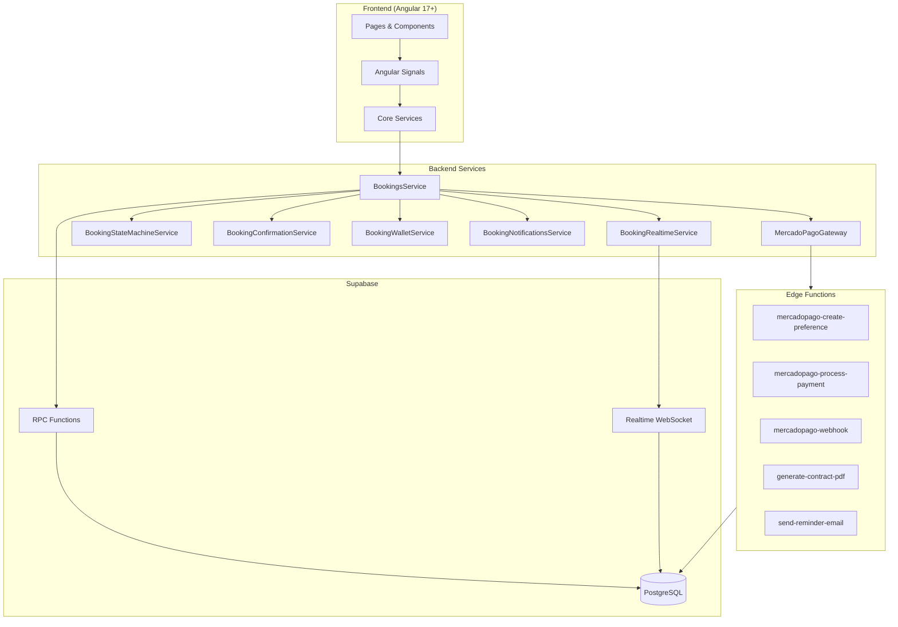
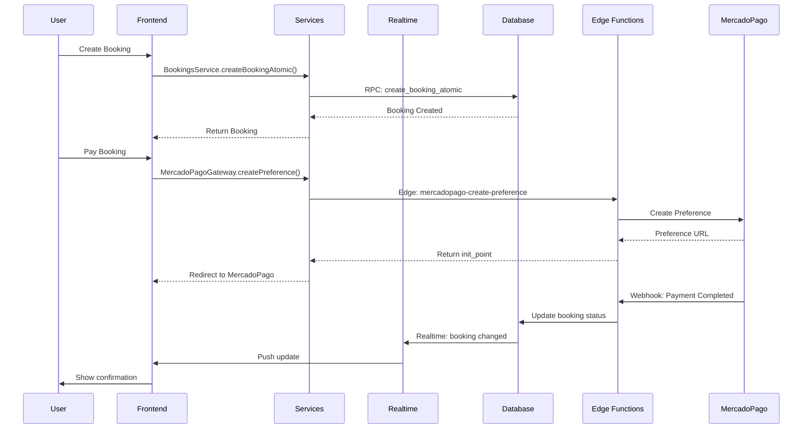
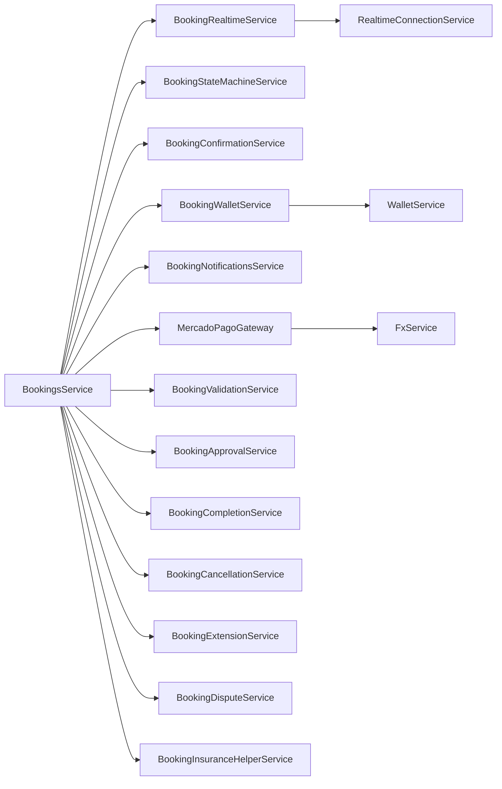

# Bookings System Architecture

## Overview

El sistema de Bookings de AutoRenta utiliza una arquitectura de capas con Angular 17+ en el frontend, Supabase como backend, y Edge Functions para logica de negocio critica.

## Architecture Diagram



## Layer Responsibilities

### 1. Frontend Layer

| Component | Location | Responsibility |
|-----------|----------|----------------|
| Booking Pages | `apps/web/src/app/features/bookings/` | User interface, routing |
| Wizard Steps | `features/bookings/components/` | Multi-step booking creation |
| Shared Components | `app/shared/components/` | Reusable UI elements |

### 2. Services Layer

| Service | File | Responsibility |
|---------|------|----------------|
| `BookingsService` | `bookings.service.ts` | CRUD operations, main orchestrator |
| `BookingRealtimeService` | `booking-realtime.service.ts` | WebSocket subscriptions |
| `BookingStateMachineService` | `booking-state-machine.service.ts` | State transitions, FSM |
| `BookingConfirmationService` | `booking-confirmation.service.ts` | Bilateral confirmation flow |
| `BookingWalletService` | `booking-wallet.service.ts` | Wallet/deposit operations |
| `BookingFlowService` | `booking-flow.service.ts` | Complex workflow orchestration |
| `BookingNotificationsService` | `booking-notifications.service.ts` | Notification management |
| `MercadoPagoGateway` | `mercadopago-booking-gateway.service.ts` | Payment integration |

### 3. Supabase Layer

| Component | Purpose |
|-----------|---------|
| PostgreSQL | Data persistence |
| Realtime | WebSocket connections for live updates |
| RPC Functions | Server-side business logic |
| Row Level Security | Authorization |

### 4. Edge Functions

| Function | Purpose |
|----------|---------|
| `mercadopago-create-booking-preference` | Create payment preference |
| `mercadopago-process-booking-payment` | Process card payments |
| `mercadopago-webhook` | Handle IPN notifications |
| `generate-booking-contract-pdf` | PDF generation |
| `send-booking-reminder-email` | Email notifications |

## Data Flow



## Service Dependencies



## Key Files

```
apps/web/src/app/
├── features/bookings/
│   ├── bookings.routes.ts           # Route definitions
│   ├── pages/booking-wizard/        # 6-step wizard
│   ├── pages/booking-checkout/      # Payment flow
│   ├── booking-detail/              # Booking details
│   ├── booking-detail-payment/      # Pre-auth/guarantee
│   ├── booking-success/             # Payment confirmation
│   ├── check-in/                    # Renter inspection
│   ├── check-out/                   # Return inspection
│   ├── my-bookings/                 # User's bookings
│   └── owner-bookings/              # Owner's bookings
│
├── core/services/bookings/
│   ├── bookings.service.ts          # 1,174 lines
│   ├── booking-realtime.service.ts  # 320 lines
│   ├── booking-flow.service.ts      # 22,798 lines
│   ├── booking-state-machine.service.ts
│   ├── booking-confirmation.service.ts
│   ├── booking-wallet.service.ts
│   └── booking-notifications.service.ts
│
└── core/services/payments/
    └── mercadopago-booking-gateway.service.ts

supabase/functions/
├── mercadopago-create-booking-preference/
├── mercadopago-process-booking-payment/
├── mercadopago-webhook/
├── generate-booking-contract-pdf/
└── send-booking-reminder-email/
```

## Technology Stack

| Layer | Technology |
|-------|------------|
| Frontend Framework | Angular 17+ |
| UI Framework | Ionic 8 |
| Styling | Tailwind CSS |
| State Management | Angular Signals |
| Backend | Supabase (PostgreSQL + Realtime) |
| Edge Functions | Deno (TypeScript) |
| Payments | MercadoPago SDK |
| PDF Generation | PDFKit |
| Email | Resend |
