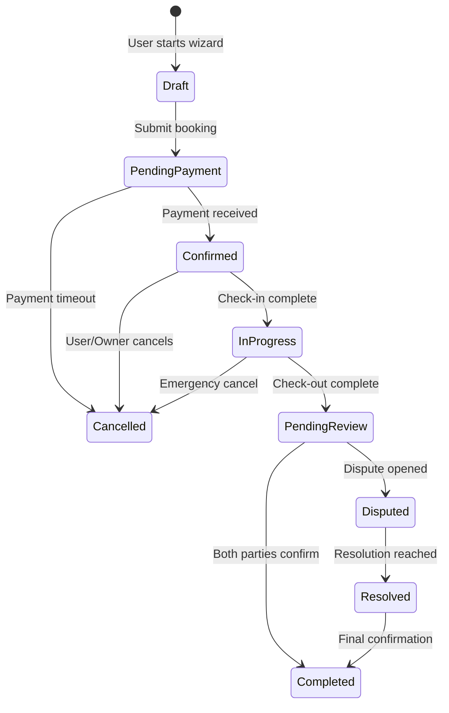
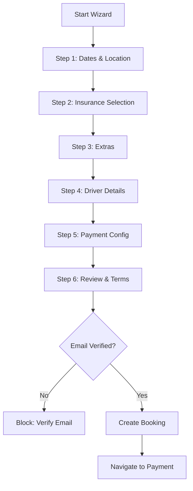
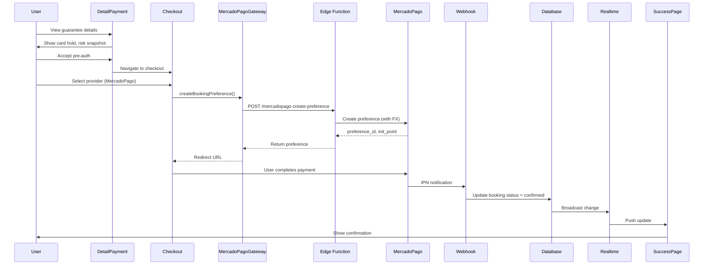
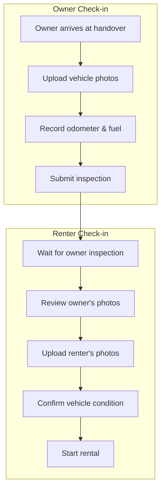
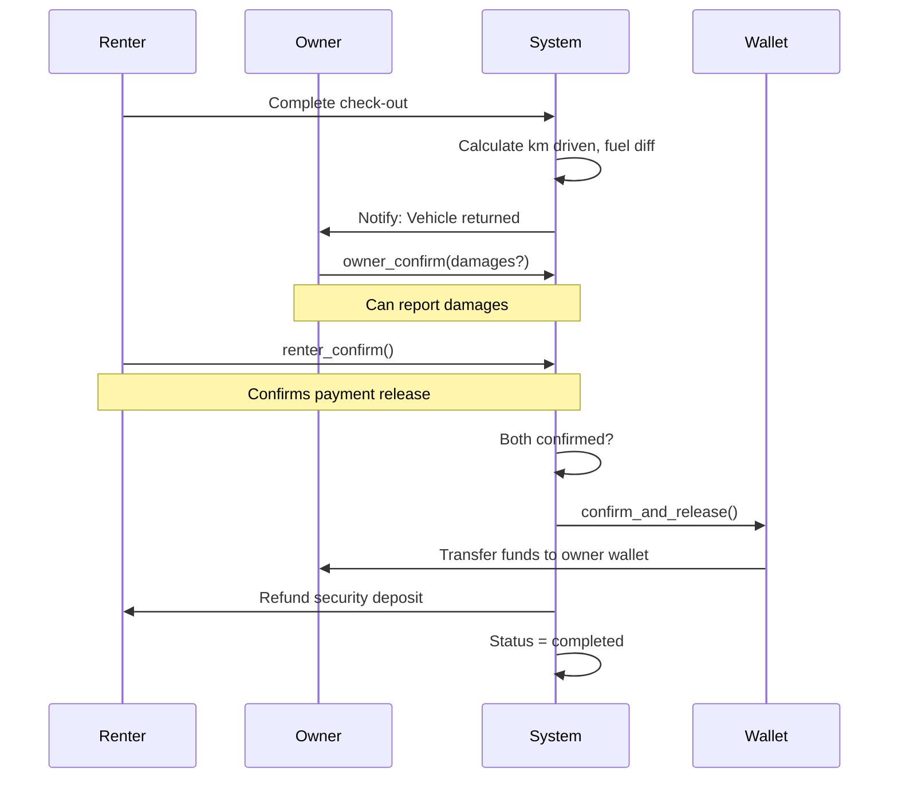
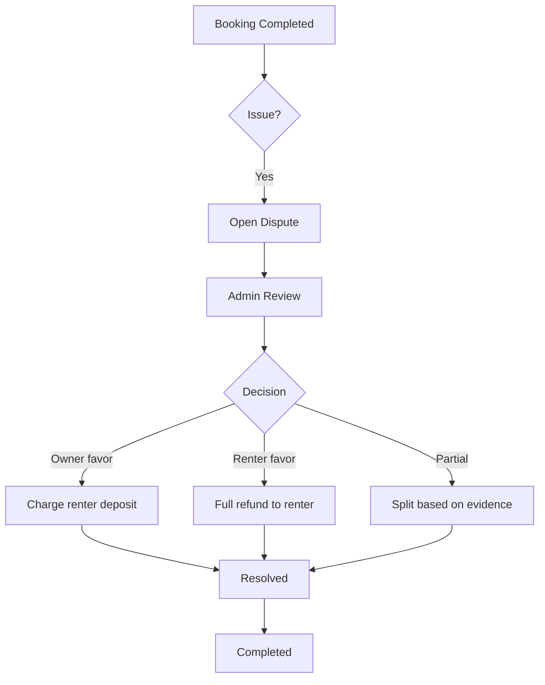
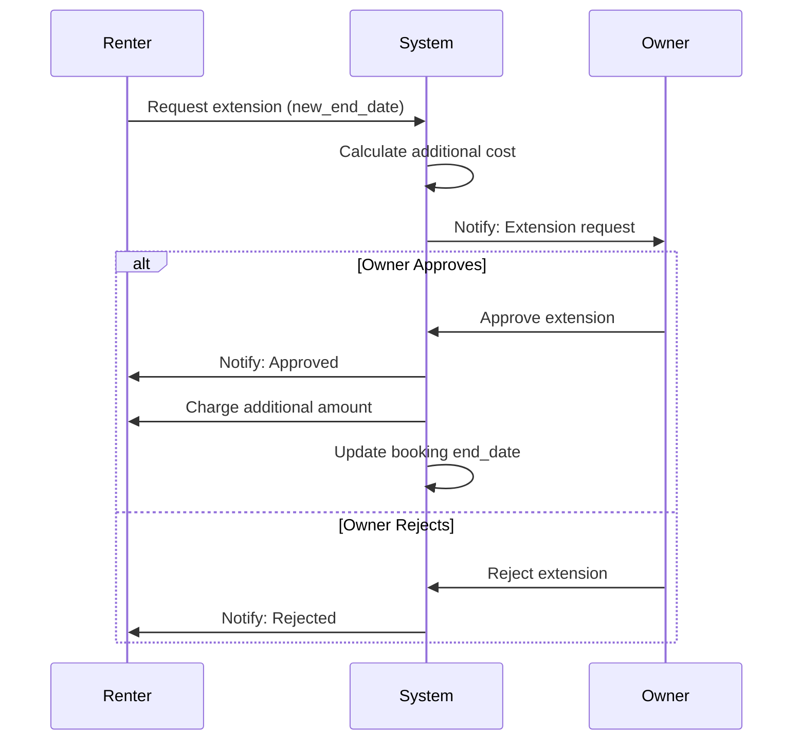

# Booking Flows

## Complete Booking Lifecycle



## 1. Booking Creation Flow (Wizard)

### Route: `/bookings/wizard?carId=xxx`



### Step Details

| Step | Component | Required Fields |
|------|-----------|-----------------|
| 1 | `BookingDatesStepComponent` | start_date, end_date, pickup_location |
| 2 | `BookingInsuranceStepComponent` | insurance_tier (basic/standard/premium) |
| 3 | `BookingExtrasStepComponent` | extras[] (optional) |
| 4 | `BookingDriverStepComponent` | license_number, license_expiry, emergency_contact |
| 5 | `BookingPaymentStepComponent` | payment_method, payment_plan |
| 6 | `BookingReviewStepComponent` | terms_accepted, cancellation_policy_accepted |

### Draft Persistence
```typescript
// Auto-saved to localStorage
key: `booking_draft_${carId}`
// Loaded on wizard init, cleared on submit
```

## 2. Payment Flow

### Route: `/bookings/:id/detail-payment` → `/bookings/:id/checkout`



### Payment Modes
- **Card**: Full payment via MercadoPago
- **Wallet**: Deduct from user wallet balance
- **Split**: Partial wallet + card

### Payment Plans
- **Full**: 100% now
- **50/50**: 50% now, 50% at check-in
- **Deposit**: 20% now, 80% 7 days before

## 3. Check-in / Check-out Flow

### Route: `/bookings/:id/check-in` (Renter) | `/bookings/:id/owner-check-in` (Owner)



### FGO v1.1 Inspection System
```typescript
interface BookingInspection {
  booking_id: string;
  inspection_type: 'checkin' | 'checkout';
  photos_url: string[];
  odometer_reading: number;
  fuel_level: number; // 0-100%
  damage_reported: boolean;
  notes?: string;
}
```

## 4. Return & Confirmation Flow



### Bilateral Confirmation States
| State | Owner Confirmed | Renter Confirmed | Funds |
|-------|-----------------|------------------|-------|
| RETURNED | - | - | Locked |
| PENDING_OWNER | No | - | Locked |
| PENDING_RENTER | Yes | No | Locked |
| FUNDS_RELEASED | Yes | Yes | Released |

## 5. Dispute Resolution Flow



## 6. Extension Request Flow



## Key RPC Functions

| Function | Purpose |
|----------|---------|
| `request_booking` | Create booking with location |
| `create_booking_atomic` | Atomic creation with risk snapshot |
| `pricing_recalculate` | Recalculate after changes |
| `mark_as_returned` | Mark vehicle returned |
| `owner_confirm` | Owner confirmation |
| `renter_confirm` | Renter confirmation |
| `confirm_and_release` | Release funds |
| `wallet_charge_rental` | Charge from wallet |
| `wallet_lock_rental_and_deposit` | Lock security deposit |
