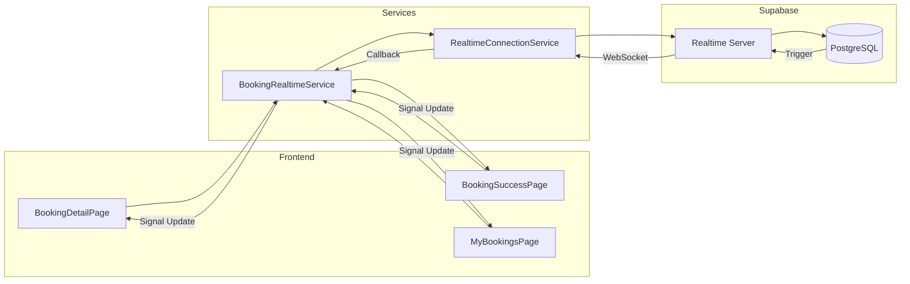

# Real-time Updates

## Overview

El sistema de bookings utiliza Supabase Realtime para actualizaciones en tiempo real via WebSocket. Cada booking puede tener hasta 6 canales de suscripcion activos simultaneamente.

## Architecture



## Subscription Channels

### Per-Booking Channels (6 total)

```typescript
// BookingRealtimeService.subscribeToBooking()
const channels = [
  `booking-${bookingId}`,           // bookings table
  `booking-confirmation-${id}`,     // bookings_confirmation
  `booking-inspections-${id}`,      // booking_inspections
  `booking-extensions-${id}`,       // booking_extension_requests
  `booking-claims-${id}`,           // insurance_claims
  `booking-fines-${id}`,            // traffic_infractions
];
```

### User Bookings List Channel

```typescript
// BookingRealtimeService.subscribeToUserBookings()
channel: `user-bookings-${userId}-${role}`
// Filters by owner_id or renter_id based on role
// 300ms debounce to prevent UI spam
```

## Handler Interface

```typescript
interface BookingRealtimeHandlers {
  // Called when booking record changes
  onBookingChange?: (booking: Booking) => void;

  // Called when confirmation status changes
  onConfirmationChange?: (confirmation: BookingConfirmation) => void;

  // Called when inspection is added/updated
  onInspectionChange?: () => void;

  // Called when extension request changes
  onExtensionChange?: () => void;

  // Called when insurance claim is filed
  onClaimChange?: () => void;

  // Called when traffic fine is reported
  onFineChange?: () => void;

  // Called when connection status changes
  onConnectionChange?: (status: ConnectionStatus) => void;
}

type ConnectionStatus = 'connecting' | 'connected' | 'error' | 'disconnected';
```

## Auto-Reconnection

### Exponential Backoff

```typescript
// RealtimeConnectionService
const retryDelays = [1000, 2000, 4000, 8000, 16000, 30000]; // max 30s
const maxRetries = 10;

// On disconnect:
// 1. Wait retryDelays[attempt]
// 2. Attempt reconnection
// 3. If fail, increment attempt
// 4. If maxRetries reached, give up
// 5. On success, reset attempt counter
```

### Channel Deduplication

```typescript
// Prevents duplicate WebSocket connections
private activeChannels = new Map<string, RealtimeChannel>();

subscribeToChannel(channelName: string) {
  if (this.activeChannels.has(channelName)) {
    return this.activeChannels.get(channelName);
  }
  // Create new channel...
}
```

## Usage Examples

### BookingSuccessPage

```typescript
@Component({...})
export class BookingSuccessPage implements OnInit, OnDestroy {
  private readonly bookingRealtime = inject(BookingRealtimeService);

  readonly booking = signal<Booking | null>(null);
  readonly paymentStatus = signal<'pending' | 'completed' | 'failed'>('pending');

  ngOnInit() {
    // Subscribe to realtime updates
    this.bookingRealtime.subscribeToBooking(this.bookingId, {
      onBookingChange: (updatedBooking) => {
        this.booking.set(updatedBooking);
        if (updatedBooking.status === 'confirmed') {
          this.paymentStatus.set('completed');
        }
      },
      onConnectionChange: (status) => {
        if (status === 'error') {
          // Fallback to polling
          this.startPolling();
        }
      }
    });
  }

  ngOnDestroy() {
    this.bookingRealtime.unsubscribeAll();
  }
}
```

### MyBookingsPage

```typescript
@Component({...})
export class MyBookingsPage implements OnInit, OnDestroy {
  private readonly bookingRealtime = inject(BookingRealtimeService);

  readonly bookings = signal<Booking[]>([]);

  ngOnInit() {
    // Subscribe to user's bookings list
    this.bookingRealtime.subscribeToUserBookings(this.userId, 'renter', {
      onBookingChange: (updatedBooking) => {
        // Update specific booking in list
        this.bookings.update(list =>
          list.map(b => b.id === updatedBooking.id ? updatedBooking : b)
        );
      }
    });
  }
}
```

## Events Tracked

### Booking Table Events

| Event | Trigger | Payload |
|-------|---------|---------|
| `INSERT` | New booking created | Full booking |
| `UPDATE` | Status change, payment, etc. | Full booking |
| `DELETE` | Booking deleted (rare) | Booking ID |

### Confirmation Events

| Event | Trigger |
|-------|---------|
| `UPDATE` | Owner/renter confirms, funds released |

### Inspection Events

| Event | Trigger |
|-------|---------|
| `INSERT` | New check-in/check-out started |
| `UPDATE` | Photos added, status changed |

### Extension Events

| Event | Trigger |
|-------|---------|
| `INSERT` | Extension requested |
| `UPDATE` | Extension approved/rejected |

## Connection Status Signal

```typescript
// RealtimeConnectionService
readonly connectionStatus = signal<ConnectionStatus>('disconnected');

// Components can react to connection issues
@if (connectionStatus() === 'error') {
  <div class="bg-warning-bg p-2 text-warning-text">
    Connection lost. Attempting to reconnect...
  </div>
}
```

## Best Practices

### Always Unsubscribe

```typescript
ngOnDestroy() {
  this.bookingRealtime.unsubscribeAll();
}
```

### Use Debouncing for Lists

```typescript
// Built-in 300ms debounce for subscribeToUserBookings
// Prevents rapid UI updates when multiple bookings change
```

### Implement Polling Fallback

```typescript
// BookingSuccessPage has polling fallback
// 40 attempts x 3 seconds = 2 minutes max wait
onConnectionChange: (status) => {
  if (status === 'error') {
    this.startPollingFallback();
  }
}
```

### Monitor Connection Health

```typescript
// Log connection status changes
onConnectionChange: (status) => {
  this.logger.debug(`Realtime connection: ${status}`);
}
```

## Troubleshooting

### No Updates Received

1. Check if `subscribeToBooking()` was called
2. Verify booking ID is correct
3. Check browser DevTools → Network → WS for connection
4. Check Supabase Realtime logs

### Duplicate Updates

1. Ensure only one subscription per booking
2. Check for multiple component instances
3. Use channel deduplication (built-in)

### Connection Drops

1. Check internet connectivity
2. Verify Supabase project is active
3. Check rate limits (200 concurrent connections per project)
4. Review browser console for WebSocket errors
