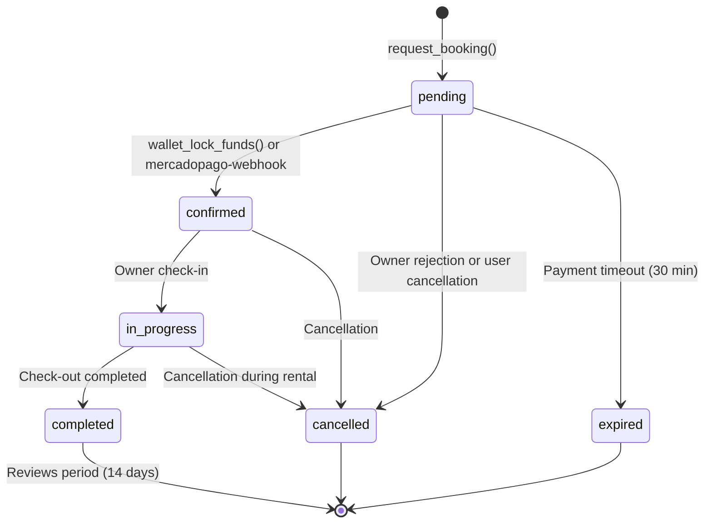
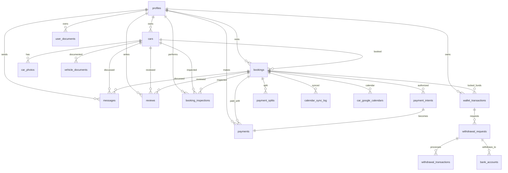

# Flujo Completo del Locatario en Base de Datos - AutoRenta

**Versión**: 2.0.0
**Fecha**: 2025-11-16
**Autor**: Sistema AutoRenta

---

## 📋 Índice

1. [Visión General](#visión-general)
2. [Diagrama de Flujo Completo](#diagrama-de-flujo-completo)
3. [Entidades y Tablas Principales](#entidades-y-tablas-principales)
4. [Funciones RPC y Edge Functions](#funciones-rpc-y-edge-functions)
5. [Estados y Transiciones del Booking](#estados-y-transiciones-del-booking)
6. [Flujo Paso a Paso - Implementación en BD](#flujo-paso-a-paso---implementación-en-bd)
7. [Relaciones entre Tablas](#relaciones-entre-tablas)
8. [Ejemplos de Queries SQL](#ejemplos-de-queries-sql)
9. [Consideraciones Técnicas](#consideraciones-técnicas)

---

## 🎯 Visión General

Este documento describe, con nivel operativo y técnico, cómo está implementado en la base de datos de AutoRenta el flujo completo del usuario "locatario" (renter) desde el registro hasta las evaluaciones finales. Incluye todas las tablas, campos, relaciones, funciones RPC, Edge Functions, y queries típicas involucradas.

### Entidades Principales Involucradas

| Entidad | Propósito | Tabla Principal |
|---------|-----------|-----------------|
| **Usuario** | Perfil y autenticación del locatario | `profiles` |
| **Autos** | Catálogo de vehículos disponibles | `cars` |
| **Reservas** | Estado central del proceso de alquiler | `bookings` |
| **Mensajes** | Comunicación entre locatario y locador | `messages` |
| **Pagos** | Procesamiento de pagos (tarjeta/wallet) | `payments`, `wallet_transactions` |
| **Documentos** | Verificación de identidad y licencia | `user_documents` |
| **Inspecciones** | Check-in y check-out del vehículo | `booking_inspections` |
| **Evaluaciones** | Sistema de reseñas bidireccional | `reviews` |
| **Pagos Split** | Distribución de ganancias (85/15) | `payment_splits` |

### Funciones RPC/Edge Functions Clave

- `request_booking()` - Validación y creación de reserva
- `wallet_get_balance()` / `wallet_lock_funds()` - Gestión de wallet
- `create_payment_authorization()` - Pre-autorización MercadoPago
- `complete_payment_split()` - Cálculo de distribución de pagos
- `create_review()` - Creación de evaluaciones
- `mercadopago-webhook` (Edge Function) - Procesamiento de pagos

---

## 🔄 Diagrama de Flujo Completo

```mermaid
flowchart TD
    %% Autenticación
    A[Usuario llega a plataforma] --> B[Registro/Login]
    B --> C[profiles creado<br/>role='locatario']

    %% Descubrimiento
    C --> D[Búsqueda en mapa/lista]
    D --> E[cars filtrado<br/>por location_lat/lng<br/>precio, disponibilidad]

    %% Selección y Reserva
    E --> F[Seleccionar auto<br/>desde mapa]
    F --> G[Verificar disponibilidad<br/>bookings overlaps]
    G --> H[request_booking() RPC]

    %% Pago
    H --> I{Pago}
    I --> J[Wallet Payment]
    I --> K[MercadoPago]

    J --> L[wallet_lock_funds() RPC]
    K --> M[create_payment_authorization()]

    %% Confirmación
    L --> N[booking.status='confirmed']
    M --> O[mercadopago-webhook<br/>payments.status='captured']
    O --> N

    %% Check-in
    N --> P[Owner Check-in]
    P --> Q[booking_inspections<br/>stage='check_in_owner']
    Q --> R[booking.status='in_progress']

    R --> S[Renter Check-in]
    S --> T[booking_inspections<br/>stage='check_in_renter']

    %% Alquiler Activo
    T --> U[Alquiler en progreso]
    U --> V[Tracking opcional<br/>booking_location_tracking]

    %% Check-out
    U --> W[Renter Check-out]
    W --> X[booking_inspections<br/>stage='check_out_renter']

    X --> Y[Owner Check-out]
    Y --> Z[booking_inspections<br/>stage='check_out_owner']

    %% Finalización
    Z --> AA[booking.status='completed']
    AA --> BB[complete_payment_split() RPC]
    BB --> CC[payment_splits<br/>85% owner / 15% platform]

    %% Evaluaciones
    CC --> DD[Período de reviews<br/>14 días]
    DD --> EE[create_review() RPC]
    EE --> FF[reviews creada]
    FF --> GG[update_user_stats_v2_for_booking()]

    %% Estados alternos
    H -.->|Cancelación| HH[booking.status='cancelled']
    N -.->|Timeout| II[booking.status='expired']
    R -.->|Cancelación| HH

    %% Estilos
    classDef primary fill:#e1f5fe,stroke:#01579b
    classDef secondary fill:#f3e5f5,stroke:#4a148c
    classDef success fill:#e8f5e8,stroke:#1b5e20
    classDef error fill:#ffebee,stroke:#b71c1c

    class A,B,C,D,E,F primary
    class G,H secondary
    class I,J,K,M secondary
    class L,N,O success
    class P,Q,R,S,T,U,V success
    class W,X,Y,Z,AA success
    class BB,CC success
    class DD,EE,FF,GG success
    class HH,II error
```

---

## 📊 Entidades y Tablas Principales

### 1. Profiles - Perfil de Usuario

```sql
CREATE TABLE profiles (
  id UUID REFERENCES auth.users(id) PRIMARY KEY,
  full_name TEXT,
  avatar_url TEXT,
  role TEXT DEFAULT 'locatario',
  is_admin BOOLEAN DEFAULT false,
  phone TEXT,
  email_verified BOOLEAN DEFAULT false,
  phone_verified BOOLEAN DEFAULT false,
  id_verified BOOLEAN DEFAULT false,
  created_at TIMESTAMPTZ DEFAULT NOW(),
  updated_at TIMESTAMPTZ DEFAULT NOW(),

  -- Campos encriptados (PCI compliance)
  phone_encrypted TEXT,
  whatsapp_encrypted TEXT,
  gov_id_number_encrypted TEXT,
  dni_encrypted TEXT,
  driver_license_number_encrypted TEXT,
  address_line1_encrypted TEXT,
  address_line2_encrypted TEXT,
  postal_code_encrypted TEXT,
  email TEXT,

  -- Información adicional
  date_of_birth DATE,
  primary_goal TEXT,
  onboarding onboarding_status DEFAULT 'incomplete',

  -- Ubicación y preferencias
  home_latitude NUMERIC,
  home_longitude NUMERIC,
  location_verified_at TIMESTAMPTZ,
  preferred_search_radius_km INTEGER DEFAULT 50,

  -- Ratings y estadísticas
  rating_avg NUMERIC DEFAULT 0,
  rating_count INTEGER DEFAULT 0,

  -- MercadoPago onboarding
  mp_onboarding_completed BOOLEAN DEFAULT false,
  mercadopago_collector_id TEXT,
  mp_onboarding_url TEXT
);
```

**Campos críticos para locatario:**
- `role = 'locatario'` o `'ambos'`
- `onboarding` - Estado del proceso de onboarding
- `id_verified`, `phone_verified` - Estados de verificación
- Campos encriptados para datos sensibles

### 2. Cars - Catálogo de Vehículos

```sql
CREATE TABLE cars (
  id UUID PRIMARY KEY DEFAULT gen_random_uuid(),
  owner_id UUID REFERENCES profiles(id),
  title TEXT,
  description TEXT,
  brand TEXT,
  model TEXT,
  year INTEGER,
  price_per_day NUMERIC,
  currency TEXT DEFAULT 'ARS',
  city TEXT,
  province TEXT,
  country TEXT,
  location_lat NUMERIC,
  location_lng NUMERIC,
  status car_status DEFAULT 'draft',
  created_at TIMESTAMPTZ DEFAULT NOW(),
  updated_at TIMESTAMPTZ DEFAULT NOW(),

  -- Relaciones normalizadas
  brand_id UUID REFERENCES car_brands(id),
  model_id UUID REFERENCES car_models(id),
  category_id UUID REFERENCES vehicle_categories(id),

  -- Campos legacy
  brand_text_backup TEXT,
  model_text_backup TEXT,
  fuel TEXT,
  fuel_type TEXT,
  transmission TEXT,
  color TEXT,
  mileage INTEGER,
  seats INTEGER,
  doors INTEGER,
  features JSONB,

  -- Información financiera
  value_usd NUMERIC,
  min_rental_days INTEGER,
  max_rental_days INTEGER,
  deposit_required BOOLEAN,
  deposit_amount NUMERIC,
  insurance_included BOOLEAN,
  auto_approval BOOLEAN,
  location_street TEXT,
  location_street_number TEXT,
  location_city TEXT,
  location_state TEXT,
  location_country TEXT,
  location_province TEXT,
  location_neighborhood TEXT,
  location_postal_code TEXT,
  payment_methods JSONB,
  delivery_options JSONB,
  terms_and_conditions TEXT,
  uses_dynamic_pricing BOOLEAN,

  -- Valores FIPE (Brasil) para valoración
  estimated_value_usd INTEGER,
  value_usd_source TEXT,
  fipe_code TEXT,
  fipe_last_sync TIMESTAMPTZ,
  custom_daily_rate_pct NUMERIC,
  value_brl INTEGER,
  value_ars INTEGER,
  value_auto_sync_enabled BOOLEAN,
  region_id UUID,

  -- Precios en centavos (para precisión)
  price_per_day_cents BIGINT,
  can_receive_payments BOOLEAN,
  security_deposit_usd NUMERIC,

  -- Geografía PostGIS
  location_geom GEOGRAPHY(POINT, 4326),

  -- Estado y control
  deleted_at TIMESTAMPTZ,
  rating_avg NUMERIC,
  rating_count INTEGER,
  plate TEXT,
  vin TEXT
);
```

**Campos críticos para búsqueda:**
- `location_lat`, `location_lng`, `location_geom` - Para mapa y búsqueda geográfica
- `price_per_day_cents` - Precio base del alquiler
- `status = 'active'` - Solo autos publicados
- `features` (JSONB) - Características del vehículo

### 3. Bookings - Reservas (Entidad Central)

```sql
CREATE TABLE bookings (
  id UUID PRIMARY KEY DEFAULT gen_random_uuid(),
  car_id UUID REFERENCES cars(id),
  renter_id UUID REFERENCES profiles(id),
  start_at TIMESTAMPTZ,
  end_at TIMESTAMPTZ,
  status booking_status DEFAULT 'pending',
  total_amount NUMERIC,
  currency TEXT DEFAULT 'ARS',
  created_at TIMESTAMPTZ DEFAULT NOW(),
  updated_at TIMESTAMPTZ DEFAULT NOW(),

  -- Seguro y garantía
  guarantee_type TEXT,
  guarantee_amount_cents INTEGER,
  risk_snapshot_booking_id UUID,
  risk_snapshot_date TIMESTAMPTZ,
  requires_revalidation BOOLEAN DEFAULT false,
  hold_authorization_id TEXT,
  hold_expires_at TIMESTAMPTZ,
  reauthorization_count INTEGER DEFAULT 0,

  -- Modo de pago
  payment_mode TEXT,
  coverage_upgrade TEXT DEFAULT 'standard',
  authorized_payment_id UUID REFERENCES payment_intents(id),
  wallet_lock_id UUID,
  total_price_ars NUMERIC,

  -- Identificación idempotente
  idempotency_key TEXT,
  payment_split_completed BOOLEAN DEFAULT false,
  payment_split_validated_at TIMESTAMPTZ,
  owner_payment_amount NUMERIC,
  platform_fee NUMERIC,

  -- Ubicación pickup/dropoff
  pickup_location_lat NUMERIC,
  pickup_location_lng NUMERIC,
  dropoff_location_lat NUMERIC,
  dropoff_location_lng NUMERIC,
  delivery_required BOOLEAN DEFAULT false,
  delivery_distance_km NUMERIC,
  delivery_fee_cents BIGINT DEFAULT 0,

  -- Riesgo y distancia
  distance_risk_tier TEXT,
  payment_provider payment_provider DEFAULT 'mercadopago',
  payment_preference_id TEXT,
  payment_init_point TEXT,
  provider_split_payment_id TEXT,
  provider_collector_id TEXT,

  -- Cálculos de tiempo
  days_count INTEGER,
  nightly_rate_cents BIGINT,
  subtotal_cents BIGINT,
  insurance_cents BIGINT DEFAULT 0,
  fees_cents BIGINT DEFAULT 0,
  discounts_cents BIGINT DEFAULT 0,
  total_cents BIGINT,

  -- Detalles de pricing
  breakdown JSONB,
  payment_id UUID REFERENCES payments(id),
  expires_at TIMESTAMPTZ,
  paid_at TIMESTAMPTZ,

  -- Políticas de cancelación
  cancellation_policy_id BIGINT,
  cancellation_fee_cents BIGINT DEFAULT 0,
  cancelled_at TIMESTAMPTZ,
  cancellation_reason TEXT,

  -- Pricing dinámico
  has_dynamic_pricing BOOLEAN DEFAULT false,
  dynamic_price_snapshot JSONB,
  price_locked_until TIMESTAMPTZ,
  price_lock_token UUID,

  -- Google Calendar
  google_calendar_event_id TEXT,
  calendar_synced_at TIMESTAMPTZ,
  calendar_sync_enabled BOOLEAN DEFAULT true,

  -- Estado de payout
  payout_status payout_status_enum DEFAULT 'pending',
  payout_date TIMESTAMPTZ,
  platform_fee_collected NUMERIC,
  owner_amount_paid NUMERIC,
  payout_retry_count INTEGER DEFAULT 0,
  payout_error_message TEXT,

  -- Split payment MercadoPago
  mercadopago_split_id CHARACTER VARYING,

  -- Risk snapshot
  risk_snapshot_id UUID REFERENCES booking_risk_snapshot(id),

  -- Información de pago
  payment_method TEXT,
  wallet_amount_cents BIGINT DEFAULT 0,
  wallet_status TEXT DEFAULT 'none',
  rental_amount_cents BIGINT,
  deposit_amount_cents BIGINT,
  deposit_status TEXT DEFAULT 'none',

  -- Estado de completación
  completion_status TEXT DEFAULT 'active',
  owner_confirmed_delivery BOOLEAN DEFAULT false,
  renter_confirmed_payment BOOLEAN DEFAULT false,

  -- Metadatos
  metadata JSONB
);
```

**Campos críticos para locatario:**
- `renter_id` - ID del locatario
- `status` - Estado del booking (pending → confirmed → in_progress → completed)
- `total_cents` - Monto total en centavos
- `payment_method` - 'wallet' o 'mercadopago'
- `wallet_amount_cents` - Monto pagado con wallet

### 4. Messages - Sistema de Chat

```sql
CREATE TABLE messages (
  id UUID PRIMARY KEY DEFAULT gen_random_uuid(),
  booking_id UUID REFERENCES bookings(id),
  car_id UUID REFERENCES cars(id),
  sender_id UUID REFERENCES profiles(id),
  recipient_id UUID REFERENCES profiles(id),
  body TEXT,
  delivered_at TIMESTAMPTZ,
  read_at TIMESTAMPTZ,
  created_at TIMESTAMPTZ DEFAULT NOW(),
  updated_at TIMESTAMPTZ DEFAULT NOW()
);
```

**Características:**
- `booking_id` opcional - puede haber chat general sobre un auto
- `car_id` - Para contexto del vehículo
- Real-time via Supabase Realtime
- RLS asegura que solo participantes vean mensajes

### 5. Payments & Wallet System - Sistema de Pagos Complejo

#### 5.1 Payments Table - Pagos con Tarjeta (MercadoPago)

```sql
CREATE TABLE payments (
  id UUID PRIMARY KEY DEFAULT gen_random_uuid(),
  booking_id UUID REFERENCES bookings(id),
  payment_intent_id UUID REFERENCES payment_intents(id),
  provider payment_provider,
  provider_payment_id TEXT,
  amount NUMERIC,
  currency TEXT DEFAULT 'ARS',
  status payment_status DEFAULT 'pending',
  metadata JSONB,
  created_at TIMESTAMPTZ DEFAULT NOW(),
  updated_at TIMESTAMPTZ DEFAULT NOW(),

  -- Campos específicos MercadoPago
  is_hold BOOLEAN DEFAULT false,
  authorized_at TIMESTAMPTZ,
  captured_at TIMESTAMPTZ,
  canceled_at TIMESTAMPTZ,
  amount_authorized_cents BIGINT,
  amount_captured_cents BIGINT DEFAULT 0,
  expires_at TIMESTAMPTZ,
  payment_method_id TEXT,
  card_last4 TEXT,
  idempotency_key TEXT,
  user_id UUID REFERENCES profiles(id),
  description TEXT
);
```

#### 5.2 User Wallets Table - Balances de Usuario Complejos

```sql
CREATE TABLE user_wallets (
  user_id UUID PRIMARY KEY REFERENCES profiles(id),
  balance_cents BIGINT NOT NULL DEFAULT 0,
  available_balance_cents BIGINT NOT NULL DEFAULT 0,
  locked_balance_cents BIGINT NOT NULL DEFAULT 0,
  autorentar_credit_balance_cents BIGINT NOT NULL DEFAULT 0, -- Créditos no retirable
  cash_deposit_balance_cents BIGINT NOT NULL DEFAULT 0,     -- Depósitos en efectivo no retirable
  currency TEXT NOT NULL DEFAULT 'ARS',
  created_at TIMESTAMPTZ NOT NULL DEFAULT NOW(),
  updated_at TIMESTAMPTZ NOT NULL DEFAULT NOW()
);
```

**Tipos de Balance:**
- `balance_cents` - Balance total
- `available_balance_cents` - Balance disponible para usar
- `locked_balance_cents` - Fondos bloqueados en reservas activas
- `autorentar_credit_balance_cents` - Créditos de plataforma (no retirable)
- `cash_deposit_balance_cents` - Depósitos en efectivo (no retirable)

#### 5.3 Wallet Transactions Table - Historial de Transacciones

```sql
CREATE TABLE wallet_transactions (
  id UUID PRIMARY KEY DEFAULT gen_random_uuid(),
  user_id UUID REFERENCES profiles(id),
  type TEXT, -- 'deposit', 'withdrawal', 'lock', 'unlock', 'payment'
  amount BIGINT, -- en centavos
  currency TEXT DEFAULT 'ARS',
  status TEXT, -- 'pending', 'completed', 'failed', 'cancelled'
  description TEXT,
  reference_type TEXT, -- 'booking', 'withdrawal_request', etc.
  reference_id UUID, -- ID del booking, withdrawal_request, etc.
  provider TEXT, -- 'mercadopago', 'bank_transfer', etc.
  provider_transaction_id TEXT,
  metadata JSONB,
  completed_at TIMESTAMPTZ,
  created_at TIMESTAMPTZ DEFAULT NOW(),
  updated_at TIMESTAMPTZ DEFAULT NOW()
);
```

#### 5.4 Payment Splits Table - Distribución de Pagos

```sql
CREATE TABLE payment_splits (
  id UUID PRIMARY KEY DEFAULT gen_random_uuid(),
  booking_id UUID REFERENCES bookings(id),
  owner_amount_cents BIGINT,
  platform_fee_cents BIGINT,
  payout_status TEXT DEFAULT 'pending',
  payout_date TIMESTAMPTZ,
  split_status TEXT DEFAULT 'pending',
  completed_at TIMESTAMPTZ,
  mercadopago_payment_id TEXT,
  webhook_data JSONB,
  created_at TIMESTAMPTZ DEFAULT NOW()
);
```

### 6. User Documents - Verificación de Documentos

```sql
CREATE TABLE user_documents (
  id BIGINT PRIMARY KEY,
  user_id UUID REFERENCES profiles(id),
  kind user_document_kind, -- 'driver_license', 'identity', 'residence_proof', etc.
  storage_path TEXT,
  status user_document_status DEFAULT 'pending', -- 'pending', 'verified', 'rejected'
  notes TEXT,
  created_at TIMESTAMPTZ DEFAULT NOW(),
  reviewed_by UUID REFERENCES profiles(id),
  reviewed_at TIMESTAMPTZ
);
```

**Tipos de documentos requeridos para locatario:**
- `driver_license` - Licencia de conducir
- `identity` - Documento de identidad
- `residence_proof` - Comprobante de residencia

### 7. Booking Inspections - Check-in/Check-out

```sql
CREATE TABLE booking_inspections (
  id UUID PRIMARY KEY DEFAULT gen_random_uuid(),
  booking_id UUID REFERENCES bookings(id),
  stage TEXT, -- 'check_in_owner', 'check_in_renter', 'check_out_renter', 'check_out_owner'
  inspector_id UUID REFERENCES profiles(id),
  photos JSONB DEFAULT '[]',
  odometer INTEGER,
  fuel_level NUMERIC,
  latitude NUMERIC,
  longitude NUMERIC,
  signed_at TIMESTAMPTZ,
  created_at TIMESTAMPTZ DEFAULT NOW(),
  updated_at TIMESTAMPTZ DEFAULT NOW()
);
```

**Stages del proceso:**
1. `check_in_owner` - Locador inspecciona antes de entregar
2. `check_in_renter` - Locatario confirma recepción
3. `check_out_renter` - Locatario devuelve vehículo
4. `check_out_owner` - Locador confirma recepción

### 8. Reviews - Sistema de Evaluaciones

```sql
CREATE TABLE reviews (
  id UUID PRIMARY KEY DEFAULT gen_random_uuid(),
  booking_id UUID REFERENCES bookings(id),
  reviewer_id UUID REFERENCES profiles(id),
  reviewee_id UUID REFERENCES profiles(id),
  rating INTEGER, -- 1-5 estrellas
  comment TEXT,
  is_car_review BOOLEAN DEFAULT false,
  is_renter_review BOOLEAN DEFAULT false,
  created_at TIMESTAMPTZ DEFAULT NOW(),
  updated_at TIMESTAMPTZ DEFAULT NOW()
);
```

**Tipos de reviews:**
- `is_renter_review = true` - Locatario evalúa al locador
- `is_car_review = true` - Locatario evalúa el vehículo

### 9. Payment Splits - Distribución de Pagos

```sql
CREATE TABLE payment_splits (
  id UUID PRIMARY KEY DEFAULT gen_random_uuid(),
  booking_id UUID REFERENCES bookings(id),
  owner_amount_cents BIGINT,
  platform_fee_cents BIGINT,
  payout_status TEXT DEFAULT 'pending',
  payout_date TIMESTAMPTZ,
  created_at TIMESTAMPTZ DEFAULT NOW()
);
```

**Regla de split:** 85% al locador, 15% a la plataforma

---

## 🔧 Funciones RPC y Edge Functions

### Funciones RPC Principales

#### 1. `request_booking()` - Crear Reserva con Validación

```sql
CREATE OR REPLACE FUNCTION request_booking(
  p_car_id UUID,
  p_renter_id UUID,
  p_start_at TIMESTAMPTZ,
  p_end_at TIMESTAMPTZ,
  p_user_id UUID DEFAULT NULL
)
RETURNS JSONB
LANGUAGE plpgsql
SECURITY DEFINER
AS $$
DECLARE
  v_booking_id UUID;
  v_car_record RECORD;
  v_overlap_count INTEGER;
  v_result JSONB;
BEGIN
  -- Validar que el usuario existe y puede reservar
  IF p_user_id IS NULL THEN
    p_user_id := auth.uid();
  END IF;

  -- Obtener info del auto
  SELECT * INTO v_car_record
  FROM cars
  WHERE id = p_car_id AND status = 'active';

  IF NOT FOUND THEN
    RETURN jsonb_build_object('error', 'Car not found or not available');
  END IF;

  -- Validar que no reserve su propio auto
  IF v_car_record.owner_id = p_user_id THEN
    RETURN jsonb_build_object('error', 'Cannot book your own car');
  END IF;

  -- Validar overlaps de disponibilidad
  SELECT COUNT(*) INTO v_overlap_count
  FROM bookings
  WHERE car_id = p_car_id
    AND status IN ('pending', 'confirmed', 'in_progress')
    AND tstzrange(start_at, end_at, '[]') && tstzrange(p_start_at, p_end_at, '[]');

  IF v_overlap_count > 0 THEN
    RETURN jsonb_build_object('error', 'Car not available for selected dates');
  END IF;

  -- Crear booking
  INSERT INTO bookings (car_id, renter_id, start_at, end_at, status)
  VALUES (p_car_id, p_renter_id, p_start_at, p_end_at, 'pending')
  RETURNING id INTO v_booking_id;

  -- Retornar resultado
  RETURN jsonb_build_object(
    'booking_id', v_booking_id,
    'status', 'pending',
    'message', 'Booking requested successfully'
  );
END;
$$;
```

#### 2. `wallet_get_balance()` - Obtener Balance Completo de Wallet

**Firma real:** `wallet_get_balance() RETURNS TABLE(...)`

**Implementación actual:** Usa tabla `user_wallets` con balances pre-calculados

```sql
CREATE OR REPLACE FUNCTION public.wallet_get_balance()
RETURNS TABLE(
  available_balance numeric,
  withdrawable_balance numeric,
  non_withdrawable_balance numeric,
  locked_balance numeric,
  total_balance numeric,
  transferable_balance numeric,
  autorentar_credit_balance numeric,
  cash_deposit_balance numeric,
  protected_credit_balance numeric,
  currency text,
  user_id uuid
)
LANGUAGE plpgsql
SECURITY DEFINER
AS $$
DECLARE
  v_user_id UUID;
  v_wallet RECORD;
BEGIN
  v_user_id := auth.uid();

  IF v_user_id IS NULL THEN
    RAISE EXCEPTION 'Usuario no autenticado';
  END IF;

  -- Obtener o crear wallet del usuario
  SELECT * INTO v_wallet
  FROM user_wallets
  WHERE user_wallets.user_id = v_user_id;

  IF NOT FOUND THEN
    INSERT INTO user_wallets (user_id)
    VALUES (v_user_id)
    RETURNING * INTO v_wallet;
  END IF;

  -- Retornar balances en formato decimal (centavos / 100)
  RETURN QUERY SELECT
    (v_wallet.available_balance_cents / 100.0)::NUMERIC(10, 2) AS available_balance,
    ((v_wallet.available_balance_cents - v_wallet.cash_deposit_balance_cents - v_wallet.autorentar_credit_balance_cents) / 100.0)::NUMERIC(10, 2) AS withdrawable_balance,
    ((v_wallet.cash_deposit_balance_cents + v_wallet.autorentar_credit_balance_cents) / 100.0)::NUMERIC(10, 2) AS non_withdrawable_balance,
    (v_wallet.locked_balance_cents / 100.0)::NUMERIC(10, 2) AS locked_balance,
    (v_wallet.balance_cents / 100.0)::NUMERIC(10, 2) AS total_balance,
    (v_wallet.available_balance_cents / 100.0)::NUMERIC(10, 2) AS transferable_balance,
    (v_wallet.autorentar_credit_balance_cents / 100.0)::NUMERIC(10, 2) AS autorentar_credit_balance,
    (v_wallet.cash_deposit_balance_cents / 100.0)::NUMERIC(10, 2) AS cash_deposit_balance,
    ((v_wallet.cash_deposit_balance_cents + v_wallet.autorentar_credit_balance_cents) / 100.0)::NUMERIC(10, 2) AS protected_credit_balance,
    v_wallet.currency AS currency,
    v_wallet.user_id AS user_id;
END;
$$;
```

#### 3. `wallet_lock_funds()` - Bloquear Fondos para Reserva

```sql
CREATE OR REPLACE FUNCTION wallet_lock_funds(
  p_booking_id UUID,
  p_amount_cents BIGINT
)
RETURNS UUID
LANGUAGE plpgsql
SECURITY DEFINER
AS $$
DECLARE
  v_wallet_lock_id UUID;
  v_available_balance BIGINT;
  v_user_id UUID;
BEGIN
  -- Obtener user_id del booking
  SELECT renter_id INTO v_user_id
  FROM bookings
  WHERE id = p_booking_id;

  IF NOT FOUND THEN
    RAISE EXCEPTION 'Booking not found';
  END IF;

  -- Verificar balance disponible
  SELECT available_balance INTO v_available_balance
  FROM wallet_get_balance(v_user_id);

  IF v_available_balance < p_amount_cents THEN
    RAISE EXCEPTION 'Insufficient wallet balance';
  END IF;

  -- Crear lock transaction
  INSERT INTO wallet_transactions (
    user_id, type, amount, status, reference_type, reference_id, description
  ) VALUES (
    v_user_id, 'lock', p_amount_cents, 'completed',
    'booking', p_booking_id, 'Funds locked for booking'
  ) RETURNING id INTO v_wallet_lock_id;

  -- Actualizar booking
  UPDATE bookings
  SET wallet_lock_id = v_wallet_lock_id,
      wallet_amount_cents = p_amount_cents,
      status = 'confirmed',
      paid_at = NOW()
  WHERE id = p_booking_id;

  RETURN v_wallet_lock_id;
END;
$$;
```

#### 4. `create_payment_authorization()` - Pre-autorizar Pago MercadoPago

```sql
CREATE OR REPLACE FUNCTION create_payment_authorization(
  p_booking_id UUID,
  p_amount_cents BIGINT,
  p_description TEXT DEFAULT NULL
)
RETURNS JSONB
LANGUAGE plpgsql
SECURITY DEFINER
AS $$
DECLARE
  v_payment_intent_id UUID;
  v_user_id UUID;
  v_result JSONB;
BEGIN
  -- Obtener user_id del booking
  SELECT renter_id INTO v_user_id
  FROM bookings
  WHERE id = p_booking_id;

  -- Crear payment intent
  INSERT INTO payment_intents (
    booking_id, amount_cents, currency, status, description, user_id
  ) VALUES (
    p_booking_id, p_amount_cents, 'ARS', 'pending',
    COALESCE(p_description, 'Booking payment'), v_user_id
  ) RETURNING id INTO v_payment_intent_id;

  -- Aquí iría la lógica para crear preferencia en MercadoPago
  -- Por ahora retornamos el intent_id
  v_result := jsonb_build_object(
    'payment_intent_id', v_payment_intent_id,
    'status', 'pending',
    'message', 'Payment authorization created'
  );

  RETURN v_result;
END;
$$;
```

#### 5. `complete_payment_split()` - Procesar Split de Pago Completo

**Firma real:** `complete_payment_split(p_split_id UUID, p_mercadopago_payment_id TEXT, p_webhook_data JSONB) RETURNS BOOLEAN`

**Implementación actual:** Procesa un split existente y actualiza su estado

```sql
CREATE OR REPLACE FUNCTION public.complete_payment_split(
  p_split_id uuid,
  p_mercadopago_payment_id text,
  p_webhook_data jsonb DEFAULT NULL::jsonb
)
RETURNS boolean
LANGUAGE plpgsql
SECURITY DEFINER
AS $$
DECLARE
  v_booking_id UUID;
  v_owner_amount DECIMAL;
  v_platform_fee DECIMAL;
BEGIN
  -- Obtener datos del split
  SELECT booking_id, owner_amount, platform_fee
  INTO v_booking_id, v_owner_amount, v_platform_fee
  FROM payment_splits
  WHERE id = p_split_id;

  IF NOT FOUND THEN
    RAISE EXCEPTION 'Split not found: %', p_split_id;
  END IF;

  -- Actualizar split con datos de MercadoPago
  UPDATE payment_splits
  SET
    split_status = 'completed',
    completed_at = now(),
    mercadopago_payment_id = p_mercadopago_payment_id,
    webhook_data = p_webhook_data
  WHERE id = p_split_id;

  -- Actualizar booking con información del split
  UPDATE bookings
  SET
    payment_split_completed = true,
    owner_payment_amount = v_owner_amount,
    platform_fee = v_platform_fee,
    mp_split_payment_id = p_mercadopago_payment_id,
    status = CASE
      WHEN status = 'pending_payment' THEN 'confirmed'::booking_status
      ELSE status
    END,
    payment_status = 'paid',
    paid_at = COALESCE(paid_at, now())
  WHERE id = v_booking_id;

  RETURN true;
END;
$$;
```

#### 6. `create_review()` - Crear Evaluación

```sql
CREATE OR REPLACE FUNCTION create_review(
  p_booking_id UUID,
  p_reviewer_id UUID,
  p_reviewee_id UUID,
  p_rating INTEGER,
  p_comment TEXT DEFAULT NULL,
  p_is_car_review BOOLEAN DEFAULT FALSE,
  p_is_renter_review BOOLEAN DEFAULT FALSE
)
RETURNS UUID
LANGUAGE plpgsql
SECURITY DEFINER
AS $$
DECLARE
  v_review_id UUID;
  v_booking RECORD;
BEGIN
  -- Validar que el booking está completado
  SELECT * INTO v_booking
  FROM bookings
  WHERE id = p_booking_id AND status = 'completed';

  IF NOT FOUND THEN
    RAISE EXCEPTION 'Booking not completed or not found';
  END IF;

  -- Validar período (14 días máximo después de completado)
  IF v_booking.completed_at + INTERVAL '14 days' < NOW() THEN
    RAISE EXCEPTION 'Review period has expired';
  END IF;

  -- Validar que no existe review previa
  IF EXISTS (
    SELECT 1 FROM reviews
    WHERE booking_id = p_booking_id
      AND reviewer_id = p_reviewer_id
  ) THEN
    RAISE EXCEPTION 'Review already exists for this booking';
  END IF;

  -- Crear review
  INSERT INTO reviews (
    booking_id, reviewer_id, reviewee_id, rating, comment,
    is_car_review, is_renter_review
  ) VALUES (
    p_booking_id, p_reviewer_id, p_reviewee_id, p_rating, p_comment,
    p_is_car_review, p_is_renter_review
  ) RETURNING id INTO v_review_id;

  -- Actualizar estadísticas del usuario evaluado
  PERFORM update_user_stats_v2_for_booking(p_booking_id);

  RETURN v_review_id;
END;
$$;
```

### Edge Functions

#### 1. `mercadopago-webhook` - Procesar Webhooks de Pago

**Ubicación:** `supabase/functions/mercadopago-webhook/index.ts`

```typescript
import { serve } from 'https://deno.land/std@0.168.0/http/server.ts'
import { createClient } from 'https://esm.sh/@supabase/supabase-js@2'

serve(async (req) => {
  try {
    const payload = await req.json()

    // Validar firma del webhook
    const isValid = validateWebhookSignature(req.headers, payload)
    if (!isValid) {
      return new Response('Invalid signature', { status: 401 })
    }

    // Procesar pago aprobado
    if (payload.action === 'payment.updated' && payload.data.status === 'approved') {
      const paymentId = payload.data.id

      // Actualizar payment status
      const { error: paymentError } = await supabase
        .from('payments')
        .update({
          status: 'captured',
          captured_at: new Date().toISOString(),
          amount_captured_cents: payload.data.transaction_amount * 100
        })
        .eq('provider_payment_id', paymentId)

      if (paymentError) throw paymentError

      // Actualizar booking status
      const { error: bookingError } = await supabase
        .from('bookings')
        .update({ status: 'confirmed', paid_at: new Date().toISOString() })
        .eq('payment_id', paymentId)

      if (bookingError) throw bookingError
    }

    return new Response('OK', { status: 200 })
  } catch (error) {
    console.error('Webhook error:', error)
    return new Response('Internal server error', { status: 500 })
  }
})
```

#### 2. `mercadopago-create-booking-preference` - Crear Preferencia de Pago

**Ubicación:** `supabase/functions/mercadopago-create-booking-preference/index.ts`

```typescript
import { serve } from 'https://deno.land/std@0.168.0/http/server.ts'

serve(async (req) => {
  const { booking_id, amount, currency = 'ARS' } = await req.json()

  // Crear preferencia en MercadoPago
  const preference = {
    items: [{
      title: `Reserva AutoRenta #${booking_id}`,
      quantity: 1,
      unit_price: amount / 100, // Convertir centavos a unidades
      currency_id: currency
    }],
    back_urls: {
      success: `${FRONTEND_URL}/bookings/${booking_id}/success`,
      failure: `${FRONTEND_URL}/bookings/${booking_id}/failed`,
      pending: `${FRONTEND_URL}/bookings/${booking_id}/pending`
    },
    notification_url: `${SUPABASE_URL}/functions/v1/mercadopago-webhook`,
    external_reference: booking_id
  }

  // Llamar a MercadoPago API
  const response = await fetch('https://api.mercadopago.com/checkout/preferences', {
    method: 'POST',
    headers: {
      'Authorization': `Bearer ${MERCADOPAGO_ACCESS_TOKEN}`,
      'Content-Type': 'application/json'
    },
    body: JSON.stringify(preference)
  })

  const result = await response.json()

  return new Response(
    JSON.stringify({
      init_point: result.init_point,
      preference_id: result.id
    }),
    { headers: { 'Content-Type': 'application/json' } }
  )
})
```

---

## 🔄 Estados y Transiciones del Booking

### Estados Principales

```typescript
type BookingStatus =
  | 'pending'        // Esperando aprobación del dueño
  | 'confirmed'      // Confirmada, pago aprobado
  | 'in_progress'    // En curso (auto entregado)
  | 'completed'      // Completada exitosamente
  | 'cancelled'      // Cancelada
  | 'expired'        // Expirada (no pagada a tiempo)
```

### Diagrama de Transiciones



### Transiciones Detalladas

| Estado Actual | Acción | Nuevo Estado | Trigger |
|---------------|--------|--------------|---------|
| `null` | Solicitar reserva | `pending` | `request_booking()` RPC |
| `pending` | Pago con wallet | `confirmed` | `wallet_lock_funds()` RPC |
| `pending` | Pago MercadoPago aprobado | `confirmed` | `mercadopago-webhook` |
| `pending` | Rechazo del owner | `cancelled` | Owner action |
| `pending` | Timeout sin pago | `expired` | Cron job (30 min) |
| `confirmed` | Owner check-in | `in_progress` | `booking_inspections` insert |
| `in_progress` | Check-out completado | `completed` | Both parties confirm |
| `completed` | N/A | `completed` | Final state |

---

## 📝 Flujo Paso a Paso - Implementación en BD

### Fase 1: Autenticación y Registro

1. **Usuario se registra** → Supabase Auth crea `auth.users`
2. **Trigger crea perfil** → `profiles` con `role='locatario'`
3. **Onboarding inicial** → `onboarding='incomplete'`
4. **Verificación requerida** → `email_verified=false`, `phone_verified=false`

### Fase 2: Descubrimiento de Autos

1. **Query de autos disponibles**:
```sql
SELECT c.*, cb.name as brand_name, cm.name as model_name
FROM cars c
LEFT JOIN car_brands cb ON c.brand_id = cb.id
LEFT JOIN car_models cm ON c.model_id = cm.id
WHERE c.status = 'active'
  AND ST_DWithin(c.location_geom, ST_MakePoint($lng, $lat)::geography, $radius)
  AND c.price_per_day_cents BETWEEN $min_price AND $max_price
  AND NOT EXISTS (  -- Excluir autos con bookings que overlap
    SELECT 1 FROM bookings b
    WHERE b.car_id = c.id
      AND b.status IN ('pending', 'confirmed', 'in_progress')
      AND tstzrange(b.start_at, b.end_at, '[]') && tstzrange($start_date, $end_date, '[]')
  );
```

### Fase 3: Creación de Reserva

1. **Validar disponibilidad** → `request_booking()` RPC
2. **Crear booking** → `status='pending'`
3. **Calcular precio** → Pricing logic (base + insurance + fees)

### Fase 4: Pago

**Opción A: Wallet**
1. `wallet_get_balance()` → Verificar fondos disponibles en `user_wallets`
2. `wallet_lock_funds()` → Actualizar balances en `user_wallets` y crear transacción
3. Update `booking.status='confirmed'` y `wallet_lock_id`

**Opción B: MercadoPago**
1. `create_payment_authorization()` → Crear intent
2. Edge Function → Crear preferencia MP
3. Redirect a checkout MP
4. `mercadopago-webhook` → Procesar pago
5. Update `booking.status='confirmed'`

### Fase 5: Check-in

1. **Owner Check-in**:
   - Insert `booking_inspections` con `stage='check_in_owner'`
   - Fotos, odómetro, combustible, firma digital
   - Update `booking.status='in_progress'`

2. **Renter Check-in**:
   - Insert `booking_inspections` con `stage='check_in_renter'`
   - Confirmación de recepción

### Fase 6: Check-out

1. **Renter Check-out**:
   - Insert `booking_inspections` con `stage='check_out_renter'`
   - Fotos finales, odómetro, combustible

2. **Owner Check-out**:
   - Insert `booking_inspections` con `stage='check_out_owner'`
   - Validación de daños, firma
   - Update `booking.status='completed'`

### Fase 7: Post-Checkout y Payment Split

1. **Split Payment Creation**: Sistema crea registro en `payment_splits` con montos calculados
2. **Webhook Processing**: `complete_payment_split(split_id, mercadopago_payment_id, webhook_data)` procesa el pago dividido
3. **Payout asíncrono**: Actualización de `payout_status` y `payout_date` para locador
4. **Liberación de fondos**: Fondos se liberan según política de retención

### Fase 8: Evaluaciones

1. Período de 14 días post-completado
2. `create_review()` → Crear review
3. `update_user_stats_v2_for_booking()` → Actualizar ratings

---

## 🔗 Relaciones entre Tablas

### Diagrama de Relaciones



### Relaciones Clave

| Tabla Origen | Tabla Destino | Tipo | Descripción |
|--------------|---------------|------|-------------|
| `profiles` | `cars` | 1:N | Un usuario puede tener múltiples autos |
| `profiles` | `bookings` | 1:N | Un usuario puede tener múltiples reservas |
| `cars` | `bookings` | 1:N | Un auto puede tener múltiples reservas |
| `bookings` | `messages` | 1:N | Una reserva puede tener múltiples mensajes |
| `bookings` | `payments` | 1:1 | Una reserva tiene un pago principal |
| `bookings` | `booking_inspections` | 1:N | Una reserva tiene múltiples inspecciones |
| `bookings` | `reviews` | 1:N | Una reserva puede tener múltiples reviews |
| `profiles` | `user_documents` | 1:N | Un usuario tiene múltiples documentos |
| `profiles` | `wallet_transactions` | 1:N | Un usuario tiene múltiples transacciones |

---

## 💻 Ejemplos de Queries SQL

### 1. Buscar Autos Disponibles

```sql
-- Buscar autos disponibles en un radio de 50km, precio entre $5k-$10k/día
-- para fechas específicas
SELECT
  c.id,
  c.title,
  c.brand,
  c.model,
  c.year,
  c.price_per_day_cents,
  c.location_lat,
  c.location_lng,
  c.rating_avg,
  c.rating_count,
  -- Calcular distancia
  ST_Distance(
    c.location_geom,
    ST_MakePoint(-58.3816, -34.6037)::geography -- Buenos Aires
  ) / 1000 as distance_km
FROM cars c
WHERE c.status = 'active'
  -- Radio de búsqueda
  AND ST_DWithin(
    c.location_geom,
    ST_MakePoint(-58.3816, -34.6037)::geography,
    50000 -- 50km
  )
  -- Rango de precios
  AND c.price_per_day_cents BETWEEN 500000 AND 1000000 -- $5k-$10k en centavos
  -- Fechas disponibles (sin overlaps)
  AND NOT EXISTS (
    SELECT 1 FROM bookings b
    WHERE b.car_id = c.id
      AND b.status IN ('pending', 'confirmed', 'in_progress')
      AND tstzrange(b.start_at, b.end_at, '[]') &&
          tstzrange('2025-11-20 10:00'::timestamptz, '2025-11-25 18:00'::timestamptz, '[]')
  )
ORDER BY c.rating_avg DESC, distance_km ASC
LIMIT 20;
```

### 2. Obtener Estado de Wallet del Usuario

```sql
-- Balance completo del usuario
SELECT
  user_id,
  -- Balance disponible (deposits + unlocks - locks - payments)
  SUM(CASE
    WHEN type IN ('deposit', 'unlock') THEN amount
    WHEN type IN ('lock', 'payment') THEN -amount
    ELSE 0
  END) as available_balance,

  -- Balance bloqueado (locks - unlocks)
  SUM(CASE
    WHEN type = 'lock' THEN amount
    WHEN type = 'unlock' THEN -amount
    ELSE 0
  END) as locked_balance,

  -- Balance total
  SUM(CASE
    WHEN type IN ('deposit', 'unlock') THEN amount
    WHEN type IN ('lock', 'payment') THEN -amount
    ELSE 0
  END) as total_balance,

  -- Balance retirable (available - locked)
  SUM(CASE
    WHEN type IN ('deposit', 'unlock') THEN amount
    WHEN type IN ('lock', 'payment') THEN -amount
    ELSE 0
  END) - SUM(CASE
    WHEN type = 'lock' THEN amount
    WHEN type = 'unlock' THEN -amount
    ELSE 0
  END) as withdrawable_balance

FROM wallet_transactions
WHERE user_id = 'user-uuid-here'
  AND status = 'completed'
GROUP BY user_id;
```

### 3. Historial Completo de Bookings del Locatario

```sql
-- Bookings del locatario con toda la información relacionada
SELECT
  b.id,
  b.status,
  b.start_at,
  b.end_at,
  b.total_cents,
  b.currency,
  b.created_at,
  b.paid_at,

  -- Info del auto
  c.title as car_title,
  c.brand,
  c.model,
  c.year,
  c.location_city,

  -- Info del owner
  p.full_name as owner_name,
  p.rating_avg as owner_rating,

  -- Info del pago
  COALESCE(b.wallet_amount_cents, 0) as wallet_paid_cents,
  CASE
    WHEN b.payment_id IS NOT NULL THEN 'mercadopago'
    WHEN b.wallet_lock_id IS NOT NULL THEN 'wallet'
    ELSE 'pending'
  END as payment_method,

  -- Estado de reviews
  CASE
    WHEN b.status = 'completed' AND b.updated_at + INTERVAL '14 days' > NOW() THEN 'available'
    WHEN b.status = 'completed' AND b.updated_at + INTERVAL '14 days' <= NOW() THEN 'expired'
    ELSE 'not_available'
  END as review_status,

  -- Reviews existentes
  (SELECT COUNT(*) FROM reviews r WHERE r.booking_id = b.id AND r.reviewer_id = b.renter_id) as reviews_count

FROM bookings b
JOIN cars c ON b.car_id = c.id
JOIN profiles p ON c.owner_id = p.id
WHERE b.renter_id = 'renter-uuid-here'
ORDER BY b.created_at DESC;
```

### 4. Inspecciones de Check-in/Check-out

```sql
-- Historial de inspecciones para un booking
SELECT
  bi.id,
  bi.stage,
  bi.created_at,
  bi.odometer,
  bi.fuel_level,
  bi.latitude,
  bi.longitude,
  bi.signed_at,

  -- Info del inspector
  p.full_name as inspector_name,
  CASE
    WHEN bi.inspector_id = b.renter_id THEN 'renter'
    WHEN bi.inspector_id = c.owner_id THEN 'owner'
    ELSE 'unknown'
  END as inspector_role,

  -- Fotos
  jsonb_array_length(bi.photos) as photos_count,
  bi.photos

FROM booking_inspections bi
JOIN bookings b ON bi.booking_id = b.id
JOIN cars c ON b.car_id = c.id
JOIN profiles p ON bi.inspector_id = p.id
WHERE bi.booking_id = 'booking-uuid-here'
ORDER BY bi.created_at ASC;
```

### 5. Estadísticas de Reviews y Ratings

```sql
-- Estadísticas de reviews para un usuario (como locador)
SELECT
  p.id,
  p.full_name,
  p.rating_avg,
  p.rating_count,

  -- Reviews recibidas
  COUNT(r.id) as total_reviews_received,

  -- Rating promedio detallado
  ROUND(AVG(r.rating), 2) as calculated_rating_avg,

  -- Reviews por tipo
  COUNT(CASE WHEN r.is_renter_review THEN 1 END) as renter_reviews,
  COUNT(CASE WHEN r.is_car_review THEN 1 END) as car_reviews,

  -- Distribución de ratings
  COUNT(CASE WHEN r.rating = 5 THEN 1 END) as five_stars,
  COUNT(CASE WHEN r.rating = 4 THEN 1 END) as four_stars,
  COUNT(CASE WHEN r.rating = 3 THEN 1 END) as three_stars,
  COUNT(CASE WHEN r.rating = 2 THEN 1 END) as two_stars,
  COUNT(CASE WHEN r.rating = 1 THEN 1 END) as one_star

FROM profiles p
LEFT JOIN reviews r ON r.reviewee_id = p.id
WHERE p.id = 'user-uuid-here'
GROUP BY p.id, p.full_name, p.rating_avg, p.rating_count;
```

---

## ⚙️ Consideraciones Técnicas

### Políticas RLS (Row Level Security)

**Importante:** Todas las tablas tienen políticas RLS que controlan el acceso basado en el usuario autenticado.

#### Ejemplos de Políticas Críticas

```sql
-- Usuarios solo ven sus propias reservas (como renter o owner)
CREATE POLICY "Users can view their bookings" ON bookings
FOR SELECT USING (
  auth.uid() = renter_id OR
  auth.uid() = (SELECT owner_id FROM cars WHERE id = car_id)
);

-- Solo locatarios pueden crear bookings
CREATE POLICY "Locatarios can create bookings" ON bookings
FOR INSERT WITH CHECK (
  auth.uid() = renter_id AND
  (SELECT role FROM profiles WHERE id = auth.uid()) IN ('locatario', 'ambos')
);

-- No booking de autos propios
CREATE POLICY "Cannot book own cars" ON bookings
FOR INSERT WITH CHECK (
  auth.uid() != (SELECT owner_id FROM cars WHERE id = car_id)
);
```

### Índices de Performance

```sql
-- Índices críticos para búsquedas de autos
CREATE INDEX idx_cars_location_geom ON cars USING gist(location_geom);
CREATE INDEX idx_cars_status_active ON cars(status) WHERE status = 'active';
CREATE INDEX idx_cars_price_range ON cars(price_per_day_cents);

-- Índices para validación de disponibilidad
CREATE INDEX idx_bookings_car_dates ON bookings(car_id, start_at, end_at);
CREATE INDEX idx_bookings_status ON bookings(status);

-- Índices para wallet
CREATE INDEX idx_wallet_transactions_user_type ON wallet_transactions(user_id, type, status);
```

### Triggers Automáticos

```sql
-- Actualizar updated_at automáticamente
CREATE OR REPLACE FUNCTION update_updated_at_column()
RETURNS TRIGGER AS $$
BEGIN
  NEW.updated_at = NOW();
  RETURN NEW;
END;
$$ language 'plpgsql';

CREATE TRIGGER update_profiles_updated_at
  BEFORE UPDATE ON profiles
  FOR EACH ROW EXECUTE FUNCTION update_updated_at_column();
```

### Validaciones de Integridad

- **Referencial**: Todas las foreign keys tienen constraints
- **Estado**: Triggers validan transiciones de estado válidas
- **Negocio**: RPC functions validan reglas de negocio (disponibilidad, balances, etc.)
- **Temporal**: Validaciones de fechas (futuro, no overlap, períodos de review)

### Manejo de Errores

```sql
-- Ejemplo de manejo de errores en RPC
BEGIN
  -- Validaciones
  IF condition THEN
    RAISE EXCEPTION 'Error message: %', details;
  END IF;

  -- Operación
  -- ...

EXCEPTION
  WHEN OTHERS THEN
    -- Log error
    RAISE LOG 'Error in function_name: %', SQLERRM;
    -- Re-raise
    RAISE;
END;
```

---

## 💻 Ejemplos de Integración Frontend

### 1. Solicitar Reserva con Wallet Payment

```typescript
// booking.service.ts
async createBookingWithWallet(carId: string, startDate: Date, endDate: Date): Promise<Booking> {
  try {
    // Verificar balance primero
    const { data: balance, error: balanceError } = await this.supabase
      .rpc('wallet_get_balance');

    if (balanceError) throw balanceError;

    if (balance.available_balance < 1000) { // Ejemplo: mínimo 1000 ARS
      throw new Error('Saldo insuficiente en wallet');
    }

    // Crear booking con wallet payment
    const { data, error } = await this.supabase
      .rpc('request_booking', {
        p_car_id: carId,
        p_start: startDate.toISOString(),
        p_end: endDate.toISOString(),
        p_payment_method: 'wallet'
      });

    if (error) throw error;

    // Booking confirmado automáticamente si wallet tenía fondos
    if (data.status === 'confirmed') {
      this.notifications.success('Reserva confirmada exitosamente');
      return data.booking_id;
    }

  } catch (error) {
    console.error('Error creating booking:', error);
    throw error;
  }
}
```

### 2. Solicitar Reserva con MercadoPago

```typescript
// booking.service.ts
async createBookingWithCard(carId: string, startDate: Date, endDate: Date): Promise<string> {
  try {
    // Crear booking como pending
    const { data: bookingData, error: bookingError } = await this.supabase
      .rpc('request_booking', {
        p_car_id: carId,
        p_start: startDate.toISOString(),
        p_end: endDate.toISOString(),
        p_payment_method: 'card'
      });

    if (bookingError) throw bookingError;

    // Crear preferencia de pago MercadoPago
    const { data: paymentData, error: paymentError } = await this.supabase
      .functions.invoke('mercadopago-create-booking-preference', {
        body: {
          booking_id: bookingData.booking_id,
          amount: bookingData.total_amount * 100, // Convertir a centavos
          currency: 'ARS'
        }
      });

    if (paymentError) throw paymentError;

    // Redirect a MercadoPago
    window.location.href = paymentData.init_point;

    return bookingData.booking_id;

  } catch (error) {
    console.error('Error creating booking with card:', error);
    throw error;
  }
}
```

### 3. Crear Review después del Booking

```typescript
// reviews.service.ts
async createReview(bookingId: string, rating: number, comment?: string): Promise<string> {
  try {
    const { data: reviewId, error } = await this.supabase
      .rpc('create_review', {
        p_booking_id: bookingId,
        p_reviewer_id: this.authService.currentUser()?.id,
        p_reviewee_id: null, // Se determina automáticamente en la función
        p_rating: rating,
        p_comment: comment,
        p_review_type: 'renter_to_owner' // o 'owner_to_renter'
      });

    if (error) throw error;

    this.notifications.success('Review creada exitosamente');
    return reviewId;

  } catch (error) {
    console.error('Error creating review:', error);
    throw error;
  }
}
```

### 4. Check-in del Locatario

```typescript
// booking-inspections.service.ts
async renterCheckIn(bookingId: string, photos: string[], odometer: number, fuelLevel: number): Promise<void> {
  try {
    const { error } = await this.supabase
      .from('booking_inspections')
      .insert({
        booking_id: bookingId,
        stage: 'check_in_renter',
        inspector_id: this.authService.currentUser()?.id,
        photos: photos,
        odometer: odometer,
        fuel_level: fuelLevel,
        latitude: this.locationService.currentPosition()?.lat,
        longitude: this.locationService.currentPosition()?.lng,
        signed_at: new Date().toISOString()
      });

    if (error) throw error;

    // Actualizar booking status si es necesario
    await this.supabase
      .from('bookings')
      .update({ status: 'in_progress' })
      .eq('id', bookingId);

    this.notifications.success('Check-in completado');

  } catch (error) {
    console.error('Error during check-in:', error);
    throw error;
  }
}
```

### 5. Verificar Estado de Wallet

```typescript
// wallet.service.ts
async getWalletBalance(): Promise<WalletBalance> {
  try {
    const { data, error } = await this.supabase.rpc('wallet_get_balance');

    if (error) throw error;

    return {
      available: data.available_balance,
      withdrawable: data.withdrawable_balance,
      locked: data.locked_balance,
      total: data.total_balance,
      nonWithdrawable: data.non_withdrawable_balance,
      currency: data.currency
    };

  } catch (error) {
    console.error('Error getting wallet balance:', error);
    throw error;
  }
}
```

### 6. Escuchar Cambios en Tiempo Real

```typescript
// booking-detail.page.ts
async setupRealtimeSubscription(bookingId: string): Promise<void> {
  // Suscribir a cambios en el booking
  this.bookingSubscription = this.supabase
    .channel(`booking-${bookingId}`)
    .on(
      'postgres_changes',
      {
        event: 'UPDATE',
        schema: 'public',
        table: 'bookings',
        filter: `id=eq.${bookingId}`
      },
      (payload) => {
        console.log('Booking updated:', payload.new);
        this.booking.set(payload.new);
      }
    )
    .subscribe();

  // Suscribir a nuevos mensajes
  this.messagesSubscription = this.supabase
    .channel(`messages-${bookingId}`)
    .on(
      'postgres_changes',
      {
        event: 'INSERT',
        schema: 'public',
        table: 'messages',
        filter: `booking_id=eq.${bookingId}`
      },
      (payload) => {
        console.log('New message:', payload.new);
        this.messages.update(msgs => [...msgs, payload.new]);
      }
    )
    .subscribe();
}
```

---

**Última actualización**: 2025-11-17
**Versión**: 2.1.0 - Incluye ejemplos de integración frontend
**Estado**: Completo con implementación práctica

---

## 📚 Referencias Adicionales

- [FLUJO_CONTRATACION_COMPLETO.md](./FLUJO_CONTRATACION_COMPLETO.md) - Flujo completo de contratación
- [docs/prd/booking-flow-locatario.md](./docs/prd/booking-flow-locatario.md) - PRD del flujo del locatario
- [CLAUDE_ARCHITECTURE.md](../CLAUDE_ARCHITECTURE.md) - Arquitectura general
- [supabase/migrations/](../../supabase/migrations/) - Migraciones de base de datos
- [apps/web/src/app/core/services/](../../apps/web/src/app/core/services/) - Servicios frontend
- [apps/web/src/app/features/bookings/](../../apps/web/src/app/features/bookings/) - Componentes de bookings

Próximos pasos sugeridos
- Añadir diagramas mermaid o PlantUML si se quiere visual más rico.
- Enumerar policies RLS exactas copiadas desde `supabase/migrations/` para referencia rápida.

Feedback
Si falta alguna RPC o tabla en este documento, dime cuál y lo integro (p.ej. si existe `wallets` o nombres distintos a los asumidos aquí). Puedo también generar consultas SQL más detalladas y tests unitarios para las RPCs mencionadas.
