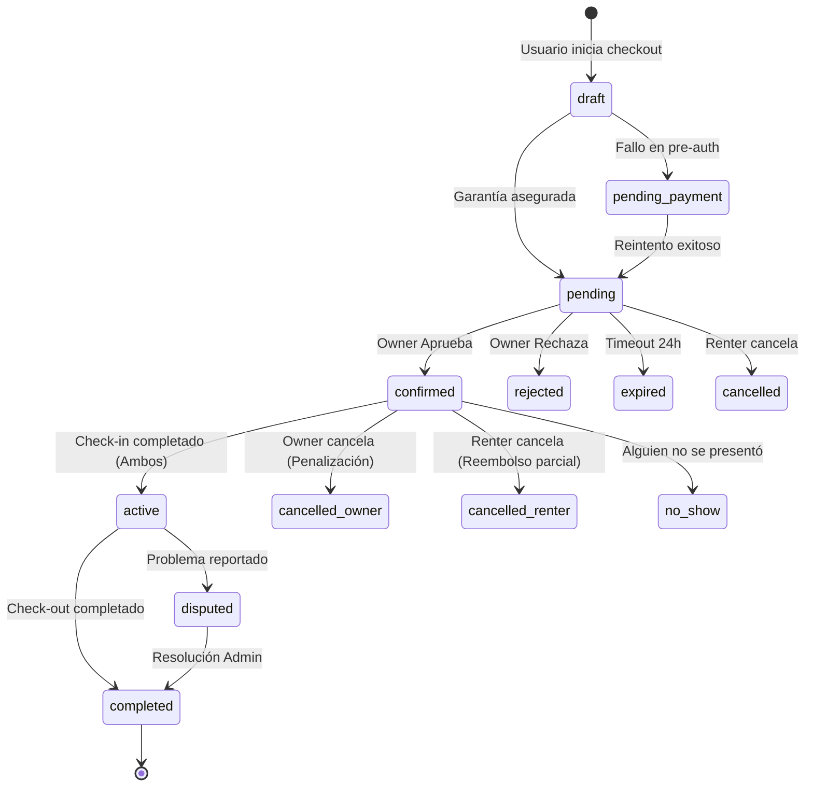

# 📅 Booking System: La Guía Definitiva

> **Documentación Maestra del Núcleo de Negocio**
> Este documento detalla exhaustivamente la lógica, arquitectura y flujos operativos del sistema de reservas de Autorenta. Es la fuente de verdad para desarrolladores, producto y operaciones.

---

## 📑 Tabla de Contenidos

1.  [Conceptos Fundamentales](#-conceptos-fundamentales)
2.  [Máquina de Estados (State Machine)](#-máquina-de-estados)
3.  [Motor de Precios (Pricing Engine)](#-motor-de-precios)
4.  [Ciclo de Vida Detallado](#-ciclo-de-vida-detallado)
    *   [Fase 1: Descubrimiento y Cotización](#fase-1-descubrimiento-y-cotización)
    *   [Fase 2: Garantía y Solicitud (Risk & Trust)](#fase-2-garantía-y-solicitud-risk--trust)
    *   [Fase 3: Confirmación y Contrato](#fase-3-confirmación-y-contrato)
    *   [Fase 4: Ejecución (Check-in / Viaje / Check-out)](#fase-4-ejecución)
    *   [Fase 5: Cierre y Conciliación](#fase-5-cierre-y-conciliación)
5.  [Gestión de Excepciones (Unhappy Paths)](#-gestión-de-excepciones)
6.  [Arquitectura Técnica](#-arquitectura-técnica)

---

## 🧠 Conceptos Fundamentales

### Modelo de "Comodato Oneroso"
A diferencia de un alquiler tradicional (Rent-a-Car), Autorenta facilita un **préstamo de uso** entre particulares.
*   **Locador (Owner):** Cede el uso del vehículo.
*   **Locatario (Renter):** Usa el vehículo y compensa los gastos/desgaste.
*   **Plataforma:** Intermediario tecnológico que provee seguridad, pagos y marco legal.

### Dualidad de Moneda
El sistema maneja una complejidad inherente a la economía latinoamericana.
*   **Base de Valor:** Los precios de los autos se fijan en **USD** (Dólares) para proteger el valor del activo.
*   **Transacción:** Los pagos se procesan en **ARS** (Pesos Argentinos) u moneda local, utilizando una tasa de conversión en tiempo real (`exchange_rates` table).
*   **Display:** El usuario puede ver precios estimados en ambas monedas.

---

## 🚦 Máquina de Estados

El campo `status` en la tabla `bookings` es la única fuente de verdad sobre el estado de una reserva.

### Diagrama de Flujo

### Matriz de Transiciones

| Estado Actual | Evento / Trigger | Nuevo Estado | Efectos Secundarios |
| :--- | :--- | :--- | :--- |
| `draft` | Usuario envía form de pago | `pending` | Bloqueo de fechas (soft), Notificación Owner |
| `draft` | Pago fallido / Abandono | `pending_payment` | Email recordatorio "Terminá tu reserva" |
| `pending` | Owner click "Aprobar" | `confirmed` | Captura de pago alquiler, Generación PDF Contrato |
| `pending` | Owner click "Rechazar" | `rejected` | Liberación inmediata de garantía (Void Auth) |
| `pending` | Cron Job > 24hs | `expired` | Liberación de garantía, Fechas desbloqueadas |
| `confirmed` | Firmas digitales Check-in | `active` | Cobertura de seguro FGO activada |
| `active` | Firmas digitales Check-out | `completed` | Fin de cobertura FGO, Trigger de reviews |
| `completed` | Cron Job > 24hs post-fin | `funds_released` | Dinero movido a Wallet del Owner |

---

## 💰 Motor de Precios

El cálculo del precio final no es una simple multiplicación. Involucra múltiples capas de lógica gestionadas por `BookingOpsService`.

### Fórmula Maestra

$$ 
PrecioTotal = (PrecioBase \times Días) - Descuentos + TarifaServicio + Seguros + Delivery 
$$ 

### Desglose de Componentes

1.  **Precio Base (`base_price`):**
    *   Definido por el Owner en la ficha del auto.
    *   Puede variar por temporada (Pricing Dinámico).
2.  **Descuentos de Duración (`duration_discount`):**
    *   7+ días: ~10% (configurable).
    *   30+ días: ~25% (configurable).
    *   Aplicados sobre el Precio Base.
3.  **Tarifa de Servicio (`service_fee`):**
    *   Ingreso de la plataforma.
    *   Porcentaje regresivo: cuanto más largo el alquiler, menor el porcentaje (ej. 15% -> 10%).
4.  **Seguro FGO (`insurance_fee`):**
    *   Monto destinado al Fondo de Garantía Operativa.
    *   Calculado sobre el valor del vehículo y el perfil de riesgo del conductor.
5.  **Delivery (`delivery_fee`):**
    *   Costo opcional si el usuario pide entrega a domicilio.
    *   Calculado por distancia lineal (Haversine) desde la base del auto.

### Ejemplo Real
*   **Auto:** Toyota Corolla ($40 USD/día).
*   **Duración:** 10 días.
*   **Cálculo:**
    *   Base: $40 * 10 = $400.
    *   Descuento (10%): -$40. Subtotal Owner: $360.
    *   Service Fee (15%): +$54.
    *   Seguro FGO (5%): +$18.
    *   **Total Renter:** $432 USD.

---

## 🔄 Ciclo de Vida Detallado

### Fase 1: Descubrimiento y Cotización
*   **Actor:** Renter.
*   **Interfaz:** `/cars/:id`.
*   **Validaciones Críticas:**
    *   **Anti-Self-Booking:** Un owner no puede alquilarse a sí mismo.
    *   **Availability Check:** Se consulta la función RPC `get_car_blocked_dates` para asegurar que no hay ni un minuto de superposición con otras reservas o bloqueos manuales.
    *   **Licencia:** El usuario debe tener licencia verificada si intenta reservar autos de categoría "Sport" o "Luxury".

### Fase 2: Garantía y Solicitud (Risk & Trust)
*   **Actor:** Renter.
*   **Interfaz:** `/bookings/:id/detail-payment`.
*   **Lógica de Riesgo (Autorentar Club):**
    *   Aquí es donde el sistema decide cuánto "miedo" tiene de prestar el auto.
    *   Si el usuario es **Club Black**, la garantía es $0.
    *   Si es usuario nuevo, la garantía puede ser hasta $1,000 USD.
*   **Pre-autorización (Hold):**
    *   No es una compra. Es una reserva de cupo en la tarjeta.
    *   Usamos `mp-create-preauth` de MercadoPago.
    *   El dinero **nunca** entra a la cuenta de Autorenta en este paso; se queda en el limbo bancario del usuario.

### Fase 3: Confirmación y Contrato
*   **Actor:** Owner.
*   **Interfaz:** Dashboard de Owner.
*   **Acción:** El Owner recibe un WhatsApp con un link directo para aprobar.
*   **Al Aprobar:**
    1.  Se ejecuta el cobro real del alquiler (Charge).
    2.  Se genera el **Contrato de Comodato** en PDF usando `generate-booking-contract-pdf` (Edge Function).
    3.  Este contrato incluye: Datos de ambos, datos del auto, fechas, y cláusulas de responsabilidad civil.

### Fase 4: Ejecución (Check-in / Viaje / Check-out)
Esta es la fase operativa física.

#### Check-in (Entrega)
El sistema exige pruebas irrefutables del estado del auto.
1.  **Fotos Obligatorias:** 4 ángulos exteriores + Tablero (Odómetro/Combustible).
2.  **Reporte de Daños Preexistentes:** El renter marca en un mapa del auto los rayones que ve.
3.  **Firma Biométrica:** Ambos firman en la pantalla del celular.
4.  **Activación:** Solo cuando ambos firman, el seguro FGO entra en vigencia.

#### Check-out (Devolución)
Espejo del proceso de Check-in.
1.  **Comparación:** El sistema (y la IA `analyze-damage-images`) compara las fotos de entrada vs salida.
2.  **Cálculo de Extras:** Si el combustible es menor, se calcula la diferencia y se propone un cargo extra automáticamente.

### Fase 5: Cierre y Conciliación
*   **Liberación de Fondos:** 24 horas después del Check-out, si no hay disputas abiertas ("Silencio Positivo"), el sistema:
    1.  Libera la garantía del Renter (`void` de la pre-auth).
    2.  Mueve el dinero del alquiler de "En Custodia" a la Wallet disponible del Owner.

---

## 🚫 Gestión de Excepciones (Unhappy Paths)

### No-Show (Ausencia)
*   **Renter no aparece:** Si pasan 2 horas del inicio y no hay Check-in, el Owner puede reportar "No-Show".
    *   **Resultado:** Se cobra el 100% del primer día + 50% del resto.
*   **Owner no aparece:** El Renter reporta.
    *   **Resultado:** Reembolso total + Cupón de crédito por las molestias.

### Daños Reportados
Si en el Check-out se reportan daños nuevos:
1.  La garantía **NO** se libera. Se congela.
2.  Se abre un ticket de **Siniestro (Claim)**.
3.  El Owner debe subir presupuesto de reparación.
4.  El sistema debita de la garantía del Renter hasta cubrir el monto (o hasta el límite de la franquicia).
5.  Si supera la franquicia, el FGO cubre la diferencia.

---

## 🏗️ Arquitectura Técnica

### Tablas Clave
*   `bookings`: Estado y fechas.
*   `booking_transactions`: Log financiero.
*   `car_blocked_dates`: Calendario.
*   `booking_inspections`: Fotos y firmas de check-in/out.

### Servicios Angular (`core/services/bookings/`)
*   `BookingFlowService`: Orquestador de la máquina de estados. Decide cuál es el "Siguiente Paso".
*   `BookingOpsService`: Cálculos matemáticos de precios y seguros.
*   `BookingRealtimeService`: Maneja las suscripciones a Supabase Realtime para que la UI se actualice sola si el otro usuario firma.

### Edge Functions Críticas
*   `mercadopago-create-booking-preference`: Crea el checkout.
*   `mercadopago-webhook`: Procesa la IPN de pago.
*   `return-protocol-scheduler`: Cron job que busca reservas finalizadas para liberar fondos.

---

**© 2026 Autorenta Booking Intelligence**