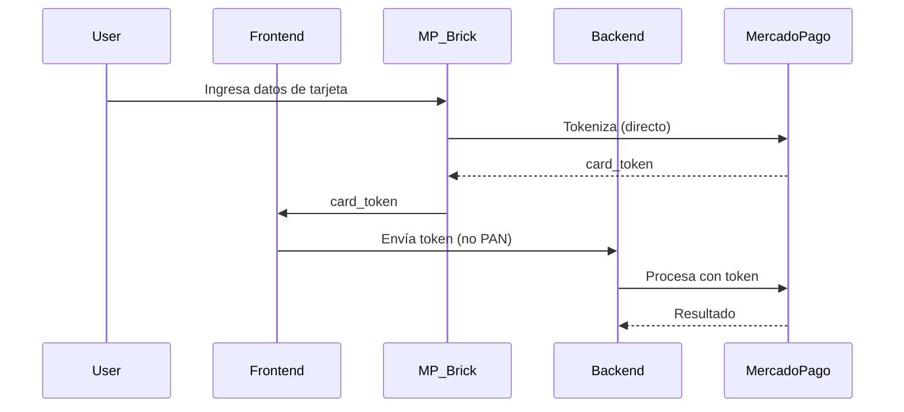

# 🔐 Políticas de Seguridad

> **Última actualización:** 2026-01-09
> **Versión:** v1.0
> **Tipo:** Políticas y prácticas de seguridad

---

## 📋 Tabla de Contenidos

1. [Introducción](#-introducción)
2. [Modelo de Seguridad](#-modelo-de-seguridad)
3. [Autenticación y Autorización](#-autenticación-y-autorización)
4. [Row Level Security (RLS)](#-row-level-security-rls)
5. [Seguridad de API](#-seguridad-de-api)
6. [Seguridad de Pagos](#-seguridad-de-pagos)
7. [Protección de Datos](#-protección-de-datos)
8. [Gestión de Secretos](#-gestión-de-secretos)
9. [Edge Functions Security](#-edge-functions-security)
10. [Reporte de Vulnerabilidades](#-reporte-de-vulnerabilidades)

---

## 🎯 Introducción

Este documento describe las políticas y prácticas de seguridad implementadas en AutoRenta. La seguridad es una prioridad máxima dado que la plataforma maneja:

- **Datos personales** (KYC, documentos de identidad)
- **Datos financieros** (tarjetas, cuentas bancarias)
- **Transacciones monetarias** (pagos, garantías)
- **Contratos legales** (comodatos firmados digitalmente)

---

## 🏗️ Modelo de Seguridad

### Arquitectura de Seguridad en Capas

```
┌─────────────────────────────────────────────────────────┐
│                    CLIENTE (Browser/App)                │
│  - HTTPS obligatorio                                    │
│  - CSP Headers                                          │
│  - CORS estricto                                        │
└─────────────────────────┬───────────────────────────────┘
                          │
┌─────────────────────────▼───────────────────────────────┐
│                    EDGE FUNCTIONS                       │
│  - Rate Limiting                                        │
│  - HMAC Validation (webhooks)                          │
│  - IP Whitelisting                                      │
│  - Request Validation                                   │
└─────────────────────────┬───────────────────────────────┘
                          │
┌─────────────────────────▼───────────────────────────────┐
│                    SUPABASE AUTH                        │
│  - JWT Tokens (RS256)                                   │
│  - Secure Session Management                            │
│  - MFA (disponible)                                     │
└─────────────────────────┬───────────────────────────────┘
                          │
┌─────────────────────────▼───────────────────────────────┐
│                    POSTGRESQL + RLS                     │
│  - Row Level Security en todas las tablas               │
│  - Políticas granulares por rol                         │
│  - Auditoría de acceso                                  │
└─────────────────────────────────────────────────────────┘
```

---

## 🔑 Autenticación y Autorización

### Métodos de Autenticación Soportados

| Método | Uso | Seguridad |
|--------|-----|-----------|
| Email + Password | Principal | Hash bcrypt + Salt |
| Magic Link | Alternativo | Token único 1h |
| OAuth (Google) | Social login | OAuth 2.0 PKCE |
| OTP (WhatsApp/SMS) | Verificación | 6 dígitos, 5 min TTL |

### Gestión de Sesiones

```typescript
// Configuración de Supabase Auth
const config = {
  auth: {
    persistSession: true,
    autoRefreshToken: true,
    detectSessionInUrl: true,
    flowType: 'pkce',
  }
};
```

### Refresh Token Flow

1. Access Token: **1 hora** de vida
2. Refresh Token: **7 días** de vida
3. Auto-refresh: **5 minutos** antes de expirar
4. Revocación: Inmediata en logout/cambio de password

---

## 🛡️ Row Level Security (RLS)

### Principios

1. **Deny by default:** Sin políticas = Sin acceso
2. **Mínimo privilegio:** Solo acceso necesario
3. **Verificación server-side:** No confiar en el cliente

### Políticas Implementadas

#### Tabla `cars`

```sql
-- Cualquiera puede ver autos publicados
CREATE POLICY "Anyone can view published cars"
ON public.cars FOR SELECT
USING (status = 'published');

-- Solo el owner puede editar sus autos
CREATE POLICY "Owners can edit own cars"
ON public.cars FOR UPDATE
USING (auth.uid() = owner_id);
```

#### Tabla `bookings`

```sql
-- Renter y Owner pueden ver sus bookings
CREATE POLICY "Participants can view bookings"
ON public.bookings FOR SELECT
USING (
  auth.uid() = renter_id
  OR EXISTS (
    SELECT 1 FROM cars WHERE cars.id = bookings.car_id
    AND cars.owner_id = auth.uid()
  )
);

-- Solo RPCs pueden modificar estado
-- (No UPDATE directo permitido para status)
```

#### Tabla `payments`

```sql
-- Solo service_role puede escribir pagos
CREATE POLICY "Only backend can write payments"
ON public.payments FOR INSERT
TO service_role
WITH CHECK (true);
```

### Validación de RLS

```bash
# Verificar políticas aplicadas
supabase db lint --level error

# Listar políticas activas
psql -c "SELECT tablename, policyname FROM pg_policies WHERE schemaname = 'public';"
```

---

## 🌐 Seguridad de API

### Rate Limiting

| Endpoint | Límite | Ventana |
|----------|--------|---------|
| Webhooks | 100 req | 60 seg |
| Auth endpoints | 10 req | 60 seg |
| General API | 1000 req | 60 seg |

### CORS Configuration

```typescript
// Edge Functions CORS
const ALLOWED_ORIGINS = [
  'https://autorenta.app',
  'https://www.autorenta.app',
  'http://localhost:4200' // Solo development
];

function getCorsHeaders(req: Request) {
  const origin = req.headers.get('origin');
  if (ALLOWED_ORIGINS.includes(origin)) {
    return {
      'Access-Control-Allow-Origin': origin,
      'Access-Control-Allow-Methods': 'GET, POST, OPTIONS',
      'Access-Control-Allow-Headers': 'authorization, x-client-info, apikey, content-type'
    };
  }
  return {};
}
```

### Headers de Seguridad

```javascript
// Implementados en frontend y Edge Functions
const securityHeaders = {
  'Strict-Transport-Security': 'max-age=31536000; includeSubDomains',
  'X-Content-Type-Options': 'nosniff',
  'X-Frame-Options': 'DENY',
  'X-XSS-Protection': '1; mode=block',
  'Content-Security-Policy': "default-src 'self'; script-src 'self' https://sdk.mercadopago.com"
};
```

---

## 💳 Seguridad de Pagos

### PCI DSS Compliance

AutoRenta **NO almacena** datos de tarjeta:

1. Tokenización via MercadoPago Brick
2. Card tokens temporales (no reutilizables)
3. PAN nunca toca nuestros servidores

### Flujo de Pago Seguro



### Webhook Validation

```typescript
// Validación HMAC de webhooks MercadoPago
function validateWebhookSignature(req: Request, secret: string): boolean {
  const signature = req.headers.get('x-signature');
  const requestId = req.headers.get('x-request-id');

  // Construir manifest
  const manifest = `id:${paymentId};request-id:${requestId};ts:${timestamp};`;

  // Calcular HMAC-SHA256
  const calculated = hmacSha256(manifest, secret);

  // Comparación timing-safe
  return timingSafeEqual(calculated, signature);
}
```

---

## 🔒 Protección de Datos

### Datos Sensibles Almacenados

| Dato | Encriptación | Acceso |
|------|--------------|--------|
| Passwords | bcrypt (Supabase Auth) | Nunca visible |
| DNI/Pasaporte | Storage encriptado | Usuario + Admin |
| Fotos de documentos | Storage privado | Usuario + Admin |
| Contratos PDF | Storage privado | Participantes |
| Tokens OAuth | Base AES-256 | Solo backend |

### Retention Policy

| Tipo de Dato | Retención | Justificación |
|--------------|-----------|---------------|
| Logs de acceso | 90 días | Auditoría |
| Transacciones | 7 años | Legal/Fiscal |
| Documentos KYC | Vida del usuario | Compliance |
| Sesiones expiradas | 30 días | Debugging |

### Anonimización

```sql
-- Procedimiento de eliminación de cuenta
CREATE OR REPLACE FUNCTION anonymize_user(user_id UUID)
RETURNS void AS $$
BEGIN
  -- Anonimizar perfil
  UPDATE profiles SET
    first_name = 'Usuario',
    last_name = 'Eliminado',
    email = 'deleted_' || user_id || '@deleted.local',
    phone = NULL,
    document_number = NULL
  WHERE id = user_id;

  -- Eliminar documentos
  DELETE FROM user_documents WHERE user_id = user_id;

  -- Marcar como eliminado
  UPDATE auth.users SET
    deleted_at = NOW()
  WHERE id = user_id;
END;
$$ LANGUAGE plpgsql;
```

---

## 🔐 Gestión de Secretos

### Niveles de Secretos

| Nivel | Almacenamiento | Ejemplo |
|-------|----------------|---------|
| **Crítico** | Supabase Vault | MERCADOPAGO_ACCESS_TOKEN |
| **Alto** | GitHub Secrets | SUPABASE_SERVICE_ROLE_KEY |
| **Medio** | .env.local | MAPBOX_TOKEN |
| **Público** | Código | SUPABASE_ANON_KEY |

### Rotación de Secretos

| Secreto | Frecuencia | Procedimiento |
|---------|------------|---------------|
| MP Access Token | 6 meses | OAuth refresh |
| Supabase Service Key | Nunca (regenerar si compromiso) | - |
| JWT Secret | Anual | Migrar sesiones |

### Acceso a Secretos en Edge Functions

```typescript
// Correcto: usar Deno.env
const accessToken = Deno.env.get('MERCADOPAGO_ACCESS_TOKEN');

// INCORRECTO: hardcodear
const accessToken = 'APP_USR-xxxxx'; // ❌ NUNCA
```

---

## 🛡️ Edge Functions Security

### Checklist de Seguridad

- [x] **CORS:** Whitelist de dominios
- [x] **Rate Limiting:** Base de datos
- [x] **Input Validation:** Schema validation
- [x] **Error Handling:** Sin stack traces en prod
- [x] **Logging:** Structured, sin datos sensibles
- [x] **Timeouts:** 30s máximo
- [x] **Idempotency:** Keys únicas para webhooks

### Ejemplo de Función Segura

```typescript
import { serve } from 'https://deno.land/std@0.168.0/http/server.ts';
import { getCorsHeaders } from '../_shared/cors.ts';
import { enforceRateLimit } from '../_shared/rate-limiter.ts';
import { createChildLogger } from '../_shared/logger.ts';

const log = createChildLogger('MyFunction');

serve(async (req: Request) => {
  // 1. CORS
  const corsHeaders = getCorsHeaders(req);
  if (req.method === 'OPTIONS') {
    return new Response('ok', { headers: corsHeaders });
  }

  // 2. Rate Limiting
  try {
    await enforceRateLimit(req, { endpoint: 'my-function' });
  } catch (e) {
    return e.toResponse();
  }

  // 3. Validar input
  const body = await req.json();
  if (!body.userId) {
    return new Response(JSON.stringify({ error: 'Missing userId' }), {
      status: 400,
      headers: corsHeaders
    });
  }

  // 4. Procesar con logging seguro
  log.info('Processing request', { userId: body.userId });

  // 5. Retornar resultado
  return new Response(JSON.stringify({ success: true }), {
    headers: { ...corsHeaders, 'Content-Type': 'application/json' }
  });
});
```

---

## 📢 Reporte de Vulnerabilidades

### Proceso de Reporte

1. **Email:** security@autorenta.app
2. **Asunto:** `[SECURITY] Descripción breve`
3. **Incluir:**
   - Descripción de la vulnerabilidad
   - Pasos para reproducir
   - Impacto potencial
   - Sugerencia de fix (opcional)

### Tiempos de Respuesta

| Severidad | Respuesta Inicial | Fix Target |
|-----------|-------------------|------------|
| Crítica | 4 horas | 24 horas |
| Alta | 24 horas | 7 días |
| Media | 48 horas | 30 días |
| Baja | 7 días | 90 días |

### Bug Bounty

Actualmente **no hay programa de bug bounty** formal, pero se reconoce públicamente a investigadores responsables.

---

## 📚 Referencias

- [OWASP Top 10](https://owasp.org/Top10/)
- [Supabase Security Best Practices](https://supabase.com/docs/guides/auth/security)
- [PCI DSS](https://www.pcisecuritystandards.org/)
- [GDPR Compliance](https://gdpr.eu/)

---

**Documento generado automáticamente por Gemini Agent**
**Fecha de generación:** 2026-01-09T06:04:35-03:00
