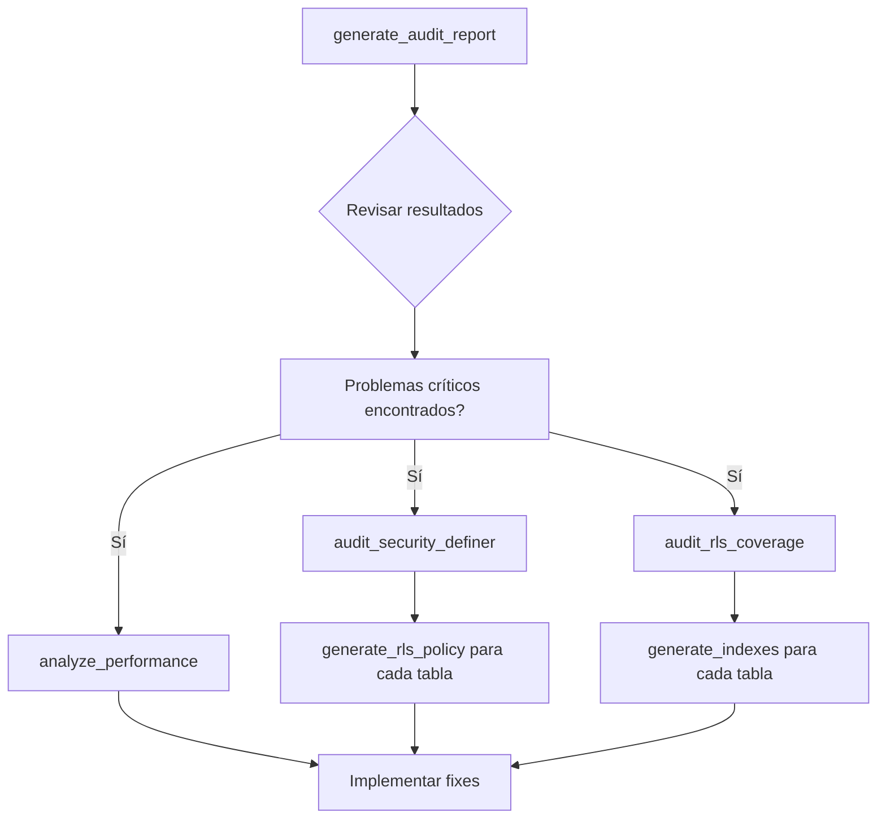

# Supabase Audit MCP Module

Módulo especializado para auditoría de seguridad y performance de la base de datos Supabase de AutoRenta.

## Características

### 1. **Security Definer Functions Audit**
Identifica y audita todas las funciones PostgreSQL que usan `SECURITY DEFINER` con evaluación de riesgo.

**Recursos:**
- `autorenta://audit/security-definer-functions` - Listado completo con categorización de riesgos

**Herramientas:**
- `audit_security_definer` - Auditar funciones con filtrado por nivel de riesgo

**Ejemplo:**
```
@autorenta-platform Muéstrame las funciones SECURITY DEFINER críticas
@autorenta-platform Audita funciones SECURITY DEFINER con riesgo alto o crítico
```

### 2. **RLS (Row Level Security) Audit**
Verifica políticas RLS en todas las tablas y detecta gaps de seguridad.

**Recursos:**
- `autorenta://audit/rls-policies` - Estado completo de cobertura RLS

**Herramientas:**
- `audit_rls_coverage` - Auditar cobertura de RLS policies
- `generate_rls_policy` - Generar boilerplate SQL para RLS policies

**Ejemplo:**
```
@autorenta-platform ¿Qué tablas no tienen RLS policies?
@autorenta-platform Genera RLS policies para la tabla bookings
@autorenta-platform Crea políticas RLS para la tabla cars
```

### 3. **Performance Audit**
Analiza sequential scans y sugiere índices para optimización.

**Recursos:**
- `autorenta://audit/performance` - Análisis de escaneos y sugerencias de índices

**Herramientas:**
- `analyze_performance` - Analizar sequential scans con umbral configurable
- `generate_indexes` - Generar SQL para índices recomendados

**Ejemplo:**
```
@autorenta-platform Analiza la performance con umbral de 5000 seq scans
@autorenta-platform Genera índices para la tabla bookings
```

### 4. **Comprehensive Audit Report**
Reporte integrado con todas las auditorías y acciones prioritarias.

**Recursos:**
- `autorenta://audit/security-summary` - Resumen ejecutivo completo
- `autorenta://audit/schema-analysis` - Análisis de schema en JSON

**Herramientas:**
- `generate_audit_report` - Generar reporte completo con prioridades

**Ejemplo:**
```
@autorenta-platform Genera un reporte de auditoría completo
@autorenta-platform ¿Cuál es el resumen de seguridad?
```

## Workflow de Uso

### Flujo 1: Auditoría Inicial Completa



### Flujo 2: Pre-Development Type Definition

Antes de escribir código, verifica el estado de seguridad:

```
1. @autorenta-platform Genera reporte de auditoría
2. Revisar prioridades y gaps de seguridad
3. @autorenta-platform Audita RLS para la tabla que voy a usar
4. Si hay gaps: genera_rls_policy y revisa el SQL
5. Procede a escribir código seguro
```

### Flujo 3: Continuous Security Monitoring

Ejecuta auditorías regularmente:

```bash
# Semanal: análisis de performance
@autorenta-platform Analiza performance

# Mensual: auditoría completa
@autorenta-platform Genera reporte completo

# Ad-hoc: cuando agregas una nueva tabla
@autorenta-platform Genera RLS policies para [new_table]
```

## Recursos Disponibles

### Security Definer Audit

**URI:** `autorenta://audit/security-definer-functions`

**Retorna:** Lista categorizada de funciones con recomendaciones

```json
{
  "summary": {
    "total": 164,
    "critical": 45,
    "high": 89,
    "medium": 30
  },
  "critical_functions": [
    {
      "function": "public.encrypt_pii",
      "risk_level": "critical",
      "recommendation": "Audit function for least privilege; consider SECURITY INVOKER"
    }
  ]
}
```

### RLS Policies Audit

**URI:** `autorenta://audit/rls-policies`

**Retorna:** Estado de RLS en todas las tablas

```json
{
  "total_tables": 150,
  "tables_with_rls": 120,
  "tables_with_policies": 95,
  "tables_with_gaps": 25
}
```

### Performance Audit

**URI:** `autorenta://audit/performance`

**Retorna:** Tablas con alto seq_scans y sugerencias de índices

```json
{
  "tables_above_threshold": 8,
  "critical_tables": [
    {
      "table": "bookings",
      "seq_scans": 339492,
      "suggested_indexes": [
        "CREATE INDEX idx_bookings_status_dates ON bookings(...)"
      ]
    }
  ]
}
```

## Herramientas Disponibles

### `generate_rls_policy`

Genera boilerplate SQL para RLS policies.

**Parámetros:**
- `tableName` (required): Nombre de la tabla
- `userIdColumn` (optional): Columna de user_id (default: `user_id`)

**Retorna:**
```sql
ALTER TABLE bookings ENABLE ROW LEVEL SECURITY;

CREATE POLICY "Users can view their own bookings" ON bookings
  FOR SELECT USING (user_id = auth.uid());

-- ... más policies
```

### `generate_indexes`

Genera SQL para crear índices recomendados.

**Parámetros:**
- `tableName` (required): Nombre de la tabla

**Retorna:**
```sql
CREATE INDEX idx_bookings_status_dates ON bookings(status, start_date, end_date);
CREATE INDEX idx_bookings_car_id ON bookings(car_id);
```

### `audit_security_definer`

Audita funciones SECURITY DEFINER con filtrado por riesgo.

**Parámetros:**
- `minRiskLevel` (optional): `critical`, `high`, o `medium` (default: `high`)

**Retorna:**
```json
{
  "total_functions": 164,
  "matching_functions_count": 45,
  "functions": [
    {
      "function": "public.encrypt_pii",
      "risk_level": "critical",
      "recommendation": "..."
    }
  ]
}
```

### `audit_rls_coverage`

Audita cobertura de RLS policies.

**Parámetros:**
- `requirePolicies` (optional): boolean (default: true)

**Retorna:**
```json
{
  "total_tables": 150,
  "tables_with_gaps": 25,
  "gaps": [
    {
      "table": "audit_log_entries",
      "has_rls": false,
      "action_required": "Enable RLS and create policies"
    }
  ]
}
```

### `analyze_performance`

Analiza sequential scans con umbral configurable.

**Parámetros:**
- `seqScansThreshold` (optional): número (default: 10000)

**Retorna:**
```json
{
  "threshold": 10000,
  "tables_above_threshold": 8,
  "tables": [
    {
      "table": "bookings",
      "seq_scans": "339,492",
      "action": "CRITICAL"
    }
  ]
}
```

### `generate_audit_report`

Genera reporte completo con prioridades.

**Parámetros:** Ninguno

**Retorna:**
```json
{
  "summary": {
    "total_tables": 150,
    "total_functions": 164,
    "security_issues": 45,
    "rls_gaps": 25,
    "missing_indexes": 8
  },
  "priority_actions": [
    {
      "priority": "CRITICAL",
      "item": "Audit function: encrypt_pii",
      "category": "Security"
    }
  ],
  "estimated_effort_hours": 85.5
}
```

## Interpretación de Resultados

### Risk Levels

- **CRITICAL**: Potencial riesgo de privilege escalation o data breach
  - Acción: Auditar inmediatamente
  - Esfuerzo: 45-60 minutos por función

- **HIGH**: Violación de principios de least privilege
  - Acción: Auditar en las próximas 2 semanas
  - Esfuerzo: 30-45 minutos por función

- **MEDIUM**: Oportunidades de mejora
  - Acción: Incluir en sprints de seguridad
  - Esfuerzo: 15-30 minutos por función

### RLS Coverage

- **Tables WITHOUT RLS**: Crítico - habilitar inmediatamente
- **Tables with RLS but NO Policies**: Alto riesgo - crear policies
- **Tables with RLS Policies**: OK - validar policies regularmente

### Performance Metrics

- **Seq Scans > 100k**: CRITICAL - crear índices inmediatamente
- **Seq Scans 10k-100k**: HIGH - planificar optimización
- **Seq Scans 1k-10k**: MEDIUM - monitorear

## Guía de Remediación

### 1. Seguridad (CRITICAL functions)

Para cada función crítica:

```sql
-- 1. Revisar definición actual
\df+ schema.function_name

-- 2. Revisar qué hace y por qué usa SECURITY DEFINER
-- 3. Considerar cambiar a SECURITY INVOKER si es posible
-- 4. Si debe ser SECURITY DEFINER:
ALTER FUNCTION schema.function_name (...)
  SET search_path = schema, pg_temp;

-- 5. Documentar razón en comentarios
COMMENT ON FUNCTION schema.function_name (...) IS
  'Why SECURITY DEFINER is necessary: ...';
```

### 2. RLS Policies (HIGH priority)

Para cada tabla sin policies:

```
1. @autorenta-platform Genera RLS policies para [table_name]
2. Revisa el SQL generado
3. Ajusta según necesidades específicas del negocio
4. Prueba en staging con diferentes roles
5. Deploy a producción
```

### 3. Indexes (HIGH performance)

Para cada tabla con seq_scans > 100k:

```
1. @autorenta-platform Genera índices para [table_name]
2. Analiza queries lentas: EXPLAIN ANALYZE SELECT ...
3. Crea índices uno por uno
4. Mide impacto: comparar seq_scans antes/después
5. Monitorea disk space
```

## Limitations & Gotchas

### 1. RPC Functions Not Available

Si algunas funciones RPC no existen en tu Supabase, el módulo fallará silenciosamente y usará fallback a `information_schema`.

**Solución:** Puedes agregar RPC functions personalizadas en Supabase:

```sql
CREATE FUNCTION public.get_security_definer_functions()
RETURNS TABLE(function_name text, schema text) AS $$
SELECT routine_name, routine_schema
FROM information_schema.routines
WHERE security_type = 'DEFINER';
$$ LANGUAGE SQL SECURITY INVOKER;
```

### 2. pg_stat_user_tables Not Accessible

Las estadísticas de seq_scans pueden no estar disponibles en todas las configuraciones de Supabase.

**Solución:** Habilitar en Supabase SQL Editor:

```sql
-- Verificar acceso
SELECT * FROM pg_stat_user_tables LIMIT 1;
```

### 3. Performance Data Lag

Las estadísticas de performance se actualizan periódicamente (no en tiempo real).

**Recomendación:** Ejecutar audits regularmente, no continuamente.

## Próximas Mejoras

- [ ] Sugerencias de índices más inteligentes (analizando queries reales)
- [ ] Integración con pg_stat_statements para auditoría de queries
- [ ] Validación automática de políticas RLS
- [ ] Recomendaciones de particionamiento para tablas grandes
- [ ] Análisis de relaciones FK y orphaned records
- [ ] Auditoría de cambios de schema (migrations tracking)

## References

- [PostgreSQL SECURITY DEFINER](https://www.postgresql.org/docs/current/sql-createfunction.html)
- [Supabase RLS Guide](https://supabase.com/docs/guides/auth/row-level-security)
- [PostgreSQL Index Types](https://www.postgresql.org/docs/current/indexes-types.html)
- [AutoRenta CLAUDE.md](../CLAUDE.md)
